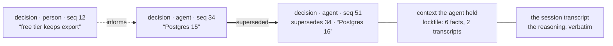

# The agent system, mapped for its gaps

> Current implementation audit (2026-09-26): [harness modules and readiness](harness-runtime.md), [source receipts and correction plan](../audit/2026-09-26-harness/README.md). The historical design below is not an installation/load/conformance receipt.

> **Target clarification, 2026-09-07:** The following earlier design remains historical context.
> The current task-level proposal is [system-contract.md](system-contract.md) and
> [engineering-specs.json](engineering-specs.json), visualised in [system.html](../reports/system.html).
> ADR-0045–0047 are proposed, not an assertion that runtime or external wire contracts changed.

**Status:** analysis, 2026-09-06. Three questions from the operator resolved in
one map, because they are one question: *where does judgement belong, and where
does a script belong.*

1. the decision graph must show how the project reached here, human vs agent, and
   why an agent decided as it did (§4);
2. the CEO — flexible, tool-using, pipeline-driven — should be an agent, and the
   implementation chosen (§5, ADR-0039);
3. across the whole product, what is an agent's job and what is a script's (§3).

Walked against the `agent-harness` audit tracks and the `agent-orchestrator`
graph rules. Every finding carries an observation; the mechanical scanner was
run first and its result is §2.

---

## 1. What Fabric actually is, and the reframing that follows

The harness scanner read `apps/desktop/src/main` and reported: *no file showed
two independent signs of an agent loop.* That is not a gap — it is the
architecture, stated by its absence.

**Fabric is a harness, not an agent.** The agent is `claude-code` or `codex`,
spawned as a PTY, driven by its own loop, reached over an MCP surface of 17
tools. Fabric owns everything `agent-harness` calls the harness — what the agent
is told (`fabric_whoami`, the context pack), the tools it is given, the floor it
cannot cross — and none of what `agent-orchestrator` calls the loop, because the
loop belongs to the CLI.

This matters for all three questions:

- the **script-vs-agent** line (§3) is drawn inside Fabric, where the code runs,
  not inside the agent;
- the **CEO** (§5) is the first loop Fabric would host itself, so it is the first
  place the orchestrator rules apply to us rather than to the CLI;
- the **decision graph** (§4) is provenance Fabric already captures, because the
  harness sees every tool call the agent makes.

---

## 2. The seven tracks, walked — findings

Each row is an observation, then a verdict. Tiered by backing: **measured** here,
**upstream** (a skill's documented rule), **judgement**.

### Prompt — what the agent is told

| # | Observation | Verdict | Tier |
|---|---|---|---|
| P1 | The protocol is returned by `fabric_whoami`, one source, current by construction (ADR-0035 §5.1). Good. | keep | measured |
| P2 | **The context pack injects no current date.** `contextPack.ts` has no `new Date` in its assembly. A model with a training cutoff answers "is this library current" from memory. | **gap — inject today's date** | upstream (harness rule 3) |
| P3 | **The status vocabulary is enumerated at the TOOL (`z.enum`) but not in the prompt.** The agent is refused a bad status after guessing; it is never told the allowed set up front, so it spends a call learning by rejection. | gap — name the vocabulary in the protocol | upstream (harness rule 2) |
| P4 | The preamble is deliberately minimal and names one tool (`preamble.ts`, tested). Correct — the rules live behind `whoami`, not in a frozen prompt. | keep | measured |

### Tools — the agent–computer interface

| # | Observation | Verdict | Tier |
|---|---|---|---|
| T1 | 17 tools, namespaced `fabric_*`. Within the range the skill calls healthy. | keep | measured |
| T2 | **Do `fabric_task_note` and `fabric_memory_remember` distinguish themselves to a model?** Both record text about a task. A model will use one where the other was meant, and nothing measures which. | gap — audit the two descriptions against each other | judgement |
| T3 | **`fabric_effect_request` relies on the agent choosing to ask** (recorded on M140). A tool the agent can decline to call is not a floor. The schema floor (ADR-0004) is the real one; the tool is a convenience. | known, documented — the per-runner hook is the other half | measured |
| T4 | Tool errors: `fabric_task_move` returns the ladder's own sentence on refusal (measured, M146), not a stack trace. This is the harness rule "errors teach the next attempt". | keep | measured |

### Control flow — workflow or agent

| # | Observation | Verdict | Tier |
|---|---|---|---|
| C1 | The agent's loop is the CLI's; Fabric does not host one today. So the workflow-vs-agent choice has not been MADE by us yet — it arrives with the CEO. | see §5 | measured |
| C2 | Chains (slice 3) are a **static** workflow: `follows` edges with named payloads, a cycle refused at draw time. This is exactly the orchestrator's "static unless you can name what forces dynamic". | keep | measured |
| C3 | Routines are a timer, not a loop. Correct as a workflow. | keep | measured |

### Context — the window

| # | Observation | Verdict | Tier |
|---|---|---|---|
| X1 | The context pack has a **byte budget** and drops with a recorded `omitted_facts` / `omitted_transcripts` count (measured, M49). Truncation is visible, not silent. | keep | measured |
| X2 | The pack carries **only current facts** (`valid_to is null`, M48). A superseded fact is never handed to an agent as current. | keep | measured |
| X3 | **Compaction of a running CLI agent's own window is the CLI's problem, not ours** — and we cannot see it. If a session compacts and drops the protocol, `fabric_whoami` is not re-read. | gap — the protocol should be re-assertable, or its read re-checked | judgement |

### Failure

| # | Observation | Verdict | Tier |
|---|---|---|---|
| F1 | A throw inside an MCP handler used to hang the agent; fixed (M104). | keep | measured |
| F2 | **Tool output is trusted.** An agent's `fabric_memory_remember` text becomes a fact another agent reads as true. Nothing marks agent-authored facts as lower-trust than person-authored ones — though `actor_kind` exists to carry it. | gap — provenance exists in the column, is not used in trust | measured |
| F3 | The context pack still compiles a session when a fact read fails, and says so (M106 class). | keep | measured |

### Permission

| # | Observation | Verdict | Tier |
|---|---|---|---|
| M1 | The floor is in the SCHEMA (ADR-0004), not an instruction. A model cannot argue its way through a refused write. This is the strongest thing in the system. | keep | measured |
| M2 | Per-hop credential scoping through the gateway (ADR-0034); no upstream key in a session bundle. **Route superseded by [ADR-0115](../adr/0115-a-local-agent-reaches-a-cloud-product-through-fabric-on-consent.md)** (noted 2026-10-04): the gateway is off since 2026-09-14; external agents reach products through the hub, narrowed per call by grant and by the product; sessions' declared servers through Fabric refuse (CO-194). No upstream key in a session bundle still holds. | keep (the scoping), route superseded | measured |
| M3 | **`canUseTool` — intercepting EVERY tool call — is unbuilt** (M140 half). Only the ASK path exists. A runner that does not ask is unfloored except by the schema. | gap, known, waits on a per-runner hook | measured |

### Evidence — the track that ends audits

| # | Observation | Verdict | Tier |
|---|---|---|---|
| E1 | **There are no agent-behaviour evals.** `memory-eval` measures the memory delta, not agent trajectories. The harness rule: without evals, every claim about agent behaviour is unfalsifiable. | **first item — the CEO needs a trajectory eval before its prompt is tuned** | upstream |
| E2 | Every tool call the agent makes is journalled. The trace `agent-evals` needs already exists. | keep — the corpus is there when the eval is written | measured |
| E3 | The context lockfile records `sha256`, `fact_ids`, `transcript_ids` per session (M49). **"What did the agent know when it decided" is already answerable** — this is the spine of §4. | keep, and build on it | measured |

**The finding that orders the rest:** E1. There is no way to prove the CEO
behaves until it has a trajectory eval, and everything about tuning its prompt is
folklore until then. It is the first build step in §5, ahead of the prompt.

---

## 3. Script or agent — the line, drawn across the whole product

The operator's rule, exactly right and matching the orchestrator's "static unless
you can name what forces dynamic": **variable data wants an agent; a computable
answer wants a script — it saves tokens and removes a class of error a script
does not have.**

The test, in one line: **can the output be wrong in a way a type system or a
comparison would catch?** If yes, a script — a wrong number the code could have
checked is an error an agent introduces and a script cannot. If the space of
correct answers is open, an agent.

### The whole product, classified

| Job | Today | Correct home | Why |
|---|---|---|---|
| Rank the Board | designed as arithmetic | **script** | components are countable; a ranked order is checkable |
| Withdraw a stale question | designed as arithmetic | **script** | "every blocked task cancelled" is a query |
| Merge EXACT duplicates | designed as arithmetic | **script** | same `about` key, same project — an equality |
| Merge SIMILAR questions | advisor call | **agent** | "the same question in other words" has no equality |
| Criticality score | designed as arithmetic | **script** | a formula over authorship and effect class |
| Compose the evening letter | designed as arithmetic | **script** | counts from the journal; a ledger, not prose |
| Re-word the letter as prose | not built | **agent** | length and phrasing are judgement |
| Answer by `about`-key citation | designed as arithmetic | **script** | a key match |
| Draft an answer with no key | advisor call | **agent** | evidence without a key needs reading |
| The coding work itself | CLI agent | **agent** | the open-ended case, by definition |
| Read a Telegram thread | model tier | **agent** | natural language, no keys |
| Route a notification | designed as config | **script** | a lookup in `telegram_routes` |
| Detect a task needs splitting | agent, in-session | **agent** | discovered from the work |
| Reconcile open tasks at boot | script (M43) | **script** | every open task belongs to a gone process — a fact |
| Redact secrets from a transcript | script (M95) | **script** | patterns, checkable |
| Decide a repository is unreadable | script (M107) | **script** | git failed or it did not |

**The pattern that falls out of the table:** almost everything the *CEO* does is a
script, and the handful that are not are all **one shape** — a single judgement
with a typed output, no tools, no iteration. That is not a coincidence; it is why
ADR-0038 could argue the CEO was not an agent at all. §5 is where that argument
meets the operator's decision.

**A rule to keep the line from drifting:** a job classified as a script that
starts wanting "just a little" model judgement is a job being reclassified, and
the reclassification is a decision with a token cost — it is made in the open, not
by adding one model call inside a function that used to be pure.

---

## 4. The decision graph — how the project reached here, and who decided

M144 shipped the decision graph as a list, honestly: 44 current decisions, zero
superseded, so the graph had no edges yet. The operator's ask is richer — show
**movement**, **who decided** (human or agent), and **why an agent decided as it
did**. Every part of that is already captured; what is missing is the reading.

### 4.1 What is already recorded

| Needed | Already in the data |
|---|---|
| the sequence of decisions | `memory_facts` of kind `decision`, each with `seq` and `recorded_at` |
| human or agent | `actor_kind` on the fact (`person` / `agent` / `system`) |
| what replaced what | `superseded_by` — the one edge the graph has (`decisions.ts`) |
| an agent's context when it decided | the context lockfile: `sha256`, `fact_ids`, `transcript_ids` per session (M49) |
| why an agent decided | the session transcript, keyed to the task, keyed to the decision's `source_ref` |

**Nothing new needs storing.** "Why did the agent decide this" resolves to: the
decision fact → its `source_ref` (the session) → that session's context lockfile
(what it was handed) → its transcript (what it did with it). The chain exists;
the graph screen does not yet walk it.

### 4.2 What the graph screen adds

- **Human and agent are drawn differently** — the operator's decisions are the
  spine, the agent's are branches off the work that produced them. `actor_kind`
  already carries this.
- **A superseding decision shows both**, with the reason, because `decisions.ts`
  already models the lineage.
- **Clicking an agent decision opens its context** — the exact facts and
  transcripts it was handed, from the lockfile. This is the "why", and it is
  evidence rather than a story: the agent could not have known more than the
  lockfile lists.
- **An informs-edge** (person decision → the agent work that consumed it) is the
  new edge, and it is derivable: an answer written as a decision fact (ADR-0035
  §4.3) names the question it answered, and the question named the tasks it
  blocked, and those tasks ran in sessions that produced decisions. The edge is a
  join, not a new record.

### 4.3 Why this is a script and not an agent

The whole graph is derived by query from data that already carries provenance.
Nothing here is judgement. It belongs in §3's script column, and building it as
anything else would be inventing variability where there is none.

---

## 5. The CEO — an agent after all, and where the line moves

ADR-0038 argued the CEO was not an agent: its work decomposed into arithmetic
plus four typed, tool-less, single-shot calls, and the orchestrator's rule *"a
run that must be auditable is static"* forbade a self-directing loop.

**The operator overrules the conclusion, with a reason ADR-0038 did not weigh:**
the CEO must be *flexible*, must *work with tools*, must *run pipelines* — and
those are the exact conditions under which `agent-harness` says build an agent,
not a workflow. ADR-0039 records the change. The important part is that **the
auditability requirement does not disappear — it moves.**

### 5.1 What the operator's reason changes

ADR-0038 assumed the CEO's four judgements would stay tool-less. The operator is
saying they will not: the CEO should be able to reach a tool mid-decision — query
the estate, call a sub-agent, gather from an external source — which is precisely
`agent-harness`'s "step count is unpredictable and cannot be hardcoded". Once a
call can reach a tool, it is a loop, and ADR-0038 said so itself: *"the moment any
advisory call gains a tool, it becomes a loop and inherits every guard."*

So the CEO is an agent. The four ADR-0038 loop guards that were declined are now
**required**: in-loop trimming, wrap-up injection, a max-iteration guard, an
iteration refund on recoverable errors.

### 5.2 Where auditability goes when the loop stops being static

This is the whole design problem, and the answer is: **the line moves from the
shape of the run to the tools the agent holds.**

A static run is auditable because its shape is drawn in advance. A dynamic agent
is not — but ADR-0036's requirement was never "static". It was that **every
settlement is cited and every priority carries its components.** That requirement
is enforceable at the tool boundary regardless of how the loop wanders:

- **The CEO's tools are the floor.** It holds `rank`, `withdraw`, `merge_exact`,
  `settle_by_citation`, `score_criticality`, `draft_answer`, `create_task`,
  `query_memory` — and **`settle_by_citation` refuses a settlement with no basis
  in the schema**, exactly as the effect floor refuses an ungranted write. The
  agent can reason however it likes; it cannot call the settle tool without a
  fact id that resolves.
- **Every tool call is journalled**, so the trajectory IS the audit trail. A
  dynamic loop whose every step is recorded is auditable in a way a static
  diagram never was — the diagram shows what was *meant*, the journal shows what
  *happened*.
- **The checker survives.** The deterministic core validates every tool result
  before it reaches the Board (ADR-0038 §2), and a refused proposal is journalled
  with its reason. The agent proposes through a gate it does not control.

So the reconciliation is: ADR-0038 was right that the CEO's *guarantees* must not
depend on a model's good behaviour, and wrong that the only way to get that is a
tool-less loop. **The guarantees live in the tools and the schema floor; the loop
above them can be as flexible as the operator wants.**

### 5.3 The implementation, chosen

The runtime question from ADR-0038 stands, and its answer is unchanged by the CEO
becoming an agent, because the alternatives are the same:

- **Not a coding-agent CLI** (`pi`, claude-code). Running the CEO on one hands a
  terminal and file access to something whose job is to rank and cite, and its
  loop is opaque to us — we would journal its tool calls only if it happened to
  route them through our surface.
- **Not a Python framework.** A second runtime inside Electron for a loop that
  makes a handful of tool calls per tick.
- **A small agent loop, ours, in the main process**, over the `ModelPort` router
  from ADR-0038 (§4), with the four orchestrator guards, dispatching to the tools
  above. This is `agent-orchestrator`'s §2 tool-calling loop — perhaps 150 lines
  — not a framework, and it journals every step by construction because the tools
  are ours.

The `ModelPort | null` design still holds: with no provider, the CEO runs its
**deterministic tools only** — rank, withdraw, merge-exact, settle-by-citation,
digest — which is the entire core ADR-0038 defined. The agent loop is what the
advisory tools plug into when a provider exists. **The product is still complete
without a model**; the agent loop is dormant until there is one to drive it.

### 5.4 What ADR-0039 supersedes, precisely

- ADR-0038 §1 "only one of them is an agent" and §6 "none of the loop guards are
  implemented" are **superseded**: the CEO is an agent, and the guards are
  required.
- ADR-0038 §2 (the core is the checker), §3 (not a CLI, not a framework), §4 (the
  ModelPort router), §5 (placement is ADR-0021's) **stand unchanged.**

The net change is small on purpose: the arithmetic, the checker, the router and
the floor are all reused. What is added is a loop above them and the four guards
that make a loop safe — and the auditability that ADR-0038 protected with
staticness is now protected by the tools and the journal instead.

---

## 6. The prioritised close-list

Ordered by the audit rule "the finding that ends most audits is no evals — say so
first":

1. **A CEO trajectory eval** (E1) — before its prompt is tuned. The corpus (E2)
   and the trace (E3) already exist.
2. **Inject today's date into the context pack** (P2) — one line, removes a whole
   class of stale-answer.
3. **Enumerate the status vocabulary in the protocol** (P3) — stop the agent
   learning the allowed set by rejection.
4. **Use `actor_kind` in trust** (F2) — an agent-authored fact is not a
   person-authored one, and the column to say so is already there.
5. **Make the protocol re-assertable after a CLI compaction** (X3).
6. **Audit the `task_note` vs `memory_remember` descriptions against each other**
   (T2).
7. The two known waits: the `canUseTool` per-runner hook (M3), and the CEO agent
   loop itself (§5), which is now M-numbered in the backlog.

Everything above 5 is a script or a sentence — cheap, and none of it waits on a
provider. That is the map's own §3 rule applied to itself: the gaps that are
computable are closed with computation, and only the CEO loop waits on a model.
