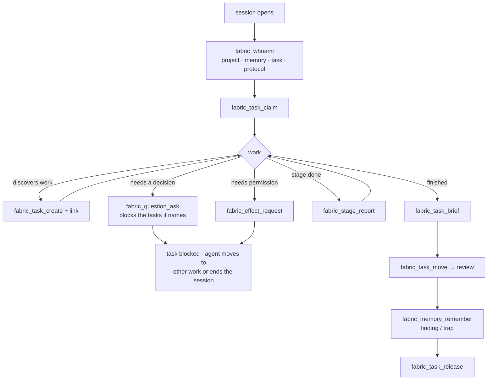
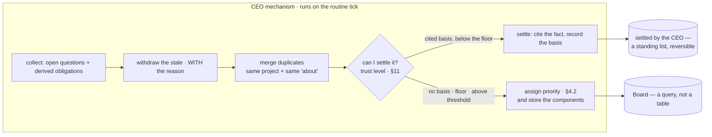
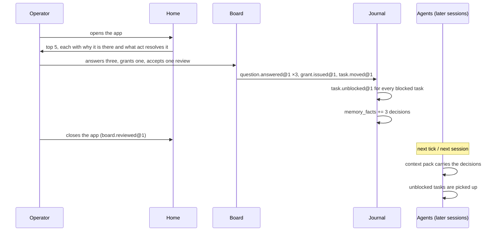
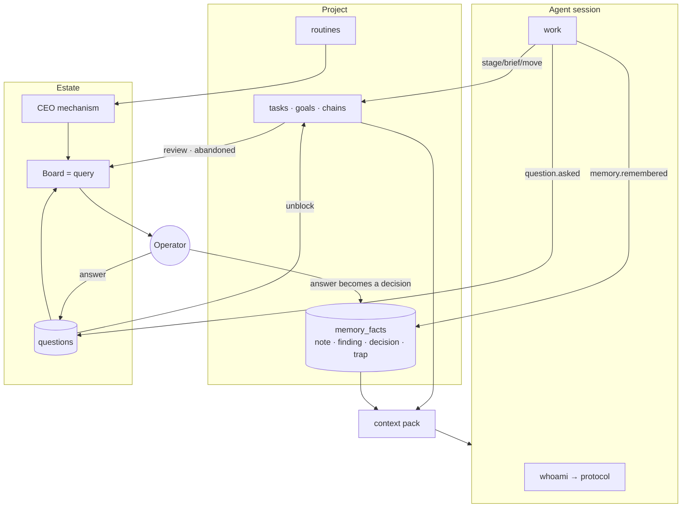

# The Board, the CEO, and the product management an agent must actually do

**Status:** design, 2026-09-05. Nothing here is built yet. Every claim about the
current system in §1 was measured against this tree today; every design decision
below names what it reuses, because the cheapest half of this design is the half
that already exists.

---

## 1. What is already here, measured

This was written after reading the code, not after remembering it. The design is
smaller than it looks because most of its parts are standing already.

| Piece | State today | Where |
|---|---|---|
| An operator queue | **exists and is derived** — `refused`, `review`, `abandoned`, `proposal` | `shared/attention.ts` |
| Task ladder with a permission table | exists; an agent cannot close its own task | `shared/ladder.ts`, `fabric_task_move` |
| Agent tool surface | **17 tools**, including claim / move / note / brief / handoff / stage-report | `main/agentSurface.ts` |
| Mandatory instruction channel | exists — `PREAMBLE` + `--append-system-prompt`, and `fabric_whoami` returns "the rules for this session" | `shared/preamble.ts`, `main/sessionBundle.ts` |
| Project memory with kinds | exists — `note`, `finding`, `decision`, `trap`, bi-temporal (`valid_to`) | `memory_facts`, `fabric_memory_remember` |
| Decisions and their lineage | exists — `superseded_by`, 44 current, 0 superseded | `shared/decisions.ts` |
| Context pack handed to every session | **exists** — project, repos, current facts, recent transcripts | `main/contextPack.ts` |
| "Where were we" digest | exists, composed from stores | `shared/digest.ts` |
| Journal-as-spine with projections | exists (ADR-0014) | `journal`, `apply_projections` |
| Goals, routines, chains, leases, grants | all exist | migrations 0022–0027 |
| **A way for an agent to ask the owner a question** | **does not exist** | — |
| **A blocked state on a task** | **does not exist** | — |
| **Anything that ranks what is waiting** | **does not exist** | — |
| **A model provider** | **does not exist, and is not scheduled** | M119, M126 |

That last row is load-bearing and the design is built around it rather than
past it. `attention.ts` already states the rule this document inherits:

> There is no model behind this product, and a chat that echoes would be a
> notepad pretending to be a colleague. But the SUBSTANCE of what that panel did
> needs no model at all.

So the Board ships without a model, and the parts that genuinely need one are
named as waiting rather than half-built.

---

## 2. The one distinction the whole design rests on

Two things arrive on the Board and they must never be merged into one record,
because **they end in different ways**:

**A derived obligation.** "This task is in review." "This effect was refused."
"This session was abandoned." Nobody wrote these down — they are computed from
state, and they leave when the state changes. `attention.ts` already holds the
rule: *a queue you can mark as read is a queue that lies, and the lie is worst
exactly when the list is long.*

**An authored question.** "Should the free tier keep the export button?" "The
migration will lock the table for ~40s — do it now or in the window?" An agent
wrote this because it reached a decision it is not entitled to make. It does not
resolve when the world changes. **It resolves when an answer is recorded**, and
the answer has to reach whoever continues the work.

Conflating them produces one of two failures, both fatal to trust:

- treat questions as derived → they can never be answered, only worked around;
- treat obligations as authored → they can be dismissed, and the queue lies.

**The Board is the ranked union of both, computed at read time.** It is a
*query*, not a table. A board stored as a table is a second copy of the truth,
and the copy that drifts is the one the operator is looking at.

---

## 3. Data model

### 3.1 Events (the spine)

Everything below is journalled first; projections are derived and rebuildable.
This follows ADR-0014, so nothing here needs its own durability story.

| Event | Payload | Written by |
|---|---|---|
| `question.asked@1` | `id`, `project_id`, `task_id?`, `text`, `why_blocked`, `options[]?`, `blocks[]` (task ids), `asked_by` (session/agent), `kind` | agent, via `fabric_question_ask` |
| `question.answered@1` | `id`, `answer`, `chosen_option?`, `answered_by` (person) | operator |
| `question.withdrawn@1` | `id`, `reason` | agent (it worked the answer out) or the projector (see §3.4) |
| `question.prioritised@1` | `id`, `priority`, `components{}`, `overridden?` | the CEO, every tick |
| `question.settled@1` | `id`, `answer`, `basis` (fact id / prior question id), `trust_level` | **the CEO**, within its trust (§11) |
| `decision.change.proposed@1` | `supersedes` (fact id), `claim`, `criticality`, `components{}` | agent, via `fabric_memory_remember` with `supersedes` |
| `project.priority.set@1` | `project_id`, `tier`, `because` | operator |
| `estate.settings.set@1` | `ceo_trust`, `priority_weights{}`, `criticality_threshold` | operator |
| `project.settings.set@1` | `project_id`, `ceo_trust?` (null = inherit) | operator |
| `task.blocked@1` | `task_id`, `question_id` | projector of `question.asked@1` |
| `task.unblocked@1` | `task_id`, `question_id` | projector of `question.answered@1` |
| `board.reviewed@1` | `until_seq`, `answered[]`, `by` | operator, when they close the Board |

`memory.remembered@1` already exists and already carries `kind`. No new event is
added for retro insights — see §5.4.

### 3.2 Projections

```sql
-- The only new table. A question is AUTHORED, so it is stored; the Board that
-- shows it is not.
create table questions (
  id            uuid primary key,
  estate_id     uuid not null,
  project_id    uuid not null,
  task_id       uuid,                  -- the work it came out of, if any
  text          text not null,
  why_blocked   text,                  -- what cannot proceed, in the agent's words
  options       jsonb,                 -- [{id, label, consequence}] — optional
  kind          text not null,         -- 'decision' | 'access' | 'priority' | 'fact' | 'approval'
  -- The SUBJECT, as a stable key: 'db.version', 'deploy.window', 'tier.free.export'.
  -- Optional, and the whole reason the CEO can answer anything at all without a
  -- model (§11): a decision fact carrying the same key answers this question
  -- mechanically. An agent that names its subject gets a faster answer, which is
  -- the right incentive to build in.
  about         text,
  -- Assigned by the CEO, never by the asker (§4.2), with the arithmetic that
  -- produced it so the order can be explained rather than trusted.
  priority      integer,
  priority_why  jsonb,
  asked_by_kind text not null,         -- 'agent' | 'person'
  asked_by_id   text not null,
  asked_at      timestamptz not null,
  status        text not null,         -- 'open' | 'answered' | 'withdrawn' | 'stale'
  answer        text,
  chosen_option text,
  answered_by   text,
  answered_by_kind text,                -- 'person' | 'ceo' — never inferred from the id
  -- What the CEO cited when it settled this itself. NULL for a person: an
  -- operator's answer needs no basis, and a CEO answer with none is invented.
  settled_basis jsonb,
  answered_at   timestamptz,
  decision_id   uuid,                  -- the memory fact the answer became (§4.3)
  seq           bigint not null
);

-- What a question blocks. A separate table because one question can block
-- several tasks, and because "what is blocked" is asked far more often than
-- "what did this block".
create table question_blocks (
  question_id uuid not null,
  task_id     uuid not null,
  primary key (question_id, task_id)
);

-- Priority is DECLARED by the operator and never silently mutated (§10).
alter table projects add column priority_tier text not null default 'active';
alter table projects add column priority_because text;
alter table projects add column ceo_trust text;   -- null = inherit the estate's

-- Estate-level configuration, journalled because it changes the shared board.
create table estate_settings (
  estate_id uuid primary key,
  ceo_trust text not null default 'cited',
  priority_weights jsonb not null,       -- the table in §4.2, tunable
  criticality_threshold integer not null default 60,
  seq bigint not null
);

-- On project_tasks, two columns rather than a new status. `blocked` is not a
-- rung of the ladder: a blocked task is still IN its rung and still someone's
-- obligation. Making it a status would let a task leave `running` by being
-- blocked, and then "how much is running" stops being true.
alter table project_tasks add column blocked_by uuid;      -- question id, or null
alter table project_tasks add column blocked_since timestamptz;
```

**Why `blocked` is a flag and not a status.** The ladder's states are the shape
of the work; blocking is a fact about the world. A task blocked in `running` is
running work that stopped; a task blocked in `backlog` is work that must not be
picked up. Both are true statements, and a single `blocked` status could express
neither.

### 3.3 What is deliberately NOT stored

- **The Board.** It is `rank(derived_obligations ∪ open_questions)`, computed on
  read. See §4.1.
- **The Board's order.** Recomputed each read. The *question's priority* is
  stored, because an actor assigns it (§4.2); the order is not, because the
  derived half has no assigner.
- **"Read" state.** Nothing on the Board can be marked read. An item leaves when
  it is *resolved* — answered, granted, accepted, released.

### 3.4 The stale rule, and why it is not a timeout

A question whose blocked tasks have all been cancelled, or whose project has
been archived, is **withdrawn by the projector** with the reason recorded — not
deleted and not left open. An open question about work nobody will do is noise
that pushes real questions off the top five, and silently dropping it would
leave the agent that asked believing an answer is coming.

A question simply *old* is never withdrawn. Age raises its rank (§4.2); it does
not expire it. An unanswered question that disappears is the failure this whole
document exists to prevent.

---

## 4. The Board

### 4.1 It is a query

```
board(scope) =
    sort_by_rank(
        derived_obligations(scope)        -- attention.ts, unchanged
      ∪ open_questions(scope)             -- the new table, status = 'open'
    )
```

`scope` is the estate (home) or one project. The *same* query serves all three
surfaces; only the scope and the cut differ:

| Surface | Scope | Shows | Rest |
|---|---|---|---|
| Estate home | all projects | **top 5** | "and 12 more" → opens the full screen |
| Project page | one project | **top 10** | "and 4 more" → full screen, filtered to this project |
| Full board | all projects, sortable | everything | grouped by project, or flat by rank |

The counts on the project *cards* come from this same query — M147 already made
that rule: *two numbers describing one thing on two surfaces is worse than one
surface having none.*

### 4.2 Priority — assigned by the CEO, computed rather than felt

**The asker does not set the priority.** An agent supplies evidence — what the
question blocks, why, what it is about — and the CEO assigns the number. A queue
where the shouting is done by whoever is asking is a queue that rewards shouting.

There is no model, so "assigns" means "computes", and the computation must be
explainable: every item on the Board carries the reason it sits where it does,
because a ranked list whose order cannot be explained is one the operator
re-sorts by hand and then stops trusting.

```
priority = blocking + breadth + age + kind_weight + goal_proximity + project_weight
```

| Component | Default | Why |
|---|---|---|
| `blocking` | `0` / `40` | A question that stops work costs money every hour it waits. Nothing else on this list does. |
| `breadth` | `min(10 × blocked_tasks, 30)` | Blocking six tasks is worse than blocking one; the cap stops one fan-out owning the board forever. |
| `age` | `min(days × 3, 30)` | Must matter, or old questions are never reached. Must not dominate, or the board becomes a queue by date — which a backlog already is. |
| `kind_weight` | `access` 15 · `approval` 15 · `decision` 10 · `priority` 5 · `fact` 0 | An access or approval question is one only the operator can settle. A `fact` question is one the CEO can often settle itself (§11). |
| `goal_proximity` | `20` if the blocked work serves an active goal | A goal is a commitment the operator made. |
| **`project_weight`** | **§10** | A blocker in a hobby project must not outrank a review in the one that pays. |

Derived obligations enter the same scale with fixed scores: `refused` 40 +
access, `proposal` at loop bound 35, `review` 25, `abandoned` 20 — each plus its
project's weight.

**Where the number lives, and why that is not a contradiction of §3.3.** The
question's priority is *assigned by an actor*, so it is **stored** on the
question with the components that produced it. The Board's *order* is still
computed at read time, because the derived half has no assigner. This is §2's
distinction one layer along: what an actor decides is a record; what is derived
is derived.

The CEO recomputes and rewrites priorities on every tick, so a stored priority is
never stale by more than one tick. When the model tier lands, the CEO may
**override** the computed value — and the override is stored with its reason,
which is exactly why the field is a record and not a formula evaluated in the
query.

Ties break by age, then by id. Stable order under the pointer is not a nicety: a
board that reshuffles between reading and clicking gets the wrong thing answered.

### 4.3 Answering, and the route the answer takes

This is the part that needed no new machinery, and finding that out is what made
the design small.

```mermaid
sequenceDiagram
    participant A as Agent session
    participant J as Journal
    participant P as Projections
    participant B as Board
    participant O as Operator
    participant C as Context pack

    A->>J: question.asked@1 (blocks: T-14, T-15)
    J->>P: questions row = open; T-14, T-15 blocked_by
    P->>B: appears, rank 40 + 20 + 0 + 10
    O->>B: reads top 5, answers
    O->>J: question.answered@1
    J->>P: question = answered
    J->>P: memory_facts += kind 'decision' (the answer, with its question)
    J->>P: task.unblocked@1 → T-14, T-15 blocked_by = null
    Note over C: the NEXT session for T-14 compiles its pack
    C->>A: the decision is in the pack, because the pack<br/>already carries current facts
```

**An answer is recorded as a decision fact in project memory.** That single
choice closes the loop through four mechanisms that already exist:

1. `contextPack.ts` already puts current facts into every session's pack, so the
   next agent to touch that task is *told the answer* with no delivery code.
2. `decisions.ts` already models supersession, so an answer that is later changed
   is a decision superseding a decision — with both readable.
3. `digest.ts` already reads decisions, so M133's "where were we" shows the
   answer without being taught about questions at all.
4. The fact is bi-temporal, so "what did the agent know when it did that" stays
   answerable.

A live session does not have to wait for its next pack: `fabric_question_check`
returns answers to questions this session asked. But the pack is the route that
works when the session is gone, which is the normal case — an operator opening
the app once a day is answering questions asked by sessions that ended hours
ago.

---

## 5. What an agent must do — the management protocol

The user's requirement is that this be *covered by mandatory skills embedded in
the agents Fabric launches*. The mechanism for that already exists and its shape
constrains the answer.

### 5.1 How the protocol is delivered

`sessionBundle.ts` appends `PREAMBLE` to every session's system prompt, and
`preamble.ts` carries a deliberate rule with a test behind it:

> The preamble names one tool and no rule — anything else is a rule living in
> two places, and the second copy is the one that goes stale.

So **the protocol is not put in the preamble.** It is returned by
`fabric_whoami`, which already promises "the rules for this session" and is
already the first call every session makes. One source, current by construction,
and versioned with the code rather than with whatever a system prompt said on
the day a session started.

`fabric_whoami` gains a `protocol` block: the obligations below, the tools that
discharge them, and the project's own additions.

### 5.2 The obligations

| # | Obligation | Tool | Exists? |
|---|---|---|---|
| 1 | Read the rules before anything else | `fabric_whoami` | ✅ |
| 2 | Claim the task before working it | `fabric_task_claim` | ✅ |
| 3 | Report each stage as it is entered | `fabric_stage_report` | ✅ |
| 4 | Split work you discover into tasks, linked to their parent | `fabric_task_create` + `fabric_task_link` | ✅ |
| 5 | **Ask rather than guess, when the decision is not yours** | `fabric_question_ask` | ❌ **new** |
| 6 | Ask rather than act, when the permission is not yours | `fabric_effect_request` | ✅ |
| 7 | Write the brief before moving to review | `fabric_task_brief` | ✅ |
| 8 | Hand off with a named thing, or do not hand off | `fabric_task_handoff` | ✅ |
| 9 | **Record what you learned that the next agent should not rediscover** | `fabric_memory_remember(kind: 'finding' \| 'trap')` | ✅ tool, ❌ discipline |
| 10 | Never close your own task | the ladder refuses it | ✅ |
| 11 | Release the lease when you stop | `fabric_task_release` | ✅ |

**Nine of eleven already have their verb.** What is missing is one tool, and —
more importantly — anything that notices when the protocol is not followed.

### 5.3 Enforcement: what is mechanical and what is only advice

This distinction is the difference between a protocol and a wish, and stating it
plainly is the point of this section.

**Enforced by refusal — the agent cannot do the wrong thing:**

- moving a task to `done` from the agent side (the ladder refuses);
- writing an effect without a grant (the authority floor refuses);
- handing off without a named thing (`chain.ts` refuses);
- exceeding the chain depth bound (`loopBound.ts` refuses);
- moving a task it does not hold the lease on.

**Enforced by observation — the omission is recorded and surfaced, not blocked:**

- a session that never called `fabric_whoami` — already journalled; becomes a
  visible property of the session and of its agent's record;
- a task moved to `review` with an empty brief — the move is allowed, and the
  review item on the Board carries "no brief" so the operator sees the cost;
- a session that ended with a blocked task still leased;
- a session that recorded no insight on a task that took more than N stages.

**Advice only, and named as such:**

- the *quality* of a question, a brief or an insight. Nothing here can judge it.
  This is the first thing a model tier would take over (§7).

Blocking on unenforceable things is how a protocol turns into a workaround
factory: an agent that cannot proceed without an insight will write "did the
task" and the store fills with sentences nobody can use.

### 5.4 Retro insights, and why no new store

`memory_facts.kind` already carries `note | finding | decision | trap`, and
`fabric_memory_remember` already writes them. A retro insight is a `finding`
(what we learned) or a `trap` (what will bite the next one). The gap is not the
verb — it is that nothing **reads them back as a retro**, so writing one feels
like shouting into a drawer.

So the design adds no store and instead adds two readers:

- the **context pack** already carries them into the next session (this is why
  writing one is worth doing);
- a **project retro surface** groups `finding` and `trap` by the task that
  produced them, so an operator can see what the estate has learned and correct
  a wrong one — the supersession machinery is already there.

---

## 6. The processes, end to end

### 6.1 The agent's working loop



The important edge is `Q → PAUSE`. An agent that asks a question **does not sit
waiting**. It records the question, the task is blocked, and the agent either
takes other unblocked work or ends. Waiting agents are how an estate ends up
paying for idle sessions and how a question gets guessed at instead of asked.

### 6.2 The CEO's loop

The CEO holds no work node (`passioncode-platform.md` already fixes this) and
runs as a routine, not a session.



Everything in that box is arithmetic. That is the claim being made: **the CEO's
useful work today needs no model.** What it does *not* do without one is in §7.

### 6.3 The operator's loop — the once-a-day case this is designed for



`board.reviewed@1` records **what the operator saw and when** — not to mark
things read, but so "this question waited three days and was on the board for
all three" is answerable, and so a question that was *never shown* because it sat
at rank 6 is a finding rather than a mystery.

### 6.4 The estate-wide chain, as one picture



Read the cycle on the right: **the operator's answer enters project memory, and
project memory is what the next session is handed.** That is the whole mechanism
by which "the CEO passes updates to the agents".

---

## 7. What needs a model, and what it would add

Named here so nothing is half-built against it, and so the boundary is a
decision rather than an accident.

| Capability | Without a model (ships) | With a model (waits) |
|---|---|---|
| Ranking | arithmetic, explainable, stable | proposes a re-order with a reason; the arithmetic stays as the floor |
| De-duplication | exact: same task + same normalised text | "these three are the same question" across projects and wordings |
| The digest | composed from decisions, questions and sessions | written as prose, at the length the operator wants |
| The question itself | the agent's own words, verbatim | rewritten for an operator who is not in the code |
| Answer routing | mechanical: unblock + decision fact | proposes which *other* tasks the answer also settles |
| **Settling a question** | **already happens** — by citing a decision fact with the same `about` key (§11) | composing an answer from evidence that does not carry the key |
| Criticality of a decision change | arithmetic over authorship, effect class, release state, breadth | "this looks bigger than its score says" |
| Project priority | operator's tier + measured pressure, both shown | proposes a re-declaration and says why |
| The chat | none — and `attention.ts` refuses to fake one | the CEO conversation of M126 |

The floor never goes away. When a model lands it *proposes*; the arithmetic and
the mechanical routing stay, because they are what makes the board correct when
the model is unavailable, wrong, or expensive.

---

## 8. Failure modes, and what each one costs

| Failure | What the operator sees | Defence |
|---|---|---|
| Agent guesses instead of asking | work built on a wrong assumption, found late | obligation 5 in the protocol; and a `review` item with no brief ranks visibly |
| Question asked and never answered | work silently stalled | age raises rank; blocked tasks are visible on the project card; nothing expires |
| Question answered, agent never told | the same question asked twice | the answer is a memory fact, so the pack carries it — no delivery step to forget |
| Board too long to be read | the important thing is at rank 8 | top 5 / top 10 cut, and `board.reviewed@1` makes "never shown" measurable |
| Two agents ask the same question | the board fills with duplicates | exact de-duplication now; semantic later; both journalled either way |
| Answer later reversed | agents act on a stale decision | supersession — both readable, the pack carries only the current one |
| A question blocks work that was cancelled | noise crowding the top five | the projector withdraws it, **with a reason** |
| The CEO settles something it should not have | work proceeds on a wrong answer | every settlement is cited and stands in a visible list; the override supersedes and is evidence for lowering the trust level |
| The CEO invents an answer | the worst failure available here | forbidden at every level by the floor: no basis, no settlement |
| Trust set too high on one project | quiet drift in exactly the project nobody watches | per-project trust may never EXCEED the estate's, so raising it everywhere is one deliberate act rather than four quiet ones |
| Weights mis-tuned | an order that feels wrong and cannot be argued with | every item shows its components, so the wrong number is visible rather than mysterious |
| A question waits forever at rank six | the top-five cut hides it | "never shown since the last review" is measured and raises its age weight (§13) |
| The operator answers, agents have all ended | nothing continues | the routine tick picks up unblocked tasks; chains resume from their next step |

---

## 9. What the operator decided, 2026-09-05

Five questions were put; all five were answered, and three of them changed the
design rather than confirming it. Recorded here because a design that quietly
absorbs its answers cannot be argued with later.

| # | Question | Answer | Effect |
|---|---|---|---|
| 1 | Does an answer bind? | **Assess how critical the change is; critical ones go to the Board for approval** | §12 — criticality is computed, and the floor in §11.3 puts an operator's own decision beyond the CEO at any trust level |
| 2 | Who may ask? | **Any session. The CEO sets the priority** | §4.2 — the asker supplies evidence, never a number. My per-session cap was dropped: the CEO absorbs the noise, and a session asking abnormally often becomes ONE board item rather than N |
| 3 | Top five when everything is low? | **Top five by priority, full stop** | My proposed floor is **refused**. The board shows what is there; it does not decide the operator has nothing worth seeing |
| 4 | May the CEO answer itself? | **Yes — and only what the CEO judges worth discussing reaches the Board** | §11. My "never silently, one press to confirm" is **refused**; the safety is that every CEO answer is cited, visible and reversible, not that it is confirmed |
| 5 | Per-project priority? | **Yes — a scale, tunable, and dynamic** | §10 |

Two of these are the operator overruling a recommendation, and both overrulings
are the right call for the same reason: a confirmation step the operator must
press every day is not a safety feature, it is a tax that trains them to press
without reading. The safety belongs in *what the CEO may settle at all* and in
*being able to see and reverse what it settled* — which is what §11 builds.

---

## 10. Project priority — declared by the operator, pressured by the world

A blocker in a hobby project must not outrank a review in the project that pays.
That needs a scale, and the scale has to be able to move without the operator
re-deciding it every morning.

### 10.1 Two numbers, and neither pretends to be the other

This is ADR-0002's rule applied to attention: **declared data and observed data
are kept apart, and a gate fails when the two disagree.**

**Declared tier** — the operator's claim, set explicitly, never mutated by the
system:

| Tier | Means | Default weight |
|---|---|---|
| `critical` | the business depends on this now | 40 |
| `active` | being worked | 25 |
| `steady` | maintained, not pushed | 10 |
| `paused` | deliberately not now | 0 |

(`archived` is `projects.status`, not a tier; an archived project's questions are
withdrawn by §3.4 rather than ranked at zero.)

**Observed pressure** — measured, never declared:

```
pressure = min( 4 × blocked_tasks
              + 3 × days_since_oldest_open_question
              + 15 × (a goal here is due within 7 days)
              + 5 × (a session ran here in the last 24h),
              25 )
```

**Effective weight = tier_weight + pressure.** The cap matters: pressure may lift
a `steady` project above an idle `active` one, and may not lift it above
`critical`. Attention follows evidence; it does not overrule the operator.

### 10.2 Why the tier is never mutated automatically

The obvious design is to let a busy project promote itself. It is wrong for the
reason ADR-0002 gives: the moment the system edits the operator's declaration,
"what did you say this was" stops being answerable, and the disagreement between
claim and world — which is the interesting signal — becomes invisible because it
has been silently resolved.

So the board says both: *"you called this `steady`; it has 4 blocked tasks and a
goal due Friday."* That sentence is a prompt to re-declare, and re-declaring is
one press. A tier that moved by itself would have produced no sentence at all.

### 10.3 Tunable, and visible when it has been tuned

`estate_settings.priority_weights` carries the table above and every default in
§4.2. Weights are a knob nobody tunes and that silently changes the board — so
the mitigation is not to forbid tuning but to make it legible: **the Board shows
each item's components**, so a mis-set weight shows up as an order the operator
can see is wrong, with the number that made it wrong.

---

## 11. The CEO's trust — the same shape as ADR-0004's autonomy, on a different subject

The operator asked for a trust level that is dynamic, set globally and
overridable per project. **That is exactly `goals.autonomy` on a different
subject**, and building a second, differently-shaped trust scale beside it would
be the "two copies of a rule" failure this repository keeps finding. So it
borrows ADR-0004's three parts:

1. an ordinal level with **inheritance and a ceiling** — a project may set its own
   `ceo_trust` and may never exceed the estate's, exactly as a sub-goal may never
   exceed its parent's autonomy;
2. **a floor that does not move at any level**;
3. **a grant is the only way through the floor.**

`goals.autonomy` governs what an agent may **do**. `ceo_trust` governs what the
CEO may **settle on the operator's behalf**. Same shape, different verb.

### 11.1 The levels

| Level | The CEO may | Mechanically |
|---|---|---|
| `ask` | rank, de-duplicate exactly, withdraw the stale. **Settle nothing.** | hygiene only |
| `cited` *(default)* | + settle a question when it can **cite a current decision fact with the same `about` key**, or an identical question already answered | a key match — no judgement |
| `routine` | + settle a `fact` question from any current memory fact, and apply **policy rules the operator wrote** ("prefer the LTS release") | a key match plus an explicit rule the operator authored |
| `proposing` | + compose an answer with reasoning below the criticality threshold | **model tier — not built** |

The default is `cited` and not `ask`, because a CEO that cannot answer "what is
the staging URL" from a fact it can point at is making the operator do clerical
work to prove a point.

### 11.2 Every settlement is cited, visible and reversible

The safety is not a confirmation press. It is three properties:

- **Cited.** `settled_basis` names the fact or the prior question. A CEO answer
  with no basis is an invented answer, and §11.3 forbids it at every level.
- **Visible.** A "settled by the CEO" list sits beside the Board, showing what it
  answered, on what basis, and when. Not a notification that scrolls past — a
  standing list, so a run of bad settlements is one glance rather than an
  archaeology exercise.
- **Reversible.** The operator overrides with one press. The override is a
  decision **superseding** the CEO's — both readable, `decisions.ts` already does
  this — and a superseded CEO answer is evidence about the trust level, which is
  how the level gets tuned from experience rather than from feeling.

### 11.3 The floor — what the CEO may never settle, at any level

Refused in the schema, not in an instruction, for ADR-0004's reason: *a
constraint that refuses the write does not have an argument.*

1. **Anything whose answer reverses a decision the operator authored.** This is
   the operator's answer to question 1, made structural.
2. **Anything whose answer authorises what ADR-0004's floor refuses** — spending
   money, deleting, outward publication under the operator's name. Settling a
   question *is* authorising its answer.
3. **Anything above the criticality threshold** (§12).
4. **Anything the CEO cannot cite a basis for.** Without a model this is most
   things, and that is not a limitation to hide — it is the floor that makes the
   rest safe.

A question hitting the floor is not refused; it goes to the Board, which is where
it was always going.

---

## 12. A decision that changes — criticality, and the approval route

The operator's rule: when a decision changes, its criticality is assessed, and a
critical change goes on the Board for approval.

An agent proposing to supersede a decision writes
`decision.change.proposed@1`. The projector scores it:

```
criticality = 40 × (the decision it replaces was authored by a PERSON)
            + 30 × (it governs an effect class that needs a grant)
            + 20 × (what it governs is already released or published)
            + min(5 × dependent_tasks_and_goals, 20)
            + project_effective_weight   -- §10
```

Above `estate_settings.criticality_threshold` (default 60) it becomes a question
of kind **`approval`** carrying the original decision, the proposed replacement,
and the score's components. Below it, the CEO may settle it within its trust —
cited, visible and reversible like any other settlement.

**Note what the first term does.** Any change to a decision the operator
personally made scores 40 before anything else is counted, and the floor in
§11.3 puts it beyond the CEO regardless of the total. A decision the estate can
overwrite is not a decision.

**And what it does not do.** A decision the *CEO* made is not protected by that
term. The estate may revise its own reasoning freely; only the operator's word is
held.

---

## 13. The CEO keeps the board current

The operator asked that there be no stale, unclosed, irrelevant questions. This
is the CEO's hygiene pass, and every item of it is arithmetic:

| Pass | Rule | Recorded as |
|---|---|---|
| Withdraw abandoned | every blocked task cancelled, or the project archived | `question.withdrawn@1` **with the reason** |
| Withdraw answered-elsewhere | a current decision fact with the same `about` key now exists | `question.settled@1`, citing it |
| Merge duplicates | same project, same `about`, or identical normalised text | the survivor absorbs the others' `blocks` |
| Re-prioritise | recompute §4.2 for every open question | `question.prioritised@1` |
| Flag a runaway asker | one session over N open questions | **one** board item naming the session — not N items |
| Notice the unshown | open, and never in a top-5 or top-10 cut since `board.reviewed@1` | raises `age` weight; surfaced in the full board as "never shown" |

Age never expires a question. The last row is why: the honest failure mode of a
top-five cut is that something waits forever at rank six, and the cure is to make
that measurable rather than to invent a deadline.

---

## 14. Build order

Each step is usable on its own; nothing here needs the next step to be worth
shipping. Steps 1–3 carry no interface at all and are verifiable through the
journal.

| # | Step | Milestone |
|---|---|---|
| 1 | `questions`, `question_blocks`, the two task columns, the projector and its planted-defect probes | M148 |
| 2 | `fabric_question_ask` + `fabric_question_check`, the `about` key, and the `protocol` block in `fabric_whoami` | M149 |
| 3 | **Project priority and CEO trust**: declared tier, measured pressure, `estate_settings`, per-project override with its ceiling | **M156** |
| 4 | The priority function as a tested pure module — arithmetic with named components | M150 |
| 5 | The Board query and the three surfaces: top 5, top 10, full screen with per-project sort | M151 |
| 6 | Answering, and the answer becoming a decision fact. **The loop closes here** | M152 |
| 7 | **CEO settlement within its trust**: cite, settle, and the standing "settled by the CEO" list with one-press override | **M157** |
| 8 | **Criticality and the approval route** for a decision that changes | **M158** |
| 9 | The CEO's hygiene pass: withdraw, merge, re-prioritise, flag a runaway asker, notice the unshown | M153 |
| 10 | The retro surface — findings and traps grouped by the task that produced them | M154 |
| 11 | Observation of the protocol: rules unread, reviews with no brief, leases left held | M155 |

Steps 1–6 are the product as described. Step 3 moves ahead of the priority
function because the function reads the project weight, and step 7 sits after 6
because a CEO that can settle before the operator can answer is a CEO nobody has
watched work.
