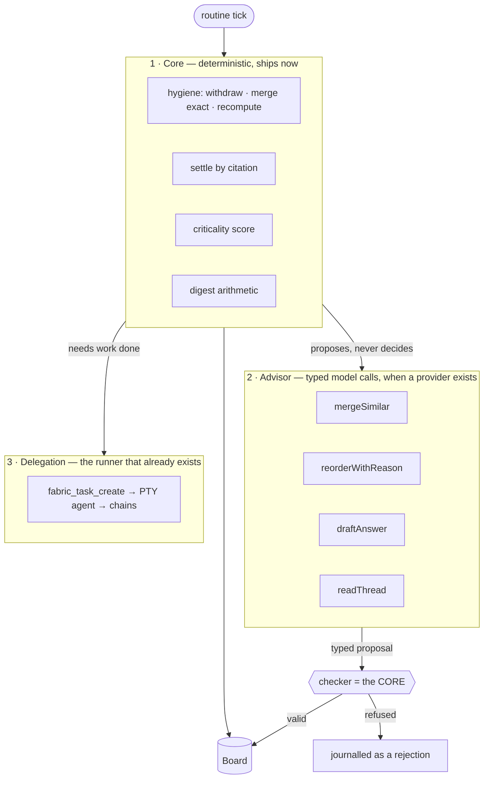

# What the CEO runs on

> **Target clarification, 2026-09-07:** The following earlier design remains historical context.
> The current task-level proposal is [system-contract.md](system-contract.md) and
> [engineering-specs.json](engineering-specs.json), visualised in [system.html](../reports/system.html).
> ADR-0045–0047 are proposed, not an assertion that runtime or external wire contracts changed.


**Status:** design, 2026-09-05. Answers the question left open by
[`board-and-ceo.md`](board-and-ceo.md) and [ADR-0036](../adr/0036-the-ceo-settles-what-it-can-cite-and-trust-is-autonomy-on-a-different-subject.md):
those decided *what* the CEO does. This decides *what executes it*.

Reasoned against the `agent-orchestrator` skill and measured against this tree.
Section references below are to that skill.

> **REVISED 2026-09-06 by [ADR-0039](../adr/0039-the-ceo-is-an-agent-after-all-and-the-line-moves-to-the-tools.md).** The operator chose an agent, for flexibility and tools. §1–§2 here (“not an agent loop”) and §5 (“no loop guards”) are superseded: the CEO IS a small tool-calling loop, with the four guards. What survives is everything else — the deterministic core, the core-as-checker, the router, `ModelPort | null`, and placement — and the new load-bearing idea is that **auditability moves from the shape of the run to the tools the agent holds**. See [`agent-system-map.md`](agent-system-map.md) §5.

---

## 1. The question, and why the obvious answers are wrong

"Is the CEO built on an off-the-shelf agent runtime like `pi`, or written
ourselves?" Both halves of that question assume the CEO is **an agent loop**. It
is not, and establishing that is most of the design.

Decompose what the CEO actually does (ADR-0035 §3, ADR-0036):

| What | Shape | Model? |
|---|---|---|
| Withdraw stale questions, merge exact duplicates, recompute priority | arithmetic over projections | **no** |
| Settle a question by citing a decision fact with the same `about` key | a key match | **no** |
| Score the criticality of a decision change | arithmetic | **no** |
| Compose the evening letter | arithmetic over the journal | **no** |
| Merge duplicates that are the same question in different words | a judgement | yes |
| Re-order with a reason the arithmetic cannot express | a judgement | yes |
| Draft an answer from evidence that carries no key | a judgement | yes |
| Read a chat thread and work out what is being asked | a judgement | yes |

**The first four are the CEO.** The last four are advice about the CEO's work,
and none of them is open-ended: each is a **single transform with a typed output**
— not a goal to be pursued with tools until it is met.

So there is no loop to host. There is arithmetic, four typed model calls, and —
when actual work is needed — the runner that already exists.

## 2. The shape: three parts, and only one of them is an agent



**The core is also the checker.** §13 of the orchestrator skill requires a checker
before anything consumes a parallel or model-produced result, and the checklist
adds that *a checker which has never rejected anything is a finding*. Here the
checker costs nothing extra, because the deterministic half can validate every
advisory output against facts:

- a proposed merge must name two questions that **exist** and share a project;
- a drafted answer must cite a memory fact that **exists and is current**;
- a re-order must move an item within a stated band, not to the top.

A proposal failing validation is **journalled as a rejection with its reason** —
which is the score the checklist asks for, and the evidence that lowers the trust
level when a provider is behaving badly.

## 3. Why not each of the alternatives

| Option | Why not |
|---|---|
| **`pi`, or another coding-agent CLI, as the CEO** | It is a **runner** — the same category as `claude-code` and `codex` — and it is not installed on this machine (`pi not found`; the `~/.pi/agent` directory was created by `obsidian-wiki setup`, whose agent list is fixed rather than discovered). Running the CEO on one gives a terminal, a working directory and file access to something whose whole job is to rank and cite. Enormous blast radius for the work. |
| **Reusing our own PTY runner** | It returns a transcript, and *"a return value proportional to the input is a function call wearing a costume"* (§ checklist). It also spawns a process, mints a credential and writes a session directory — per tick. |
| **A framework: Pydantic AI, LangGraph, and the rest** | A graph engine for four single-shot calls is ceremony, and they are Python: a permanent second runtime inside an Electron app, for four calls. §13's rule — *static unless you can name what forces dynamic* — removes the only thing a graph engine would have bought. |
| **A provider SDK client in the main process** | Closest, and still refused as written: §6 says **a router in front of the providers, not a provider client in front of the app**. The difference is a fallback chain, a total attempt cap and one place where price and window are resolved. |
| **Written ourselves** | ✅ — but "ourselves" here is ~200 lines of router plus four typed functions, not an agent framework. The smallness is the argument. |

**`pi` is still worth adding — as a runner.** `AGENTS` in `shared/agents.ts` is a
descriptor list; a third entry costs a program name, a surface adapter and its
permission modes. That is orthogonal to this document and does not touch the CEO.

## 4. The port

```ts
// shared/modelPort.ts — the contract, so the core can be tested with a fake and
// so `null` is a state rather than a crash.
export interface ModelPort {
  /** One shot, typed in and typed out. No tools, no iteration — see §5. */
  ask<T>(req: ModelRequest<T>): Promise<ModelResult<T>>
  /** What is reachable right now, for the capability-assembled prompt (§10). */
  health(): ProviderHealth[]
}
```

`ModelPort | null` **is the design**. Null is what the product has today, and it
must be an ordinary state rather than a broken one:

- the core runs unchanged;
- the advisory calls are skipped, not stubbed;
- the interface says *which* capabilities are unavailable and why, in the same
  place it says the quota is unread — never a silent degradation.

### 4.1 What the router does, and the three traps it exists for

Straight from §6, and each is a real bill:

- **Cap the attempts in total, not per provider.** Three providers with three
  retries is nine calls for one prompt.
- **Probe an unhealthy provider on a schedule.** A health check that only runs on
  failure never recovers: the chain runs one provider short forever and every
  request still succeeds, so nobody sees it.
- **Fail over between turns, never mid-turn.** Reasoning carries a vendor
  credential, sometimes on the tool call; a mid-turn switch 400s, and *stripping
  the reasoning* is what causes it.

And one that is Fabric's own doctrine rather than the skill's: **model, window and
price are resolved at one boundary from configuration**, never from a table of
vendor ids in source — the same rule the launch options already follow.

### 4.2 Where it sits, and what ADR-0021 already decided

ADR-0021 makes **execution placement a property of each immutable provider
binding**: `local_harness`, `provider_managed`, `estate_managed`,
`platform_managed`. The CEO's advisor is a provider binding like any other, and
today only `local_harness` exists — the Electron main process, holding the key
with the same custody as the Supabase service key.

Nothing new is invented for placement. When hosted estates arrive, the binding's
placement changes and the port does not.

### 4.3 Metering, and the floor that already exists

Every call is journalled — `model.called@1` with the provider, the model, the
tokens and the cost. Two things follow at no extra cost:

- §9 asks that the observable feed be *a view over a durable trace, never the
  record itself*, because **a stream nobody stored is a run `agent-evals` cannot
  evaluate**. Fabric's journal is already that trace.
- `quotaGate.ts` already blocks unattended work when the account is nearly spent,
  and `routine.ts` already refuses to make up a missed window. A CEO that quietly
  burns the budget re-ranking a board nobody opened is prevented by machinery
  that exists.

## 5. Why none of §2's loop guards appear here

The orchestrator skill's §2 carries a long list — in-loop trimming at 80%, a
wrap-up injection at 70%, a max-iteration guard, an iteration refund on a
recoverable error, budget awareness in the prompt. **None of them is implemented
for the CEO, and that is a decision rather than an omission.**

They are all guards on *a loop that decides its own next step*. The CEO's model
calls have no tools, take one turn, and return a typed value. There is no
iteration to bound, no history to trim, and no context that grows.

The moment any advisory call gains a tool, it becomes a loop and inherits every
one of those guards. Recorded here so that day is a decision and not a drift.

## 6. The prompt is assembled, not stored

§10: the prompt is built per request from the same capability flags that build
the tool list, so the two can never disagree. For the CEO that means each typed
call carries exactly what its transform needs:

| Call | Given | Returns |
|---|---|---|
| `mergeSimilar` | N open questions of one project, with their `about` keys | pairs to merge, each with a reason |
| `reorderWithReason` | the ranked list with its components | a proposed move plus the reason the arithmetic missed |
| `draftAnswer` | one question and the facts that mention its subject | a draft answer, **with the fact it cites** |
| `readThread` | a bounded thread (chat + reply chain, §5.3 of the Telegram design) | what is being asked, or a clarifying question |

None of them is handed the estate. A sub-agent's value is its own window, and a
call that receives everything has none.

---

## 7. Build order

| # | Step | Ships without a model? |
|---|---|---|
| 1 | The core: hygiene, settlement by citation, criticality, digest arithmetic — pure modules in `shared/`, driven by the existing tick | **yes** |
| 2 | `ModelPort` as a contract plus a fake, so the core is tested against both a present and an absent provider | **yes** |
| 3 | The validators — the core, used as the checker — with a planted bad proposal watched being refused | **yes** |
| 4 | The router: fallback chain, total attempt cap, scheduled health probe, one boundary for model/window/price | needs a key |
| 5 | The four typed calls, one at a time, each behind its validator | needs a key |
| 6 | `model.called@1` and the cost surface | needs a key |
| 7 | *(orthogonal)* `pi` as a third runner descriptor, if the operator wants it | **yes** |

Steps 1–3 are the whole CEO as ADR-0036 defines it. Steps 4–6 are the advisor,
and the product is complete without them — which is the property that made this
shape worth choosing.
