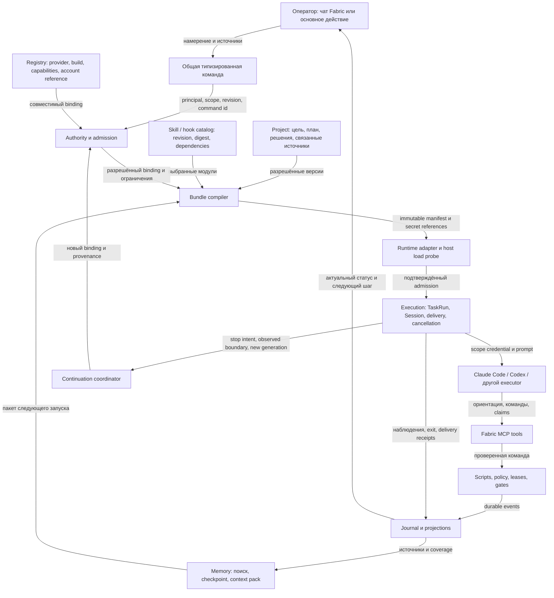

# Harness Fabric: модули, подключение и границы гарантий

Статус: **аудит реализации + рекомендуемая декомпозиция**, 2026-09-26. Не новый wire contract и не подтверждение готовности релиза. Источник текущего состояния — Fabric `019a23eaad9169e1e8b0751da8230f939ea76839`; [доказательства и воспроизведение](../audit/2026-09-26-harness/evidence.md). [План исправлений](../audit/2026-09-26-harness/plan.md), [единый вход и передача](../audit/2026-09-26-harness/README.md).

Текущая реализация после аудита: [все R0-модули](../launch/harness-r0/modules.md), [разработка и зависимости](../launch/harness-r0/development.md), [измеренные проверки](../launch/harness-r0/checks.md). Аудиторский baseline ниже сохранён; исправления имеют собственные receipts. Обновление 2026-09-27: migrations60/61 и `managedLaunch.ts` разделяют admission, one-shot begin, final validation, bind, actual write и ACK. Общая session identity до spawn; lease timeout не доказывает конец writer; boot не отменяет работу других hosts. [Контракт и ограничения проверок](../launch/harness-r0/checks.md#har-r0-03--единый-managed-launch-2026-09-27).

HAR-R0-04 добавляет [durable Stop contract](../launch/harness-r0/stop.md): операционные receipts, observed/never-spawned основания и удержание неизвестного writer. SQL, native binding, typed IPC и UI Stop имеют локальные проверки; остановка фоновой работы провайдера и целостная native приёмка ещё впереди. [Exact-build provider packets](../launch/harness-r0/providers.md) задают следующий этап.

HAR-R0-05 реализует внутренний execution binding, ограниченный JSONL transport, нормализацию части событий Codex и control coordinator с проверкой прав на самой записи. Typed cancellation имеет отдельный порт до физического teardown. Составная проверка использует реальные pipes собственного Node fixture; это не native Codex/Claude приёмка. Supervisor и production producers ещё не подключены. HAR-R0-06 исправляет идемпотентность redaction и задаёт [общую схему подготовки входов](../launch/harness-r0/ingress.md); desktop journal, answer/import и подготовка оригиналов подключены; остальные sinks сохраняют явно названных владельцев, без обещания универсального покрытия. [Receipts и следующая работа](../launch/harness-r0/checks.md).

Документ детализирует существующие [system-contract](system-contract.md), [agent-composition](agent-composition.md), ADR-0035/0063/0067/0069. Нормативный внешний формат остаётся в **fabric-agent-contract**. Предложения ниже требуют реализации и приёмки; статусы backlog не повышаются. Архитектурные развороты и новые публичные схемы проходят отдельный ADR/version gate.

## 1. Что именно называется адаптером

1. **Provider authoring adapter** — `fabric-agent-adapter`: skills и скрипты, помогающие разработчику описать или создать провайдера, manifest, wrapper и fixtures. Он не устанавливает Fabric в запущенную сессию Claude/Codex.
2. **Runtime adapter** — код Fabric, который знает аргументы запуска конкретного CLI, канал команд/результата, поддерживаемые права, остановку и продолжение. Сейчас реализованы MCP-конфигурация Claude Code (`--mcp-config --strict-mcp-config`) и конфиг сессии Kilo Code в `KILO_CONFIG_CONTENT` (адаптер `config-content-env`, [ADR-0119](../adr/0119-acp-is-the-generic-runner-drive-and-runners-are-catalogue-rows.md); подключение проверено на Kilo 7.4.17 — `docs/reports/2026-10-05-openrouter-agent-support/raw/probes/`); Hermes Agent подключается по ACP через терминальную оболочку Fabric и stdio-мост (адаптер `acp-session`, поправка 2 к ADR-0119; проверено на Hermes 0.21.4); терминал Codex и Cline (до пробы, открывшей его сессию) не равны полноценному Fabric executor.
3. **Agent profile / binding** — выбранная роль, инструкции, runner и разрешённые серверы проекта. Это конфигурация работы, не отдельный процесс и не учётная запись провайдера.
4. **Session bundle** — материал для одного запуска. В текущем коде: MCP config, preamble, необязательный context pack и его content-addressed packet. Целевой bundle дополнительно фиксирует skills, hooks, policy, compiler и версии зависимостей.

**Итог:** пользователь подключает доступный исполнитель; Fabric проверяет его возможности и собирает материал для конкретного запуска. Копирование skill в глобальную папку само по себе не подключает исполнителя и не даёт ему полномочий.

## 2. Итоговая схема

Сплошные стрелки — рекомендуемый путь данных; схема показывает **целую целевую систему**, а готовность каждого узла находится в таблице ниже.

Отдельный контур: **Provider authoring adapter → manifest/fixtures → contract validation → host admission → project binding**. Он поставляет кандидата в registry, а не запускает его в обход admission. Условие подключения другого провайдера — доказанный конкретный набор возможностей, а не присутствие в списке.

## 3. Модули и фактическая готовность

`Есть` означает наличие кода указанного шва; `частично` — ограниченный рабочий механизм; `план` — требуемый следующий слой. Ни одно из этих слов не заменяет live conformance на конкретной сборке CLI.

| Модуль | Что уже есть | Пробел / следующий результат | Доказательство |
|---|---|---|---|
| Identity / project scope | Scoped store, токен Session/Project, серверные проверки | Новые manager-команды должны использовать тот же authority path | E05, E08 |
| Provider registry | Дескрипторы runner, permission modes, result channel; matrix по сборкам | Текущие native-resume receipts unverified; capabilities проверять на точной версии | E01, E09 |
| Agent configuration | Имя, инструкции, runner, список servers | Нет versioned skill/hook selection в AgentSpec; нужен воспроизводимый resolved manifest | E02 |
| Authoring adapter | Skills создания/адаптации provider, scaffold/validation | Не provisioning runtime; pins трёх репозиториев требуют compatibility review | E03 |
| Installation | npm копирует authoring skills и по умолчанию сохраняет существующие | Legacy shell и `--force` перезаписывают; нет ownership/upgrade/uninstall receipt | E03 |
| Session bundle | Scope config, grant recheck, preamble, context; cleanup после spawn failure/exit | Нет полного skill/plugin/hook compiler; compile-after-mint failure может оставить token/dir | E04, E16 |
| Orientation / load | `fabric_whoami` и journal receipt protocol hash/version | Receipt запроса не доказывает чтение ответа, всех skills или соблюдение инструкций | E05 |
| Execution / PTY | Запуск, ввод/вывод, exit, delivery/ack, result-channel проверки | Stop без observed boundary; existing-task path не компенсирует все spawn/bind failures | E01, E06, E14 |
| Conversation continuation | Детерминированный delivery id, последовательный retry | Дубли при concurrency; queued после crash ошибочно считается delivered; premature written и pending-slot overwrite | E07, E15 |
| Portable continuation | Проверяемый context packet; switch phase model | Switch coordinator не подключён к production caller; не доказан межпровайдерный resume | E04, E09 |
| Rules / scripts / gates | Typed tools, policy, task ladder, enforced/observed/advice vocabulary | Нет общего native-tool interception; instruction не является sandbox | E08 |
| Skills / hooks | Документированный target bundle | В ограниченном native source search нет skill bundle/hook provisioning; React hooks-check — другая проверка | E02, E04, E10 |
| Memory / evidence | Transcripts, facts, pack, scoped search | Coverage, bounded retrieval, checkpoint и redaction gaps остаются в MEM-P0…P7 | E11 |
| Manager / cycles | Детерминированные work/chain/routine механизмы и target CEO | Свободный CEO-диалог с полным управлением не доказан этим аудитом; ModelPort и общий command path остаются отдельной работой | E10, E12 |
| Operator projection | Harness snapshot с scope и partial/unavailable readings | Итоговая готовность не должна сводиться к одному «подключён» | E13 |

## 4. Как агент получает harness: текущий путь

1. Fabric выбирает descriptor/runner и permission mode. `executorReadiness` проверяет структурную возможность быть executor; это отдельный вопрос от свежей проверки установленной сборки.
2. Compiler проверяет запрошенные MCP servers относительно разрешений проекта. Отозванный grant останавливает подготовку до выдачи credential.
3. Создаётся scoped token и session directory с ограниченными правами; внутри `mcp.json` и доступный `context.md`. Контекст дополнительно сохраняется по digest отдельно от временной папки.
4. Claude получает `--mcp-config`, `--strict-mcp-config`, `--append-system-prompt`. Последний указывает на `fabric_whoami`. **Strict MCP config не означает изоляцию всех skills, правил, файловых и сетевых инструментов CLI.**
5. Запрос `fabric_whoami` записывает ориентацию и возвращает проект, repositories, task, протокол, информацию о context pack. Ошибка journal не лишает агента ответа; значит отсутствие receipt — неизвестность, а не доказательство отсутствия правил.
6. Агент вызывает scoped инструменты. Claims агента и наблюдения host хранятся раздельно. Task ACK не равен accepted outcome; проверка результата остаётся отдельной стадией.
7. Exit и failed spawn после успешной компиляции запускают cleanup и отзыв токена. Но compile выполняется до spawn try/catch: ошибка после mint может оставить token/dir (E16). Текущий `kill()` сам по себе не подтверждает прекращение всех дочерних процессов и внешних действий.

Это подтверждает доставку **части** harness. Утверждения «все skills установлены и загружены» и «агент не может обойти правила своими инструментами» из этого пути не следуют.

## 5. Целевой manifest и цепочка доказательств

Предлагаемый внутренний DTO, **не выпущенная внешняя схема**:

| Группа | Что фиксировать |
|---|---|
| Identity | estate/project/task/taskRun/session, binding revision, generation, resolved primary repository |
| Provider | provider id, exact CLI build, runtime/OS, adapter revision, account reference без credentials |
| Instructions | protocol version/hash, agent instructions digest, source provenance и разрешённый context packet |
| Skills | namespace/id, revision, content digest, dependency closure, required/optional, origin/license, supported host |
| Hooks / gates | hook id/version, event/schema, trusted executable digest, timeout, output cap, cancellation, failure policy |
| Capability policy | required result/ACK/stop capabilities, effective grants revision, containment limits, budgets |
| Compilation | compiler version, manifest digest, omitted/unsupported items с причиной, owned paths/keys |

Secret values исключены из manifest, memory, journal и report. Secret references сами не дают права: host разрешает их только для допущенного binding. Пакет источников не исполняется как политика; fetched text и agent memory остаются данными.

Цепочка состояния: **selected → materialized → host registered/loaded → orientation served → task acknowledged → observed progress → checked outcome**. Для каждого шага нужны отдельные `status`, timestamp, digest и scope. Неподдерживаемая host introspection остаётся `unverified`; model-generated «я прочитал» — только claim. Даже validated load receipt не доказывает, что модель всегда следует skill: это проверяется поведенческим corpus, а опасные действия блокирует код.

Обязательный skill/hook не загрузился → managed run не admitted. Необязательный модуль отсутствует → явный degradation, если policy разрешает такой режим. Свободный терминал можно открыть как отдельный режим с ограниченными гарантиями; он не становится managed executor автоматически.

## 6. Skills, scripts, hooks, gates и flows

| Слой | Назначение | Кто держит гарантию |
|---|---|---|
| Skill | Метод работы: какие источники читать, как анализировать и формировать proposal | Модель интерпретирует; skill не даёт privilege |
| Script | Повторяемое вычисление/проверка с типизированным вводом и ограниченным выводом | Host запускает разрешённый versioned executable |
| Hook | Привязка script к событию конкретного host | Adapter доказывает событие, matcher, timeout и cancellation |
| Gate | Условие допуска к переходу или эффекту | Trusted command handler; model prose не подменяет verdict |
| Flow | Последовательность состояний с guards, retry/recovery и человеческими решениями | Durable coordinator/journal, а не порядок сообщений в чате |

Пример: человек говорит «продолжи другим агентом». CEO уточняет только неоднозначный Task/provider, формирует proposal. Script проверяет capability/права; coordinator прекращает admissions, останавливает старую generation, строит checkpoint, допускает новый run и ждёт ACK. Skill помогает объяснить выбор и восстановить смысл. Он не заменяет остановку, не выдаёт grant и не закрывает task.

Для hook нужны unit fixtures плюс **проверка нарушения**: попытка пропустить gate должна быть остановлена на требуемой границе. Молчание hook, timeout, неверный JSON, unsupported event и stale version не дают зелёный статус. На CLI без полной interception честно ограничиваем гарантию `fabric_mediated`; `native_too` возможно только после отдельного доказательства containment.

## 7. Управление и восстановление

Три разных действия сохраняем отдельно:

- **Продолжить текущую сессию:** доставить решение той же живой Session с устойчивой дедупликацией и ACK. Это место дефекта E07.
- **Возобновить conversation провайдера:** только при доказанной поддержке native resume конкретным adapter/build/account/runtime. Не переносить opaque vendor reference в другой provider.
- **Новый агент с сохранённым контекстом:** новый TaskRun/Session, явная связь predecessor, старый checkpoint + разрешённые источники + branch/worktree/dirty-state receipt, новый capability admission. Это перенос контекста, а не продолжение того же процесса.

Рекомендуемые stop states: `stop_requested → stopping → stopped_confirmed` либо `stop_unknown`. Новая generation с тем же write scope не стартует при unknown. Отзыв Fabric credential закрывает Fabric API, но не доказывает, что старый процесс потерял собственные filesystem/network credentials. При отсутствии гарантии человек видит точную причину и recovery action, а не ложное «остановлен».

Необходимо сохранять причину завершения: user stop, app shutdown, crash, provider error, natural exit. Exit code не доказывает готовность результата. Эффект, отправленный наружу до остановки, отдельно reconciles; его нельзя безопасно повторять только потому, что процесс завершился.

## 8. Что показываем оператору

Это требования к следующей реализации существующих экранов, **UI в этой итерации не изменён**; сценарии и mockups обновляются вместе с соответствующим implementation packet.

На Home/Project: агент, проект, текущая работа, наблюдаемый статус/свежесть, одно основное действие. В деталях: исходная задача, run/session, provider/build, контекст, применённый набор skills, границы доступа, доказательства состояния. Установка и версии — в Settings → Agents/Harness; объяснение сбоя доступно из текущей карточки.

Готовность: «Терминал доступен», «Подготовка», «Возможности не проверены», «Готов к этой задаче», «Работает с ограничениями», «Нужна помощь». Эти состояния вычисляются из receipts. Нельзя показывать «Готов» из факта наличия бинарника или загруженного аватара.

Чат, кнопка карточки и голос создают одну команду с тем же scope/idempotency/revision. Подробности не навязываются в основном потоке; при отказе показывается конкретная причина и следующий допустимый шаг. Внимание оператора требуется для выбора и полномочий, не для ручного копирования harness-файлов.

## 9. Граница первого релиза

Рекомендуемый обязательный путь: доказанный Claude Code managed executor, versioned minimal bundle, правдивый load/admission статус, исправленная доставка, подтверждённая остановка, сохранённый контекст, новая сессия и recovery. Запрошенный пользователем Codex handoff входит в желаемый R0, **но остаётся release blocker**, пока не реализован и не проверен его adapter/result/stop/context path. Уменьшение этого обещания требует отдельного продуктового решения; аудит его не принимает молча.

Marketplace, произвольные third-party plugins, автоматическое самоизменение skills и новые внешние протоколы не prerequisites этого узкого пути. Их идеи сохраняются в прежнем backlog; расширение идёт через manifest/adapter seams, без второго journal или параллельного launcher.
