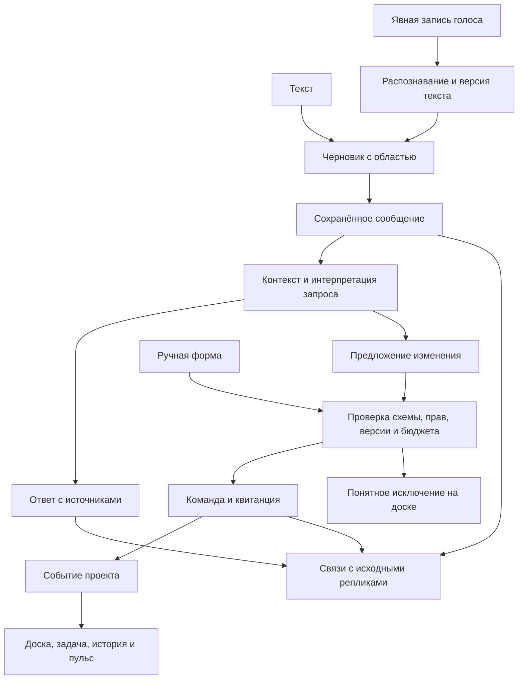

# Общение и управление через Fabric

**Статус: контракт R0; границы владения и setup приняты в ADR-0061 (2026-09-17), отсутствующие runtime-порты остаются планом.** Обязательный объём голоса/журнала задан оператором; ниже — проектируемые контракты, не утверждение о реализации. [Постановка](../launch/operator-first.md) · [план](../ux/plans/2026-09-15-r0-operator.md).

## 1. Единая система, два способа действия

Ручной UI и разговор с Fabric обращаются к одним командам. Модель помогает понять запрос, подготовить объяснение или спецификацию; право и факт изменения подтверждают scoped validator и command receipt. Голос добавляет способ ввода, не новый набор полномочий.

Не добавлять вторую event store, параллельный CEO или отдельную шкалу trust. [ADR-0032](../adr/0032-project-memory-is-verbatim-first-and-built-not-adopted.md) требует verbatim-first и отсутствие LLM в первичном write path; [ADR-0036](../adr/0036-the-ceo-settles-what-it-can-cite-and-trust-is-autonomy-on-a-different-subject.md) задаёт settlement и floor; [ADR-0039](../adr/0039-the-ceo-is-an-agent-after-all-and-the-line-moves-to-the-tools.md) переносит контроль в tools. [Контракт пульса](personal-fabric-pulse.md) уже описывает события, курсоры, свежесть и циклы. Эти решения переиспользуются.

## 2. Владелец и адрес каждого объекта

Названия ниже — семантические порты. [AD01 matrix](../launch/adoption/contract-bindings.json) связывает их с точными файлами/символами в commit `c1fb56125c28f14de88191e7ffb162b7eb0eed72`; отсутствующие producers отмечены отдельно. `Scope` и `EntityRef` переиспользуются из canonical shared modules; wrapper добавляет scope/revision, не второй словарь идентичностей. Новые Message/TaskRun references требуют расширения canonical resolver. Ревизии сохраняются и сравниваются как opaque значения, не вычисляются UI.

| Объект | Владелец / обязательные свойства | Не путать с |
|---|---|---|
| Conversation | Estate; audience/access scope, участники, список связанных проектов | Сессия CLI и TaskRun |
| Message | Conversation; стабильный ID, actor, role, input_kind, original text ref, timestamps, sequence | Принятое решение или tool instruction |
| TranscriptRevision | Message/voice draft; original recognition и отредактированный вариант, автор/время/derived_from | Молчаливая замена сказанного |
| Attribution | Message/span → project/task/goal/question; explicit/derived, version, actor, reason | Копия сообщения в каждом проекте |
| Intent/Proposal | Ссылки на message spans, typed operation, destination, ожидаемый результат, prerequisites | Право выполнить действие |
| Command receipt | Стабильный request ID, scope, expected revision, policy ref, outcome, resulting entity refs | Фраза Fabric «готово» |
| Timeline projection | Разрешённые читателю события с причинными связями | Полный приватный разговор estate |
| Appearance | Существующая estate identity / revision | Контекст разрешений или выбранный provider |

Сохранять `origin_scope` отдельно от `target_scope`: исходная реплика может обсуждать несколько проектов, но каждая команда адресована конкретно. У реплики фиксируются `origin_view`, `project_id/task_id` при наличии, `captured_at`, `submitted_at`; `received_at` и sequence задаёт доверенный writer. Переход A→B после отправки не переадресует уже отправленное. В глобальном разговоре неопределённый адресат остаётся estate intake: он не подставляется из последней вкладки. Несколько поручений разбиваются на независимые intents с собственными receipts; один отказ не изображает общий успех.

Conversation identity не обещает переносимость provider session. [ADR-0051](../adr/0051-provider-accounts-and-conversation-continuity.md) — proposed контракт продолжения у провайдера; журнал Fabric должен быть сохранён даже при невозможности native resume. PTY transcripts и CEO messages связываются через refs, но не объявляются одним форматом.

## 3. Запись, доставка и восстановление

До обращения к модели CEO/dispatch сохранить сообщение и outbox item атомарно либо обеспечить доказуемое восстановление после сбоя между этими шагами. `message_id` и `request_id` сохраняются при retry; transactional writer и unique constraints определяются после D01. UI показывает: **черновик → сохранено локально → принято системой → обрабатывается → ответ/отказ/неизвестный исход**. Локальное сохранение не называется синхронизацией; offline не означает dispatch.

Неуспешное сохранение блокирует dispatch и сохраняет доступный черновик. Потеря ответа после commit ведёт к reconcile того же request ID, не к повторному созданию задачи. Streaming assistant response получает message ID до первого fragment; завершение/обрыв/частичный ответ фиксируются. Видимый пользователю текст, его исправления и итог остаются; скрытые chain-of-thought не запрашиваются и не являются частью пользовательского журнала.

Большие текст/аудио blobs живут в имеющемся Storage с immutable reference, hash и access scope; журнал несёт ссылки и версии. Обновления UI применяются по cursor/read envelope, сохраняя выделение, scroll и незавершённый ввод. Ответ из проекта A не открывает A поверх работы в B: появляется scoped unread-сигнал с осмысленным переходом.

## 4. Голосовой ввод R0

Предлагаемый первый срез — **нажал «Записать» → сказал → «Остановить» → проверил текст → «Отправить»**. Назначение выбрано перед отправкой, а во время записи постоянно видно. Запись не начинается при открытии панели. Нажатие отправки является поручением; второй однотипный approval поверх безопасного поручения не нужен. Пороговые решения и изменения полномочий имеют отдельный preview/confirm по policy.

| Состояние | Что видит человек | Следующее действие |
|---|---|---|
| idle | Текстовый ввод и кнопка записи | Печатать либо записать |
| permission-required / denied | Зачем нужен микрофон; при отказе текст остаётся | Разрешить через OS или продолжить текстом |
| recording | Видимый индикатор, длительность, адресат, Stop/Cancel | Остановить либо отменить; фокус не захватывается |
| processing | Запись остановлена, идёт распознавание | Отменить ожидание, сохранить draft, повторить при ошибке |
| transcript-ready | Полный редактируемый текст, источник «голос», адресат | Исправить, отправить, записать дополнение |
| silence / no-device / interrupted | Конкретная причина и сохранённая пригодная часть | Повторить запись или ввести текст |
| submitted / delivery-unknown | Message ID/состояние, исходный текст доступен | Ждать/проверить исход; без второй команды |

Нельзя принимать решения по частичным распознанным словам. Низкая уверенность распознавания не даёт права угадать имя проекта или сумму: показать сомнительный фрагмент/выбор. Числа, отрицания, имена и переключение языка включить в corpus. Смена вкладки не меняет адрес текущей записи; скрытое продолжение записи без явного индикатора не допускается. Политика stop при закрытии/сворачивании фиксируется в UI-контракте, с сохранением восстанавливаемого draft. Не писать постоянный аудиопоток.

Захват получает стабильный capture ID и локальный receipt до передачи распознавателю; незавершённая запись хранится как восстанавливаемый ограниченный draft по media policy. ASR — преобразование канала ввода до отправки, а не семантический отбор того, что записать в память. После отправки исходная расшифровка сохраняется без LLM-фильтра; срок raw audio управляется отдельно. Повтор STT имеет тот же capture ID и общий бюджет попыток.

`SpeechToTextPort` возвращает текст, язык, segments/uncertainty при поддержке, provider receipt и ошибку; конкретного поставщика этот план не выбирает. OX-07 сравнит локальный/сетевой вариант на целевом desktop: RU/EN, latency, offline, обработка данных, стоимость, permission и packaging. Отсутствие STT provider не скрывается fake microphone success. Текстовый fallback позволяет работать, но сборка без проверенного voice-path не проходит полный R0, запрошенный оператором.

## 5. Что именно логируется

Все отправленные реплики оператора, видимые ответы Fabric (включая частичные/ошибочные), исправления и связи сохраняются. Черновик не считается публично отправленной репликой; он восстанавливается отдельно. Частичные STT drafts и отменённые записи не попадают в проектный timeline как поручения. Оригинальный распознанный текст и отправленная редакция различимы.

Raw audio — отдельный объект и настройка хранения. Предложение для R0: текстовая история долговечна по политике владельца Conversation/audience; проектные excerpts имеют отдельный lifecycle; длительное хранение исходного аудио включается явно, с видимой retention и удалением. Архивирование проекта A не удаляет первичный общий разговор и допустимые ссылки B. Это открытая настройка, а не утверждение «записываем весь звук навсегда». В план входит выбор retention перед активацией. Аудио не требуется для обычного поиска по задачам, но при включённом хранении segment открывает соответствующий timestamp.

Личные заметки, секреты и данные других проектов не раздаются команде через общий transcript. Проект получает разрешённый excerpt/ref, а чтение сообщения повторно проверяет ACL. Секреты не пишутся в логи запросов, URL, analytics или обычные context packs; redaction видна как redaction, а ограниченный raw source хранится только при допустимой политике. Удаление/ограничение доступа оставляет безопасный tombstone и отзывает derived excerpts/index entries, не восстанавливая контент из summary. Это проектные требования; юридические сроки и внешние обязательства здесь не утверждаются.

Архитектура R0 уточнена [ADR-0075](../adr/0075-private-ceo-content-and-opaque-journal-receipts.md): одна личная Conversation на Person/subject, immutable primary content отдельно от Estate-readable journal, в журнале только opaque receipts. Обычные actor/time/seq остаются видимыми; это защита содержания, не скрытие участия. [Пакеты и пределы приёмки](../launch/harness-r0/ceo-conversations.md) разделяют SQL, native IPC/drafts и UI/owner-portable recovery. Архитектурное решение не объявляет эти механизмы внедрёнными.

## 6. Атрибуция и timeline

Явно выбранный проект/задача даёт подтверждённый адрес. Извлечённые моделью связи помечаются предложенными, пока правила или оператор не подтвердили их. Детерминированная ссылка на открытый Task при scope snapshot не требует лишнего вопроса. Если одна реплика относится к A и B, ссылки могут указывать на разные spans; нельзя автоматически раскрывать весь разговор обоим проектам.

Timeline различает: **информация получена → Fabric предложил → оператор решил / правило применено → команда принята → агент получил → результат появился → результат проверен**. У каждого звена тип события, актор и причина. Текст «давай подумаем об удалении» не становится разрешением удалить. Исправление проекта или расшифровки добавляет версию; существующее решение продолжает ссылаться на текст, на основании которого оно было принято. Если correction делает задачу неверной — отдельная команда изменения с новым receipt.

Из задачи/решения/версии настроек открывается точная реплика, затем разговор вокруг неё. Из разговора видны связанные артефакты и их актуальное состояние. Поиск учитывает права, проект, время, автора, тип и наличие решения; summary всегда ведёт к первоисточнику. Чтение не автоматически помечает весь пакет изученным.

## 7. Самостоятельность без налога на подтверждения

| Класс | Поведение R0 | Что остаётся оператору |
|---|---|---|
| Наблюдение, сводка, дедупликация, точный ответ по принятому основанию | Автоматически в пределах разрешённого чтения и trust | Просмотреть основание/исправить факт |
| Явное обратимое поручение внутри уже выданной области | Штатная команда без повторного «точно?»; квитанция и доступная отмена, если операция обратима | Исключение или неизвестный исход |
| Подбор workflow/конфигурации из неструктурированного намерения | Editable preview: что изменится, где, кто и в каких пределах | Подтвердить новую конфигурацию либо исправить |
| Смена полномочий, превышение бюджета/criticality, отмена решения оператора, запрещённый внешний эффект | Удержать действие, показать конкретное основание и необходимые варианты | Действие того, у кого есть право |
| Недостаточные/противоречивые источники | Точный вопрос адресату; merge повторов по subject/revision | Одно недостающее решение, не повтор всего контекста |

Модель не может выдать себе scope, grant или budget. Capability catalog один для prompt, tool exposure и UI; неподдержанная функция имеет понятное состояние и ручной путь, а не пустую кнопку. Policy res проверяется на выполнении, а не только при составлении proposal. Локальный CLI вне перехватываемого gateway не объявляется sandboxed: границы enforcement показываются в подробностях подключения.

## 8. Прогрессивная настройка

Минимум для нового агента: **роль → ожидаемая работа → существующий Provider → что может сам / когда спросит → лимит**. Имя, модель и технические параметры — следующая ступень. Binding/config/role/run/session названы различимо. Save config не означает canary/admission/launch; UI показывает отдельный шаг допуска, если он нужен, и проверенный результат.

Цикл: **готовый шаблон → когда → над чем → кто → лимит → когда остановиться / спросить**. Preview показывает ближайшее окно, последствия и scope. Подробности раскрывают typed inputs/steps/retry/concurrency/checkpoint/version. CEO создаёт тот же typed workflow proposal, который открывает ту же форму. Save, enable и run-now — различимые команды. Пауза цикла прекращает новые окна, а текущий запуск имеет отдельный статус и доступную stop policy; скрыть карточку не значит остановить работу.

## 9. Развитие, миграция и критерии выхода

Порядок: единая адресация и inventory → durable conversation/outbox → текст → voice draft → attribution/readers → узкие config/workflow commands → bounded autonomy и cycles. Граница миграции: старые PTY transcripts сохраняются как PTY, не получают выдуманных message IDs и task links; импортированные связи несут provenance и unknown там, где записи нет.

Совместимость: версии событий и proposal schemas, additive reader до writer activation, обратимое выключение нового ввода без удаления уже записанного. Rollback отключает capability, сохраняет журнал и drafts; unknown external effects сначала reconciled. Index можно перестроить из событий, первичный разговор не восстанавливается из summary.

Приёмка по [OX-05…OX-12](../ux/plans/2026-09-15-r0-operator.md): restart, offline→online, duplicate submit, A→B во время записи/запроса, ACL revocation, multi-intent partial failure, исправление transcript, отсутствие модели, denied microphone, stop/resume цикла. До activation определить target OS/STT backend, retention и quota, не обновляя public provider contract без отдельной необходимости. Ни один этот пункт пока не является проверкой живого runtime.

## Prototype seam exercised · 2026-09-16

The [R0 UI iteration](../launch/r0-ui.md) exercises the proposed interface boundaries: Estate/Project origin, explicit artifact destination, immutable message provenance, `{ok, receipt, entityRef}` acknowledgement, idempotent apply, versioned relink, exact routine drafts and separate activation. Implementation evidence: `scripts/product/assistant.mjs` exports `submitAssistantMessage`/`applyAssistantProposal`; `scripts/product/launch.mjs` exports `addLaunchArtifact`/`relinkLaunchArtifact`; `scripts/test/r0-ui-design.test.mjs` supplies negative checks. These are fixture reducers, not a production journal or gateway. CTX task/question IDs isolate the context example from the older invitation/staging fixture. No backend schema, transport, authority rule or runtime readiness changed.

## AD01: принятые границы и обнаруженные пробелы · 2026-09-17

[ADR-0061](../adr/0061-project-setup-precedes-managed-activation.md) разделяет сохранённый Project и managed activation. Первый может иметь ненастроенную PM-ответственность; второе требует ровно одного допущенного PM. Выбор разработчика не назначает PM и не выдаёт прав. Blueprint настроенной организации сохраняет требование PM и не используется как формат неполного setup.

[Source-bound matrix](../launch/adoption/contract-bindings.json) фиксирует producer, owner, identity/revision, authority, ошибки и недостающие механизмы для каждой способности. `node scripts/check-adoption-bindings.mjs` сверяет anchors и хеши с immutable source; это source proof, не native acceptance.

- `main/conversationRegistry.ts` хранит provider/account continuity; это не CEO message history и не outbox. AD09 использует существующий Estate journal с зарегистрированными событиями и одной границей commit/reconcile.
- `IPC.projectsCreate` сейчас сохраняет Project и затем прикрепляет репозитории. Project ID не доказывает immutable command payload; AD04 должен определить транзакционный результат и частичное прикрепление, исключить повтор с изменённым payload.
- Native digest передаёт boundary вместе с payload. AD07 сохраняет это правило, дополнительно ограничивает состав snapshot этой границей и вводит actor/Estate namespace личного курсора. Текущая head и длина списка не заменяют показанный срез.
- Business messages и принятые context checkpoints принадлежат существующему journal. Неотправленные drafts, личный review cursor и guide state используют существующий localState CAS/recovery. Guide не владеет Task/Agent и не выдаёт grants.
- Routine сейчас создаётся enabled. AD17 должен разделить сохранение paused, enable и run; изменение документации не меняет это runtime-поведение.

Точные prerequisites каждого packet находятся в [общем контракте](../launch/adoption/contracts.md#exact-dispatch-prerequisites). AD12 отдельно измеряет настоящий STT; невыбранный provider не считается успешным выходом. Все отсрочки остаются в CO-167; эта матрица не второй backlog.
