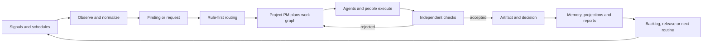

# PassionCode.ai and Fabric — high-level platform architecture

**Status:** canonical technical direction under ADR-0018 through ADR-0033; public hierarchy amended by ADR-0070
**Reviewed:** 2026-09-26 (portfolio hierarchy only; technical scope retained)
**Decision scope:** product and system boundaries, not vendor procurement or detailed
component design

> **Vocabulary note, 2026-09-08 (S10 · [ADR-0045](../adr/0045-workflow-runs-task-runs-and-explicit-iterations.md)):**
> where this document says **run** it means a **WorkflowRun** — one execution of one
> pinned graph version, the wire's `run_id`. A **TaskRun** is a different identity: one
> admitted attempt at one Task. The bare word is no longer used alone, and
> [`CONTEXT.md`](../../CONTEXT.md) defines both. This note clarifies the reading; the
> text below is unchanged and remains the record of its own decision.


## Portfolio boundary · ADR-0070

PassionCode.ai is the organization (ADR-0090). Fabric is its product, the CEO AI agent for coordinating
agents and Projects, in development. Fabric Switchboard is Fabric's account tool, usable on its own,
desktop beta selected as the first public download (licence: AGPL-3.0 or commercial,
[ADR-0092](../adr/0092-every-repository-is-agpl-3-0-or-commercial.md)); its release does not establish Fabric
runtime readiness. [ADR-0070](../adr/0070-passioncode-toolkit-and-product-design-system.md)
changes naming and common design direction, not the authority, data or kernel boundaries
below. Read references to the platform operating loop as Fabric’s target capabilities.

## 1. The vision in one sentence

**From vibe coding to passion coding.** PassionCode.ai moves the control point from
individual agent conversations to durable Projects and the teams and operating loops
around them (ADR-0033).

**Fabric is the CEO AI agent and operating environment in development within the
PassionCode.ai toolkit. Fabric the technical kernel makes work portable, durable,
governable and inspectable.**

The product is not a gallery of chatbots and not a dashboard glued onto unrelated
automations. It is a system of persistent organizations and projects in which people,
agents and external services work through one explicit lifecycle: observe, propose,
decide, execute, verify, learn and schedule the next action.

Working language:

- **Organization:** PassionCode.ai (its toolkit is for AI-native teams)
- **CEO AI agent / product in development:** Fabric
- **First public-download product:** Fabric Switchboard
- **Kernel / compatibility layer:** Fabric the kernel
- **Working positioning:** PassionCode.ai — A toolkit for AI-native teams.
- **Category:** From vibe coding to passion coding.
- **Operating reframe:** Stop managing agents one by one. Start operating projects.
- **Working slogan:** Where people and agents run the business together.

The category is decided in ADR-0033; ADR-0070 updates positioning and portfolio
hierarchy. The technical product/kernel boundary is decided in ADR-0018.

## 2. What a customer is buying

A customer is not buying “agents.” They are buying five compounding capabilities:

1. **One operating picture.** Projects, current work, incidents, customer questions,
   content opportunities, releases, evidence and cost are visible without opening each
   provider separately.
2. **A closed work loop.** Signals become typed work; work is routed to an accountable
   role; results are checked; accepted artifacts update the system; schedules and new
   signals begin the next loop.
3. **Replaceable execution.** A role binds to a capability, not permanently to one
   model, vendor or runtime. Historical runs retain the provider revision that actually
   served them.
4. **Bounded autonomy.** Agents can act quickly inside explicit scope. Money, deletion,
   publication and sensitive customer decisions remain behind policy and grants.
5. **Human participation without a parallel tool.** Owners, employees, contractors and
   specialists receive only the tasks, evidence and controls relevant to their role;
   they may perform the work themselves or delegate a declared slot to automation.

## 3. The nested operating model

```text
PassionCode.ai
└── Estate (organization or personal workspace)
    ├── People: owners and members
    ├── CEO agent: routes across projects; holds no work node
    ├── Shared services: identity, policy, vault, journal, billing, registry
    └── Project (persistent workspace around one purpose)
        ├── one Product Manager agent
        ├── goals and immutable work graphs
        ├── routines and event triggers
        ├── agent/provider bindings
        ├── connection bindings
        ├── reports, artifacts and project memory
        └── human interaction points and role workspaces
```

The organization is the tenant. A personal workspace is the same Estate object seeded
from another template, not a second ontology. A Project is persistent; a Goal and Run
are temporary. An Agent is a replaceable project binding; a Provider is the reusable,
versioned implementation behind it. A Routine owns recurrence so replacing an agent
does not destroy cadence or history.

## 4. The closed loop



Every transition is journalled. Events announce that something happened; the journal
is the source of truth; queryable registers and dashboards are rebuildable projections.
An external effect is not “exactly once” because a queue says so: it requires an
idempotency key, a recorded attempt, an observed receipt, retry policy and compensation
or reconciliation where the target API cannot deduplicate.

## 5. The six planes

| Plane | Owns | Does not own |
|---|---|---|
| Product experience | estate/project navigation, role workspaces, approvals, evidence, layout | provider internals |
| Control | identity, membership, policy, registry, admission, bindings, budgets, scheduling | executing untrusted work |
| Execution | durable run state, checkpoints, queues, workers, terminal/runtime adapters | business authority |
| Integration | connections, MCP tools, A2A peers, webhooks/events, provider views | tenant-wide ambient credentials |
| Knowledge | artifacts, provenance, project memory, promoted estate knowledge, search | hidden cross-estate memory sharing |
| Evidence | append-only journal, traces, metrics, logs, checker verdicts, cost | unsourced “agent says done” status |

The control plane may be hosted while execution remains local or customer-managed.
[ADR-0021](../adr/0021-execution-placement-is-declared-per-provider-binding.md) makes
placement a property of each immutable provider binding: `local_harness`,
`provider_managed`, `estate_managed` or `platform_managed`. Only the last profile makes
PassionCode.ai the host of third-party code and engages its sandbox obligation.

## 6. Protocol allocation

One protocol does not need to carry every relationship:

| Boundary | Default | Reason |
|---|---|---|
| External agent/automation ↔ Fabric control plane | MCP | project-scoped discovery, current context and admitted commands under ADR-0026 |
| Remote surface (Quest, phone) ↔ Fabric on the Mac | northbound MCP through the relay | projections and typed commands with receipts; the Mac connects out, and the relay holds no authority (ADR-0088) |
| Host ↔ tools, data and prompts | MCP | capability discovery and scoped invocation |
| Estate ↔ autonomous estate/provider | A2A 1.0 | task lifecycle, artifacts, input-required state, agent cards |
| Provider ↔ embedded interactive view | MCP Apps-compatible extension | sandboxed UI with host-controlled tools and fallback |
| Internal event producers ↔ consumers | CloudEvents-compatible envelope candidate | portable occurrence metadata without choosing a broker |
| Service ↔ telemetry pipeline | OpenTelemetry | correlated traces, metrics and logs without choosing a backend |
| Skill/instruction packaging | Agent Skills-compatible package | progressive disclosure, reusable scripts/references/assets |
| Fabric provider lifecycle | Fabric Agent Contract | admission, binding, result, execution and governance semantics |

MCP, A2A and Agent Skills are not alternatives to Fabric. They standardize edges.
Fabric defines the domain semantics between those edges: tenant, project, capability,
authority, run, proof, artifact, memory promotion and billing attribution.

[ADR-0026](../adr/0026-fabric-exposes-a-project-scoped-policy-enforced-mcp-control-surface.md)
makes the MCP direction explicit. Southbound, Fabric is an MCP client invoking the
capabilities compiled into a Run. Northbound, Fabric is an MCP server exposing authorized
Project projections and typed control commands to external agents. The northbound adapter
is a protocol seam over the same policy, Event Journal and durable runtime; it is not a
second control plane. Its canonical contract is
[`mcp-control-surface.md`](mcp-control-surface.md).

## 7. Agent and product foundry

There are three legitimate entry paths:

1. **Install an admitted provider** from a registry and bind it to one project.
2. **Adapt an existing repository or service** with an Agent Bootstrap Recipe.
3. **Create a new provider** in a foundry project, using the same production pipeline
   that any other deliverable uses.

All three converge on one lifecycle:

```text
discover/source
  → inspect manifest and provenance
  → run conformance fixtures
  → admit exact provider revision
  → bind capability + scope + effect ceiling to one project
  → canary under independent checker
  → promote, hold or roll back future resolution
```

A copied prompt is only a bootstrap recipe. It pins inputs, proposes changes, adapts or
creates code, runs local checks and emits a provider bundle. It contains no standing
credential and cannot admit or bind itself. This preserves the low-friction onboarding
idea without turning prompt text into a security boundary.

## 8. Workspaces and widgets

PassionCode.ai exposes two related surfaces:

- **Owner workspace:** configure estates, projects, agents, routines, connections,
  policies, budgets and layouts; inspect the whole evidence chain.
- **Role workspace:** a focused queue and dashboard containing only addressed tasks,
  relevant context, permitted actions, due/SLA state and the person's own automations.

A provider may contribute a view, but the host controls its frame. The view receives a
scoped projection and may request declared tool calls; it never receives database or
vault access. A structured fallback must expose the same work and approvals when the
host cannot render the extension. Under
[ADR-0024](../adr/0024-v1-workspaces-use-a-constrained-responsive-grid.md), v1 uses a
constrained responsive grid: rectangular admitted spans, no overlaps/arbitrary pixel
coordinates, a canonical keyboard/focus order, narrow linearization and immutable
Estate + Project + Role layout revisions. A future spatial canvas is a separate product
surface, not a workspace mode switch.

## 9. Worked scenario — an AI-native B2B SaaS

The estate contains one product project and several service projects.

### Customer and support loop

1. Mail, chat and product events enter through estate Connections.
2. A support routine normalizes the signal, links the customer/account and deduplicates
   it into a request or incident artifact.
3. A support agent answers questions inside its knowledge and effect ceiling.
4. A sensitive or unresolved case becomes an `approve` or `respond` interaction point
   in the human supporter's role workspace, with evidence and SLA.
5. The resolution is checked, sent through the organization's connection, and retained
   as a sourced artifact. Only reviewed facts are promoted to knowledge.

### Reliability and development loop

1. Logs, traces, synthetic checks, releases and customer crashes become observations.
2. Rule-first routing sends asset-specific findings to the owning product project;
   cross-cutting findings go to the CEO only when no deterministic route exists.
3. The PM creates a goal graph: reproduce → diagnose → propose fix → implement → test →
   review → release → monitor.
4. Developer and QA providers execute nodes in isolated workspaces. An independent
   checker gates artifacts, not the producer's prose.
5. Production effects require the applicable grant. Release monitoring opens a new
   incident or closes the loop with sourced evidence.

### Research, content, SEO and growth loop

1. A daily research routine scans declared sources and produces evidence-backed topics,
   not posts.
2. A content planner maps accepted topics to audience, channel and project facts.
3. Writer/SMM providers draft channel-specific artifacts; SEO validates search intent,
   technical constraints and position changes.
4. Publication under the organization's name crosses the floor and requires a grant or
   human interaction point. Once published, analytics and Search Console observations
   feed the next research run.
5. Technical SEO findings enter the product backlog through the target PM; an SEO agent
   never writes a developer's graph directly.

The loops share the same primitives but not the same memory or authority. “One system”
means one lifecycle and evidence model, not one omniscient prompt.

## 10. Knowledge and memory

Memory has scopes and promotion paths:

- **Run context:** temporary, pinned to one execution and checkpointed for resume.
- **Project memory:** accepted facts and artifacts for one project; no direct writes by
  another project.
- **Estate knowledge:** reviewed, provenance-carrying facts intended for reuse.
- **External source:** fetched through a Connection and cited; it is not copied wholesale
  merely because an agent read it.

Promotion is a decision with source, author/actor, confidence, contradiction handling,
retention/decay and target scope. Search is a projection over authorized records. A
vector index is not the memory system and never bypasses tenant or project filters.

## 11. Security and authority

Every sensitive operation is evaluated as principal + action + resource + context
through the typed decision port accepted by
[ADR-0023](../adr/0023-policy-is-an-embedded-decision-port-that-never-grants-on-uncertainty.md).
The v1 reference is an embedded Cedar-compatible evaluator supplied by signed,
versioned bundles. Default deny and forbid/floor precedence are mandatory; missing,
expired or invalid policy/entity data and evaluation errors are `indeterminate`, which
can never grant a new effect, credential, scope or remote read.

Non-negotiable invariants:

- `estate_id` is present from the first persistence layer; every event carries actor and
  tenant identity.
- Authentication and authorization are separate; membership and role claims are not
  accepted from user-editable metadata.
- Credentials live in an estate vault. Projects and agents receive time/scoped material
  through bindings, never the stored secret.
- Context does not carry authority. Every hop re-authorizes the requested effect.
- An external MCP credential points to an immutable access binding over explicit Projects
  and operations. It is never forwarded to a worker, Provider or downstream tool.
- Provider code, view code and tools are separate trust surfaces with separate grants.
- Cross-estate exchange carries typed artifacts through declared interaction points,
  never shared database rows or implicit memory.
- Policy runs at admission, provider/hop resolution, credential release and immediately
  before each external effect. A planning-time allow is not standing authority.
- A valid signed last-known-good policy bundle may continue through a control-plane
  outage; an expired/revoked bundle may not. Every decision receipt names request hash,
  policy/entity revisions, evaluator and diagnostics.

## 12. Runtime, reliability and observability

A Run is durable state, not a worker process. The runtime checkpoints every agentic
iteration, preserves partial artifacts, releases a worker while waiting, and resumes
from a monotonic event position. Questions, approvals and external input share one
suspended state contract.

[ADR-0022](../adr/0022-durable-execution-is-an-adapter-over-the-event-journal.md)
places a `DurableExecutionPort` beneath that contract and selects Temporal as the
reference managed profile for scheduled, effect-bearing and multi-day Runs. Workflow
code is deterministic; model/tool/network operations are persisted Activities/Steps.
Dispatch is at-least-once, while logical effect completion requires a stable
idempotency key plus attempt and observed-receipt records. Fabric's Event Journal remains
the domain source of truth; engine history exists for orchestration recovery.

A Run pins its engine and workflow build. Existing Runs drain/resume there; new Runs may
bind to a successor adapter. Cross-engine movement closes the old Run with a portable
snapshot and creates a linked continuation Run rather than rewriting one history.

Telemetry is OpenTelemetry-shaped and correlates the user-visible run with model calls,
tools, external effects and worker spans. The evidence plane additionally records domain
facts OTel does not define: result schema, proof, unverified surfaces, checker verdict,
policy revision, provider revision and cost attribution. Retention, recovery objectives
and service-level objectives remain CO-082.

## 13. Technology capability map

This is a capability map, not a purchasing decision.

| Need | Architectural requirement | Candidates / standards | Decision state |
|---|---|---|---|
| Transactional tenant store | Postgres, RLS, append-only journal + projections | Supabase/Postgres | direction accepted; RLS details CO-071 |
| Durable orchestration | deterministic recovery adapter over Fabric journal; timers, signals, retries, pause/resume, pinned build | Temporal reference; Restate/Cloudflare adapters after fixtures | ADR-0022 accepted; implementation open |
| Event envelope | stable type/source/id/time/schema revision, broker-neutral | CloudEvents | CO-078 |
| Authorization | typed PARC decision port; signed LKG bundle; default deny; indeterminate never grants effects | embedded Cedar-compatible reference; later OPA adapter | ADR-0023 accepted; implementation open |
| Fabric northbound control | authorized Project resources; typed idempotent commands; durable handles; per-request policy | MCP 2026-07-28 + Tasks extension with Fabric-handle fallback | ADR-0026 accepted; implementation open |
| Agent/tool interoperability | capability discovery and scoped invocation from Runs | MCP | accepted southbound boundary |
| Peer/estate interoperability | tasks, input-required, artifacts, cards | A2A 1.0 | accepted boundary |
| Embedded provider UI | sandbox, typed bridge, fallback | MCP Apps-compatible | ADR-0020 |
| Telemetry | correlated traces, metrics and logs | OpenTelemetry | accepted shape |
| Artifact/blob storage | immutable object references, checksums, retention | S3-compatible object store | provider open |
| Search | tenant-filtered lexical + semantic projection | Postgres FTS/pgvector, external index later | provider open |
| Secrets | per-estate keys, audit, rotation, short-lived delivery | managed KMS/vault or self-hosted equivalent | CO-069 |
| Untrusted execution | machine boundary appropriate to trust tier and declared placement | VM/microVM/container sandbox | ADR-0021; CO-045 for platform-managed isolation detail |

## 14. Open questions by abstraction level

This table is a map, not a second register. Status and exact wording remain canonical in
the carry-over ledger.

| Level | Settled | Open question families | Blocking horizon |
|---|---|---|---|
| Product identity | PassionCode.ai product; Fabric kernel (ADR-0018); Estate subscription unit fixed internally (ADR-0025) | tier/price/overage details and marketplace economics (CO-080); final brand/trademark outside architecture | before public offer |
| Operating model | Estate/Project/CEO/PM; role interaction points; execution placement per binding (ADR-0021) | SLA/escalation (CO-072), privacy obligations (CO-073), platform-managed isolation details (CO-045/069) | before non-operator users |
| Domain model | Project persistence, immutable runs, artifact aperture | work-item authority (CO-051), project lifecycle/dependencies (CO-064), unified effects/grants (CO-059/065) | before backlog and lifecycle automation |
| UX/workspace | owner and role surfaces; provider-view seam (ADR-0020); constrained responsive grid (ADR-0024) | member scenario validation and the concrete layout-schema fixture | before member workspace build |
| Workflow/runtime | journal spine; durable execution port and Temporal reference profile (ADR-0022); routines, checkpoints, independent gates | suspend/resume API detail (CO-016), checker policy (CO-060/061), adapter fixtures | before scheduled effect-bearing runs |
| Agent lifecycle | external contract, production pipeline, bootstrap lifecycle | runner passports (CO-074), instruction/model revisions (CO-055/056), loaded-skill proof (CO-066) | before second real provider/runner |
| Protocol/integration | MCP northbound control (ADR-0026), MCP southbound capabilities, A2A and MCP Apps allocation | event envelope/schema governance (CO-078), upstream compatibility proposals (CO-053), connection inventory (CO-003/004/009/010/012/014/024) | before multi-source production |
| Security | tenant from migration 1; embedded policy decision port with fail-closed uncertainty (ADR-0023) | RLS/session invariants (CO-071), vault custody (CO-069), platform-managed sandbox detail (CO-045) | before external tenant or hosted code |
| Knowledge/data | scoped memory and artifact promotion | export/deletion/retention/decay contract (CO-081), evidence graph (CO-023), artifact store (CO-054) | before durable customer knowledge |
| Observability/operations | journal + OTel-shaped telemetry | SLO, RPO/RTO, backup/restore and retention (CO-082), provider quotas/heartbeats (CO-057) | before production SLA |
| Economics | Estate subscription is primary unit and includes managed continuity plus platform-agent credits (ADR-0025); per-estate wallet direction and hierarchical budgets | delegated-slot payer (CO-070), standing budget grants (CO-063/065), marketplace trust/liability/settlement (CO-080), private tier and overage rules | before paid multi-estate use |
| Governance/ecosystem | discovery ≠ admission ≠ binding; canary promotion | reputation/moderation/revocation and dispute rules (CO-080), contract release process (CO-053/074) | before public registry |

### The five former blockers are now settled

ADR-0021..0025 close the five choices raised by the 2026-08-29 architecture review:
placement is per binding; durable execution is an adapter with a Temporal reference
profile; policy is an embedded Cedar-compatible decision port with fail-closed
uncertainty; v1 uses a constrained grid; and the internal commercial unit is an Estate
subscription with managed continuity and platform-agent credits.

Implementation still must prove the durable adapter, policy failure matrix and layout
schema with fixtures. The remaining bounded questions keep their canonical status in the
carry-over ledger and may not become implicit when their “before” condition arrives.

## 15. Delivery sequence and decision gates

This is architectural sequencing, not a committed release calendar:

| Horizon | Prove | Minimum product slice | Gate before advancing |
|---|---|---|---|
| 0 — org #1 legible | the system observes reality with receipts | estate/project registry, journal/projections, portfolio observer, sourced attention | stale/broken property appears without manual checking |
| 1 — one closed project loop | typed work survives provider/process failure | PM graph, durable run contract, provider binding, checker, grant/effect receipt, release monitor | one real finding reaches observed recovery end-to-end; ADR-0022/0023 fixture suites pass before effect-bearing schedules |
| 2 — one real team | humans participate without owner-level access | identity/membership, role workspace, interaction SLA/escalation, support handoff | a non-owner resolves work with no credential or unrelated context; CO-071/072/073 satisfied |
| 3 — bring and compose | third-party providers and external control agents can join without bespoke integration | bootstrap recipe, conformance/admission, canary binding, sandboxed provider view, constrained grid, project-scoped MCP access | second provider/runner passport plus ADR-0024 layout and ADR-0026 authorization/idempotency fixtures pass before visual build |
| 4 — federate and host selectively | estates collaborate without shared memory | personal estate, A2A interaction slots, budget attribution, per-binding local/provider/estate/platform placement | CO-069/070 and platform-managed isolation threat model accepted |
| 5 — open ecosystem | discovery becomes a governed market | public registry, signing/provenance, reputation/revocation, private commercial package and settlement | CO-080, privacy/export and production SLOs accepted |

The rule from ADR-0016 remains: a later horizon may shape contracts early, but may not
consume implementation capacity before the preceding slice is real and observed.

## 16. Documentation reconciliation

| Earlier state | Classification | Resolution and receipt |
|---|---|---|
| Vision described org #1 and still rejected a reusable framework | contradiction after ADR-0016/operator clarification | product/kernel boundary and narrower anti-vision now live in `docs/vision.md:58` and `docs/vision.md:141`; ADR-0018 records the reversal |
| README called Fabric the platform/client backend but did not make the brand boundary explicit | ambiguous/stale copy | `README.md:3` names PassionCode.ai as product and Fabric as kernel |
| Provider and agent were used almost interchangeably | ontology gap | distinct definitions plus bootstrap/view/workspace terms at `CONTEXT.md:103`, `CONTEXT.md:113`, `CONTEXT.md:118`, `CONTEXT.md:123` |
| UX covered only P-01 and twelve operator screens | missing user-facing behaviour | P-02..04 and JTBD-04..07 in `docs/ux/foundation.md`; role/foundry/workspace screens begin at `docs/ux/screens.md:231`; SCN-013..021 are draft pending user validation |
| Agent-composition froze marketplace design under ADR-0011 | stale scope assumption | historical amendment is labelled at `docs/architecture/agent-composition.md:7`; §13 is reopened at line 348; ADR-0025 now owns the internal primary package while CO-080 retains marketplace trust/liability |
| Agent-family/backlog still treated CO-028 as blocking | stale dependency | role catalogue status at `docs/architecture/agent-family.md:3`; backlog scope note and marketplace dependencies at `docs/evidence/backlog.md:96` and `docs/evidence/backlog.md:128` |
| Compatibility contract had no safe provider UI seam | architecture gap | ADR-0020 plus §8: sandboxed MCP Apps-compatible view, host-owned layout and mandatory structured fallback |
| Open questions were scattered and mixed with historical statuses | navigation gap, not a new register | §14 maps them by abstraction level; canonical status remains the carry-over ledger, now extended through CO-082 |

No runtime or schema is claimed implemented by this reconciliation. Existing derived HTML
surfaces remain explicitly dated snapshots in `README.md`; Graphify is regenerated at the
accepted commit rather than treated as source.

## 17. Source receipts and constraints

External facts were re-checked on the dates stated below against primary sources:

- [MCP specification](https://modelcontextprotocol.io/specification/2026-07-28) —
  capability negotiation and the resources/prompts/tools boundary.
- [MCP Authorization](https://modelcontextprotocol.io/specification/2026-07-28/basic/authorization/)
  and [MCP Tasks](https://modelcontextprotocol.io/extensions/tasks/overview) — remote
  resource-server authorization, audience-bound credentials and durable task handles;
  re-checked 2026-08-30 for ADR-0026.
- [A2A specification 1.0](https://a2a-protocol.org/latest/specification/) — agent
  cards, tasks, artifacts and `INPUT_REQUIRED`.
- [MCP Apps overview](https://modelcontextprotocol.io/extensions/apps/overview) —
  sandboxed interactive UI resources and host-controlled tool calls.
- [Agent Skills specification](https://agentskills.io/specification) — `SKILL.md`
  packages with progressive disclosure and optional scripts/references/assets.
- [Temporal documentation](https://docs.temporal.io/) and
  [architecture](https://github.com/temporalio/temporal/blob/main/docs/architecture/README.md)
  — durable recovery, deterministic workflow code and idempotent-or-non-retryable
  Activities; selected as the reference managed profile, not the domain source of truth.
- [Restate key concepts](https://docs.restate.dev/foundations/key-concepts) and
  [Cloudflare Workflows](https://developers.cloudflare.com/workflows/) — alternative
  durable-step/journal adapters measured against ADR-0022's fixture contract.
- [CloudEvents specification](https://github.com/cloudevents/spec/blob/main/cloudevents/spec.md)
  — vendor-neutral event context and transport-independent formats; candidate only.
- [OpenTelemetry observability primer](https://opentelemetry.io/docs/concepts/observability-primer/)
  — traces, metrics and logs; telemetry shape, not a storage backend.
- [Cedar authorization guide](https://docs.cedarpolicy.com/auth/authorization.html) and
  [validation](https://docs.cedarpolicy.com/policies/validation.html) — PARC, default
  deny, forbid-overrides-permit, diagnostics and policy-schema validation; reference
  evaluator under ADR-0023.
- [OPA operations](https://www.openpolicyagent.org/docs/operations),
  [bundles](https://www.openpolicyagent.org/docs/management-bundles) and
  [decision logs](https://www.openpolicyagent.org/docs/management-decision-logs) —
  caller-owned failure semantics, signed last-known-good activation and decision
  receipts used to define the replaceable policy port.
- [Supabase RLS guide](https://supabase.com/docs/guides/database/postgres/row-level-security)
  — row security and JWT caveats already captured by CO-071.
