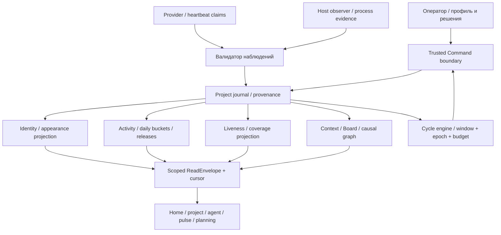

# Персональный Fabric: профиль, активность, релизы и пульс

**Статус:** целевая архитектура 2026-09-15, [ADR-0059](../adr/0059-personal-fabric-and-evidence-backed-pulse.md). Реализация этой итерации — документация и интерактивные макеты. Это расширение [system-contract](system-contract.md), C1 ContextView, C2 Agenda, C3 Execution, C5 Cycle, C6 Provenance из [контрактов запуска](../audit/2026-09-15-launch/contracts.md). Новые DTO ниже пока не объявлены существующим wire API.

## 1. Конечная форма и границы

Fabric — узнаваемое лицо estate. Проект владеет целью, задачами, решениями, работой и релизами. Provider остаётся заменяемым исполнителем роли. Цветной аватар — версия представления постоянной идентичности; он не является ID, статусом, permission или доказательством активности.

Профиль, Home, доска, график, live-панель, релизы и планирование читают согласованные проекции общего журнала. Это один модульный монолит с доверенным command boundary, PostgreSQL journal и детерминированными проекторами. Отдельные сервисы, новый брокер и graph database для R0 не требуются. UI не определяет business state; граф — представление существующих связей.



Наблюдаемая база, которую следует переиспользовать: [liveness.ts](../../apps/desktop/src/shared/liveness.ts) уже разделяет claim, observation и coverage; [livenessRead.ts](../../apps/desktop/src/main/livenessRead.ts) собирает heartbeat/run/orientation; [cycleView.ts](../../apps/desktop/src/shared/cycleView.ts) различает config/observation/outcome. Это чтение исходников ревизии [d2bec11](https://github.com/passioncode-ai/fabric/tree/d2bec116a254cae49a0e5b4f53d3665b88b2eed6), не проверка live-системы. D01 обязан пройти producers → readers → UI и выявить конкретные пробелы, прежде чем добавлять второй health engine.

## 2. Владелец каждого факта

| Объект | Владелец / ключ | Храним | Не выводим из него |
|---|---|---|---|
| FabricIdentity | estate / durable CEO role slot | identity_id, role_slot_id, created_at | Provider, лицо, имя не дают authority |
| AppearanceRevision | identity / revision | seed, generator_version, style_id, palette_version, asset_ref, digest, selected_at, selected_by | Время работы, здоровье, опыт |
| ActivityEvent | project / source event ID | kind, subject_ref, evidence_ref, occurred_at, received_at, journal_seq | Текст агента не равен verified result |
| DailyBucket | estate/project + timezone + date + filter revision | accepted decisions/results/releases, coverage, contributing IDs | Неизвестное покрытие не 0 |
| AgentObservation | role_slot + TaskRun + Session | last agent claim, host observation, orientation coverage, received_at | Вывод терминала не ACK и не решение |
| CycleView | cycle_id + window | definition_revision, host coverage, last outcome, next due | enabled не означает работает |
| ReleaseRecord | project + release_id + environment | artifact digest, commit refs, changes, publication attempts, verification receipts, acceptance | Merge, deploy и success — разные факты |
| ViewCursor | user + view/scope | last displayed seq, explicit read checkpoint | Просмотр не закрывает Board obligation |

Профиль принадлежит **estate**, а не каждому участнику совместного estate: участники видят одного Fabric. «У каждого свой» означает свой Fabric в личном пространстве; членство в другом estate переключает и профиль. Локальные предпочтения (порядок/избранное/пауза ленты) принадлежат пользователю. Это предотвращает борьбу нескольких персональных обликов за одну CEO identity.

## 3. Генерация и жизненный цикл аватара

R0: в доверенном слое при создании estate один раз создаётся случайный 128-bit seed. Версия генератора + seed + style + palette однозначно задают изображение. UI может строить preview без сети; сохраняется выбранная AppearanceRevision, не новое случайное изображение на каждом mount. Распределённая уникальность seed не означает обещание визуальной уникальности: разные seeds могут выглядеть похоже.

Команда `appearance.select` (target): `{command_id, estate_id, identity_id, expected_revision, candidate:{seed,generator_version,style_id,palette_version}}`. Trusted boundary проверяет membership, право изменить estate profile, доступную версию генератора и expected revision. В одной транзакции append event и новая projection revision; повтор command_id возвращает исходный receipt. Невалидный ввод не интерполируется в SVG. SVG собирается из доверенных примитивов/палитры; загрузка произвольного SVG не входит в R0.

Preview → выбрать → сохранить. «Ещё варианты» меняет только preview. «Пропустить» фиксирует существующий fallback и не блокирует создание проекта. Conflict сохраняет локальный draft, перечитывает текущую revision и требует повторного выбора; никакой last-write-wins под видом успеха. Смена Provider, logout/login и relaunch не меняют seed. История AppearanceRevision append-only, восстановление старого облика создаёт новую revision.

Позже `AvatarGenerationPort` заменяет только получение кандидата: `request_id, style_recipe_revision, owner_scope, budget_cap → queued|generating|candidate|failed|cancelled`. Результат — immutable asset_ref + media type + digest + provenance. Генератор не видит историю проектов, приватные документы, токены или название клиента; ему достаточно разрешённого описания характера. Rate/budget cap, timeout, отмена, старый облик до готовности, очистка непринятых кандидатов по retention. Ошибка модели не блокирует Home. Сохранение — та же `appearance.select` с asset candidate; новый provider не переписывает выбранный asset. AI-адаптер в CO-165, не prerequisite R0.

## 4. Общая событийная модель

Новые проекции подписываются на **существующие доменные события**, а не на тексты UI и не на токены модели. До миграции D01 фиксирует конкретные event names и semantic mappings из текущего schema. Если источника нет, API возвращает unsupported/unobserved, не синтезирует успех.

Target projection envelope:

```text
PulseRead = ReadEnvelope<{
  scope, snapshot_seq, as_of, timezone,
  sources: [{source_id, coverage, observed_at, lag, reason}],
  observations, cycles, daily_buckets, release_refs,
  next_cursor, has_more
}>
```

У каждого отображаемого факта — typed entity ref, source revision и evidence link. `occurred_at` нужен для истории; `received_at` доверенной границы — для freshness, а journal_seq — для доставки. Timestamp клиента не делает heartbeat «живым» на год вперёд. Упорядоченность — внутри своего journal/scope; между проектами используем composite cursor и стабильный tie-break, не притворяемся единой причинной шкалой.

Delivery at-least-once: projector dedup по source event identity; consumer применяет delta по seq один раз. Snapshot + cursor берутся согласованно. После reconnect — catch-up after cursor. Если cursor старше retention, явный reset-required с новым snapshot; никаких тихо пропущенных событий. Поздняя запись обновляет соответствующий день и помечает уточнение. Исправление/отзыв verification создаёт новое событие и пересчитывает projection; старый evidence остаётся адресуемым.

В R0 доступен snapshot pull через существующий desktop IPC; versioned deltas/subscribe порт добавляется без смены DTO. Ни GraphQL, ни SSE, ни отдельный web backend не объявлены обязательными. Внешний протокол выбирается только при появлении соответствующей поверхности и проверяется отдельно.

## 5. Активность и накопительный эффект

Единица прогресса — уникальное принятое решение, независимо проверенный результат или проверенный релиз. Heartbeat, cost, duration, открытие страницы, сообщения и retry — отдельная operational telemetry, не награда. Изменение отображения/фильтра не пишет event и не увеличивает метрику.

Daily buckets строятся по явному IANA timezone профиля; UTC хранится в событиях. Смена timezone пересчитывает buckets с новой projection revision, не меняет timestamps. DST, день с нулём, partial day, поздняя доставка и отозванная проверка — отдельные acceptance cases. Сумма за период должна совпадать с раскрытым списком уникальных event IDs с теми же scope/filter/revision.

Основной показатель R0: «дни с значимым результатом за период». Streak допустим только при полном покрытии дней и явной формуле, в самостоятельном компактном элементе; недоступный день делает серию неизвестной. Отдых не рождает push, красный штраф или потерю накопленной истории. Вложенные деньги/время показываются отдельно и только при измерении с обозначением incomplete usage; они не умножают опыт.

## 6. Heartbeat, live и циклы

Три временные шкалы:

1. **Observation:** когда доверенный host последний раз видел процесс/источник и что тот сообщил. Интервал heartbeat capability-specific; configuration содержит expected/quiet/stall, проверяется порядок порогов. `unsupported`, `unobserved`, `stale` и подтверждённый process exit не сливаются. `stalled` существующего derivation — подозрение с причиной, не доказательство смерти.
2. **Work:** TaskRun/step, question/refusal/checkpoint и verified outcome. Свежий heartbeat с phase=waiting показывает ссылку на ожидаемое решение; этот факт не закрывается таймером.
3. **Cycle:** definition revision, current window, последний receipt, next due и host availability. Пример «09:00 каждое утро» и «сегодня 13:00 follow-up» — разные triggers/keys.

UI умеет остановить **показ** и накопить deltas; продолжение применяет их порцией по явному действию, сохраняя focus/selection/scroll. Число новых событий не равно Board count. События не закрываются от чтения. Нет источника — сохраняется разрешённый датированный snapshot; изменение прав очищает cache немедленно, включая приостановленную ленту. После logout недоступен даже старый профиль estate.

Cycle engine переиспользует S15: due → stable window key → exclusive claim/epoch → bounded observation → proposal/Board item → durable receipt → cursor → next due. Нужен стоп по времени/работе/стоимости; один активный invocation на scope/window. Пропущенные окна coalesce по policy; не запускаем лавину пропущенных обзоров. После crash сначала reconcile unknown attempts, потом re-admit. Desktop закрыт — наблюдатель недоступен; отдельный always-on host является следующим deployment tier.

Fabric может детерминированно собрать обзор и предложить следующие действия. ModelPort нужен лишь для synthesis/judgement с evidence и ограниченным budget. Предложение не даёт права на внешнее действие. По умолчанию уведомление — meaningful change/decision/failure, не каждый heartbeat. Quiet hours/сводки принадлежат пользовательским настройкам, не генератору голоса Fabric.

## 7. Релиз как проверяемый результат

ReleaseRecord связывает project, environment, work/decision refs и immutable artifact digest. Состояния не одним boolean: `candidate`, `build_result`, `publication_attempt`, `deployment_observation`, `verification`, `operator_acceptance`, `rollback_ref`. UI выводит сводный label по отдельным доказательствам; переходы нельзя повышать лишь по тексту названия.

Кандидат без publish receipt — не опубликован. Publish receipt без независимой проверки — опубликован, проверка ожидается. Проверка другого digest или другой среды не подтверждает текущий релиз. Публикационная попытка с timeout получает unknown, не автоматически повторяется до reconciliation. Откат создаёт новую запись со ссылкой на target artifact и его verification; прежний релиз остаётся в истории, счётчик текущего принятого состояния пересчитывается.

В макете есть отдельные примеры четырёх стадий. Проектные релизы не используют workspace receipt wiki: [report-workspace](report-workspace.md) подтверждает публикацию документации, не результата Atlas и не desktop build.

## 8. Порядок развития и пакеты исполнения

Все пакеты ниже planned; delivery state остаётся в CO-165/backlog. Никакой пакет не требует «переписать всю архитектуру». Оценки времени до D01 не выдаются за измерение. Общий контекст каждого: этот контракт, system-contract §§3–7, C1–C6, SCN-094/040/046/090/091/053, read/command contracts соответствующего владельца. Read/write paths уточняются после D01, чтобы не изобретать второй источник истины.

| Пакет | Зависимость и что передаёт | Результат / граница | Приёмка |
|---|---|---|---|
| **P0 / D01 — карта текущих producers** | Существующий код и pinned baseline | Таблица producer→event→projection→reader→screen; reuse/extend/missing, command authority и миграции | Ни одна цифра/карточка макета не остаётся без producer либо явно named gap; legacy семантика не стирается |
| **P1 — Identity + appearance** | P0: estate/role/profile owner и command receipt | Seed, версия генератора, selected revision, onboarding и чтение во всех Fabric surfaces; R0 SVG | Relaunch/provider change сохраняют облик; два конкурентных выбора conflict; retry idempotent; denied не раскрывает чужой avatar |
| **P2 — event/read projection spine** | P0: journal identities и ReadEnvelope | Scoped snapshot/cursor/coverage и typed refs; без собственного event store | Duplicate, reorder, late arrival, replay, gap/reset, revoked scope; snapshot и count одной версии |
| **P3 — activity + release readers** | P2: события/coverage/cursor; C6 evidence | Buckets, day detail, ReleaseRecord readers и источники; R0 read-only | Totals=list IDs; unknown ≠ zero; timezone/DST; deployment mismatch не verified; rollback не удаляет history |
| **P4 — pulse + return context** | P2: observations; C1 context, C2 Board, C3 runs | Home/project/agent одна health projection, pause/apply batch, deep link к вопросу | Unsupported/long tool call/app-off/ended различимы; pause не останавливает run; focus не скачет; разрешённый snapshot остаётся при partial |
| **P5 — bounded review cycle** | P4: source coverage; C5/S15 window receipts и authority | Утренний обзор, post-result review, checkpoint при уходе, следующий due; R0 детерминированный сбор | Crash/replay/duplicate tick дают один результат; unknown external effect reconciled; missed windows explicit; модель выключена — обзор доступен |
| **P6 — расширение и приёмка** | P1/P3/P4/P5: реальные сквозные paths | R1 bounded manager, planning links, добровольные AI avatars; later always-on host | Контекст после перехода между ≥2 проектами восстанавливается по источникам; контракт provider-independent; каждый новый effect ограничен и проверяется |

P1 и P2 независимы после P0. P3/P4 читают P2; конфликтующие файлы проекторов/IPC требуют последовательной интеграции. P5 можно выпускать по одному instrumented cycle, без ожидания всей будущей автоматики. Рёбра несут domain data, authority или window ownership; дизайнерский порядок экранов не создаёт техническую зависимость.

Первая вертикаль: **D01 → P2 scoped snapshot → P4 Home→вопрос→контекст → P5 следующий обзор**. P1 небольшой параллельно готовящийся модуль узнаваемости; P3 добавляет накопленный результат, когда есть receipts. Полезный R0 не блокируется AI avatars, сложной геймификацией, полномасштабным планировщиком и 24/7 host.

## 9. Миграция, качество и дальнейшие решения

Добавления versioned и additive. Backfill only из подтверждённых существующих events с provenance; отсутствие источника остаётся unknown. Dual-read сравнивает старый и новый reader на одинаковом scope, а не суммарные цифры разных периодов. Feature flag per capability; rollback UI возвращает старый reader, не удаляет новые journal records. Проекции пересобираются с версии и cursor; семантическая смена требует новой версии и diff отчёта.

Критерии пользовательской ценности для pilot: время до первого обоснованного действия после возврата; доля вопросов, найденных без поиска по чатам; доля карточек со свежим источником; количество неверных live-сигналов; повторно потерянный контекст. Цели эксперимента, не текущие цифры: восстановить пять ответов «задача/почему/сейчас/блокер/дальше» за один короткий проход и не более двух переходов до агента. Измерение требует согласованной pilot procedure, raw transcripts в telemetry не нужны.

Открытые настройки для дальнейшего review: готовые характеры аватара, плотность live-панели, release source adapters, время обзора/quiet hours, retention сырых heartbeat и asset candidates. Они не блокируют стабильные identity/event/authority контракты. Owner выбора — оператор продукта; engineering owner фиксирует конкретные threshold/retention в versioned configuration перед активацией. Runtime, AI adapter, always-on host и расширенная геймификация остаются в **CO-165**.
