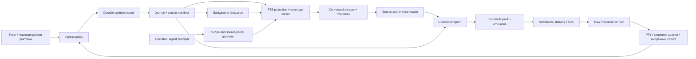

# Project memory · архитектура поиска и продолжения

**Статус:** target design, 2026-09-26; частичная нативная база, [проверенные границы](../launch/memory/evidence.md). **Нормативные основания:** ADR-0014, ADR-0027, ADR-0032, ADR-0063, ADR-0067, [ADR-0069](../adr/0069-project-memory-is-source-addressed-and-authority-bounded.md). **Вход:** [обзор](../launch/memory/README.md), [план](../launch/memory/plan.md). Это расширение Knowledge и Continuation из [system-contract](system-contract.md), не новый домен задач.

## 1. Границы и владельцы

Project владеет целью, Task, Decision, Evidence и историей. Agent — долговечная роль; Provider — заменяемая реализация; Run — попытка; Session — транспорт. Один Task может иметь несколько Runs и Sessions; одна provider session может обслужить несколько разрешённых invocations. Поэтому привязка памяти хранит временные/событийные диапазоны Task/Run, а не угадывает их по имени папки или провайдера.

CEO Fabric объясняет, предлагает запросы и собирает итог; host отвечает за identity, scope, capability, бюджет, журнал и receipts. Найденный текст не даёт полномочий и не запускает tools. Общий чат без проекта может читать только разрешённый обзор; для эффекта всё равно нужен конкретный Project/Task и команда.

### Четыре представления, один источник истории

| Представление | Назначение | Владелец / обновление |
|---|---|---|
| Исходная запись | Что действительно ввели/наблюдали | Санитизированный transcript/event + journal; неизменяемая версия |
| Рабочий checkpoint | Где остановились, чего не сделали, что проверить | Run, структурные ссылки и coverage; новая версия на checkpoint |
| Память проекта | Принятые решения, записанные факты, ограничения, опыт | Уже существующие Decision/Task/memory_facts; correction/supersession |
| ContextPack | Что конкретно было отдано исполнителю | Immutable compiler output с refs/versions/omissions; новый pack на новую передачу |

L0 — короткий индекс, L1 — ограниченное резюме/отрывок, L2 — адресный исходный диапазон. Это уровни чтения, не новые базы. Summary — производный navigation aid, не Evidence факта и не замена transcript. «Агент решил» отличается от «оператор утвердил», «проверка прошла» — от «агент сообщил».

## 2. Модули и швы

| Модуль | Расширяет | Вход → выход | Чего не делает |
|---|---|---|---|
| Capture adapters | `transcripts.ts`, `pty.ts`, CW-N1 | PTY/typed messages/provider export → attributed chunks | Не читает все файлы агента без выбранного import scope |
| Ingress policy | `shared/redact.ts`, ADR-0067 | allowlisted event → sanitized body + redaction receipt | Не пишет сырой секрет в spool/log/error/summary |
| Capture journal bridge | `index.ts`, event projections | chunk manifest → durable capture receipt + replay cursor | Не считает запись полной по отсутствию ошибок |
| Session catalog | `session_transcripts`, Run/Task refs | authorized metadata → фильтры/покрытие/история | Не использует путь/название как identity |
| Search projection | existing PostgreSQL FTS/read services | sanitized chunks + source revisions → rebuildable index | Не становится первичным хранилищем |
| Retrieval gateway | `agentSurface.ts`, `searchRead.ts` | principal + scope + query/ref → bounded hits/ranges | Не принимает scope из найденного текста |
| Derivation worker | existing background Routine model | immutable covered ranges → versioned L0/L1 | Не блокирует capture; не продвигает вывод в Decision |
| Context compiler | `contextPack.ts`, `sessionBundle.ts` | task + policy + selected refs + checkpoint → pack manifest | Не передаёт всё найденное и не сжимает обязательные ограничения до потери |
| Continuation coordinator | FR-E / existing admission | stopped predecessor + repo observation + pack → new Run/ACK | Не смешивает native resume с portable restart |
| Memory workspace | SCR-34 / R0 | same read APIs + existing CEO commands → search/source/pack | Не содержит своей копии задач, статусов и authority |
| Evaluation/maintenance | memory eval, journal replay, storage | synthetic corpus / receipts → recall, budget, recovery results | Не собирает полный prompt в продуктовую телеметрию |



Стрелки несут: I→S санитизированные bytes и offsets; S→J digest/coverage/idempotency; J→X последовательность и ссылки; G→X допустимые источники, а не список пожеланий; V→C конкретные разрешённые версии; P→H digest и target IDs. ACK удостоверяет получение конкретного пакета, не понимание и не выполнение.

## 3. Предлагаемые локальные контракты

Имена ниже — design DTO, не утверждение о зарегистрированных wire events. Перед реализацией MEM-P0 проверяет versioned external contract; новые публичные events/tools требуют его схем и compatibility fixtures. Не менять wire enum молча.

```ts
type MemorySourceRef = {
  estateId: string; projectId: string; sourceId: string;
  revision: string; kind: 'transcript'|'fact'|'decision'|'checkpoint'|'artifact';
  sessionId?: string; runId?: string; taskId?: string;
  range?: { chunkId: string; startByte: number; endByteExclusive: number };
};
type CaptureCoverage = {
  state: 'complete'|'partial'|'unknown';
  observedThrough: string | null; durableThrough: string | null;
  gaps: { from: string; to: string | null; reason: string }[];
  truncated: boolean; redactionPolicyVersion: string;
};
type RetrievalReceipt = {
  id: string; principalRef: string; policyRevision: string;
  requestedScopeRefs: string[]; effectiveScopeRefs: string[];
  indexWatermark: string | null; sourceWatermark: string | null;
  status: 'ok'|'no_match'|'partial'|'unavailable';
  selectedRefs: MemorySourceRef[]; omittedByReason: Record<string, number>;
  budget: { unit: 'tokens'|'bytes'; limit: number; used: number; method: string };
};
```

Байтовый диапазон относится к **санитизированной** неизменяемой версии, не сырому файлу. `sourceId+revision+chunkId+range` воспроизводим; смена redaction создаёт новую версию. UI не получает приватные raw offsets/paths. L2 reader проверяет checksum, границы UTF-8 и максимальный размер, возвращает cursor/hasMore; курсор привязан к principal, query, scope revision и index snapshot. Совпадение на границе chunks проверяется overlap с дедупликацией одного source span.

Session catalog: stable fabric session ID, opaque provider session ref отдельно; provider/version, host ref, start/end observation, capture kinds, task/run range bindings, complete/partial/unknown, available tiers. Import provenance включает importer/version, выбранный источник, capture timestamp и дедуп key. Неизвестный Task остаётся unassigned; CEO предлагает привязку, host записывает подтверждённый mapping, не переписывает первичную атрибуцию.

Checkpoint: goalRef, taskRef/revision, predecessorRunRef, decisions/constraints, completed with evidence, pending/unverified, nextStep, lastDetailedRangeRefs, outstanding effect receipts, repoRef/worktreeRef/branch/head/dirtyManifestRef, observation times и coverage. Текстовая сводка не заменяет эти поля.

## 4. Захват и восстановление

1. На Session start host сохраняет binding Project/Agent/Provider/Run и capabilities. Capture scope виден в настройках; внешняя история подключается отдельно.
2. Структурный канал пишет пользовательские сообщения и публичные ответы с авторством. Диктовка фиксируется как подтверждённый текст с voice provenance; хранение аудио — отдельно выбранная политика, в R0 по умолчанию выключено. Скрытые рассуждения, credentials и private blocks не захватываются.
3. PTY сохраняется как **наблюдение вывода**, не реконструированная беседа. Парсер не превращает echo строки в доказательство автора или вызова tool.
4. До любой durable записи выполняется ingress policy. Streaming sanitizer удерживает неполный sensitive span через границы chunks, ограничивает буфер, при неопределённости скрывает span и показывает gap. Сырой fallback запрещён.
5. Chunk fsync + manifest cursor → append receipt в журнал → projection ack. Повтор после crash идемпотентен по capture ID/chunk sequence/digest. Разрыв процесса не требует финального LLM summary для сохранности.
6. Index worker читает только подтверждённые chunks; lag измеряется watermark. Целевое live чтение — инкрементальная projection, не обещание текущего exit-only capture.
7. Stop/crash закрывает coverage известным состоянием; недостающий хвост помечается. Disk full, cap, failed redaction и lost observer не превращаются в «сессия сохранена полностью».
8. Асинхронное summary строится из source ranges независимо по сегментам; вход/версия модели/промпта/расход/coverage записаны. Retry ограничен; источник доступен без summary. Резюме не пересуммирует своё прошлое как новый факт.

## 5. Поиск по своим и чужим сессиям

По умолчанию агент читает текущий Project и свои разрешённые источники. Другой Agent того же Project доступен по policy; provider не является владельцем памяти. Для связанных Projects используются явные read grants, не унаследованные права оператора. «Все проекты» означает все **разрешённые в запросе**; никогда all Estate автоматически. Scope определяет host из authenticated invocation.

Pipeline: resolve principal → authorized source set → lexical query/filters → snapshot cursor → ranked IDs/L0 → nearby timeline → selected ranges/L2. Проверки повторяются на search, expansion, compilation и dispatch. Counts, snippets, filenames и существование защищённой записи тоже данные; denied/missing ref даёт одинаковую внешнюю форму. Revocation очищает UI/cache и запрещает последующий read/pack delivery; уже прочитанное у провайдера отозвать невозможно.

R0: PostgreSQL FTS + нормализованный exact identifier fallback, русские/английские fixtures, явная детерминированная сортировка rank/date/id; page size и maximum bytes ограничены server-side. Индексируются все доступные chunks, не только начало тела. Нет совпадений ≠ никто никогда не обсуждал: UI указывает охваченный диапазон/индекс. Related-source hit не даёт права изменения.

Запрос можно произнести/написать CEO: «Почему изменили onboarding?», «Что делал Claude Code до остановки?», «Найди последнее решение по оплате». Ответ: краткое резюме + ссылки на исходные ranges + известные пробелы. Retrieved instructions, старые разрешения и команды считаются неисполняемыми данными. Skills описывают стратегию поиска; hooks инициируют capture/checkpoint; scripts валидируют schemas/digests/bounds; gates проверяют authority, freshness, budget и ack.

## 6. Сборка контекста и продолжение

Пакет собирается под конкретный invocation: текущая задача и ограничения → подтверждённые решения → checkpoint → последние детальные диапазоны → релевантные записи → ссылки на прочее. Закрепление оператором увеличивает приоритет, но не права и не доступный бюджет.

Бюджет выводится из capabilities выбранного provider/model. Сначала резервируются system/tool definitions, свежий пользовательский ввод, ответ и безопасный tool headroom; потом memory quota. При известном tokenizer сохраняем метод и оценку; иначе честно показываем bytes/символы, не «точные токены». Mandatory ограничения не влезают — admission отказ, а не тихое усечение. Конфликтующие актуальные утверждения передаются парой с attribution; система не выбирает победителя по уверенности LLM.

Pack manifest: compiler/policy/task revisions, target Project/Agent/Provider/Run, ordered exact source refs/hashes, bytes and token estimate method, selected/omitted/inaccessible categories, coverage, git observation, createdAt, digest. Digest вычисляется по canonical serialization с фиксированным snapshotAt и compiler revision; createdAt транспортной квитанции находится вне hashed content. Повторная сборка одной snapshot/config воспроизводит те же bytes. Archive хранит точные **разрешённые** bytes передачи отдельно от ephemeral credentials. Изменившаяся память не переписывает прошлый pack. Preview не считается delivered.

Продолжение: `requested → stopping → stopped-observed → checkpoint-sealed → repo-revalidated → pack-ready → admitted → delivered → acknowledged`. Любой unknown outcome требует reconcile по стабильному command ID. Пока старый writer не fenced/не подтверждён stop, новый writer не допускается. Старый read-only источник остаётся доступен.

Три явных режима: прежняя native session того же provider (только доказанная adapter capability); новая session того же provider; новая session другого provider с portable pack. Последние два сохраняют незакрытый Task и Agent role, создают новые Run/Session и predecessor edge. Для done/cancelled Task создаётся новый связанный Task: закрытая работа не переоткрывается (CONTEXT.md). Не переносим скрытые reasoning blobs, vendor credentials, незавершённые vendor tool calls. Если native resume не поддерживается, это видимый fallback choice, не тихая подмена.

Изменившаяся ветка/HEAD/worktree/dirty manifest делает preview stale. Нет Git — допустимый Project без репозитория; нет чтения Git у repo-bound continuation — blocker. Незавершённый внешний effect проверяется по receipt прежде повтора. Recovery receiver сначала сверяет workspace и формирует acknowledgement/recovery report; дальнейшее выполнение остаётся под обычной authority.

## 7. Жизненный цикл и приватность

Исправление факта — новый record + supersession/validity window, источник сохраняется. Summary можно пересобрать. Index можно удалить и восстановить. Эти операции отличаются от удаления пользовательских данных.

R0 предоставляет «не включать в следующий контекст»/scope controls и correction, без обещания полного забывания. Полное удаление проектируется отдельным MEM-P7: closure transcript blobs + journal payload + spool + summaries + FTS/embeddings + caches + exported packs + backups. Append-only audit хранит только безопасный факт удаления и идентификатор, не секретный payload. Suppression/tombstone применяется **до replay/read**, а миграция старого inline journal payload требует явного решения, key/retention политики и restore fixtures. Ни projection delete, ни tombstone сами по себе не доказывают физическое стирание. UI не пишет «забыто навсегда», пока closure/expiry не подтверждены; ранее отправленные внешнему provider данные перечислены как невозвратимые копии.

Хранение и квоты версионируются по Estate/Project; default R0 без автоматического удаления истории. Объём виден оператору, при quota pressure новые capture/summary имеют явный degraded outcome. Raw content в outbound telemetry не уходит. Retrieval audit хранит IDs/метод/результат/стоимость; raw search query — пользовательский контент под той же policy, а не debug log. Summary egress требует разрешённого provider и policy до передачи.

## 8. Приоритет и развитие

**R0 must:** безопасный durable capture, session provenance/coverage, bounded multilingual lexical search, same-Project cross-agent retrieval, exact source links, compiler budget/omissions, portable checkpoint и честная поддержка provider capabilities, простой workspace и CEO-entry. Читать старое можно при неготовом executor.

**R0 later:** отложенные LLM summaries при наличии provenance и budget, импорты сторонних histories с preview, policy-authorized related-Project reads. Отсутствие summary не мешает основной ценности.

**После измерения:** embeddings/hybrid ranking при воспроизводимом FTS miss; граф при multi-hop failure; learned ranking и shared Estate knowledge после review/provenance policy. Нет автоматического накопления «уроков» из собственных пересказов. Метрики: answer correctness с source citation, successful cold resume, leakage count, retrieval bytes/tokens, capture gaps, lag, cost; число сохранённых воспоминаний само по себе не успех.
