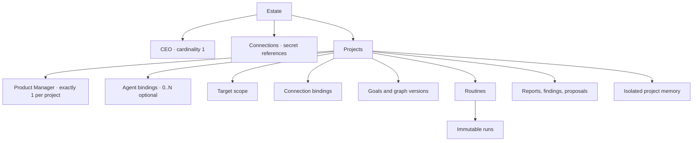
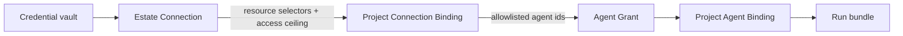
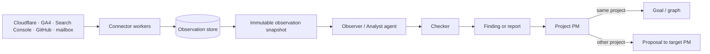
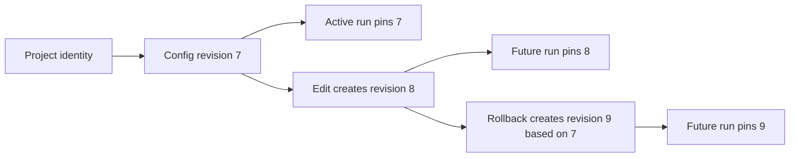
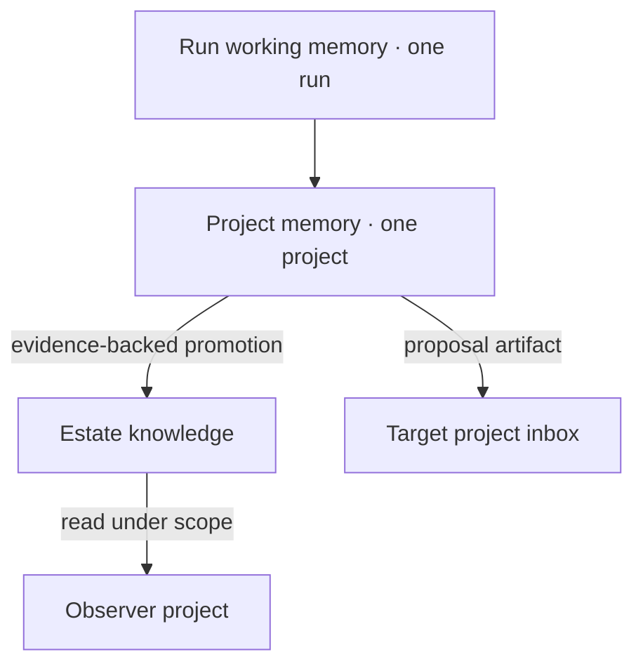
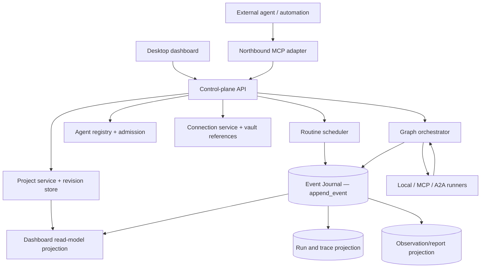

# Project workspaces — architecture and information model

**Status:** accepted intent under ADR-0013 · **Date:** 2026-08-27

This is the canonical product-level explanation of a Fabric Project. JSON Schemas under
`schemas/` make the shapes reviewable; they describe intended configuration and dashboard
read models, not an implemented database or host runtime.

> **Vocabulary note, 2026-09-08 (S10 · [ADR-0045](../adr/0045-workflow-runs-task-runs-and-explicit-iterations.md)):**
> where this document says **run** it means a **WorkflowRun** — one execution of one
> pinned graph version, the wire's `run_id`. A **TaskRun** is a different identity: one
> admitted attempt at one Task. The bare word is no longer used alone, and
> [`CONTEXT.md`](../../CONTEXT.md) defines both. This note clarifies the reading; the
> text below is unchanged and remains the record of its own decision.

## 1. The invariant

> A Project is one persistent purpose, one Product Manager, and a versioned set of agents,
> scopes, connections, routines and memory. Everything that runs resolves through that
> boundary.

The CEO is outside project graphs and holds no Node. The PM is the single decomposition
authority inside one project. Optional agents implement capabilities but never become a
second PM by accumulating more tools.

## 2. Two projects, one object model

| Configuration | Portfolio Observer | Product project |
|---|---|---|
| Purpose | detect estate-wide drift and route findings | operate and grow one product |
| Target scope | all current/future or selected projects | owned assets and selected dependencies |
| Seeded agents | PM, Cloudflare/Search observers, analyst, reporter | PM, developers, QA; optional support/SEO/content/SMM |
| Connections | broad read bindings to provider accounts | resource bindings narrowed to its domains, repositories and channels |
| Cross-project output | Proposal to target PM | usually internal Goal/Node; Proposal when another project owns the target |
| Repository | optional | zero, one or many repositories |

No `projectType` participates in authorization. The creation template is retained as
provenance and can be changed without converting the Project into another entity.

## 3. Connections, resources and grants

| Object | Contains | Must not contain |
|---|---|---|
| Connection | provider, external account subject, secret reference, health | token, cookie or OAuth refresh value |
| Project Connection Binding | connection revision, resource selectors, access ceiling, eligible agent bindings | a broader permission than the Connection can supply |
| Agent Grant | capability/effect, target, expiry, preconditions | `all` or an ambient account choice |
| Run bundle | exact binding revisions and resolved secret references for this run | unrelated project connections |
| MCP access binding | external principal/client, explicit Project ids, resource/command scopes, effect ceiling, expiry/revocation and policy lineage | raw token, implicit current/future Projects or downstream credentials |

The same Cloudflare account can serve Portfolio Observer and PassionCode.ai. The first binding may
select every managed zone read-only; the second may select two zones. Reuse happens before
the project boundary, least privilege after it.

## 4. Collection is not analysis

A connector is deterministic infrastructure. It owns OAuth refresh, pagination,
watermarks, rate limits and source timestamps. It writes observations, not conclusions.
An agent consumes a pinned snapshot and owns interpretation. Collecting once prevents
several agents from spending the same API quota and disagreeing only because they fetched
at different times.

## 5. Project configuration revisions

The editable Project is an identity plus a chain of immutable configuration revisions.

Revisioned fields include target scope, PM and agent bindings, connection bindings,
routines, cross-project policy and memory policy. A replacement does not mutate existing
Run, Report, Finding or trace rows.

## 6. Routines and runs

A Routine is stable intent; a Run is one execution.

| Routine owns | Run pins |
|---|---|
| trigger: manual, cron or event | trigger event/tick id |
| capability and input template | exact input and observation snapshot ids |
| target scope | resolved targets |
| eligible or preferred agent binding | selected agent/provider binding revision |
| concurrency and catch-up | the policy revision applied |
| checker policy | checker and its verdict |

Defaults are `concurrency: skip` and `catchUp: latest-only`. The dashboard may present
“next run for Agent X”, but that value is derived from routines currently assigned to X;
the schedule never moves into the Agent record.

## 7. Cross-project observation and action

Target scope has four useful modes:

| Mode | Meaning |
|---|---|
| `owned-assets` | this project's owned/bound assets only |
| `selected` | explicit project and asset references |
| `all-current` | every project visible at this revision |
| `all-current-and-future` | a dynamic estate selector; new projects enter automatically |

A broad selector grants read visibility only. A Portfolio Observer finding addressed to
PassionCode.ai crosses the boundary as an immutable Proposal carrying source observations, target,
requested outcome and idempotency key. PassionCode.ai's PM accepts, refuses or supersedes it. Direct
node creation or effects require a named grant and remain attributable to the source
project.

## 8. Memory boundaries

- Run working memory is temporary and pinned to the run.
- Project memory holds decisions, lessons and report context for one project.
- Estate knowledge holds promoted facts that outlive one project and names provenance,
  confidence, contradiction and expiry/decay.
- One project never writes another project's memory directly. Proposal acceptance creates
  a new target-project record with a link back to the source artifact.

## 9. Control-plane components

*(Amended 2026-08-31 under ADR-0027: the earlier "durable event bus" node was the Event
Journal wearing a second name — ADR-0014 had already made the journal the spine, and a
bus beside it reintroduced the dual-write it exists to prevent. The scheduler and
orchestrator append to the journal; registers are its projections; runner dispatch is a
call whose results append back.)*

The UI never calculates health by scraping terminal output. It reads a durable projection
whose facts link to observations and traces. Streams accelerate the view; the journal
is the record (ADR-0014, ADR-0027).

The MCP adapter is another control-plane ingress, not a privileged runner. It discovers
only resources and tools admitted by the request's MCP access binding, translates reads to
the same Project projections and appends allowed typed commands to the same journal.
Long-running commands return MCP Tasks when negotiated or a Fabric Run/resource handle;
the HTTP connection never owns execution state. See
[`mcp-control-surface.md`](mcp-control-surface.md) and ADR-0026.

## 10. Dashboard read model

Estate home shows one card per Project with independent dimensions rather than one opaque
traffic light:

- attention count and highest severity;
- PM identity/health;
- active, idle, blocked and failed agent counts;
- current work and latest completed run;
- next scheduled run;
- repository status when a repository is bound (`not-configured` is not an error);
- connection health;
- last report and unreviewed findings.

Project detail uses Overview, Work, Agents, Runs, Schedule, Connections, Reports, Memory
and Settings. `docs/ux/` is the behavioural source for their states and navigation.

## 11. Schema map

| File | Purpose |
|---|---|
| `schemas/project-blueprint.schema.json` | one immutable project configuration revision |
| `schemas/project-dashboard.schema.json` | estate/project monitoring projection shown by the UI |
| `schemas/proposal.schema.json` | immutable evidence-backed cross-project request and resolution |
| `schemas/examples/portfolio-observer.project.json` | broad read-only observer configuration |
| `schemas/examples/product.project.json` | product project with development and operations agents |
| `schemas/examples/estate-dashboard.json` | representative home-screen projection |
| `schemas/examples/cross-project.proposal.json` | observer finding addressed to a product project's PM |

`scripts/check-project-schemas.py` compiles all Draft 2020-12 schemas, validates every
example, refuses secret-like fields and verifies local schema/example routing. Passing it
proves the documents' machine shapes agree; it does not prove a database or runtime exists.
