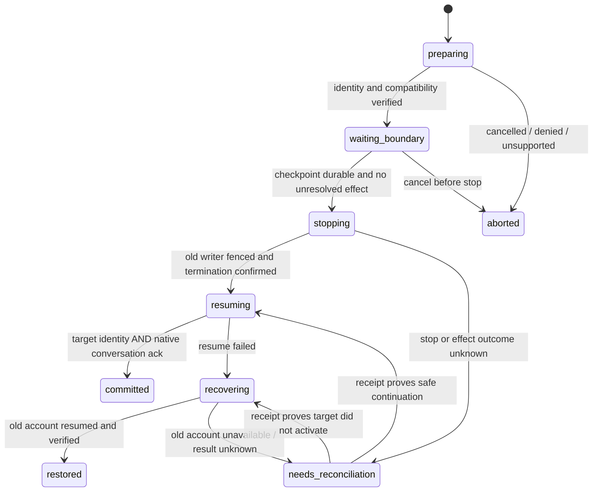

# Provider accounts and conversation continuity — proposed contract

Status: **proposed design, 2026-09-09; no runtime implementation or live acceptance**.
Owner: [M199 / CO-112](../evidence/plans/2026-09-09-provider-accounts.md).
Decisions: [ADR-0051](../adr/0051-provider-accounts-and-conversation-continuity.md), amended by [ADR-0052](../adr/0052-provider-account-automatic-switching.md) to include automatic switching.
Evidence baseline: [pinned Orca/cswap/Fabric study](../audit/2026-09-09-provider-accounts.md).

## Product promise

An operator may keep the existing CLI login, optionally add several accounts, pick
an account for a new conversation, and explicitly continue an existing conversation
with another account of the **same provider**. The Project, Task, accepted decisions,
working directory and saved conversation history remain addressable. Credentials are
local to their execution device/runtime. No account setup is required to create a project.

“Continue the conversation” means a verified native resume with the saved context,
not retention of a live process, its unsaved memory, active tool calls or exactly the
same TaskRun. The UI says when a restart is needed and shows what is unconfirmed.
If the adapter cannot prove native resume, it offers a separately labelled **new
conversation with a reviewed context handoff**. That fallback is never reported as
successful continuation. Cross-provider handoff is a different operation (M169).

The design serves the [vision](../ux/vision.md): a provider is replaceable while the
Project retains purpose, authority and history. It does not add another multi-chat
product or make provider subscriptions into Fabric identity/permission grants.

## Vocabulary and ownership

| Record | Identity and ownership | Retention / authority |
|---|---|---|
| ProviderAccount | opaque account ID; provider, local principal, device ID, runtime ID, verified subject/org, auth revision | Private local metadata. Email is a display label, never identity. A provider account grants no Fabric membership. |
| Runtime scope | host on device, named WSL distro, or remote execution host | Auth is acquired on that runtime. No automatic token transfer across devices, hosts or distributions. |
| AuthContext | opaque secret reference and refresh lineage; provider account + runtime | Local secret store and restricted provider home. No secret in database, Git mirror, IPC read models, URL, transcript or telemetry. |
| DefaultAccountSelection | provider + principal + runtime → account or system-default, revision | A default for future admissions. Changing it does not rewrite existing bindings. Project override may narrow it. |
| ConversationBinding | conversation ID → Project, provider, native opaque ref, account ID, binding revision, runtime, workspace fingerprint | Durable non-secret routing record with access checked. Native ref and path remain local unless an explicit supported snapshot transport exists. |
| Session | existing fabric_session_id plus fenced generation, linked to the binding | Transport/PTY. A restart creates a new Session. Stable conversation identity must not be implemented by reusing a dead PTY ID. |
| SwitchOperation | idempotency key, conversation, expected revision, from/to refs, actor revision, durable phase and receipt | One outstanding operation per conversation; caller payload is not proof of actor or permission. |
| UsageObservation | provider + subject/org + account + runtime + auth revision, sampledAt, resetAt, source, status | Fresh/stale/unknown are distinct. No account-blind TTL or backoff. Secrets excluded. |

`ConversationBinding` is a proposed local routing entity, not a rename of the
canonical [Session or TaskRun](system-contract.md). An account change ends the old
TaskRun through its cancellation lifecycle (reason `account-switch`); unresolved
termination is `outcome_unknown`, not `cancelled`. Only a confirmed boundary admits
a new linked TaskRun, with a new frozen account/configuration, under the existing
Task. The Task stays open; no step is marked verified by switching. A closed Task
requires a new linked Task. For a free terminal, only the Session generation changes.
Native reuse across TaskRuns still requires invocation-scoped ack, trace,
cancellation and fencing as required by `system-contract.md`.

## Account lifecycle and launch

1. Read the existing system login through the provider adapter; show observed identity
   or “identity not confirmed”. Never import silently. An empty account list is valid.
2. Add account: start the provider's official login flow in a staging auth context on
   the chosen runtime. The view explains the destination device and leaves browser
   consent to the provider. No request to paste subscription cookies in this first slice.
3. Verify subject and org through the provider's supported identity reader; reject
   mismatches, detect duplicates by provider/subject/org/runtime, then atomically publish
   the local profile. Label and email alone cannot complete login. Cancel/expiry cleans
   staging context without modifying another account. The provider's own login may have
   remote effects; cleanup does not promise remote revocation.
4. Resolve new-run selection once: explicit run choice → project binding → provider
   default → system default. Admission verifies the account revision and current
   principal's authority. Resolution failure is visible; no silent alternative account.
5. Construct the child environment from the selected profile, clearing conflicting
   inherited credential overrides. The quota reader uses the **same resolved context**.
   System default is externally mutable: record the observed identity, detect drift,
   and stop claiming it is pinned if identity cannot be rechecked. Strict managed-run
   isolation requires a verified managed profile; permissive free terminals say so.
6. Removal first disables new admissions, then lists dependants. Active references
   block secret deletion until stopped or explicitly rebound. Defaults must be resolved
   atomically; deleting an account does not delete conversations. Local removal and
   provider-side sign-out/revocation are distinct actions. Retained auth backups have
   bounded cleanup and remain secret; ordinary metadata keeps receipts, not tokens.

The auth writer follows the CLI's refresh protocol for the **tested CLI version and
runtime**. One owner coordinates a refresh lineage; do not duplicate rotating refresh
tokens into per-session homes. Concurrent sessions using one managed account must share
a compatible refresh lock. A Fabric-only mutex cannot fence an external CLI writer.
If provider isolation or lock compatibility is unverified, managed concurrent launch
and account swap remain unavailable on that runtime. This is particularly a prerequisite
for macOS Keychain handling; setting an environment variable alone is not evidence.

## Switch transaction

Preparation is non-destructive: verify target login, runtime, same provider, plan/model
eligibility, workspace identity, native history portability and permission. Record the
expected binding and auth revisions, checkpoint digest/manifest, pending input and effect
cursor. Native history can cross provider organizations only when provider capabilities
and the operator's allowed data scope permit it; possession of a second login is not
permission to send the first organization's conversation there.

A boundary must be reported by a certified adapter. Quiet terminal output, a timer,
process exit code or a user clicking “pause” does not prove all work was saved. If a raw
TUI cannot produce the required checkpoint and receipt, it cannot offer this switch.
A queued boundary request is cancellable before stopping; after stop it becomes an
explicit recovery operation, not a cosmetic Cancel button.

After fencing the old writer, journal the spawn intent **before** starting the new
process. Verify target account identity and native conversation reference before
sending pending user input or releasing the new TaskRun. Commit the binding with CAS
against its expected revision. Keep the prior checkpoint until recovery is verified.
No prompt, answer, tool call or external effect is automatically replayed to reconstruct
history. Unknown outcomes are reconciled by the same operation ID, not a new switch.
After a crash, read operation phase and provider receipts before doing any spawn.

Recheck Fabric actor/membership and project authority at preparation, stop, admission
and commit. Revocation after preparation blocks progression and secret access; cleanup
may fence a child but cannot continue paid work. Each terminal callback carries generation
and binding revision so late events from the old process cannot mutate the new binding.
Other conversations, including ones using account A, retain their selected accounts.

## Provider-specific seams

| Adapter | First proposed slice | Gates before claiming continuity |
|---|---|---|
| Claude Code | official CLI login/status, optional isolated managed account, per-context usage | config/Keychain resolution, refresh locks, exact native conversation store and resume ack tested by CLI version; no wholesale .claude copy or global credential swap |
| Codex CLI | official CLI login, per-account home/identity, same-provider conversation resume | auth storage backend, refresh ownership, compatible rollout/session store bridge and native ack; do not copy a live SQLite database or infer restore from a symlink alone |
| Gemini, OpenCode Go, MiniMax, Grok | named future adapters with separate auth/usage capabilities | unavailable in this first slice; a usage reader does not certify login management or native resume |

### Measured 2026-09-10 — M199.probe

The table above proposes the gates. This is what the two installed CLIs actually
answered when asked, and it changes two of the design's assumptions. The matrix
lives in code — [`providerCapabilityMatrix.ts`](../../apps/desktop/src/shared/providerCapabilityMatrix.ts),
each row carrying the command it came from — and
[a gate](../../scripts/check-provider-capability.mjs) refuses a row that claims
`supported` without naming what was observed, an `unverified` row that does not
name the test that would settle it, and a matrix pinned to a build other than the
one installed.

| Capability | Claude Code 2.1.236 | Codex CLI 0.152.1 |
|---|---|---|
| machine-readable identity reader | **supported** — `claude auth status --json` returns login state, org and subscription | **unsupported** — `codex login status` prints one line and has no `--json` |
| stable per-user subject | **unsupported** — an org id and an email, and the design forbids email as identity | **unsupported** — there is no identity output to carry one |
| login isolation by config home | **unverified** — the reader follows the home; the credential does not | **supported** — an empty `CODEX_HOME` answers "Not logged in" |
| credential store per home | **unsupported** — one Keychain item keyed by the OS user; no file in the home | **supported** — `auth.json` inside the home, mode 0600, and no Keychain item |
| conversation store per home | **supported** — `~/.claude/projects/<cwd>/<uuid>.jsonl` | **supported** — `~/.codex/sessions/YYYY/MM/rollout-…-<uuid>.jsonl` |
| resume by opaque reference | **supported** — an unknown id is refused loudly, with no inference | **unverified** — requires a terminal before it validates anything |
| native resume acknowledgement | **unverified** — the reference is checked; the restored context is not | **unverified** — blocked behind the row above |

#### The environment, measured one variable at a time (M199.auth)

The design says the resolver must clean "conflicting env overrides". Which ones,
on Claude Code 2.1.236, measured against `claude auth status --json`:

| in the environment | what the reader then says |
|---|---|
| `ANTHROPIC_API_KEY=<value>` | `apiKeySource` appears; email, org and subscription **all null** |
| `ANTHROPIC_API_KEY=` (empty) | nothing — an empty value is ignored |
| `ANTHROPIC_AUTH_TOKEN=<value>` | `authMethod` becomes `oauth_token`; identity null; `apiKeySource` still null |
| `CLAUDE_CODE_USE_BEDROCK=1` | `authMethod` becomes `third_party`; identity null |
| `CLAUDE_CODE_USE_VERTEX=1` | `authMethod` becomes `third_party`; identity null |
| `ANTHROPIC_BASE_URL=…` | no change to the identity |
| `ANTHROPIC_CUSTOM_HEADERS=…` | no change to the identity |

**Four override and three do not**, and the two detector fields catch different
subsets: `apiKeySource` exposes exactly one of the four, `authMethod` the other
three. A resolver watching the obvious field alone would pass
`ANTHROPIC_AUTH_TOKEN` through untouched.

**Codex 0.152.1 has no detector.** `codex login status` answers "Logged in using
ChatGPT" with `OPENAI_API_KEY` set, with `CODEX_API_KEY` set, and with neither.
That is not a finding that the key wins — it is the absence of any way to
observe which credential a session will use, so a Codex auth context is
`cleaned-unverified` and never `verified`.

**So the rule is clean, then read back.** Cleaning a list is a guess about the
list; reading the identity back under the cleaned environment and comparing it
to the chosen account is a measurement. A disagreement blocks; an override still
in force after cleaning blocks, because something outside this process is
writing it; and a provider with no reader to disagree with is cleaned and left
unverified.

**Two providers, opposite answers, which is why this was measured rather than
assumed.** Codex keeps its credential in the home, so two homes are two
accounts. Claude Code keeps it in one Keychain item per operating-system user
while its identity reader answers per home — so a redirected home *looks*
isolated and a second login has one place to write. The card's warning that "an
environment variable alone is not evidence" is not a general caution; it is true
of one of these two and false of the other.

**And the mechanism that isolates is the mechanism that continues.** For both
providers the saved conversations live inside the same directory as the
credential. So isolating an account by redirecting the home also hides every
conversation recorded under the other home — and this document promises both
isolation and continuing an existing conversation under another account of the
same provider. Those two promises cannot be kept by home redirection alone;
CO-140 holds the question.

**What was not run, and why.** No login flow was performed. On Claude Code a
second login would write over the one Keychain item and log the operator out of
their live session — which is the concrete form of the card's rule that real
accounts belong to a separately granted certification. The Codex resume path
needs a pseudo-terminal; this repository has one
([`pty.test.mjs`](../../apps/desktop/test/pty.test.mjs)) and driving it is the
next probe rather than this one.

An adapter declares `detectSystemIdentity`, `login`, `verifyIdentity`, `resolveAuthContext`,
`readUsage`, `checkpoint`, `resume`, `confirmIdentityAndConversation`, `fence`,
`removeLocalAuth`; every capability is `supported | unsupported | unverified`, scoped to
provider, CLI build, OS/runtime and test receipt. This is a proposal for the adapter
contract, not a claim these methods already exist. Version changes invalidate unsupported
assumptions until contract tests pass. Do not rely on parsing undocumented TUI prose.

Provider files stay in their supported formats. A conversation bridge takes a manifest
of permitted files, resolves real paths, rejects traversal/symlink escapes, checks a single
writer lease and works from a durable checkpoint. Shared history includes only the selected
conversation when possible; never expose all conversations to every account by default.
Settings, MCP credentials and unrelated projects are not moved with login state.

## API and module proposal

| Port | Input and result | Failure cases |
|---|---|---|
| accounts.list | runtime; redacted local account views and capability receipts | denied / runtime-offline; no fabricated zero usage |
| accounts.beginLogin / completeLogin / cancelLogin | login attempt ID; verified account or terminal result | expired / cancelled / identity-mismatch / duplicate / unsupported |
| accounts.setDefault | scope, expected selection revision, target ref; CAS receipt | stale / denied / auth-required; existing bindings untouched |
| conversations.prepareSwitch | conversation, expected binding, target; operation ID + feasibility | busy / pending-effect / unsupported / wrong-runtime / denied |
| conversations.advanceSwitch / reconcileSwitch | existing operation ID and expected phase | stale phase / unknown outcome / revoked / failed; no duplicate spawn |
| accounts.removeLocal | account, expected revision; dependency summary then deletion receipt | in-use / changed / default-unresolved / denied |
| usage.read | resolved auth context reference; attributed observation | auth-required / rate-limited / stale / unknown |

Renderer consumes read models and sends typed intent; main process obtains authority
from the trusted principal context. Separate proposed modules: local account store,
provider auth adapters, conversation registry, switch coordinator and usage reader.
They integrate with existing admission/TaskRun/session/fencing rather than creating a
second execution engine. Exact schema and adapter package changes must be reviewed in
[M199's bounded packets](../evidence/plans/2026-09-09-provider-accounts.md#packets).

## Acceptance boundary

A successful live A→B→A acceptance must use two operator-authorized test accounts,
verify account subject at every activation and prove the same native conversation can
recall distinct markers and existing tool history without replaying effects. Record
provider build, runtime, checkpoint and redacted operation receipts. Verify another
live conversation stays on its account and keeps its own native history. File checksums
and fixture clicks alone cannot establish this acceptance. Test accounts, scoped test
workspace, provider-supported identity evidence and a certified adapter are prerequisites;
none were used in the design iteration.

## Automatic switching

Operator-required capability, specified by M199.auto; runtime implementation remains open.
The policy is opt-in and versioned per principal/project/provider/runtime. Future runs may
inherit it; an existing conversation requires explicit enrollment. The approved pool, model
window selection, strategy, threshold, cooldown, maximum switch count and duration budget
are part of that policy revision. A manual pin excludes the conversation until released.
Once enabled, the policy can execute eligible switches without another confirmation.

Proposed editable defaults follow the studied cswap settings: threshold 90% used, normal
poll interval 60 seconds, cooldown 300 seconds, hysteresis 10 percentage points, strategy
best. A separate proposed hard ceiling of 12 switches per hour follows 3600/300; no quota
error bypasses that ceiling or the enclosing work budget. API-key/billed accounts are
excluded unless explicitly approved with a spending boundary. These are design defaults,
not evidence that Fabric currently supports the engine.

best compares the maximum utilization of relevant account-wide and selected model windows;
consume-first prefers the earliest confirmed weekly reset among eligible accounts with
sufficient headroom. Never compare an absent model window as zero utilization. Exact ties
are deterministic and favor staying put. Selection excludes wrong scope/runtime/provider,
disabled/quarantined/revoked accounts, unknown identity, stale usage and uncertified resume.
Candidates get identity/auth/headroom rechecked immediately before stopping the old process.

For best, trigger on a threshold crossing or typed provider quota exhaustion. For consume-first, also allow a proactive move below the threshold when a fresh eligible account has an earlier confirmed weekly reset and sufficient headroom. In both cases persist a deduped
intent keyed by conversation, binding/policy revisions and the observation generation.
Queue it until the adapter confirms the checkpoint and no unresolved effect. Dispatch via
the same SwitchOperation transaction as manual switching, preserving its operation ID and
fencing. Policy revocation, account exclusion or membership change invalidates a queued
intent. An intent already stopping must reconcile/recover before auto can do more work.

Keep last switch, cooldown deadline, quarantine, excluded accounts, pending operation and
bounded polling state across restart. The tick lease prevents two app windows or processes
from switching twice. Back off per account/source, use a bounded number of refresh requests
per tick and 429 retry timing; exhausting the pool suspends new dispatch and schedules the
next probe near the earliest known reset without assuming the reset already happened.
Unknown usage alone does not authorize another account: re-read/back off and explain the
hold. An idle expired token first follows the ordinary coordinated refresh path.

Expose off, monitoring, waiting-boundary, switching, cooling-down, exhausted, held and
paused with reason, current/next account, last receipt and next check/reset time. Preview
and dry-run produce the same decision trace without touching credentials, PTYs or journals
of paid execution. Pause is immediate for future intents; it is not a promise to undo
already performed work. App-off means no local polling; app restart first reconciles.

Acceptance adds automatic A→B with **no second human confirmation**, unchanged history,
other conversation and enclosing budget; pool exclusion, cooldown/hysteresis, stale/unknown,
wrong identity, process crash, conflicting manual switch and all-exhausted recovery. Native
support must be measured per CLI/runtime; no global credential swap is inferred from cswap.
