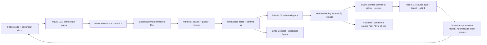

# Fabric project workspace

Normative publication contract, [ADR-0048](../adr/0048-fabric-workspace-is-a-versioned-private-publication.md).
This is documentation infrastructure. Product runtime readiness stays in the
[backlog](../evidence/backlog.md) and [engineering contracts](engineering-specs.json).

## Ownership

| Concern | Editable home | Published form |
|---|---|---|
| Product vision, scenarios, screens and flows | `docs/ux/` in Fabric | readable documents + interactive product report |
| Architecture, cycles, engineering tasks | `docs/architecture/` in Fabric | system report and source-linked documents |
| Decisions and deferred work | Fabric ADR / CO registers under a lease | source-pinned snapshot; no second register |
| Brand and visual assets | Fabric `docs/brand/`, `assets/brand/` | browsable brand library and downloads |
| Report UI and mockup generators | Fabric `scripts/product/`, report builders | generated `docs/reports/*.html` |
| Website, document reader, access and deployment | `fabric-workspace` | Heroku web process |
| Agent update procedure | workspace `skills/maintaining-fabric-workspace/` | linked project skill + readable guide |
| Publication receipt | generated `docs/workspace-receipt.json` | source commit → workspace commit → Heroku release |
| How every other tool works | each PassionCode.ai repository's own docs, listed in `workspace.config.json#sources` | `repos/<id>/` in the same snapshot, each pinned to its own commit |

The parent brand is **PassionCode.ai**, the product is **Fabric** (operator direction).
Older brand records remain historical/legacy until S11 propagates the naming decision;
publication must not silently rewrite old evidence or imply that propagation shipped.

## Data and update cycle

1. Edit canonical source, update the design map with a new top iteration and stable links;
   update visual scenarios/model/report for behavior changes. Run `bash scripts/ci.sh fast`.
2. Commit the source iteration. The commit must contain all intended source changes and
   the previous workspace pin. Do not push this intermediate state as a completed release.
3. `node scripts/workspace.mjs publish` exports from that immutable commit. It requires
   committed source/host work (only the child gitlink may be dirty) and workspace `main`
   containing the current remote main; it does not reset,
   force-push or invent a merge when the repositories disagree.
4. The child snapshot is committed and pushed before the parent points to it. Host tests
   run before Heroku publication. Anonymous version access must return401; authenticated version data must match source,
   digest, actual Heroku build SHA and the current successful release before receipt.
5. The final parent commit contains only `workspace` and `docs/workspace-receipt.json`.
   The map excludes those derived outputs, avoiding a hash cycle. The separate publication
   gate checks **all other source paths**, including a code-only change that leaves docs
   bytes unchanged. It also compares the pinned child manifest and bytes when initialized.

`node scripts/workspace.mjs status` is the safe entry point. `export` only generates a
snapshot; it does not publish. `check --require-child` is the complete local/CI check.
The ordinary fast suite stays runnable without credentials or initialized submodules;
parent CI checks the source/receipt/gitlink; child CI checks its own manifest bytes and host.
GitHub policy disables deploy keys on this repository (API returned 422 on 2026-09-07),
so no personal token is copied into CI. The publishing agent performs the combined
`--require-child` check locally. Parent CI alone does not attest the private child bytes.

## Content boundary

Exporter selection is executable in `scripts/workspace-snapshot.mjs`: tracked `docs/`,
`assets/brand/`, `registry/`, and root `README.md`, `CONTEXT.md`, `AGENTS.md`; the receipt
is excluded, and so are git's bookkeeping files `.gitkeep`, `.gitignore` and `.gitattributes`
(`scripts/workspace-snapshot.mjs#gitBookkeeping`), which carry no document and which the host cannot serve.
Any other dot-segment path still fails the export. It refuses symlinks and sensitive path names. It does not read `.env`, the
source repository root as a web directory, runtime databases or agent transcripts outside
the selected docs. This path boundary is not a semantic anonymizer: internal reports may
contain private source excerpts and audit findings, hence authenticated publication.

Entries are sorted lexicographically; `content_digest = SHA256(JSON.stringify(files))`,
with every entry ordered `{path, sha256, bytes}`. Snapshot timestamp is source commit time,
not an invented runtime observation. The server validates the snapshot at startup.

## Other repositories — the wiki of every tool

Fabric Workspace is also where the organization reads how each of its tools works
(agent-registry plan AR-0.5, [design](../evidence/specs/2026-09-29-agent-registry-design.md)).
Fabric stays the root source, so no existing address moves; every other repository named in
`workspace.config.json` → `sources` is exported under `repos/<id>/` at its own commit.

- **What travels** (`scripts/workspace-snapshot.mjs#sourceSelected`): the entry documents
  (`README*.md`, `AGENTS.md`, `CONTEXT.md`, `CONTRIBUTING.md`, `RULES.md`, `ONBOARDING.md`,
  `SECURITY.md`, `CHANGELOG.md`), `repositories.json`, `docs/`, `profile/`, `schemas/` and
  every `SKILL.md`. Hidden path segments (`.gitkeep`, tool allowlists) are skipped; code
  never travels. The same symlink and sensitive-path refusals apply, and a path the host
  cannot serve (`scripts/workspace-snapshot.mjs#hostServable`, the host's own rule) fails the export rather than the
  deployment. A source that selects nothing is a configuration error.
- **The id is a folder name, the repository may be dotted:** `org-github` is
  `passioncode-ai/.github`, the organization defaults and its `CONTRIBUTING.md`.
- **The manifest** gains `sources: [{id, repository, commit, exported_at}]` only when a
  source exists, so a Fabric-only snapshot keeps its exact bytes. The host refuses a file
  under an undeclared `repos/<id>/`, a repository outside `passioncode-ai`, or a moving ref.
- **The receipt** pins each source (`sources: [{id, repository, commit, files_digest}]`) and
  adds `fabric_digest`, the digest of Fabric's own rows. `check` recomputes everything
  where the source mirrors hold the pinned commits; without them (parent CI has no access
  to private tool repositories) it recomputes Fabric's part against `fabric_digest`, holds
  the pins, and says so in its output: `"sources": "pinned; not recomputed without a local clone"`.
- **Mirrors** are bare clones under `~/.cache/fabric-workspace/sources/<id>.git`
  (`FABRIC_WORKSPACE_SOURCES` overrides) — a cache, never a source of truth. `publish`
  refreshes each to its default-branch tip before exporting; an unreadable repository stops
  the publication instead of republishing an old pin as current. A publication is finished
  only when Fabric **and** every source equal the receipt, so a commit in a tool's
  repository alone is enough to republish.
- **Lag:** `node scripts/workspace.mjs lag [--grace-hours N]` (default 24) compares each
  pin with its repository's tip: `current`, `within-grace`, `stale` (the oldest unpublished
  commit is older than the grace), `diverged` (history rewritten under the pin),
  `unpublished`, `unreachable`. Exit 0 all current or within grace, 1 behind, 2 unreadable.
  Running it on a schedule, and publishing on merge, is an operator decision recorded as a
  carry-over in the [brief](../evidence/specs/2026-09-29-agent-registry-brief.md).

## The knowledge base

`fabric-workspace/knowledge/` is edited directly and is the one home of cross-repository
knowledge — vision, principles, how to work, rules, the repository standard, products, plans,
licensing ([ADR-0093](../adr/0093-fabric-workspace-is-the-knowledge-base-agents-read-first-and-update-last.md),
superseding [ADR-0048](../adr/0048-fabric-workspace-is-a-versioned-private-publication.md) in
part). The host serves it from its own deployed commit at `/knowledge/<name>`, first on the home
page; the deployment identity the publisher already verifies (`deployment.workspace_commit`)
covers it. It is not part of the source snapshot, so a knowledge change publishes as a host-only
change and reuses the pinned Fabric source.

## Keeping it current

`node scripts/workspace.mjs sync` publishes only when something is behind
(`scripts/workspace-sources.mjs#syncReasons`): a source whose tip moved past its pin (grace 0),
the host's `origin/main` ahead of the pinned workspace commit (a knowledge-base or host change),
or Fabric changed since the published source. An unreachable source is not a reason. `sync`
moves its checkout to `origin/main`, so it runs only in the checkout
`FABRIC_WORKSPACE_SYNC_CHECKOUT` names; a detached checkout pushes its pin to `main`.
`scripts/install-workspace-sync.sh` makes that checkout and a launchd job
(`ai.passioncode.fabric-workspace-sync`, every two hours, log
`~/Library/Logs/fabric-workspace-sync.log`); `--status` and `--uninstall` report and remove it.
A push that loses a race with another session fails the run; the next run starts from `origin/main` in both its checkouts — dropping the snapshot or pin the failed run left unpushed — and retries. A run that deployed and wrote its receipt but failed before the pin commit leaves the receipt and the gitlink changed; the next run drops exactly those two paths (`scripts/workspace-sources.mjs#syncLeftovers`) and refuses if anything else changed. Measured on the first run, 2026-09-30: a CLA change landed on the host mid-run and the host push was refused.

## Failure and recovery

| Failure | Observable result | Recovery |
|---|---|---|
| Missing submodule | status names initialization command | `git submodule update --init workspace` |
| Changed source after publication | gate reports stale source | finish source iteration, publish new snapshot |
| Uncommitted work / divergent child main | publisher refuses | inspect and commit/merge owned work; no reset |
| Tampered snapshot / missing file | child verification fails | export again from the named source commit |
| GitHub push fails | parent pin remains old | repair access, inspect child state and retry |
| Heroku build/health/revision mismatch | no new parent receipt | inspect release, redeploy verified child |
| Interrupted after child publish | child may be ahead of parent | inspect deploy; `publish --resume` completes that source/pin, including a failed final push |
| Workspace checkout has no `heroku` remote (a fresh worktree's submodule has only `origin`) | publisher stops before the gates and names the `git remote add` command | add the remote, rerun |
| A tool repository unreadable at publish | publisher stops, names the repository | restore access; never publish around it |
| A tool repository moved on | `lag` reports `within-grace` / `stale` | `node scripts/workspace.mjs publish` |
| A source's history rewritten under its pin | `lag` reports `diverged` | inspect that repository, then publish its new tip |
| Rollback | previous host + snapshot restored together | follow workspace deployment runbook, retain Git history |
| The workspace's `main` moved while the gates ran (another session committed knowledge) | outside `content/`: the publication is re-applied on top, the workspace's checks run again and the push is retried, up to three times; inside `content/`: refused as another publication | nothing when integrated; otherwise rerun publish |

### Publication races

A publication fetches the workspace at its start and pushes after the gates, minutes later
(`scripts/workspace.mjs#workspace-publish-race`). Other sessions commit to the workspace's
`knowledge/` in that window. Twice on 2026-10-05 the push was rejected after a full run. Such
commits never touch `content/`, which only a publication writes, so the publisher fetches again
right before its push and re-applies its commit on top of theirs. It then verifies the committed
snapshot and runs the workspace's own `npm test` and `verify:content` again before pushing. A
remote change inside `content/` means a second publication ran, and the publisher refuses.

The source, published snapshot and runtime release are three different revisions. A green
HTTP health response alone does not identify the running version. No database-backed
collaborative comments are added here: the existing prototype review export remains local.

## Verification

`node --test scripts/test/workspace-snapshot.test.mjs` exercises immutable-source export,
unsafe path refusal, generated-content ownership, tamper detection, pointer-only cycles,
code-only drift and false receipts. `node scripts/test/check-design-map.test.mjs` covers
map gate behavior. `node --test scripts/test/workspace-sources.test.mjs` covers the other
repositories: selection, refusals, byte-compatible manifests, partial and full receipt
checks and every lag state. Workspace `npm test` owns web auth/serving tests; deployment evidence
belongs to the [iteration report](../evidence/plans/2026-09-07-report-workspace.md).

A repeated completed publication verifies the running identity and retries only the parent
push. A host-only child commit reuses the original source commit when no non-publication
parent file changed; it does not manufacture a new source snapshot. Local child commits
ahead of remote are permitted, remote divergence or a behind branch is refused.

The publisher verifies the **committed** child manifest files before pushing, not just
working-tree bytes. Canonical historical `.log` evidence overrides runtime-log ignore
patterns inside generated content. Heroku postbuild validates that same committed payload.

## Common backlog sources

[ADR-0098](../adr/0098-workspace-federates-repository-backlogs.md) adds a source-addressed common
backlog to the host. Every repository declares `docs/backlog-sources.json`; local rows stay
authoritative. Root `BACKLOG.md` and `ROADMAP.md` are selected by `sourceSelected` in
`scripts/workspace-snapshot.mjs`, alongside existing documentation. Hidden paths and runtime
code remain excluded. The regression `the common backlog includes root source registers without
exporting hidden configuration` checks both sides of that boundary. Workspace
`knowledge/backlog.md` owns parsing, goal and agent-update rules; the exporter owns bytes and pins.
