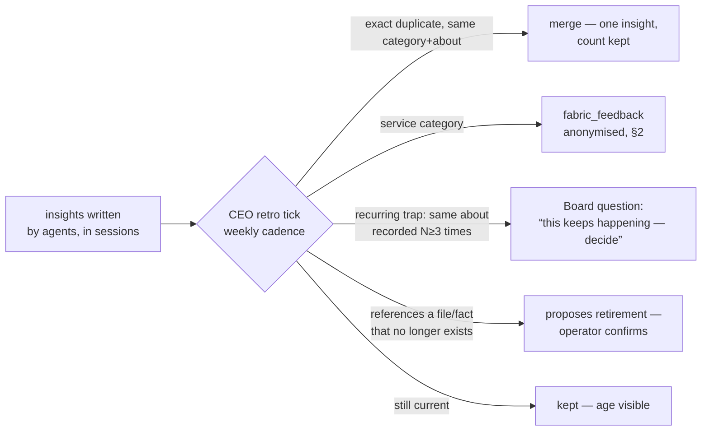

# Retro categories, the anonymised product loop, and where signals land

> **Target clarification, 2026-09-07:** The following earlier design remains historical context.
> The current task-level proposal is [system-contract.md](system-contract.md) and
> [engineering-specs.json](engineering-specs.json), visualised in [system.html](../reports/system.html).
> ADR-0045–0047 are proposed, not an assertion that runtime or external wire contracts changed.

**Status:** design, 2026-09-06. Five operator asks in one seam: insights get
categories; service-category insights feed an anonymised cross-project base that
becomes Fabric's own product backlog; the CEO runs a retrospective cycle; every
module's notifications flow into one dashboard inbox; and the interface gets a
density principle plus a cycles view — noted now, built later.

Measured first: `memory_facts.kind` carries `note | finding | decision | trap`
and **no category**; the M95 redaction pass (`shared/redact.ts#redact`) is a
reusable function; `AttentionPanel` already sits on the home.

---

## 1. Categories — an insight says what it is ABOUT

`kind` says what an insight *is* (a finding, a trap). The new `category` says
what it is *about*, and the vocabulary is CLOSED — an open field grows
`fabric`, `Fabric`, `фабрик` and `tool` in a week (the harness rule: enumerate
or the agent invents):

| Category | About | Example |
|---|---|---|
| `project` *(default)* | the project's own domain | "the staging DB truncates emails at 64 chars" |
| `agents` | how an agent behaved — the runner, its habits | "codex ignores the brief unless it is restated in the instruction" |
| `harness` | Fabric's harness seam — tools, protocol, pack | "the context pack omitted the fact I needed; the budget cut it" |
| `fabric` | the product itself — screens, flows, gaps | "there is no way to see which routine produced this task" |
| `process` | how we work — reviews, briefs, cadence | "reviews with no brief get accepted anyway" |

`fabric_memory_remember` gains an optional `category` (default `project`). The
column lands on `memory_facts` with a CHECK; the projector already upserts kinds
and extends the same way.

**Why this is load-bearing and not labelling.** The three *service* categories —
`agents`, `harness`, `fabric` — are insights about THE TOOL, not about the
operator's project. They are the raw material of Fabric's own product backlog,
and today they drown in project memory where nobody sweeps across projects.

## 2. The anonymised product loop — service insights feed Fabric's backlog

The operator's requirement, stated as the contract it must keep:

> Collected across all projects into one shared base, **anonymised** — bound to
> no user and no project, describing only the essence of the problem. On by
> default, can be switched off, and must carry no leak risk.

### 2.1 Two hops, and the second does not exist yet

**Hop 1 — estate-level (ships now).** Service-category insights are mirrored
into an estate-wide `fabric_feedback` projection, stripped of their project
binding. This is the cross-project sweep on THIS machine, and for the operator —
who is also Fabric's developer — it already is the product backlog feed.

**Hop 2 — upstream (waits on an endpoint).** Sending to Fabric's makers needs a
server; there is none (`telegram-surface.md` §1.4). The design is ready and the
transport is named as waiting — never half-built.

### 2.2 The anonymisation contract, enforced in order

1. **Category gate first:** only `agents` / `harness` / `fabric` are EVER
   eligible. A `project` insight never leaves project memory — not stripped, not
   redacted: **refused**, in the schema, because the essence of a project insight
   IS project data and no redaction makes it safe.
2. **The M95 redaction pass** (`redact()`) — secrets, tokens, keys.
3. **Identifier stripping:** absolute paths → basenames, UUIDs → `‹id›`, emails
   and URLs → placeholders, the estate name → nothing.
4. **What the row carries:** `category`, the redacted claim, the Fabric version,
   a COARSE date (week, not timestamp). **No estate id, no project id, no actor,
   no session** — anonymity by absence of the column, not by promising not to
   look at it.
5. **The queue is visible** (SCR-35 harness screen): what would be sent sits in a
   list the operator can read, delete from, or switch off. Default on, one
   switch, journalled when flipped.

### 2.3 Why default-on is defensible here

Because of §2.2/1 and /4: the only thing that can leave is a statement about
Fabric itself, with nothing to bind it to anyone. The failure mode of default-off
is known from every telemetry system: the people with the most useful feedback
never flip the switch. The failure mode of default-on is a leak — and the leak is
prevented by columns that do not exist, not by policy.

## 3. The retrospective has its own cycle, and the CEO runs it

Insights were write-only until M154 gave them readers. The cycle makes them
MAINTAINED — every insight is eventually re-examined, and the examiner is the
CEO's tick, with judgement raised to the operator rather than exercised:

Mechanical actions (merge exact, mirror service, count recurrences, detect a
dangling reference) are **scripts** on the tick. Anything needing judgement — is
this trap still true? — is a **proposal**, because a retired insight that was
still true is worse than a stale one: the next agent re-learns it the hard way.
An insight is never silently deleted; retirement is supersession, both readable.

**The Board is how retro reaches the operator:** a recurring trap becomes a
`question` of kind `process`, ranked by M150 like everything else. No separate
retro-review ceremony — the operator meets it in the same top-5.

## 4. One inbox on the dashboard — where every module's signals land

Modules that already emit or will: the Board (questions, obligations), health
(`stalled`, `harness.break`), routines (paused, stuck), chains (blocked input),
quota, releases, the retro cycle, Telegram delivery failures. The operator asked:
one window, everything lands, each item expandable.

**The honest shape: the inbox is a VIEW, not a new store.** Everything above is
already a journal event or a derived obligation. The inbox is the feed, split by
one question — *does this need you?*

| Lane | Contents | Behaviour |
|---|---|---|
| **Needs you** | the Board's top slice — questions, refusals, reviews, `stalled` | expandable to the full item, with the ACT that resolves it (answer, grant, accept); leaves only when resolved |
| **Happened** | notable events — task finished, release, letter sent, insight recorded | expandable to detail; scrolls away; nothing to dismiss because nothing is owed |

One component, two lanes, and the rule that keeps it honest is inherited from
`attention.ts`: the "needs you" lane can never be marked read. Expansion shows
the event's payload, its actor, its project, and the deep link to where it lives.

## 5. Density — the principle, noted now, applied later

The operator's instruction, recorded as the standing principle for every surface
(the review itself is M187, not this iteration):

> **Primary information, primary controls — visible. Everything else — behind a
> disclosure.** A screen shows its main data, main text, main meta and main
> actions; every additional control folds into an expandable. Informative and
> data-backed, never saturated. Later: disclosures themselves become
> customisable (a project-settings screen where each operator opens what THEY
> use) — thought about now, built when the review lands.

What this changes when applied: settings screens collapse to essentials + "more",
panels lead with the number and fold the table, and the component set gains ONE
disclosure primitive so every screen folds the same way — not per-screen
inventions. The review sweeps every SCR against this rule with the screens
register as the checklist.

## 6. The cycles view — the system has loops, and they should be visible

The estate now runs on cadences: the routine tick, the chain advance, the CEO
hygiene tick, the retro cycle, the evening letter, the board review, quota
refresh. Today only automations (M65) show any of this, per project.

**One view, estate-wide: every cycle, its cadence, its last run, its next due,
its health** — using the same five-state liveness vocabulary as agents (ADR-0040),
because a cycle that silently stopped is exactly a stalled agent one level up.
The evening letter that could not send at 21:00 shows here as "late, will send on
next launch" — the honest state the letter design already carries.

This is M65's automations surface generalised from "this project's routines" to
"everything that ticks", and it lives beside the inbox: the inbox is what
happened, the cycles view is what is SUPPOSED to happen and whether it does.

---

## 7. Build order

| # | Step | Ships without a model? |
|---|---|---|
| 1 | `category` column + CHECK, `fabric_memory_remember` param, projector, probe | yes |
| 2 | `fabric_feedback` projection: category gate in schema, redaction + stripping on write, coarse date | yes |
| 3 | The visible queue + the default-on switch, journalled | yes |
| 4 | The CEO retro tick: merge exact, mirror service, count recurrences, propose retirement | yes — scripts |
| 5 | Recurring traps become Board questions of kind `process` | needs M149 |
| 6 | The inbox view: two lanes over feed + Board | needs M151 |
| 7 | The cycles view | yes |
| 8 | The density review across every screen (M187) | yes — UX work |
| — | Upstream transport for `fabric_feedback` | **waits on an endpoint** |
