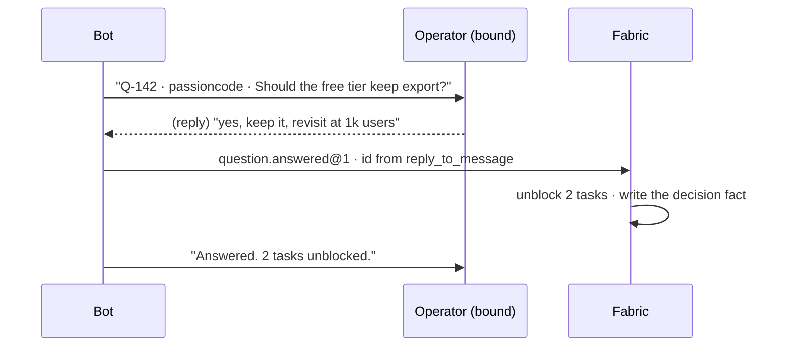

# The Telegram surface — where the operator's day actually happens

**Status:** design, 2026-09-05. Nothing built. Extends
[`board-and-ceo.md`](board-and-ceo.md): the Board decides *what* needs the
operator; this decides *where they meet it*.

Platform facts below were read from the `telegram-bots` skill against **Bot API
10.3** (read 2026-08-25); facts about this repository were measured in this tree
today. Both are cited where they carry weight, because two of them make a
plausible design impossible and one of them is about us, not about Telegram.

---

## 1. Four constraints, and one of them is ours

### 1.1 A bot cannot read the conversation it was added to

> A bot cannot read messages in a group without privacy mode off or a mention,
> see a chat it was never added to, **read history from before it joined**, act
> on behalf of a user, or download a file over 20 MB.
> — `telegram-bots`, Bot API 10.3

So "tag it in the work chat and it analyses the correspondence" has three
distinct costs, and they should be paid deliberately rather than discovered:

1. **Privacy mode must be off** — a BotFather setting, not an API call. With it
   on, the bot receives only messages that mention it or reply to it. With it
   off, **it receives every message in that group**, and that is a consent
   decision about a work chat, not a configuration toggle.
2. **There is no history.** A bot added today cannot see yesterday. "Analyse the
   correspondence" therefore means *"analyse what we have been storing since the
   bot joined"* — which means Fabric stores the group's messages, which is the
   same consent decision again, with a retention question attached.
3. **Reading a chat as a person requires MTProto** — a user account, which the
   family's own `telegram-userbots` skill opens by telling you to read its
   refusal first: a session file is a logged-in human, revocable by them and
   bannable by Telegram. **Refused here.** A work chat is not worth an account.

### 1.2 `update_id` is the only idempotency key, and nobody uses it

> `update_id` is the only idempotency key you get… Measured across eight live
> Telegram bots on this machine on 2026-08-25: **zero of eight deduplicate on
> `update_id`.**

Claim before working, with an `INSERT` on a primary key. This repository already
holds the same rule twice — the journal's `append_event`, and its exact analogue
in the chain advance's overlap guard — so it is a pattern to reuse, not invent.

### 1.3 The default subscription silently drops three update types

`allowed_updates` defaults to *"everything except `chat_member`,
`message_reaction` and `message_reaction_count`"*. A bot that tracks who joined a
chat receives nothing, `ok: true` comes back, and the logs are clean. Every type
is named explicitly, and re-subscribed when one is added.

### 1.4 **Fabric has no always-on process, and this is the load-bearing one**

Measured in this tree: every scheduled thing in the product is a `setInterval` in
the Electron main process — the routine tick, the chain advance, the feed poll.
There is no server, no public HTTPS endpoint, and nothing runs when the operator
closes the laptop.

Three consequences, all of which the design must state rather than route around:

| | Consequence |
|---|---|
| **Polling, not a webhook** | a webhook needs a public endpoint; we have none. `getUpdates` it is — and `getUpdates` **will not work while a webhook is set**, so this is one token with one consumer, forever, and the choice is recorded rather than left to whoever wires it. |
| **"Evening letter at 21:00" is a promise we cannot keep** | if the app is closed at 21:00, nothing sends. See §6.2 — the letter is **sent late and labelled late**, never sent silently on Monday for Friday's window. |
| **Inbound is deaf while the app is closed** | Telegram keeps updates for **24 hours**. Under a day, the backlog drains on next launch; over a day, it is gone and nothing says so. Reconcile from our own state, never from the assumption the queue drained. |

**The honest fix is a small always-on relay**, and it is exactly the hosted
estate that ADR-0016 puts at horizon 4. Naming it here means the local version
ships knowing what it is — a good local bot, not a broken hosted one.

---

## 2. Identity: who is allowed to be believed

**Anyone in a group chat can message the bot.** Answering a Board question
settles estate state, so a Telegram user carries no authority until they are
**bound** to a person in the estate.

```
persons (existing)  ←──  telegram_identities  ──→  a Telegram user id
```

- **Binding starts in the app, never in Telegram.** The app shows a one-time
  code with a short expiry; the person sends it to the bot in a **direct
  message**. Starting from Telegram would let anyone claim to be the operator by
  asserting it.
- **A DM is required for binding** even if the person only ever intends to use a
  group: a code pasted into a group is a code every member has seen.
- **Unbound users get a refusal that leaks nothing** — not "you are not the
  operator of Fabric estate org #1", which confirms the estate exists and names
  it. One sentence, no detail, the same for every failure.
- **A binding is revocable from the app**, and revocation takes effect on the
  next update rather than on a cache expiry.

## 3. What may be said where

A group sees everything the bot posts. This is the seam that turns a convenience
into a leak, and it is a design decision rather than an operational care.

| Content | DM | Group / channel |
|---|---|---|
| A question and its answer | **default** | only if the project is marked `shareable` |
| The evening letter | **default** | only if marked `shareable` |
| Counts and states — "3 waiting, 1 blocked" | yes | **yes, by default** |
| A refused effect and its grant | **DM only, always** | never — it is an authorisation act |
| A repository path, a file, a transcript excerpt | **DM only** | never |

Default is the narrow channel. A project is widened by an explicit act that names
what widening means, and the act is journalled — so "who decided this channel
could see the questions" stays answerable.

---

## 4. Outbound — what the bot sends

### 4.1 The kinds

| Kind | Default | Composed from | Model? |
|---|---|---|---|
| `question` — an item reached the Board and wants the operator | **on** | the Board query | no |
| `evening` — the day's letter | **on** | tasks, sessions, questions, decisions | no |
| `blocked` — work stopped and nobody has looked | on | `blocked_since` past a threshold | no |
| `refused` — an effect was refused and wants a grant | **on, DM only** | the authority plane; already the escalation surface named in `external-contracts.md` | no |
| `release` — something shipped | off | journal | no |
| custom | — | a notifier, §7 | depends |

### 4.2 Routing, and the two switches that are not the same switch

The operator asked for per-project channels and for the ability to silence, for
example, the developer while keeping the marketer. Those are two different
switches, and merging them would make one of them unusable:

- **`route`** — *where* a kind goes for a project: DM, a channel, a group, or
  several. Absent for a project ⇒ inherit the estate's route.
- **`mute`** — *whether* a source may raise a kind at all. Keyed on
  **(project, agent, kind)**, with `agent = null` meaning the whole project.

"The developer agent sends no notifications in this project" is a mute on
`(project, developer, *)`. "This project goes to the #ops channel" is a route.
Neither can express the other, and a single "notifications on/off" per project
would have forced the operator to choose which meaning they wanted.

**A mute never silences a `refused`.** An effect waiting on a grant is work
stopped on the operator's own authority floor; a muted grant request is a session
blocked forever with nobody told. The mute table refuses that combination rather
than accepting it quietly.

### 4.3 Delivery is a queue with a resume point, not a loop

Rate limits from the skill, treated as design constraints:

| Limit | Value | Design consequence |
|---|---|---|
| one chat | ~1 message/second | the queue paces per chat, not globally |
| **one group** | **20 messages/minute** | a chatty project cannot fan out per event; it batches |
| bulk | ~30 messages/second | irrelevant at our scale, and stated so nobody designs for it |

On 429 the response carries `parameters.retry_after`: **sleep exactly that and
retry the same call.** A fixed backoff either wastes the window or trips the next
one.

Every outbound message is a row before it is a send — `queued → sent → confirmed`
with the returned `message_id` stored, because editing a message later needs both
ids. A message that fails is retried from its row; nothing is regenerated,
because regenerating a digest an hour later produces a *different* digest and the
operator would receive two letters that disagree.

---

## 5. Inbound — three modes, and only one of them needs a model

### 5.1 Reply-to-answer — the mode that makes the daily loop work today

The bot posts a question as a message. **The operator replies to that message.**
`reply_to_message.message_id` identifies the question exactly — no parsing, no
understanding, no ambiguity.

This is the whole daily loop, in Telegram, with no model:



The operator opens Telegram, answers three replies, and the estate continues. The
app need not be opened at all — **except that Fabric is what polls**, so the
answers land the next time it runs (§1.4). That is the honest shape, and the
relay in §1.4 is what would remove the caveat.

### 5.2 Commands — structured, unambiguous, no model

`/board [project]` · `/answer <id> <text>` · `/projects` · `/mute <project> [agent]` ·
`/route` · `/status`

Everything the operator does on the Board has a command, because a command is a
contract and a sentence is an interpretation.

### 5.3 A mention in a group — this is the part that needs a model

"Tag it in the chat and it works out what is being asked, asks a clarifying
question if it needs one, and answers." Every verb there is judgement. There is
no mechanical path — unlike the CEO's settlement, where `about` keys gave one —
because a work chat has no keys in it.

**So until a provider exists, a bare mention is answered honestly:**

> I can read structured requests, not the thread. Reply to a question I posted,
> or use /board.

Not a fabricated answer, and not silence. And the pieces that make the model
version possible later are built now, because they are the expensive half and
they are useful on their own:

- **message capture**, with its consent decision made explicitly (§1.1);
- **retention**, set per chat, so "analyse the thread" has a defined window;
- **a thread key** — chat plus reply chain — so a future model is handed a
  bounded conversation rather than a firehose.

### 5.4 The clarifying question, when it arrives

Worth stating now because it changes the data model: a clarifying question the
bot asks is **not a Board question**. It is a turn in a conversation, it expires
with the thread, and it must never appear in the operator's queue of things only
they can settle. Conflating the two would fill the Board with the bot's own small
talk — the exact failure `attention.ts` was written to avoid.

---

## 6. The evening letter

### 6.1 What is in it, and every line is countable

Per project, then a total: tasks finished, tasks started, sessions run and their
outcomes, questions asked and answered, decisions recorded, what is blocked and
for how long, what is waiting on the operator.

Composed from the journal by the same arithmetic as everything else — no prose
generation, no model. The tone is a ledger, and a ledger read at the end of a day
is a good thing to receive.

### 6.2 It is labelled with the window it covers, not the time it was sent

The app is not running at 21:00 every day. A letter that was missed is sent on
next launch and says so:

> **Evening letter · Mon 4 Sep, 00:00–23:59** (sent Tue 09:12 — Fabric was not
> running at 21:00)

Never a silent late send, and never a window quietly widened to swallow the gap.
Two missed days are two letters, because merging them loses the day boundary the
letter exists to draw.

### 6.3 Nothing happened is a sentence

A day with no activity gets a letter saying so. A digest that only appears on
busy days trains the operator to read its absence as "nothing happened", and then
a week when Fabric was broken looks exactly like a quiet week.

---

## 7. Notifiers — a "notification agent" is three existing parts

The operator asked to be able to request a notification by describing an example and
have the CEO build one that runs on a schedule or a trigger, gathers data — from the
app, from tools, or by asking another agent — and sends it.

**Almost all of that already exists.**

| Part | Exists? | What it is |
|---|---|---|
| An agent with its own instructions and servers | ✅ | `agent_bindings`, M125 |
| A schedule | ✅ | `routines`, M132 |
| An event trigger | ✅ | the journal, plus the routine tick |
| Calling another agent | ✅ | chains — with the loop bound and the named-thing rule already enforced |
| Reaching an external tool | ✅ | ~~the machine gateway, ADR-0034~~ — **superseded by [ADR-0115](../adr/0115-a-local-agent-reaches-a-cloud-product-through-fabric-on-consent.md)** (noted 2026-10-04): the gateway is off since 2026-09-14; a registered external agent goes through Fabric's hub; a session Fabric starts has no product route yet (CO-194) |
| **Delivering the result to Telegram** | ❌ | the one new part |

So a notifier is `routine + agent + delivery target + template`, and the new
surface area is the delivery step. It inherits every guard those parts already
carry — the loop bound, the depth limit, the grant floor, the quota gate — which
is the argument for composing rather than building a notification engine.

**Creating one without a model** is a form: pick a schedule or a trigger, pick a
source, pick a channel, name it. With a model it is a sentence. The form is not a
placeholder for the sentence — it is what the sentence would produce, and it
remains the thing that can be inspected and corrected afterwards.

**A notifier is bounded like any other scheduled agent.** It obeys the routine's
own rules: nothing starts over its own last run, a missed window is not made up,
and the quota gate blocks unattended work when the account is nearly spent. A
notifier that quietly burns the model budget producing a daily message nobody
reads is a real failure, and those three already prevent it.

---

## 8. Data model

```sql
-- Who may be believed. Binding starts in the app; a code is redeemed in a DM.
create table telegram_identities (
  estate_id     uuid not null,
  person_id     uuid not null,
  tg_user_id    bigint primary key,
  bound_at      timestamptz not null,
  revoked_at    timestamptz
);

-- Where the bot may speak, and what a group is allowed to be told.
create table telegram_chats (
  chat_id       bigint primary key,
  estate_id     uuid not null,
  kind          text not null,      -- 'dm' | 'group' | 'channel'
  title         text,
  shareable     boolean not null default false,   -- section 3
  capture       boolean not null default false,   -- section 1.1, an explicit consent
  retain_days   integer,                          -- null = do not store messages
  added_at      timestamptz not null
);

-- WHERE a kind goes. Absent for a project means inherit the estate.
create table telegram_routes (
  estate_id   uuid not null,
  project_id  uuid,                 -- null = the estate default
  kind        text not null,        -- 'question' | 'evening' | 'blocked' | 'refused' | ...
  chat_id     bigint not null,
  primary key (estate_id, project_id, kind, chat_id)
);

-- WHETHER a source may raise a kind. A different question from `route`.
create table telegram_mutes (
  project_id uuid not null,
  agent_id   uuid,                  -- null = every agent in the project
  kind       text not null,         -- '*' for all
  because    text,
  primary key (project_id, agent_id, kind)
);

-- Every outbound message is a row before it is a send.
create table telegram_outbox (
  id          uuid primary key,
  chat_id     bigint not null,
  kind        text not null,
  body        text not null,
  ref         jsonb,                -- question id, digest window, notifier id
  state       text not null,        -- 'queued' | 'sent' | 'failed' | 'skipped'
  message_id  bigint,               -- Telegram's, needed to edit later
  attempts    integer not null default 0,
  retry_after timestamptz,
  created_at  timestamptz not null
);

-- The only idempotency key there is. INSERT to claim, never SELECT then INSERT.
create table telegram_updates_seen (
  update_id bigint primary key,
  seen_at   timestamptz not null
);

-- Captured only where `telegram_chats.capture` is true, pruned by `retain_days`.
create table telegram_messages (
  chat_id     bigint not null,
  message_id  bigint not null,
  thread_key  text,                 -- chat + reply chain, for a bounded thread
  from_tg_id  bigint,
  text        text,
  sent_at     timestamptz not null,
  primary key (chat_id, message_id)
);
```

**Where the token lives.** A bot token is a credential with the same custody as
the Supabase service key: **main process only**, never in a session bundle, never
in the renderer, never in a repository. It is not an MCP upstream, so the machine
gateway's rule does not reach it; it is read from the OS keychain, and the
settings screen shows whether one is present, never its value.

**Journalled or not.** Routes, mutes, bindings and captures are **decisions** and
are journalled — "who let this channel see the questions" must stay answerable.
The outbox, the seen-updates table and captured messages are **operational**, are
not journalled, and are pruned; a rebuild from the journal must not resend
yesterday's notifications, and the surest way to guarantee that is for the
journal not to contain them.

---

## 9. Failure modes

| Failure | What it looks like | Defence |
|---|---|---|
| An update processed twice | one answer recorded twice; a task unblocked, re-blocked, unblocked | claim on `update_id` by INSERT |
| The app was closed for two days | updates silently gone after 24h | reconcile from our own state; the letter says which windows it missed |
| A group is told something private | a repository path in a work chat | narrow by default; widening is an explicit journalled act |
| An unbound user answers a question | anyone in the chat settles the estate | authority requires a binding, and refusals leak nothing |
| A muted project stops asking for grants | a session blocked forever, nobody told | a mute cannot cover `refused` |
| A chatty project trips 429 | messages silently dropped | outbox with `retry_after` honoured exactly; per-chat pacing |
| A digest regenerated on retry | two letters that disagree | the body is composed once, into the row; a retry sends the row |
| A notifier loops | budget burned on a message nobody reads | routine rules, loop bound and quota gate — all existing |
| Privacy mode left on | "the bot ignores me in the group" | the setting is checked at connect and reported as a state, not assumed |

---

## 10. What needs a model

| Capability | Without | With |
|---|---|---|
| Notifications, routing, mutes | **all of it** | — |
| The evening letter | composed arithmetic, ledger tone | written as prose at the length asked for |
| Answering by reply | **exact, via `reply_to_message`** | — |
| Commands | **all of them** | — |
| A bare mention in a group | an honest refusal naming what does work | reads the captured thread, asks a clarifying question, answers |
| Creating a notifier | a form | a sentence |

The daily loop the operator described — open Telegram, answer what is waiting,
leave — **works with no model at all**, because a reply carries its own
addressing. That is the finding that decides the build order.

---

## 11. Build order

| # | Step | Depends on |
|---|---|---|
| 1 | Token custody, connect, `getUpdates` polling on the existing tick, `allowed_updates` named, claim on `update_id` | — |
| 2 | Binding: a code in the app, redeemed in a DM; refusals that leak nothing | 1 |
| 3 | Outbox with per-chat pacing and `retry_after`; routes and mutes, journalled | 1 |
| 4 | `question` notifications and **reply-to-answer** — the daily loop closes here | Board M152 |
| 5 | The evening letter, labelled with its window, including "nothing happened" | 3 |
| 6 | `refused` to a DM, and a grant issued from Telegram | authority plane |
| 7 | Notifiers: routine + agent + delivery, created through a form | routines, chains |
| 8 | Capture and retention, with the consent decision made explicitly — the expensive half of the model tier, useful alone as a record | 1 |
| 9 | *(model tier)* mention, thread, clarify, answer | a provider |

Step 4 is where this stops being plumbing: the operator can run their day from
Telegram, and Fabric becomes the thing that works while they are not looking —
which is what the whole product claims to be.
