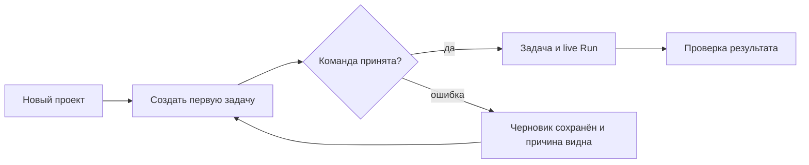

ssheleg skills — project-audit · agent-sync · agent-orchestrator · agent-harness · agent-interop · ux-scenarios · ux-flows · ux-audit · sheleg-design · brand-voice · copywriting

# PassionCode.ai / Fabric — объединённый технический и продуктовый план

**Срез 2026-09-07; HEAD `153b4f029e626230d465d5d21d02fb8c9de5fadf`. Статус: проверенный по зависимостям план реализации, не выполненные фичи.** Базовый аудит и его пробы сохранены. Этот документ заменяет укрупнённый W-план как маршрут следующей работы: исходные M остаются, W findings привязаны к ним и к дополнительным локальным S-блокам. S/R — идентификаторы только этого отчёта, не новые номера общего backlog.

Бренд подтверждён владельцем: **PassionCode.ai** — главный; **Fabric** — продукт, включающий рабочую среду, IDE и командный центр. Требования о графах не сняты. Предыдущий W-план действительно укрупнил их чрезмерно: M155, M173, M182–M186 и M189–M191 должны оставаться видимыми самостоятельными результатами.

Работа другого агента видна в сохранённых `agent-visibility-and-runs.md`, `retro-and-signals.md`, ADR0041/0042/0043 и M-строках backlog. `agent_sync.py status` на этом срезе: `other runs: none holding anything`, одна чужая expired lease M146, `Mirror drift (60 page(s))`. Это наблюдение о координации, не доказательство отсутствия работающего агента: активная CLI-сессия без lease возможна. Чужую текущую переписку этот отчёт не утверждает прочитанной. Зеркало и общие записи не перезаписаны.

Соответствие vision: сохраняем проект, его полномочия, историю и проверяемые результаты при замене исполнителя ([docs/ux/vision.md:12](https://github.com/passioncode-ai/fabric/blob/153b4f029e626230d465d5d21d02fb8c9de5fadf/docs/ux/vision.md#L12), `:18`, `:32`, `:70`). Предлагаемые экраны служат этой работе. Они не требуют наблюдать каждую внутреннюю мысль модели.

## 1. Что изменилось после слияния

1. **M97 и M196 уже завершены в HEAD.** Во вложении они ещё впереди. M195 и M197 сохраняются как shipped с текущими ограничениями; M195 не закрыл обход policy sink; установленное приложение не доказывает состояние HEAD. M109 остаётся частичным. Источники: backlog:459,547,679–682; предыдущие runtime/artifact probes.
2. **Перед развитием автономности добавлены реальные дефекты:** scope чужого estate, false executed, grant race, повторный запуск цепочки и unknown quota; одновременно исправляются потеря ввода и пустой first-task path. Это расширяет слой безопасности, а не заменяет его новым списком фич.
3. **М198 предшествует pinned revision.** Повторный rebuild сейчас меняет config_revision. Прогресс и manager binding нельзя основывать на недетерминированной ревизии.
4. **Каждый граф имеет отдельную карточку/смысл.** M173 — решения; M190 — история агента, общая история задач проекта и целевой план. M188 — данные каждого прогона; M189 — его виджет. Список плана и его DAG обязаны читать одну версию.
5. **M157/M158 вводятся через один activation gate.** Нельзя включить автоматическое settlement, а защиту человеческих решений добавить потом. Минимальный M168 checker идёт до включения; полный model port не нужен для deterministic core.
6. **M191 не ждёт M190**, M182 не ждёт графов, M153 не ждёт отправку feedback, M178 не ждёт весь UI Board. Эти ветки можно вести независимо после их собственных контрактов. Порядок фаз ниже задаёт читаемую группировку; обязательный порядок задают рёбра JSON.
7. **M194 — больше picker.** Нужны estate/project scope роли, fencing, wake/recovery, адресная доставка, измерение, capability conformance. M176 требует сначала существующую трассу вызовов; текущий журнал не даёт полную tool trajectory.
8. **Анонимизация не гарантирует нулевой риск.** Default-on — предпочтение владельца; свободный текст без ids всё ещё может содержать клиента, код, инцидент или уникальную комбинацию. Безопасный default-on внешней отправки возможен только как отдельно проверенный ограниченный structured режим. Пока нет endpoint и контракта, локальный сбор и внешняя передача — два состояния, не одна галочка.

## 2. Архитектурные решения, которые надо уточнить до кода

| Противоречие / недоработка | Что фиксируем в следующем контракте | Почему |
|---|---|---|
| CONTEXT:72 — Run одного graph; ADR0042 — task+session | Согласовать словарь и runtime model новой ADR/уточнением канона; различать graph launch, task attempt, manager cycle invocation, provider native conversation | Иначе один номер Run обозначает несколько разных вещей |
| Каждая итерация — новый Run, но vendor conversation может продолжаться | Новая Fabric execution session на каждую управляемую итерацию; native session ref отдельно; resume как continuity, не новая authority; скрытые turns не выдумывать | Сохраняется ваше требование полного прогона, не зависит от vendor transcript формата |
| «Два экрана», но «один SCR40 с тремя tabs» | SCR40 как семейство адресуемых views с разной семантикой, точным заголовком и ссылкой; decision graph — M173/SCR33 | Пользователь не читает намерение как историю |
| «Все edges есть», «журнал не может ошибаться о прошлом» | Typed edges с event source и evidence grade; добавить missing producers; журнал доказывает запись claim, а не истинность произвольного claim | Граф не может честно показывать неподтверждённую причинность |
| «Pack — всё, что агент знал» | Pack доказывает стартовый вход; последующие retrieval/tool/input receipts расширяют наблюдаемый контекст; unknown если correlation отсутствует | Агент может прочитать файл и после старта, иметь vendor history |
| Manager hired as any agent, но binding project_id NOT NULL | RoleSlot estate CEO / project PM, scoped auth и single-active epoch; management invocation не насильно task Run | Нельзя спрятать CEO в фиктивном проекте или дать ему любой project_id |
| Reader-only M186/M191 | Сначала цикл events, dry compiler, mirror watermark, exact lineage; потом readers | Отсутствующие данные UI не создаёт |
| Удалить строку feedback queue, затем rebuild | Durable private suppression/delivery state; export payload не содержит локальных связей | Иначе удалённое снова отправится после rebuild |
| Category+about как «точный дубль» | Сопоставлять содержание/контекст/версию и distinct occurrence ids; contradictory claims не объединять | Один subject может иметь несколько разных проблем |

Первичные внешние контракты проверены 2026-09-07. Claude SDK различает continue/resume/fork; resume конкретной сессии требует явного id, fork копирует разговор, а не filesystem. Поэтому перенос проекта и перенос vendor conversation — разные операции; Fabric должен уметь начать свежую сессию с собственными evidence. [Claude sessions](https://code.claude.com/docs/en/agent-sdk/sessions). SDK permissions существуют как отдельный механизм: Fabric grants не возникают автоматически от MCP tool. [Claude permissions](https://code.claude.com/docs/en/agent-sdk/permissions). MCP latest разрешился в `2026-07-28`; реализуемые capabilities нужно pin/negotiation проверять на конкретном адаптере, а не обещать весь стандарт. [MCP specification](https://modelcontextprotocol.io/specification/2026-07-28).

NIST рассматривает деидентификацию как управление риском с учётом данных, техники и контекста, а не доказательство отсутствия риска после удаления идентификаторов. Это основание изменить неверную гарантию в ADR0041 перед внешним выпуском feedback. [NIST SP 800-188](https://csrc.nist.gov/pubs/sp/800/188/final). Здесь предлагается инженерная граница данных; правовое заключение не проводится.

## 3. Матрица всех требований владельца

Ниже единица покрытия — отдельное требование из двух сообщений, а не весь абзац про «видимость». Статус фич остаётся в карточках: наличие строки покрытия не означает реализацию.

| ID | Требование | Работа | Смысл / ограничение |
|---|---|---|---|
| R01 | PassionCode.ai — главный бренд, Fabric — продукт | S11 | Брендовый документ исправлен сейчас; канонический перенос отдельной поставкой. |
| R02 | Смержить предоставленный layered plan, сохранить каждый M | S10 | Все 32 M из attachment сохранены отдельными карточками. |
| R03 | Технический, архитектурный и security аудит всего harness | S02 S03 S04 S05 M98 M109 M155 M177 | Исходные findings сохраняются, новые противоречия вынесены отдельно. |
| R04 | Manager/CEO свой или внешний, включая Claude Code | M194 M175 | Один role contract, сменяемый judgement loop. |
| R05 | Lifecycle, проверка, wake/recovery внешних агентов | M178 M179 M180 M181 M194 | App-off, unknown, stale lease, budget и повторная доставка описаны. |
| R06 | Передача данных между агентами | M152 M188 M194 S04 | Адресованные command/evidence envelopes; provider-native context не универсальный перенос. |
| R07 | Хранилища и синхронизация: как устроены | M191 M198 S05 S12 | Карта authority, projections, mirrors, local files, receipts и будущего cloud. |
| R08 | Что пользователь видит и как работает с памятью | M191 M154 | Actual historical pack отдельно от dry next pack; lineage и omissions. |
| R09 | История работы каждого агента в проекте | M190 M188 | Actor/project scope и историческое участие, не только текущий assignee. |
| R10 | Граф действий и решений агента | M190 M173 | Действия+записанные решения+rationale/evidence; скрытое рассуждение не реконструируется. |
| R11 | Какие задачи агент создал, кому/куда добавил | M190 M149 | Created-from, board destination, assignment history и вопрос как отдельные отношения. |
| R12 | Текущая задача: план, декомпозиция, checkpoints | M188 M189 | Версия плана, вложенные шаги, typed blockers и evidence. |
| R13 | Каждая итерация цикла — целый отдельный прогон | M188 S10 | Fresh Fabric task execution; vendor inner turns не подменяют границу. |
| R14 | Все шаги каждого прогона и статусы в realtime | M188 M189 S05 | planned/active/done/blocked/skipped/failed, claim отдельно от observed verification. |
| R15 | На проекте общий граф задач всех агентов | M190 | История создания/исполнения/переназначений с текущим местом задачи. |
| R16 | На проекте граф решений | M173 | Самостоятельный маршрут и карточки доказательств, не растворён в task graph. |
| R17 | Проектный план списком, декомпозицией и графом | M190 M188 | Один plan revision/read model, список и DAG согласованы. |
| R18 | DID история и SHOULD цель — разные смыслы | M190 S10 | Отдельные адресуемые views и явная семантика; status overlay не выдаёт plan за history. |
| R19 | На project/agent previews, полный graph отдельно | M189 M190 M173 M187 | Preview→full view→exact node→source→назад с сохранением выбора. |
| R20 | Категории ретро: проект, агенты, harness, Fabric, процесс | M182 | Closed enum; kind orthogonal; project default. |
| R21 | Общая база service insights через все проекты | M183 M182 | Scoped local intake, отдельный приватный delivery control и внешний обезличенный payload. |
| R22 | Default-on выключаемая отправка и отсутствие привязок | M183 | Предпочтение default-on сохранено как цель безопасного structured режима; обещание нулевого риска отвергнуто доказательно. |
| R23 | Ретро формирует backlog улучшения Fabric | M183 M184 | Недоверенные предложения с проверкой и dedup; не автоматическое принятие задач в product roadmap. |
| R24 | CEO разбирает, закрывает, обновляет, обсуждает ретро циклично | M184 M153 M194 | Состояния рассмотрения и verification; история supersession, повторная проверка. |
| R25 | Уведомления всех модулей в dashboard, раскрытие события | M185 S05 | Needs-you vs happened, safe detail и точная ссылка, отсутствие false read. |
| R26 | Информационная плотность: основное видно, остальное раскрывается | M187 M189 | Sweep сейчас; настройки/advanced hidden, важный blocker/permission visible. |
| R27 | Будущие настраиваемые раскрытия в project settings | M187 | Явная заметка и return trigger после density review; не добавлять конструктор сейчас. |
| R28 | Отдельный view всех циклов | M186 | Cadence/last/next/health/outcome/placement, включая отсутствие наблюдателя. |
| R29 | Воронки и смысловые цепочки экранов | S01 M151 M152 M185 S08 S09 | First value, daily return, handoff, retro, manager replacement и memory inspection. |
| R30 | Чем лучше агенты, тем лучше фабрика | M194 M176 S08 S09 | Durable project/evidence/roles и заменяемые execution adapters; полезность проверять на результатах. |
| R31 | Видна ли работа другого агента и не потеряны ли требования | S10 | Сохранённые ADR/architecture/backlog прочитаны; agent-sync активных leases не увидел, mirror drift 60 страниц. Живую чужую сессию не заявляем. |

## 4. Порядок слоёв и самостоятельные ветки

Фазы — группы результатов, не барьер «закончить весь предыдущий слой». `depends_on` в JSON означает готовность контракта/проверок **до включения**, проектировать соседние блоки можно раньше. M157 зависит от M158 для activation, M175 — от M194 service contract, поэтому циклического ожидания между ними нет.

| Фаза | Результат | Карточки |
|---|---|---|
| A | Немедленные исправления и подтверждение уже сделанного | S01, S02, S03, S04, M195, M196, M197, M97 |
| B | Контракты, источники состояния и управляемое извлечение модулей | S05, S10, S11, S12, M198, M109, M98, M102, M105, S14 |
| C | Наблюдаемое исполнение и полные прогоны | M103, M177, M155, M178, M179, M180, M181, M188, S15 |
| D | Замкнуть Board → ответ → решение → продолжение | S06, M149, M151, M152, M157, M158, M168 |
| E | Ретро, Inbox, циклы и безопасный feedback | M153, M154, M182, M183, M184, M185, M186 |
| F | Четыре графа, live widget, память и плотность интерфейса | S13, M173, M187, M189, M190, M191 |
| G | Выбираемый manager/CEO и сравнение провайдеров | M166, M167, M169, M171, M176, M175, M194 |
| H | Подтверждённый выпуск и командный пилот | S07, S08, S09 |

## 5. Каждая задача: зачем, что строим, как это работает, чем проверяется

### S01 · Сохранность пользовательской работы

**Статус:** `proposed`. **До включения:** нет межблочных зависимостей. **Из прежнего плана:** W01, W02, W03, W05.

**Зачем.** Новый интерфейс бессмысленен, пока базовые переходы теряют состояние.

**Работа.** Исправить Hooks в App, гонку Monaco Save, TaskPage draft/taskId и поздние ответы; пустую доску, переход после Agents, создание проекта с повтором и закрытием pending-формы. Использовать реальные компоненты и scoped request generation.

**Пользователь видит.** Первая задача доступна в пустом проекте; ввод сохраняется; поздний ответ старого экрана не меняет текущий; ошибка оставляет форму и действие восстановления.

**Приёмка.** Пробы UV-01/02/03 и PLAN-03 из предыдущего аудита сначала воспроизводят дефект, затем проходят. A→B и Save→новый ввод проверяются через компонент, а не копию логики.

### S02 · Граница estate/project и файловых корней

**Статус:** `proposed`. **До включения:** нет межблочных зависимостей. **Из прежнего плана:** W06.

**Зачем.** Service role обходит RLS; scheduler сейчас может читать чужую работу.

**Работа.** Ввести server-derived scope во все команды/queries и filesystem ports; scoped store в routineTick/chainAdvance; проверить принадлежность связанных task/project/session/repo и разрешённые реальные пути, включая symlink escape. Тестовый estate никогда не попадает в production eligibility.

**Пользователь видит.** Человек видит только своё; refusal не раскрывает чужие названия и пути.

**Приёмка.** Два estate, общий процесс и чужая routine: ноль чужих чтений/стартов. Смешанные project/task/agent ids и выход через symlink отвергнуты.

### S03 · Полномочие, исполнение и доказательство — разные состояния

**Статус:** `proposed`. **До включения:** S02. **Из прежнего плана:** W07, W08, W11.

**Зачем.** Сейчас effect_request пишет executed до реального действия; grant допускает конкурентное расходование.

**Работа.** Атомарно reserve grant на project/action/target/expiry/revocation с command id; затем dispatch и отдельный observed receipt. Для timeout оставить unknown и reconcile. Cooperative MCP request не считать sandbox или перехватом внешних действий CLI. Redaction во всех sinks, включая policy writer.

**Пользователь видит.** Разрешено / выполняется / результат неизвестен / подтверждено различаются. Видны точное действие и граница полномочия; повтор ответа не расходует grant дважды.

**Приёмка.** Один grant + два конкурентных запроса → максимум одна резервация. Permission receipt без запуска не даёт executed. Обрыв после внешнего эффекта не вызывает слепой повтор. Секрет в why/target не сохраняется.

### S04 · Надёжный запуск существующей задачи

**Статус:** `proposed`. **До включения:** S02, S03. **Из прежнего плана:** W09, W10.

**Зачем.** Повторный tick порождает новые задачи; join ждёт не все ветви; unknown quota принимается за доступность.

**Работа.** Start-existing-task port; durable launch key + lease/fencing; all-predecessors join и needs; DAG admission в транзакции; валидировать quota по действительному runner и свежести; неизвестный лимит блокирует unattended admission с объяснением. Разделить manual и unattended policy явно.

**Пользователь видит.** Следующая задача ждёт конкретную зависимость; заблокирована по неизвестному лимиту, а не якобы простаивает; повтор не создаёт копию работы.

**Приёмка.** Два тика, рестарт, diamond join, два противоположных ребра, RPC error, quota HTTP200 {}: один разрешённый запуск нужного task либо явный отказ.

### M195 · Redaction: сохранить сделанное и закрыть обход

**Статус:** `shipped_with_followup`. **До включения:** нет межблочных зависимостей. **Из прежнего плана:** W07.

**Источник M:** [backlog:679](https://github.com/passioncode-ai/fabric/blob/153b4f029e626230d465d5d21d02fb8c9de5fadf/docs/evidence/backlog.md#L679); заявлено в каноне: **shipped**. Статус канона и замечание аудита выше различаются намеренно.

**Зачем.** Шлюз AgentSurface уже очищает текст, но policy writer остаётся отдельным путём.

**Работа.** Не переоткрывать отгруженный milestone: добавить коррекцию S03 с проверкой всех persistence/trace/pack sinks. Протестировать технические ключи и свободный текст, не портя валидные идентификаторы.

**Пользователь видит.** Секрет не размножается в памяти, вопросах и последующих контекстах.

**Приёмка.** Имеющиеся redaction probes проходят; дополнительный why/target обход закрыт и воспроизводится негативным тестом.

### M196 · Sandbox уже включён в HEAD

**Статус:** `shipped`. **До включения:** нет межблочных зависимостей. **Из прежнего плана:** W13.

**Источник M:** [backlog:680](https://github.com/passioncode-ai/fabric/blob/153b4f029e626230d465d5d21d02fb8c9de5fadf/docs/evidence/backlog.md#L680); заявлено в каноне: **shipped**. Статус канона и замечание аудита выше различаются намеренно.

**Зачем.** Приложенный план устарел: CJS preload и sandbox исправлены.

**Работа.** Сохранить CJS external electron bundle probe; проверять именно устанавливаемый артефакт в S07. Не путать sandbox renderer с sandbox spawned CLI.

**Пользователь видит.** Installed build показывает версию и действительные гарантии.

**Приёмка.** Три окна sandboxed, bridge доступен в packaged build; в preload нет запрещённых зависимостей.

### M197 · RU/EN ratchet уже есть

**Статус:** `shipped`. **До включения:** нет межблочных зависимостей. **Из прежнего плана:** самостоятельно выделено из требований / канонического M.

**Источник M:** [backlog:681](https://github.com/passioncode-ai/fabric/blob/153b4f029e626230d465d5d21d02fb8c9de5fadf/docs/evidence/backlog.md#L681); заявлено в каноне: **shipped**. Статус канона и замечание аудита выше различаются намеренно.

**Зачем.** Локализация нужна всем новым поверхностям; shipped system не равна полному переводу.

**Работа.** Каждая новая строка в обеих локалях; legacy debt только уменьшается. Добавить Run/graph/memory/manager/retro states через текущий механизм.

**Пользователь видит.** Нет raw keys; понятны локальные даты, единицы, статусы и причины.

**Приёмка.** Ratchet + оба языка на узком экране и 200% zoom; новые ключи не уходят в baseline.

### M97 · Projector dissolve завершён

**Статус:** `shipped`. **До включения:** нет межблочных зависимостей. **Из прежнего плана:** W14.

**Источник M:** [backlog:459](https://github.com/passioncode-ai/fabric/blob/153b4f029e626230d465d5d21d02fb8c9de5fadf/docs/evidence/backlog.md#L459); заявлено в каноне: **shipped**. Статус канона и замечание аудита выше различаются намеренно.

**Зачем.** Повторная декомпозиция уже удалённой legacy функции — потеря времени.

**Работа.** Сохранить parity probes и отсутствие legacy; обнаруженный config_revision вынесен в M198.

**Пользователь видит.** Косвенно: состояние не меняется из-за rebuild.

**Приёмка.** Диспетчер и вынесенные проекторы проходят parity; M198 отдельно не скрыт исключением.

### S05 · Безопасная полная трасса вызовов

**Статус:** `proposed`. **До включения:** S02. **Из прежнего плана:** W17, W20.

**Зачем.** Доменный журнал содержит не каждый tool call; без attempt/outcome trace M176 нечего оценивать.

**Работа.** Безопасный diagnostic trace для read/write/refusal/throw/retry/cancel с request/command/correlation ids, schema/protocol/tool version, duration и outcome. Redaction до persistence. Domain receipts остаются отдельно. Read envelope и UI consistency вынесены в S14.

**Пользователь видит.** Видно, какой вызов зарегистрирован и с каким результатом; trace не выдаётся за внутреннюю историю неподключённого CLI.

**Приёмка.** Каждый Fabric tool attempt получает один trace identity и наблюдаемые outcomes; failed trace delivery имеет gap, не заявляет полноту; synthetic secrets не сохраняются.

### S10 · Термины и доказательства с одним источником

**Статус:** `proposed`. **До включения:** нет межблочных зависимостей. **Из прежнего плана:** W14.

**Зачем.** Словарь, новые ADR, M-статусы и execution briefs расходятся.

**Работа.** Свести Run/session/cycle invocation, current fact/decision, role scope, graph semantics и верные event names. Новое решение — новая ADR; old ADR не переписывать. Генерировать проверки ссылок, event/field enums, implemented/verified/installed/observed отдельно; обновить актуальный execution brief под lease.

**Пользователь видит.** Один и тот же статус означает одно действие на board, task, agent и graph.

**Приёмка.** Все ссылки/команды/поля разрешаются; M97/M196 больше не в очереди на повторную реализацию; сценарии не объявляют будущие экраны построенными.

### S11 · PassionCode.ai → Fabric

**Статус:** `proposed`. **До включения:** нет межблочных зависимостей. **Из прежнего плана:** W31.

**Зачем.** Пользователь подтвердил главное имя и имя продукта; текущая ADR0018 задаёт другую роль Fabric.

**Работа.** Новая ADR о брендовой иерархии; затем CONTEXT/vision/brand pack/narrative gate/README/About/i18n/site в одной согласованной поставке. Fabric Core — техническое ядро; IDE/workspace/command center — части Fabric. Сохранять данные, appId и старые ссылки без бессмысленного механического переименования.

**Пользователь видит.** PassionCode.ai — главный бренд; Fabric — продукт. В приложении Fabric; на первом знакомстве Fabric by PassionCode.ai. Другие продукты возможны позднее.

**Приёмка.** Название и статус возможностей согласованы в RU/EN, About и public surfaces; новый читатель различает бренд/продукт/режим. Это критерий будущей проверки понимания.

### S12 · Восстановление данных и честный sync contract

**Статус:** `proposed`. **До включения:** S02, M198, S14. **Из прежнего плана:** W14, W17.

**Зачем.** M191 не закрывает частично неудачный import и неполное покрытие declared mirror.

**Работа.** В инвентаре объявить, что mirror покрывает сейчас, и расширять только по явному контракту. Import validate→staging/transaction→commit либо durable resumable import id; сохранить status и ссылки, повтор после сбоя безопасен. Отделить backup/restore journal+blobs от generated mirror. Scoped rebuild, progress receipt, compatibility/backup/rollback; missing mirror cursor нельзя вычислять из любого journal seq. Context pack query errors передавать как incomplete и не ориентировать агента якобы полным пакетом. Manifest declared coverage отдельно перечисляет goals, человеческие decisions и relations: либо roundtrip каждого, либо явно согласованное сужение ADR0002. Pack read errors и local preference errors закрывает ранний S14, не ожидая всего restore.

**Пользователь видит.** Storage показывает источник/покрытие/свежесть и восстанавливаемость; import preview называет omitted entities, конфликт и результат. Pack preview видит частичный отказ источника.

**Приёмка.** Экспорт→импорт fixture со status/relationships; failure после первого append и retry без дублей/потери; rebuild parity; восстановление backup; отключение одного pack source даёт incomplete, не пустой успешный pack.

### M198 · Детерминированная config_revision

**Статус:** `proposed`. **До включения:** M97. **Из прежнего плана:** W18.

**Источник M:** [backlog:682](https://github.com/passioncode-ai/fabric/blob/153b4f029e626230d465d5d21d02fb8c9de5fadf/docs/evidence/backlog.md#L682); заявлено в каноне: proposed. Статус канона и замечание аудита выше различаются намеренно.

**Зачем.** При replay счётчик ревизии растёт и меняет pinned execution identity.

**Работа.** Вывести ревизию из событий/устойчивой версии вместо повторного increment; вернуть исключённую колонку в parity. Миграционная стратегия сохраняет корректные исторические ссылки.

**Пользователь видит.** Повторная сборка не изображает новое изменение настроек проекта.

**Приёмка.** Два rebuild подряд дают одинаковые config_revision и текущие настройки; upgrade старой базы проверен.

### M109 · Завершить IPC Returns sweep

**Статус:** `partly_shipped`. **До включения:** нет межблочных зависимостей. **Из прежнего плана:** W16.

**Источник M:** [backlog:547](https://github.com/passioncode-ai/fabric/blob/153b4f029e626230d465d5d21d02fb8c9de5fadf/docs/evidence/backlog.md#L547); заявлено в каноне: **partly shipped**. Статус канона и замечание аудита выше различаются намеренно.

**Зачем.** Часть механизма есть; все handlers всё ещё не связаны с декларацией.

**Работа.** Аннотировать оставшиеся handlers перед/во время извлечения M98; отдельно runtime validation недоверенных inputs и explicit error union. Не ждать полного M98, чтобы получить типовую страховку.

**Пользователь видит.** Ошибки чтения/открытия/сохранения имеют честную ветку восстановления.

**Приёмка.** Несовместимый return ломает сборку; неверный id/enum/payload даёт typed refusal. Инвентарь считает проверенные handlers автоматически.

### M98 · Извлечение по бизнес-границам

**Статус:** `proposed`. **До включения:** M109, S02. **Из прежнего плана:** W15.

**Источник M:** [backlog:460](https://github.com/passioncode-ai/fabric/blob/153b4f029e626230d465d5d21d02fb8c9de5fadf/docs/evidence/backlog.md#L460); заявлено в каноне: proposed. Статус канона и замечание аудита выше различаются намеренно.

**Зачем.** Монолиты смешивают policy, state, queries и UI lifecycle.

**Работа.** Сначала Work/Execution/Authority ports, затем Knowledge и Projects/files; main остаётся wiring+IPC, agent surface — tools adapter, renderer — typed readers. Извлекать по одному шву под regression tests, без big-bang rewrite и новых микросервисов.

**Пользователь видит.** Текущее поведение сохраняется, а следующий graph/manager не копирует обходы scope.

**Приёмка.** Handlers не имеют обходного raw store; production services проходят S01–S06 cases; replay не меняется.

### M102 · У каждого reader свои причины обновления

**Статус:** `proposed`. **До включения:** S14. **Из прежнего плана:** W17.

**Источник M:** [backlog:483](https://github.com/passioncode-ai/fabric/blob/153b4f029e626230d465d5d21d02fb8c9de5fadf/docs/evidence/backlog.md#L483); заявлено в каноне: proposed. Статус канона и замечание аудита выше различаются намеренно.

**Зачем.** Один feed tick перезапускает шесть загрузчиков.

**Работа.** Repo/config по revision; transcripts по session outcome; memory по её событиям; quota по собственной свежести; snapshot/delta streams с catch-up. Scoped generation + stale сохранение. Эти небольшие исправления можно делать до полного M98.

**Пользователь видит.** Live обновляется нужная часть; loading не стирает полезный stale snapshot; ошибка объяснена.

**Приёмка.** Счётчики IPC на одинаковом fixture до/после; feed burst не вызывает повторный запрос всех stores; reconnect не теряет события.

### M105 · Убрать стоимость полного scrollback на байт

**Статус:** `proposed`. **До включения:** нет межблочных зависимостей. **Из прежнего плана:** W17.

**Источник M:** [backlog:527](https://github.com/passioncode-ai/fabric/blob/153b4f029e626230d465d5d21d02fb8c9de5fadf/docs/evidence/backlog.md#L527); заявлено в каноне: proposed. Статус канона и замечание аудита выше различаются намеренно.

**Зачем.** PTY hot path блокирует main, от которого зависит heartbeat и MCP.

**Работа.** Инкрементальный tail/ANSI parser, ограниченный буфер, async batched persistence с flush на exit; легковесный sessions summary и отдельный transcript range.

**Пользователь видит.** Статус и ввод не тормозят из-за длинной истории другого агента.

**Приёмка.** Chunk boundaries ANSI, обычные [скобки], burst+exit сохраняются корректно; замер event-loop delay/IPC bytes на том же fixture, без выдуманного ускорения.

### S14 · Read envelope и сохранение пользовательских настроек

**Статус:** `proposed`. **До включения:** S02. **Из прежнего плана:** W04, W17, W26.

**Зачем.** Ранние readers не должны ждать полной agent trajectory, а ошибки нельзя превращать в пустые данные.

**Работа.** Scope/generation/readAt/cursor/completeness/error contract и catch-up. Независимые overview/misses loaders: ошибка одного не скрывает другой. Context compile передаёт error каждого источника как complete/partial/failed; launch не принимает молчаливый неполный pack. Atomic local JSON temp+rename, last-good recovery и surfaced save failure; preferences остаются локальными.

**Пользователь видит.** Старые данные имеют возраст; частичный pack перечисляет недоступное; настройка с ошибкой записи помечена несохранённой.

**Приёмка.** Late A→B, failed memory query, successful overview+failed misses, interrupted local save и write denied: данные/черновик сохранены, no false success. Cursor не перескакивает непрочитанное.

### M103 · Доставка задания без ложного подтверждения

**Статус:** `proposed`. **До включения:** S04, S14. **Из прежнего плана:** W11.

**Источник M:** [backlog:515](https://github.com/passioncode-ai/fabric/blob/153b4f029e626230d465d5d21d02fb8c9de5fadf/docs/evidence/backlog.md#L515); заявлено в каноне: **shipped**. Статус канона и замечание аудита выше различаются намеренно.

**Зачем.** Таймер готовности PTY не доказывает, что нужный агент принял запрос.

**Работа.** Развести process started, bytes written, agent accepted task и task attached; предпочесть structured readiness/ack capability. У legacy terminal показать delivery-unconfirmed и действие проверки; не повторять prompt автоматически после неопределённого результата.

**Пользователь видит.** Запуск, доставка и принятие различаются; можно открыть нужную сессию и безопасно продолжить.

**Приёмка.** Медленный startup, prompt-after-timeout, early exit, malformed ack и duplicate ack не создают ложное task-running или двойное поручение.

### M177 · Агент знает время, правила и происхождение

**Статус:** `proposed`. **До включения:** S05, S10. **Из прежнего плана:** W20.

**Источник M:** [backlog:663](https://github.com/passioncode-ai/fabric/blob/153b4f029e626230d465d5d21d02fb8c9de5fadf/docs/evidence/backlog.md#L663); заявлено в каноне: proposed. Статус канона и замечание аудита выше различаются намеренно.

**Зачем.** Недостаточный context увеличивает ложную уверенность и обход протокола.

**Работа.** Дата/timezone/freshness, перечисленные статусы, actor_kind из authenticated actor в trust/settlement, protocol version/hash и evidence повторного reassert после resume/compaction. Разделение person/agent facts уже есть (contextPack:202–211); whoami уже повторно вызывается — не строить эти части заново. session.oriented — фактическое имя события, не несуществующий context.read.

**Пользователь видит.** В диагностике видно, какие правила доставлены и подтверждены, когда и для какой сессии.

**Приёмка.** Новый и resumed agent получают текущий protocol; spoof person автором-агентом отвергнут; отсутствие подтверждения не считается доказанным чтением.

### M155 · REFUSED / OBSERVED / ADVICE как контракт

**Статус:** `proposed`. **До включения:** M177, S03. **Из прежнего плана:** W11, W20.

**Источник M:** [backlog:641](https://github.com/passioncode-ai/fabric/blob/153b4f029e626230d465d5d21d02fb8c9de5fadf/docs/evidence/backlog.md#L641); заявлено в каноне: proposed. Статус канона и замечание аудита выше различаются намеренно.

**Зачем.** Наблюдаемое нарушение не обязательно технически блокируемо.

**Работа.** Для каждого protocol obligation указать enforcement point и evidence: отказ self-close/grant/scope, наблюдение orientation/review brief/lease end, совет по качеству. Matrix по runner capability; пределы не маскировать инструкцией.

**Пользователь видит.** Пользователь видит enforced, observed, unsupported, unknown отдельно; нет зелёной гарантии из одного prompt.

**Приёмка.** Нарушение каждого правила либо реально отклонено, либо оставляет finding с источником; voluntary client не получает enforced label.

### M178 · Heartbeat с ожидаемым объектом

**Статус:** `proposed`. **До включения:** M177. **Из прежнего плана:** W19.

**Источник M:** [backlog:664](https://github.com/passioncode-ai/fabric/blob/153b4f029e626230d465d5d21d02fb8c9de5fadf/docs/evidence/backlog.md#L664); заявлено в каноне: proposed. Статус канона и замечание аудита выше различаются намеренно.

**Зачем.** Молчание не различает thinking, waiting и сломанный процесс.

**Работа.** Версионированное heartbeat event с phase/waiting_on и server-bound execution; серверное время receipt. Cadence configurable с capability default, без универсальной цифры для всех моделей.

**Пользователь видит.** Жив, ждёт Q, нет подтверждения — три разных сообщения; текст heartbeat помечен сообщением агента.

**Приёмка.** Late/duplicate/out-of-order heartbeat не оживляет старую execution; waiting_on в чужом scope отвергается.

### M179 · Наблюдатель вне агента

**Статус:** `proposed`. **До включения:** M178, S04. **Из прежнего плана:** W19.

**Источник M:** [backlog:665](https://github.com/passioncode-ai/fabric/blob/153b4f029e626230d465d5d21d02fb8c9de5fadf/docs/evidence/backlog.md#L665); заявлено в каноне: proposed. Статус канона и замечание аудита выше различаются намеренно.

**Зачем.** Сломанный репортёр не сообщит, что сломан.

**Работа.** Process exit, heartbeat gap, orientation receipt и scheduler host lifecycle; вычислять подозрение на stall, не обвинение. Независимый watch не должен зависеть от той же заблокированной очереди PTY.

**Пользователь видит.** Виден источник диагноза и последняя наблюдаемая точка; app-off — отсутствие наблюдения.

**Приёмка.** Kill/process hung/DB outage/host sleep/fresh silent thinking различаются; после открытия app нет ложного run-completed.

### M180 · Типы отказов и причинная связь

**Статус:** `proposed`. **До включения:** M179. **Из прежнего плана:** W19.

**Источник M:** [backlog:666](https://github.com/passioncode-ai/fabric/blob/153b4f029e626230d465d5d21d02fb8c9de5fadf/docs/evidence/backlog.md#L666); заявлено в каноне: proposed. Статус канона и замечание аудита выше различаются намеренно.

**Зачем.** Один failed теряет способ восстановления и честный отрицательный результат задачи.

**Работа.** Нормализованные failure_kind + origin + evidence + retryability + remediation; неизвестная причина остаётся unknown; failure task result отделён от runtime crash.

**Пользователь видит.** Доступно конкретное восстановление: установить runner, перечитать, ответить, повторить попытку или проверить неизвестный эффект.

**Приёмка.** Synthetic corpus по каждому detector; неприменимый recovery отсутствует; новый запуск не стирает историю старого.

### M181 · Честная деградация

**Статус:** `proposed`. **До включения:** M180. **Из прежнего плана:** W19.

**Источник M:** [backlog:667](https://github.com/passioncode-ai/fabric/blob/153b4f029e626230d465d5d21d02fb8c9de5fadf/docs/evidence/backlog.md#L667); заявлено в каноне: proposed. Статус канона и замечание аудита выше различаются намеренно.

**Зачем.** Недоступная функция сегодня может выглядеть пустой или завершённой.

**Работа.** Capability/outcome degradation в execution receipt; notifier partial source, model absent deterministic mode, missing skill, unsupported trace; Board obligation для действительного action-required.

**Пользователь видит.** Видны выполненная часть, отсутствующая проверка и безопасный следующий шаг.

**Приёмка.** Отказ одной зависимости не превращается в green completion; восстановление не дублирует обязательство.

### M188 · Прогон, версия плана, шаги и чекпоинты

**Статус:** `proposed`. **До включения:** M198, M177, S04, S10. **Из прежнего плана:** W18.

**Источник M:** [backlog:674](https://github.com/passioncode-ai/fabric/blob/153b4f029e626230d465d5d21d02fb8c9de5fadf/docs/evidence/backlog.md#L674); заявлено в каноне: proposed. Статус канона и замечание аудита выше различаются намеренно.

**Зачем.** Нужен отдельный полный прогон каждой итерации, а не накопительный checklist всей жизни task.

**Работа.** Task Run по ADR0042 = task+Fabric execution session; каждая оркестрируемая итерация — новая пара, vendor session ref отдельно. Immutable plan revision, stable step_id/parent_step_id/needs/checkpoint/evidence refs; replan supersedes, не переписывает прошлое. Claim status и verified evidence независимы.

**Пользователь видит.** Прогон N, предыдущие попытки, текущая декомпозиция; unknown total без фиктивного «из N». Видно, что агент добавил/убрал и почему.

**Приёмка.** Re-run сбрасывает steps; replay не создаёт дубликат; parallel siblings, replan, late old-run event, crash/resume и skipped проверяются. Native hidden loop не выдаётся за наблюдаемую Fabric iteration.

### S15 · Общий контракт повторяемого цикла

**Статус:** `proposed`. **До включения:** S04, S14. **Из прежнего плана:** самостоятельно выделено из требований / канонического M.

**Зачем.** Ретро и manager не могут ждать UI циклов, чтобы стать идемпотентными.

**Работа.** Cycle/window identity, configured placement/cadence, trigger causation, durable lease/epoch, input watermark и checkpoint только после commit, start/skip/finish/failure receipts. Coalesce/backoff/catch-up policy и total time/attempt budget, ручной wake через тот же entry.

**Пользователь видит.** Даже до M186 доступны правильные receipts: цикл пропущен без изменений, завершился, частично выполнен или ждёт восстановления.

**Приёмка.** Concurrent ticks, restart before/after commit, missed windows, DST и самопорождаемые события не дают дублей/wake storm; unknown не становится success.

### S06 · Множество блокировок и атомарный ответ

**Статус:** `proposed`. **До включения:** S02, S03. **Из прежнего плана:** W21, W22.

**Зачем.** Ответ на один из двух вопросов сейчас снимает блокировку; promote может записаться наполовину.

**Работа.** Question→blocked task relations как множество; atomic idempotent answer+decision+resolution command; rev/subject/scope validation. Доставка ответа ждёт committed receipt и адресована нужному task/execution, а не последнему открытому терминалу.

**Пользователь видит.** Оставшаяся блокировка видна; ошибка ответа не показывает успех; повтор безопасен.

**Приёмка.** Два вопроса на task: один ответ не разблокирует task. Crash/retry между fact и resolution → один согласованный результат; stale answer требует перечитать вопрос.

### M149 · Агент задаёт и проверяет вопрос

**Статус:** `proposed`. **До включения:** S06, M177. **Из прежнего плана:** W22.

**Источник M:** [backlog:635](https://github.com/passioncode-ai/fabric/blob/153b4f029e626230d465d5d21d02fb8c9de5fadf/docs/evidence/backlog.md#L635); заявлено в каноне: proposed. Статус канона и замечание аудита выше различаются намеренно.

**Зачем.** Сейчас storage вопроса есть, но полноценного входа через tool нет.

**Работа.** fabric_question_ask/check через общий command boundary; subject/about, options, consequence, blocks и адресат; attachment task/run; idempotency и safe payload; вопрос без блокировки допустим, не каждый ask останавливает всё.

**Пользователь видит.** Вопрос появляется на нужной доске и у нужного человека с контекстом.

**Приёмка.** Два одинаковых delivery одного command → один вопрос; чужой recipient/scope отказ; pending/rejected различимы.

### M151 · Одна Board query, три масштаба

**Статус:** `proposed`. **До включения:** M149. **Из прежнего плана:** W22.

**Источник M:** [backlog:637](https://github.com/passioncode-ai/fabric/blob/153b4f029e626230d465d5d21d02fb8c9de5fadf/docs/evidence/backlog.md#L637); заявлено в каноне: proposed. Статус канона и замечание аудита выше различаются намеренно.

**Зачем.** Топы и counters должны считать один набор открытых обязательств.

**Работа.** Ranked union questions+derived obligations; top5 home/top10 project/full Board; deterministic pagination, project role filters и current unresolved state. Last50 events не заменяют unresolved query.

**Пользователь видит.** На preview видно сколько ещё; полный список открывается с тем же scope, выделяет исходную карточку.

**Приёмка.** 11 проектных и 6 estate items не исчезают; resolved исключён; failure не даёт нулевой badge; доступность keyboard проверена.

### M152 · Ответ становится решением и доходит до работы

**Статус:** `proposed`. **До включения:** M151, M188, S06. **Из прежнего плана:** W22.

**Источник M:** [backlog:638](https://github.com/passioncode-ai/fabric/blob/153b4f029e626230d465d5d21d02fb8c9de5fadf/docs/evidence/backlog.md#L638); заявлено в каноне: proposed. Статус канона и замечание аудита выше различаются намеренно.

**Зачем.** Memory в следующем старте не доставляет ответ уже ждующему агенту.

**Работа.** S06 atomic command + decision fact/version/provenance; durable response envelope, addressed continuation, ack/timeout/retry with same command. При умершей session — новая execution с pack, без повторного grant.

**Пользователь видит.** Отвечено / доставляется / получено / ждёт перезапуска видны; закрывается ровно решённый blocker.

**Приёмка.** Живой, умерший и сменившийся runner получают корректное решение; stale epoch не пишет; два pending questions не схлопываются.

### M157 · Settlement только по действующему основанию

**Статус:** `proposed`. **До включения:** M152, M158, M168. **Из прежнего плана:** W23.

**Источник M:** [backlog:643](https://github.com/passioncode-ai/fabric/blob/153b4f029e626230d465d5d21d02fb8c9de5fadf/docs/evidence/backlog.md#L643); заявлено в каноне: proposed. Статус канона и замечание аудита выше различаются намеренно.

**Зачем.** Ссылка сама по себе не даёт полномочия менять человеческое решение.

**Работа.** Stable about+scope+revision/current fact; schema no-basis refusal; journalled settlement+override by supersession. Implementation может стартовать раньше M158, но автоматическое исполнение выключено до общего gate.

**Пользователь видит.** Кто решил, что процитировал, почему применимо, как оспорить — в одной карточке.

**Приёмка.** Чужая/устаревшая/подменённая citation и basis-less settlement отклонены; override не стирает исходное.

### M158 · Criticality до включения автоматического settlement

**Статус:** `proposed`. **До включения:** M152. **Из прежнего плана:** W23.

**Источник M:** [backlog:644](https://github.com/passioncode-ai/fabric/blob/153b4f029e626230d465d5d21d02fb8c9de5fadf/docs/evidence/backlog.md#L644); заявлено в каноне: proposed. Статус канона и замечание аудита выше различаются намеренно.

**Зачем.** Порядок «сначала автоматика, потом защита» оставляет окно небезопасного поведения.

**Работа.** Сохранить принятую scoring модель и estate/project trust clamp; server checks не только UI score. M157+M158+checker/floor составляют один activation gate; human decision revision всегда с нужным approval.

**Пользователь видит.** Вопрос показывает original/replacement/impact и причину запроса; score раскрывается как дополнительная деталь.

**Приёмка.** Тесты border values, human/agent provenance, revoked trust, changed dependents; неподтверждённая замена не попадает в current memory.

### M168 · Checker перед любой записью предложения

**Статус:** `proposed`. **До включения:** S06. **Из прежнего плана:** W23, W29.

**Источник M:** [backlog:654](https://github.com/passioncode-ai/fabric/blob/153b4f029e626230d465d5d21d02fb8c9de5fadf/docs/evidence/backlog.md#L654); заявлено в каноне: proposed. Статус канона и замечание аудита выше различаются намеренно.

**Зачем.** Общий manager interface без verifier не сохраняет гарантии.

**Работа.** Проверять references/current versions/scope/permission/merge eligibility; journal rejection safe evidence. Этот минимальный checker независим от полного model port и может идти с M158.

**Пользователь видит.** Предложение отклонено с причиной, состояние проекта не изменено.

**Приёмка.** Несуществующие, чужие, устаревшие основания отвергнуты; два разных вопроса не сливаются из-за похожего текста.

### M153 · Гигиена CEO без потери вопросов

**Статус:** `proposed`. **До включения:** M152. **Из прежнего плана:** W24.

**Источник M:** [backlog:639](https://github.com/passioncode-ai/fabric/blob/153b4f029e626230d465d5d21d02fb8c9de5fadf/docs/evidence/backlog.md#L639); заявлено в каноне: proposed. Статус канона и замечание аудита выше различаются намеренно.

**Зачем.** Возраст вопроса — повод для внимания, не основание забыть его.

**Работа.** Deterministic withdraw with reason для отменённой blocked work, exact command/semantic-identity dedup и escalation. Не ждать anonymous feedback M183; semantic merge — только proposed через checker.

**Пользователь видит.** Почему снят, что осталось и что обострилось видно в истории.

**Приёмка.** Повторный sweep не создаёт дублей; старый актуальный вопрос остаётся; ложное совпадение не объединяет разные решения.

### M154 · Ретро получает рабочий reader

**Статус:** `proposed`. **До включения:** M182. **Из прежнего плана:** W24.

**Источник M:** [backlog:640](https://github.com/passioncode-ai/fabric/blob/153b4f029e626230d465d5d21d02fb8c9de5fadf/docs/evidence/backlog.md#L640); заявлено в каноне: proposed. Статус канона и замечание аудита выше различаются намеренно.

**Зачем.** Finding/trap уже пишутся, но полезный review ещё не замкнут.

**Работа.** Список по category/kind/project/task/run со source/evidence/current/superseded; фильтры, correction/supersession и связь с Board task; не отдельное хранилище.

**Пользователь видит.** Что произошло, что извлечено, повторялось ли, что уже проверено; прямое открытие исходного run.

**Приёмка.** Current и history не перемешаны; ошибка не пустое ретро; пропущенный source назван; keyboard и scope проверены.

### M182 · Закрытая категория инсайта

**Статус:** `proposed`. **До включения:** S10. **Из прежнего плана:** W24.

**Источник M:** [backlog:668](https://github.com/passioncode-ai/fabric/blob/153b4f029e626230d465d5d21d02fb8c9de5fadf/docs/evidence/backlog.md#L668); заявлено в каноне: proposed. Статус канона и замечание аудита выше различаются намеренно.

**Зачем.** Kind=trap не говорит, проблема проекта это или продукта Fabric.

**Работа.** Schema/project default + closed category project/agents/harness/fabric/process; orthogonal kind; migration/backfill defaults; tool+pack+query+UI support same enum. Авторитет категории — серверная проверка, текст агента остаётся недоверенным. Stable about, source/evidence refs и occurrence identity проходят schema→tool→projector→read model; исторические записи без ключей не получают выдуманный occurrence.

**Пользователь видит.** Категория в карточке; изменить можно с историей; service filters объединяют проекты в пределах полномочий.

**Приёмка.** Старая память получает project; неизвестная category отвергается; нет auto-export project/process; rebuild сохраняет классификацию. Категория без стабильной связи не считается готовым входом recurrence; повтор одного source command сохраняет identity.

### M183 · Общий контур улучшений с проверяемой приватностью

**Статус:** `proposed_privacy_contract_required`. **До включения:** M182, S02, S14. **Из прежнего плана:** самостоятельно выделено из требований / канонического M.

**Источник M:** [backlog:669](https://github.com/passioncode-ai/fabric/blob/153b4f029e626230d465d5d21d02fb8c9de5fadf/docs/evidence/backlog.md#L669); заявлено в каноне: proposed. Статус канона и замечание аудита выше различаются намеренно.

**Зачем.** Удаление ids не обезличивает свободный текст и транспортные метаданные.

**Работа.** Разделить local service intake и external delivery. Default ON сохранить для локального intake; outbound default-on только для отдельного доказанного безопасного structured allowlist режима после privacy review. Project/process запрещены; свободный claim карантин/preview/явное включение. Private outbox/suppression tombstone/optout epoch и bounded retention; endpoint пока отсутствует. Внешние данные — untrusted product suggestions, не автокоманды. Два самостоятельных результата: M183.local (локальный intake) и M183.upstream (transport activation после endpoint/privacy contract). Принятый payload digest фиксируется перед dispatch; изменения privacy schema не снимают suppression; re-enable не backfill всю историю.

**Пользователь видит.** Очередь показывает точный payload, куда/что/когда уйдёт, что не отправлено, что уже отправлено; выключение останавливает будущую и queued отправку с честной границей inflight.

**Приёмка.** Synthetic company/domain/code/basename/rare incident остаются local; rebuild не воскрешает suppressed; optout race не маркирует unsent sent; project never exported. Нет обещания нулевого риска. Нет endpoint/контракта → outbound calls=0. Preview digest совпадает с отправленными байтами. Lost ACK после реального send → unknown, а не «не отправлено/отозвано»; remote deletion показывается только после server confirmation. У договора есть retention/IP/access-log/deletion условия.

**Независимые результаты внутри M183 (не новые M-номера):**

- `M183.local` — Локальный default-on intake без сети. До включения: M182, S02, S14.
- `M183.upstream` — Внешний transport только после privacy/endpoint gate. До включения: M183.local, S03, S10. configured real endpoint; reviewed payload and metadata/retention contract; preview digest and deletion/optout tests

### M184 · Ретро как повторяемая работа CEO

**Статус:** `proposed`. **До включения:** M182, M154, M153, M151, S15. **Из прежнего плана:** W24.

**Источник M:** [backlog:670](https://github.com/passioncode-ai/fabric/blob/153b4f029e626230d465d5d21d02fb8c9de5fadf/docs/evidence/backlog.md#L670); заявлено в каноне: proposed. Статус канона и замечание аудита выше различаются намеренно.

**Зачем.** Нужно превращать опыт в проверенное улучшение, а не плодить записи при каждом sweep.

**Работа.** Weekly cycle: gather→classify→dedup occurrences→propose resolution/update/task/discussion→verify→supersede. N≥3 считать distinct occurrences, не refresh и не одного about. Process question enum и Board route; missing local file не доказательство удаления источника. Run — корреляция, не единица recurrence: несколько прогонов могут описывать один инцидент. Общий S15 обеспечивает lease/window/cursor/checkpoint и failure receipt.

**Пользователь видит.** Когда рассмотрено, почему отложено, кто решает, какая задача исправляет, когда повторно проверить.

**Приёмка.** Три разных occurrence создают одно process obligation; три replay одного не создают. Исправление закрывается после evidence; повтор regression возвращает review с новым основанием. Concurrent sweep и restart после commit сохраняют один outcome и не увеличивают recurrence.

### M185 · Единый Inbox: нужно участие / произошло

**Статус:** `proposed`. **До включения:** M151, S14. **Из прежнего плана:** W04, W26.

**Источник M:** [backlog:671](https://github.com/passioncode-ai/fabric/blob/153b4f029e626230d465d5d21d02fb8c9de5fadf/docs/evidence/backlog.md#L671); заявлено в каноне: proposed. Статус канона и замечание аудита выше различаются намеренно.

**Зачем.** Нужен общий обзор всех модулей без копии бизнес-состояния.

**Работа.** Needs-you читает Board; happened читает safe notable-event DTO. Per-operator read cursor/preferences — отдельное локальное состояние, не новый notification truth store. Dedup по obligation/source command; expand payload только очищенный; deep link сохраняет scope и возврат.

**Пользователь видит.** Нерешённое нельзя убрать «прочитано»; разрешённое уходит из needs-you; happened можно отметить прочитанным. Hidden details не скрывают severity/owner/action.

**Приёмка.** Каждый producer из module matrix имеет маршрут, source и recovery. Новое событие/error не двигает read watermark; два клиента не отмечают чужое прочитанным.

### M186 · Экран циклов с настоящими источниками состояния

**Статус:** `proposed`. **До включения:** S15, M180. **Из прежнего плана:** самостоятельно выделено из требований / канонического M.

**Источник M:** [backlog:672](https://github.com/passioncode-ai/fabric/blob/153b4f029e626230d465d5d21d02fb8c9de5fadf/docs/evidence/backlog.md#L672); заявлено в каноне: proposed. Статус канона и замечание аудита выше различаются намеренно.

**Зачем.** Не все тики journalled; reader-only обещание здесь неверно.

**Работа.** Cycle identity/cadence/placement/config enabled + tick start/finish/skip/failure receipts; read model last/next/missed. Separate cycle config, liveness, last outcome. DST/timezone, app-off, coalescing/catch-up policy для каждого cycle; manual wake через тот же guard.

**Пользователь видит.** Все routines/chains/CEO hygiene/retro/letter/review в одном виде; ещё не реализованный цикл помечен planned; отсутствующая телеметрия unknown.

**Приёмка.** Sleep/wake, DST, app closed, DB down, overlap tick, disabled/inflight проверены; last-success не рисуется по одному expected cron time.

### S13 · Достижимые действия и согласованные рабочие экраны

**Статус:** `proposed`. **До включения:** S01, S14. **Из прежнего плана:** W26.

**Зачем.** Новые графы не исправят уже найденные поисковые, навигационные и семантические дефекты.

**Работа.** Довести search до заявленных stores и exact match links с completeness/pagination; actor registry names вместо Codex→Terminal; pins cap5; completed goal остаётся в done/total; reuse task достижим и не затирает draft; project Harness читает project permissions, не глобальную смесь. Убрать nested buttons, неверный grid selector и contrast/theme пары, сохранить proper focus/accessible names.

**Пользователь видит.** Из поиска и attention открывается точный объект; задача имеет понятное продолжение; прогресс не исчезает после completion; безопасность показана для выбранного проекта.

**Приёмка.** PLAN04–08, UV04/05/09/12/14–17 из базового аудита закрыты отдельными acceptance cases; старый transcript A не подменяет B; cap результатов имеет кнопку продолжения.

### M173 · Граф решений — отдельная семантика

**Статус:** `proposed`. **До включения:** M152, S14. **Из прежнего плана:** W24.

**Источник M:** [backlog:659](https://github.com/passioncode-ai/fabric/blob/153b4f029e626230d465d5d21d02fb8c9de5fadf/docs/evidence/backlog.md#L659); заявлено в каноне: proposed. Статус канона и замечание аудита выше различаются намеренно.

**Зачем.** Пользователь должен понимать, как изменились решения и кто отвечал.

**Работа.** Decision lineage/supersedes/subject/project + actor person/agent/system + rationale/evidence; session correlation к конкретному context lockfile, retrieve после старта — отдельные receipts. Никакой реконструкции скрытого хода мыслей и утверждения «знал только pack».

**Пользователь видит.** Project preview current changes → отдельный decision graph SCR33 → решение → основание/контекст/связанные задачи. Не прячется в M190.

**Приёмка.** Human decision не заменяется тихо агентом; missing historical pack не подставляется ближайшим; source link точный; legacy evidence помечено неполным.

### M187 · Плотность и единый disclosure

**Статус:** `proposed`. **До включения:** нет межблочных зависимостей. **Из прежнего плана:** W26.

**Источник M:** [backlog:673](https://github.com/passioncode-ai/fabric/blob/153b4f029e626230d465d5d21d02fb8c9de5fadf/docs/evidence/backlog.md#L673); заявлено в каноне: proposed. Статус канона и замечание аудита выше различаются намеренно.

**Зачем.** Информативность теряется, когда каждый модуль добавляет все свои поля на главный экран.

**Работа.** Пройти каждый SCR: цель/status/freshness/main text/owner/next action видимы; filters/raw params/trace/advanced controls за общим disclosure. Keyboard/focus/contrast/reduced-motion/i18n. Будущая персонализация disclosure — заметка после проверки спроса, без layout builder сейчас.

**Пользователь видит.** Project и agent previews компактны; blocker не спрятан; раскрытие не сбрасывается на каждый live tick. Полный graph/list/trace по понятной ссылке.

**Приёмка.** По каждому экрану inventory primary/secondary/exception; light/dark, narrow/200% zoom, keyboard, naming, no nested buttons. Действие и его причина доступны без цепочки скрытых меню.

### M189 · Live виджет текущей задачи

**Статус:** `proposed`. **До включения:** M188, M178, S14. **Из прежнего плана:** W18, W26.

**Источник M:** [backlog:675](https://github.com/passioncode-ai/fabric/blob/153b4f029e626230d465d5d21d02fb8c9de5fadf/docs/evidence/backlog.md#L675); заявлено в каноне: proposed. Статус канона и замечание аудита выше различаются намеренно.

**Зачем.** Нужен быстрый ответ, как идёт конкретный прогон.

**Работа.** Один reader/component для agent/project-task/task page; run N, plan revision, done/total declared steps, active path, blocker, heartbeat age, independent check. Обновление delta без прыжков фокуса. History открывается отдельно.

**Пользователь видит.** Основная доля и текущий шаг; всё дерево и checkpoints по раскрытию. Для неизвестного числа итераций только «Прогон 3», не «3 из 3».

**Приёмка.** Все step statuses, no plan, unknown, reconnect, replanning, parallel active steps, collapsed state, slow reader. Done claim не становится verified badge.

### M190 · История агента, задачи проекта и целевой план

**Статус:** `proposed`. **До включения:** M188, M152, S14. **Из прежнего плана:** W26.

**Источник M:** [backlog:676](https://github.com/passioncode-ai/fabric/blob/153b4f029e626230d465d5d21d02fb8c9de5fadf/docs/evidence/backlog.md#L676); заявлено в каноне: proposed. Статус канона и замечание аудита выше различаются намеренно.

**Зачем.** У трёх графов разные вопросы и разные отношения.

**Работа.** Общий renderer infrastructure, отдельные адресуемые views: agent DID, project DID, project SHOULD. DID event-time ordered; dependency plan DAG + revision/status overlay. Parent/created-from/assigned/blocks/handoff/needs/goal refs typed и с источником. История допускает возвраты во времени через новые events, а не запрещает их DAG guard. Нужные отсутствующие producers добавить до UI.

**Пользователь видит.** Preview→конкретный graph→task/run/question/decision→назад с selection/filter/as-of. List/outline равноправная альтернатива; project plan list и graph читают один snapshot. SCR40 route family, без одного переключателя меняющего смысл графа.

**Приёмка.** Агент создал задачу для другого, переадресовал, спросил, blocked/resumed/retried: вся цепочка видна. Planned step не выглядит совершённым. Partial data/large graph/read errors не скрыты.

### M191 · Память, pack preview, lineage и sync

**Статус:** `proposed`. **До включения:** S14. **Из прежнего плана:** W17, W26.

**Источник M:** [backlog:677](https://github.com/passioncode-ai/fabric/blob/153b4f029e626230d465d5d21d02fb8c9de5fadf/docs/evidence/backlog.md#L677); заявлено в каноне: proposed. Статус канона и замечание аудита выше различаются намеренно.

**Зачем.** Следующий агент должен получать объяснимый набор данных.

**Работа.** Разделить pure compile и persistence lockfile; dry preview тем же selector без session/append. Показать source/revision/tokenizer budget/omissions, actual past pack separately. Lineage exact task/session refs; declared-mirror drift по собственному exported cursor/covered events, не общему feed. Cloud mode недоступен пока не работает. Точный past pack требует immutable artifact либо всех inputs с версиями (project/repos/task brief/facts/transcripts), compiler и budget revision; legacy incomplete. Текущий budget в символах, token count — отдельное явно помеченное измерение, не переименование единицы.

**Пользователь видит.** Память проекта → «Контекст следующего запуска» → почему выбрано/исключено → источник/линия изменений. Source cloud/local, freshness/error и синхронизация понятны.

**Приёмка.** Dry ничего не пишет и не запускает; одинаковый snapshot/budget даёт тот же content hash; source failures дают incomplete; нет context claim без source session. Полное исправление import/restore — S12, не скрыто внутри preview. Rename проекта, изменение brief и compiler upgrade не меняют сохранённый historical hash; при отсутствующих legacy inputs интерфейс не обещает byte-exact reconstruction.

### M166 · Детерминированное ядро CEO

**Статус:** `proposed`. **До включения:** M153, M158. **Из прежнего плана:** W29.

**Источник M:** [backlog:652](https://github.com/passioncode-ai/fabric/blob/153b4f029e626230d465d5d21d02fb8c9de5fadf/docs/evidence/backlog.md#L652); заявлено в каноне: proposed. Статус канона и замечание аудита выше различаются намеренно.

**Зачем.** Сортировка и проверки не должны зависеть от настроения модели.

**Работа.** Rank/hygiene/criticality/digest как pure tools over scoped readers; no-provider mode полезен; не объявлять продукт полностью готовым только из-за core.

**Пользователь видит.** Без модели доступны реальные действия ядра, advisory обозначено недоступным.

**Приёмка.** Повторный одинаковый input → тот же результат; errors не fake advisory; scopes не пересекаются.

### M167 · ModelPort может отсутствовать

**Статус:** `proposed`. **До включения:** M166. **Из прежнего плана:** W29.

**Источник M:** [backlog:653](https://github.com/passioncode-ai/fabric/blob/153b4f029e626230d465d5d21d02fb8c9de5fadf/docs/evidence/backlog.md#L653); заявлено в каноне: proposed. Статус канона и замечание аудита выше различаются намеренно.

**Зачем.** Встроенный loop не должен скрывать отсутствие провайдера.

**Работа.** Typed provider capability/result/error port + fake, usage/timeout/abort contracts; отсутствие и отказ различаются.

**Пользователь видит.** Выбор manager объясняет доступные функции и способ оплаты/лимит, unknown cost не zero.

**Приёмка.** Absent/provider down/quota unknown отображаются и не меняют Board через заглушки.

### M169 · Provider router с общим бюджетом попыток

**Статус:** `proposed`. **До включения:** M167, S04. **Из прежнего плана:** W29.

**Источник M:** [backlog:655](https://github.com/passioncode-ai/fabric/blob/153b4f029e626230d465d5d21d02fb8c9de5fadf/docs/evidence/backlog.md#L655); заявлено в каноне: proposed. Статус канона и замечание аудита выше различаются намеренно.

**Зачем.** Failover не должен умножать число оплаченных вызовов.

**Работа.** Cap attempts across providers, cooldown/health probe, failover на границе turn; config версия моделей/цен, no invented cost; cancellation и per-request budget.

**Пользователь видит.** Пользователь видит причину смены, фактический usage и отсутствующие измерения.

**Приёмка.** Три провайдера не получают каждый новый retry budget; отмена завершает dispatch; incompatible session state не передаётся другому vendor.

### M171 · Учет model usage

**Статус:** `proposed`. **До включения:** M167, S05. **Из прежнего плана:** W29, W30.

**Источник M:** [backlog:657](https://github.com/passioncode-ai/fabric/blob/153b4f029e626230d465d5d21d02fb8c9de5fadf/docs/evidence/backlog.md#L657); заявлено в каноне: proposed. Статус канона и замечание аудита выше различаются намеренно.

**Зачем.** Показать цену wake невозможно без наблюдаемого usage.

**Работа.** model.called/usage result с provider/model/revision и measured vs estimated cost; не считать unknown quota free.

**Пользователь видит.** Стоимость конкретной management iteration и суммарный бюджет доступны по раскрытию.

**Приёмка.** Отказ/partial response/retry учитываются один раз; цена не вычисляется по неактуальной зашитой таблице.

### M176 · Trajectory eval до настройки manager prompt

**Статус:** `proposed`. **До включения:** S05, M155, M168. **Из прежнего плана:** W20, W30.

**Источник M:** [backlog:662](https://github.com/passioncode-ai/fabric/blob/153b4f029e626230d465d5d21d02fb8c9de5fadf/docs/evidence/backlog.md#L662); заявлено в каноне: proposed. Статус канона и замечание аудита выше различаются намеренно.

**Зачем.** Утверждение «все tool calls уже journalled» не подтверждено.

**Работа.** Сначала S05 capture, затем корпус expected constraints и hostile/stale/absent/partial cases; checker outcome, unnecessary wake, intervention, evidence quality, cost. Synthetic conformance сначала, реальные пилотные traces позднее с scope/redaction.

**Пользователь видит.** В diagnostics версия policy/model/harness и какие проверки прошли; eval score не authority.

**Приёмка.** Корпус ловит seeded violations до подключения нового manager; baseline/candidate одинаковые задачи и ресурсы.

### M175 · Встроенный loop как один вариант manager

**Статус:** `proposed`. **До включения:** M169, M171, M176, M194. **Из прежнего плана:** W29.

**Источник M:** [backlog:661](https://github.com/passioncode-ai/fabric/blob/153b4f029e626230d465d5d21d02fb8c9de5fadf/docs/evidence/backlog.md#L661); заявлено в каноне: proposed. Статус канона и замечание аудита выше различаются намеренно.

**Зачем.** Внешний provider не должен заставлять строить второй control plane.

**Работа.** Небольшой tool loop над тем же manager service, общий total-attempt/time/budget guard и safe wrap-up. Recoverable retry ограничен отдельным total cap даже при iteration refund. Loop prompts после eval contract.

**Пользователь видит.** Одинаковые Board/decision/retro результаты и guard объяснения для built-in/external.

**Приёмка.** Пустой tool result/error/retry storm/trim/stop проверены; dormant no-provider не притворяется running.

### M194 · Manager/CEO: выбираемый binding и полный lifecycle

**Статус:** `proposed`. **До включения:** M166, M168, M176, M155, M181, M152, M188, M103, S03, S04, S15. **Из прежнего плана:** W29.

**Источник M:** [backlog:678](https://github.com/passioncode-ai/fabric/blob/153b4f029e626230d465d5d21d02fb8c9de5fadf/docs/evidence/backlog.md#L678); заявлено в каноне: proposed. Статус канона и замечание аудита выше различаются намеренно.

**Зачем.** Сейчас project-only binding не моделирует estate CEO; wake не всегда task-bound Run.

**Работа.** RoleSlot scope estate(manager)/project(PM), binding revision+epoch+single-active lease. One manager tools/floor/checker. Management invocation без task отделить от task Run; external native session optional. Wake coalesce cursor/cadence/budget; durable addressed mailbox; session context/evidence; revoke stops future writes. Provider adapter with explicit capabilities, no promise all CLI tools intercepted.

**Пользователь видит.** Выбрать built-in/Claude Code/другой доступный → readiness/permissions/cost → bind. Текущий manager, scope, last wake, reason, phase, next due, last result. Замена сохраняет проект и историю, старое полномочие отозвано.

**Приёмка.** Два managers race→один active epoch; stale response отвергнут; crash/restart drains pending once; self-events не создают wake storm; два runner conformance и capability gaps честны.

### S07 · Поставка, которой можно доверять

**Статус:** `proposed`. **До включения:** S01, S02, S03, S04. **Из прежнего плана:** W12, W13.

**Зачем.** Установленная 0.1.0 отличается от HEAD; предыдущая проверка не обнаружила remote CI/release.

**Работа.** Build manifest: SHA/build time/schema compatibility/contract versions/checksum; integration PR, clean-clone CI, from-empty и upgrade в изолированной DB; packaged Electron sandbox/preload smoke; rollback с совместимыми данными. Публикация/установка выполняются отдельным delivery шагом.

**Пользователь видит.** About и diagnostics называют точную сборку; требования к локальному stack и режим app-off объяснены.

**Приёмка.** Проверяемый remote SHA, реально выполненный CI, package manifest соответствует файлам, upgrade сохраняет данные. Перезапуск smoke не запускает чужие fixtures.

### S08 · Один полный рабочий цикл и второй исполнитель

**Статус:** `proposed`. **До включения:** S04, S05, M152, M188, M176. **Из прежнего плана:** W25, W29, W30.

**Зачем.** Тесты хранения не доказывают продуктовый результат и переносимость агента.

**Работа.** Observer→finding→task→исполнитель→независимая проверка→decision/memory→следующий check. Повторить на втором runner с capability matrix, одинаковым corpus и pinned context; сравнить качество/стоимость/время/вмешательства. Rollback меняет будущие bindings.

**Пользователь видит.** Пользователь получает проверенный результат и продолжает проект с другим совместимым агентом без переноса чужого внутреннего формата сессии.

**Приёмка.** Контролируемая поломка обнаружена и закрыта независимым probe; свежая модель не ухудшает объявленные safety/quality gates. При отсутствии живого pilot результат остаётся unobserved.

### S09 · Командный доступ и первый полезный результат

**Статус:** `proposed`. **До включения:** S07, S08, M185. **Из прежнего плана:** W27, W28.

**Зачем.** Видение командное, но доказательств двух живых пользователей пока нет.

**Работа.** Узкий M38: owner/member, адресованная очередь, server-side authorization/revoke. Onboarding: repo→готовность агента→первая задача→результат; возврат через изменения/ожидания. Никакой обязательной полной оргструктуры до первой задачи.

**Пользователь видит.** Каждый видит свою роль, ожидаемое от него действие и результат; разрешения не прячутся в декоративном профиле.

**Приёмка.** Две тестовые личности проходят allow/deny/revoke, затем живая совместная сессия; measured funnel и ошибки по шагам, без выдуманной конверсии.

## 6. Порядок практической работы и точки приёмки

**Ближайший проход.** Зафиксировать текущее состояние M97/M196, взять воспроизводящие пробы S01–S04 и закрывать дефекты по одному. Контракт S10 и S05 вести рядом; M109 даёт типовую страховку перед M98. Не начинать с переписывания ProjectHome на новый layout и не запускать реальные unattended effects для проверки заведомо сломанной границы estate.

**Первый вертикальный результат.** M177/M155 + M188 + M178, затем M149/M151/M152: агент получил задачу, объявил план, задал один вопрос, человек ответил, решение записалось и дошло нужной execution, шаг продолжился; независимый результат отделён от self-report. Виджет M189 можно делать сразу на этом срезе. Это первая демонстрация полезности новой архитектуры, а не таблица статусов всех будущих модулей.

**Вторая поставка видимости.** M173 и M190 строятся поверх точных причинных связей; M191 отдельно показывает будущий и фактический прошлый context. M182/M154/M153/M184 формируют ретро; M185 объединяет внимание, M186 делает циклы наблюдаемыми. Density review M187 сопровождает каждый экран, финальный sweep ловит общую перегрузку. Персонализация раскрытий остаётся отдельной заметкой с возвратом после наблюдения повторяющихся потребностей пользователей.

**Третья поставка управления.** К этому этапу должны быть готовы минимальный core/checker/floor; затем trace/eval, provider capabilities и M194. Built-in M175 и внешний adapter — два исполнения одного контракта. Второго manager нельзя включить только потому, что он умеет отвечать в терминале. Нужны scope/fencing/wake/trace/receipt проверки и осмысленная стоимость каждого пробуждения.

**Пилот.** Сборка S07, затем S08 и S09: сначала один проверенный цикл на двух исполнителях, затем два человека. Критерии выхода из пилота назначаются до измерения. Сейчас нет оснований обещать процент роста производительности или полную незаменимость продукта.

У карточки перед передачей агенту обязательны: конкретная цель, source SHA, исходный failing scenario, границы изменения, входы/выходы, команды/events/schema, failure/recovery, миграция/backfill при необходимости, UI состояния, evidence/test command, условия Done и связанные M. Реализация обновляет scenario→flow→screen и технические документы в той же поставке; shared canonical files — под lease. Отчёт не резервирует чужие M/ADR/CO ids и не меняет статусы рабочих задач в Notion.

## 7. Воронки и цепочки экранов

Предлагаемый первый сегмент остаётся техническим владельцем проекта и небольшой командой. Спрос и конверсия не измерены. Следующие сценарии — draft для переноса в каноническую UX-базу, без выдуманных SCN номеров. Все изменения следуют PRN01/03/05/09/11: видимость, управление, предотвращение ошибок, восстановление, раскрытие сложности.

| Цель и текущий разрыв | Предлагаемый путь ≤5 действий пользователя | Ветки и восстановление | Что измерять |
|---|---|---|---|
| Первый результат: пустая Board скрывает вход; установка не совпадает с HEAD | Открыть Fabric → выбрать repo → проверить/выбрать доступного агента → поручить задачу → открыть доказательство | Stack/runner missing с точным шагом; create retry безопасен; запрос пользователя сохранён | Достижение первой verified task; время по шагам; причина выхода, не только клик CTA |
| Вернуться после отсутствия: feed не даёт единого действия | Dashboard → нужный проект/обязательство → прочитать источник → решить → увидеть доставку/продолжение | Error/stale; вопрос уже решён другим; решение не доставлено; возврат с тем же фильтром | Время до понимания, возраст unresolved, число лишних переключений |
| Проверить текущий прогон | Agent/task preview → полный run → раскрыть blocker/checkpoint → открыть evidence | Нет плана; поздняя telemetry; старый run; unknown verification | Совпадение ответа человека с источниками, discovery blocker без терминала |
| Понять отклонение от плана | Project plan outline → SHOULD graph → задача → её DID history → связанное решение | Replan revision; отменённая ветвь; исторические неполные links; список вместо graph | Может ли пользователь объяснить источник новой задачи и почему она вне исходного плана |
| Передать работу другому агенту | Task → выбрать совместимого исполнителя → посмотреть scope/входы → передать → проверить receipt | Capability missing; grant stale; old runner ещё жив; enqueue failed | Один принятый handoff, нет потерянных inputs/дубликатов/расширения authority |
| Проверить память | Memory → preview следующего контекста → выбранный/исключённый факт → lineage/source | DB/mirror stale; budget; source missing; secret access denied | Понимает ли человек, что получит агент и чего там нет |
| Разобрать ретро | Retro → insight cluster → evidence → применить предложенное действие/обсудить → проверить изменение | Conflict claims; повторный occurrence; отказ reviewer; suppression/optout | Доля recurring problems с проверенным исправлением; reopen по regression |
| Сменить manager | Team/Manager → provider → readiness/permissions/cost → bind → результат первого wake | Credentials absent; provider unsupported; previous invocation in flight; revoke/rollback | Продолжение одного проекта без потери решений, сколько участия потребовала смена |

Два рассмотренных варианта структуры: (A) один общий canvas с переключателями «план/история/решения»; (B) обзорные виджеты и отдельные адресуемые экраны по смыслу. Выбран B: соответствует запросу, даёт прямую ссылку и позволяет читать DID/SHOULD независимо. A смешивает смысл ребра при переключении и теряет контекст входа. Для управления настройками рассмотрены всё-на-одном-экране и стабильный primary block + disclosure; выбран второй, поскольку сохраняет action/status без постоянного шума.

До (обнаруженный пустой first-task путь):

После (проектируемый путь):

Детальная визуальная цель: header показывает project/task, статус с текстом, freshness, исполнителя и следующий нужный шаг; preview не превращается в весь graph. История планов/полный payload/advanced settings раскрываются. Цвет дополняет форму/иконку/слово, источник и claim различимы без цвета. SVG/Canvas graph имеет доступный list/outline, поиск, focus selected node, sensible fit, virtualisation/expansion и reduced motion; масштабирование не подменяет keyboard navigation. Предлагаемые визуальные формы не выдаются за проведённый usability test.

## 8. Хранилища, графы, manager и ретро — подробные контракты

Три приложенных технических разбора раскрывают поля, producers, lifecycle и acceptance cases. Существующий код отделён от предлагаемого, в каждом есть file:line. Это обязательные входы в карточки M, а не необязательные пояснения:

- [Графы, полные прогоны и UX](2026-09-07-merge-graphs.md).
- [Хранение, синхронизация, память и ретро](2026-09-07-merge-data-retro.md).
- [Manager, harness, Inbox и циклы](2026-09-07-merge-manager-cycles.md).

## 9. Что действительно проверено и что ещё предстоит

В предыдущем срезе этого же HEAD выполнены fast CI, пакетные тесты (desktop 48 файлов/415 тестов), проверки соседних Agent Contract и Agent Adapter, targeted runtime/UI probes. Все 49 SCN и 196 M-строк инвентаризированы; сырые findings могут пересекаться и не суммируются в число независимых дефектов. Подробные receipts: [базовый аудит](2026-09-07-deep-audit.md), [evidence index](2026-09-07-evidence/index.md). Штатный suite повторно не запускался при изменении только отчётов.

Для нового плана проверены: неизменный source HEAD; покрытие каждого M из вложения; сохранение W01–W31; наличие карточки для каждого требования; разрешение зависимостей; отсутствие циклов в execution DAG. Проверка plan JSON не доказывает будущую бизнеслогику — её проверят acceptance cases карточек. Live native app, реальные внешние действия и отправка feedback не выполнялись; нет новых наблюдений о конверсии, двух живых пользователях или behaviour uplift моделей.

Контроль спорных решений перед соответствующей реализацией: согласовать Run/manager invocation термины; уточнить routing SCR40 и происхождение графовых edges; заменить невозможную гарантию «нулевого риска» у feedback; зафиксировать estate-role scope и authority fencing. Все эти вопросы включены в обязательные карточки S10/M188/M190/M183/M194; они не оставлены скрытым долгом.

## 10. Куда перешёл прежний W-план

| Предыдущий блок | Теперь в карточках |
|---|---|
| W01 | S01 |
| W02 | S01 |
| W03 | S01 |
| W04 | M185, S14 |
| W05 | S01 |
| W06 | S02 |
| W07 | S03, M195 |
| W08 | S03 |
| W09 | S04 |
| W10 | S04 |
| W11 | S03, M103, M155 |
| W12 | S07 |
| W13 | S07, M196 |
| W14 | S10, S12, M97 |
| W15 | M98 |
| W16 | M109 |
| W17 | S05, S12, M102, M105, M191, S14 |
| W18 | M198, M188, M189 |
| W19 | M178, M179, M180, M181 |
| W20 | S05, M177, M155, M176 |
| W21 | S06 |
| W22 | S06, M149, M151, M152 |
| W23 | M157, M158, M168 |
| W24 | M153, M154, M182, M184, M173 |
| W25 | S08 |
| W26 | S13, M185, M187, M189, M190, M191, S14 |
| W27 | S09 |
| W28 | S09 |
| W29 | S08, M166, M167, M168, M169, M171, M175, M194 |
| W30 | S08, M171, M176 |
| W31 | S11 |

---

**Made with [ssheleg skills](https://github.com/ssheleg/sshlg-skills)**

- [`project-audit`](https://github.com/ssheleg/task-pipeline) — сверка фактов проекта и объединение планов
- [`agent-sync`](https://github.com/ssheleg/agent-sync) — проверка видимости параллельной работы
- [`agent-orchestrator`](https://github.com/ssheleg/agent-stack) — жизненный цикл менеджера и границы полномочий
- [`agent-harness`](https://github.com/ssheleg/agent-stack) — проверяемость прогонов и контекста
- [`agent-interop`](https://github.com/ssheleg/agent-stack) — границы внешних агентов и протоколов
- [`ux-scenarios`](https://github.com/ssheleg/super-ux) — покрытие требований сценариями
- [`ux-flows`](https://github.com/ssheleg/super-ux) — цепочки экранов и восстановление
- [`ux-audit`](https://github.com/ssheleg/super-ux) — проверка графов памяти и рабочих сценариев
- [`sheleg-design`](https://github.com/ssheleg/sheleg-design-skill) — плотность и визуальная иерархия
- [`brand-voice`](https://github.com/ssheleg/super-ux) — иерархия PassionCode.ai и Fabric
- [`copywriting`](https://github.com/ssheleg/super-ux) — термины и объяснение состояний
