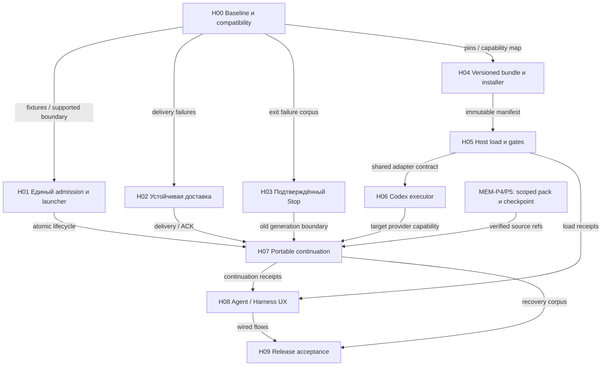

# Harness R0: порядок исправлений и пакеты работы

Статус: **предложенный план, native работа открыта**. Единый реестр — [backlog](../../evidence/backlog.md) и CO-168; H00…H09 — локальные task packets аудита, не новые M/CO. [Схема и контракты](../../architecture/harness-runtime.md), [доказательства E01…E16](evidence.md). Сначала исправляем целостность уже работающих путей, затем расширяем executor support.

## Приоритеты и связи

| Findings | Уровень и причина | Пакет |
|---|---|---|
| E07/E15: потеря, дубли и ложное written | P0: ошибочное действие в production caller; последствия могут выходить за PTY | H02 |
| E14/E16: незавершённый admission и compile-after-mint без cleanup | P0: ghost ownership, task остаётся в неверном состоянии; пока source finding | H01 |
| E06: stop без boundary/reason | P0 для замены исполнителя: риск двух writers; kill не receipt | H03 |
| E01/E09: нет Codex managed executor, live builds unverified | R0 blocker для обещанного cross-provider handoff; не считать проверенный descriptor live readiness | H00/H06/H07 |
| E02–05: skill delivery/load не реализованы целиком | P1 foundation: невоспроизводимый harness, unknown load, ambient влияние | H04/H05 |
| E03: installer ownership и contract pins | P1 перед использованием installer в onboarding; исправление в sibling owner | H04 |
| E08: native tools вне Fabric floor | P0 если обещана полная изоляция; для честно ограниченного режима — отдельный containment gate | H05/H09 |
| E09: устаревший switch тест | Исправлено в этом аудите: текущие pinned rows выбираются отдельно от history | H00 receipt |

Оценка усилий: H01 — средняя, H02/H03 — крупные из-за recovery и integration; H04–H07 — крупные и по provider. Это оценка сложности, не сроки. Не делаем native resume критической зависимостью portable handoff: это разные функции. Если R0 должен обещать обе, обе проходят свои gates.

H01/H02/H03 можно проектировать параллельно, но `index.ts`, `pty.ts`, journal schemas и projections изменяются в отдельных ветках с последовательным convergence review. H08 может начать с DTO fixtures, его native acceptance ждёт producers. H07 уточняет FR-E/M169/MEM-P5, не создаёт второй transfer engine. H09 включает обязательные R0 voice/CEO checks из других планов; этот harness audit не удаляет их.

## Общий контекст для исполнителя

Прочитать CONTEXT.md, system-contract.md, ADR-0035/0063/0067/0069, harness-runtime.md и evidence.md. Проверить текущие source/contract revisions: номера строк привязаны к audit baseline. Не копировать private config; использовать synthetic account/project data. Авторизация в trusted host, UI/LLM не raw DB writers. Journaling не содержит secrets, credential values, private provider reasoning; raw CLI text не становится policy. Нельзя строить второй journal или «временно» переключать реальные аккаунты для теста.

Каждый пакет отдаёт: commit-addressed source delta, изменённый контракт/DTO, prerequisites, negative fixtures, команды/exit codes, performed vs skipped, migration/rollback, UI effects, оставшиеся blockers. Перед утверждением PASS проверить сам probe: injected defect должен делать его красным. Уровни evidence: source / deterministic fixture / DB integration / exact CLI live / behavioral eval — раздельно.

## H00 · фиксированный baseline и compatibility inventory

**Owner:** QA + runtime/contracts. **Input:** E01–E16, текущий release pin и чистый synthetic test workspace. **Read:** agents.ts, providerCapabilityMatrix.ts, sessionBundle.ts, sibling adapter manifest/validator, contract README/specs. **Write:** test inventory и receipts; runtime capabilities не повышать без выполненного probe.

**Работа:** воспроизвести H02 на baseline, записать CLI build/OS/adapter/schema hashes. Сопоставить Fabric pin, adapter pin и contract HEAD по semantics; разработать compatibility fixture на выбранной immutable revision. Отдельно выписать required capabilities для terminal, managed executor, native resume и portable continuation. Проверить запуск without endpoint: compiler возвращает null, поэтому upstream managed admission обязан запретить тихое понижение до plain terminal.

**Приёмка:** повтор в fresh checkout даёт те же bounded results; недоступная DB/provider даёт NOT_RUN, а не PASS. **Output:** baseline corpus, supported matrix, failing cases, согласованный owner каждой public schema. **Запрет:** latest pin update без diff, auto-login/install. **Rollback:** нет production mutation. **Первый следующий шаг всей итерации — H00, затем H02 и H01.**

## H01 · единый admission / launch / compensation

**Owner:** execution host. **Depends:** H00. **Read/write:** main/index.ts startTask/start-existing paths, pty.ts, runLifecycle.ts, scopedStore.ts; соответствующие lifecycle probes/migrations. **Input:** trusted actor, Task revision, resolved provider/config. **Output:** admitted run + bound session либо durable отказ/compensation.

Свести create/startExisting/chain к общему launcher. После admission проверить каждый результат read-project, bundle compile, spawn, lease update и run bind. Обернуть compile-after-mint в cleanup boundary: отказ mkdir/write/verify после выдачи токена должен отозвать token и убрать только свои временные файлы. Bind failure запрещает instruction delivery; failed spawn освобождает только владение этого operation, отзывает token, оставляет трассу. Если неизвестно, запущен ли процесс, reconciliation проверяет его до retry, а не слепо создаёт второй.

**Приёмка:** failure injection до/после каждого await; DB отказ, потерянный ответ, crash после spawn до bind, exception после mint до spawn, повтор одной команды; максимум один admitted writer, нет orphan lease/credential, UI различает refused/failed/unknown. Реальная DB test stack обязательна для atomicity. **Migration/rollback:** additive operation id/revision, старые unknown sessions помечаются для reconciliation; downgrade не удаляет receipt и не переоткрывает lease.

## H02 · delivery outbox, actual write и ACK

**Owner:** journal/execution. **Depends:** H00; общий launch contract H01 согласовать до интеграции. **Read/write:** continuationDelivery.ts, pty.ts deliverWhenReady, deliveryState.ts, journal delivery projector/schema, index.ts callers, continuation-exactly-once.test.mjs. **Input:** decision id + exact TaskRun/Session generation. **Output:** durable delivery with queued/claimed/written/accepted/unknown/failed semantics.

Replace read-before-write с atomic claim/outbox и fencing generation. Проверять query errors. Очередь допускает несколько distinct delivery IDs, не затирает pending slot. Actual-write callback пишет receipt после успешного PTY write; acknowledge со стороны adapter с digest отдельно. Crash after write before receipt — unknown и reconciliation, не blind resend; если provider не умеет consumer dedup/lookup, exactly-once эффект не обещать, ручной recovery допустим. Повтор не создаёт повторное решение и не расширяет полномочия.

**Приёмка:** два конкурентных callers; два процесса-host; crash queued→write и write→receipt; journal отказ; stale generation; pending delivery во время stop; duplicate/late/wrong-digest ACK; distinct messages сохраняют порядок; DB failure не превращается в empty list. Baseline repro выше после исправления становится negative regression. **Migration:** прежние queued/written не повышать в accepted. **Rollback:** остановить admissions и reconcile outbox; не отправлять старые pending автоматически старым кодом.

## H03 · stop как durable операция

**Owner:** process supervisor. **Depends:** H00; согласовать cancellation с H01/H02. **Read/write:** pty.ts, runtime observer, index.ts terminalEnd/closeTaskForSession, lifecycle events/projections. **Input:** exact session/run/generation, reason, command id. **Output:** stop receipt с evidence boundary или unknown.

Сохранить intent до сигнала. Последовательность: halt new deliveries → signal → observed exit/descendant check → final capture checkpoint → revoke/cleanup → terminal outcome. Политика timeout/escalation provider/platform-specific. Повтор stop idempotent; natural exit и operator_stop не сливаются с app shutdown. Credential revoke немедленно закрывает mediated channel при отказе/unknown, но не доказывает native containment.

**Приёмка:** ignores graceful signal, child survives parent, exit race, double stop, host crash, deadline, permission-denied kill, внешнее действие in-flight. Новый writer не допускается при unknown в том же scope. Pending callbacks не пишут в dead/reused session. **Rollback:** UI продолжает показывать unresolved stop; нельзя откатить в running с разрешением нового запуска.

## H04 · reproducible bundle и ownership-safe delivery

**Owner:** Fabric compiler; installer fixes — fabric-agent-adapter owner. **Depends:** H00 compatibility. **Read/write Fabric:** AgentSpec, SessionBundle/compiler и manifest validation; executionPacket extend без сохранения credentials. **Sibling:** installer/scripts/tests только отдельной task-owned веткой. **Input:** explicit role/modules/versions + project grants + host descriptor. **Output:** resolved immutable manifest/materialization receipt.

Определить минимальный R0 skill set по ролям; не грузить весь локальный toolkit. Namespaces, dependency closure, required/optional, file digest и host support — детерминированные. Mutable latest ссылки запрещены. Controlled per-run location; не смешивать writable repo instructions с trusted policy. Ambient user setup либо исключается проверенным host mechanism, либо отражается как неизолированная зависимость с ограниченными гарантиями.

Installer: план diff перед mutation, ownership receipt с previous digest/owned keys, preserve foreign/local edits, symlink containment, interruption recovery, uninstall только owned unchanged content. Legacy shell не вызывать из onboarding. npm skip-existing не считать upgrade success.

**Приёмка:** одноимённые skills, unknown dependency, tampered digest, stale version, unsupported host, symlink escape, чужой файл, изменённый owned file, crash halfway, compile failure after token mint, rollback. Из secrets остаются opaque refs. **Migration:** импорт существующей конфигурации сначала read-only; явно принять managed scope. **Rollback:** предыдущий verified bundle digest, без удаления чужой конфигурации.

## H05 · load evidence и проверяемые gates

**Owner:** adapter/harness boundary. **Depends:** H04. **Input:** manifest, точный host build, required capabilities. **Output:** scoped readiness receipt и guard coverage, без выдуманного load ACK.

Развести installed/materialized/host registered/orientation requested/response served/task ACK. Probe на конкретной версии использует безопасную synthetic задачу и проверяет reachable tools/result. Required hooks: event/schema/matcher/timeout/output cap/process cleanup/failure policy; receipt принадлежит host, не ответу модели. Перечислить unmediated native effects. Unknown required prerequisite отказывает в managed admission; optional degradation виден.

**Приёмка:** absent hook, wrong event/schema, invalid JSON, timeout, unsupported flag, stale receipts после upgrade, compaction/reconnect, disabled tool, malicious source text. Planted boundary violation должна блокироваться trusted handler. **Rollback:** readiness invalidated, новые admissions запрещены, существующие sessions показаны с прежним verified revision и текущей неизвестностью.

## H06 · Codex как полноценный executor

**Owner:** Codex runtime adapter. **Depends:** H00/H05; H03 stop contract. **Read/write:** agents.ts, SessionBundle adapter switch, protocol surface/result delivery, capability probes. **Input:** same manifest as Claude, distinct provider implementation. **Output:** actual tool/result/ACK path на закреплённой сборке.

Не переиспользовать Claude flags. Проверить official/current host mechanism перед code change, pinned docs/revision приложить. Сначала isolated fixture → затем live canary с существующими credentials только в выделенном тестовом scope. Admission требует surface, context delivery, task ACK, result receipt и stop; наличие терминала недостаточно.

**Приёмка:** missing tool/config, malformed result, wrong task/session, stale build, revoked token, timeout и provider crash. Result claim не автоматически accepted. **Rollback:** descriptor снова unavailable for managed executor; свободный терминал остаётся отдельной возможностью. Нельзя скрывать failure переключением на другого provider без recorded choice.

## H07 · portable checkpoint и замена исполнителя

**Owner:** Continuity/MEM-P5. **Depends:** H01/H02/H03, H05 и H06 для Codex, MEM-P4 scoped pack. **Read/write:** shared continuation contract, switch coordinator/driver, contextPack/executionPacket, journal refs; existing FR-E/M169/MEM-P5 остаются владельцами capability. **Output:** новый run linked to prior work, восстановленный из доступных источников, с verified ACK.

Snapshot: Task/goal/accepted decisions, compact summary с source refs, последние детальные события, незавершённые вопросы, git commit/branch/worktree + dirty state, environment prerequisites, omitted/private sources. Сначала verify stopped old generation, потом new admission и context ACK. Native provider resume предлагается только отдельным verified capability; новый same-provider agent тоже получает новый Session. Revoked grants и secrets не наследуются.

**Приёмка:** Claude→Claude(new), Claude→Codex, Codex→Claude; provider unavailable; corrupt/missing packet; changed repo/branch/dirty files; stop unknown; missing recent tail; permission revoked; crash между admission и ACK; повтор операции. Проверить смысл восстановления по исходной задаче и решениям, не только digest. **Rollback:** сохранить оба receipts, новый run остановить/пометить unknown; старого автоматически не оживлять.

## H08 · management UX без ложной готовности

**Owner:** UX + read models. **Depends:** observed producers для roster/status/Stop и H05 для readiness; только Continue требует H07. Fixtures можно раньше. **Read/write:** scenarios → flows/screens → product model/renderers, Home/Project/Agent/Harness native view и shared DTOs. **Input:** scoped receipts/partial reads, exact route IDs. **Output:** доступные действия по текущим capabilities.

Основной экран: работа, статус, проект, быстрый переход. Детали: instructions/context/skills/versions и причины отказа. Settings владеет установкой/обновлением. Кнопка, текст и голос создают один command. Не показывать prompt «нажми подключить» после уже установленного bundle без конкретной причины. Installed≠loaded≠ready сохраняется в модели, но основной экран не превращается в таблицу всех technical states.

**Приёмка:** один/несколько проектов; пусто/partial/error/stale; agent unavailable; optional skill absent; stop unknown; продолжить тем же/новым/другим; direct deep link exact TaskRun; narrow view/keyboard; race ответа и клика. Нет lost draft, двусмысленного target, двойного submit. **Rollback:** скрыть unsupported action с объяснением, не удалять историю.

## H09 · выпускная проверка и handoff

**Owner:** independent QA/release. **Depends:** H01…H08; CW-N1…N4 и M175/M176/M194 для CEO; AD12/13 voice; MEM-P1/2/4/5/6; AD17 cycles и AD18–20 adoption. [Полная карта](../../launch/harness-r0/modules.md) перечисляет владельцев, которых H00…H09 не реализует. **Output:** receipts exact application SHA, CLI build, adapter/manifest/schema versions и runtime.

Слои: pure contracts → DB atomicity/crash recovery → Electron/PTY integration → isolated real CLI conformance → task trajectory eval → operator walkthrough. Corpus проверяет loaded skill usage, wrong tool/argument, source injection, refusal recovery, budget/step timeout, two conflicting writers, continuation fidelity, skipped required step. Transcript redacted до хранения; eval secret-free. Пройденный screenshot или fabricated model ACK не заменяет runtime proof.

**Приёмка:** все обязательные negative cases действительно выполнялись; skip/NOT_RUN остаются blockers; release scope совпадает с UI claims; метрики ошибок, lost/duplicate deliveries, stop latency/timeouts, load failures, operator interventions и unknown usage имеют denominator/coverage. Fresh checkout по entry point воспроизводит checks. **Rollback:** tested disable admissions/provider revision rollback с сохранением journal/checkpoint; no automatic replay of external effects.

## Что остаётся на отдельных полках

Broad agent marketplace, автоматическое переписывание skills, федерация и произвольные plugin UI остаются в существующих agent-composition/agent-production/backlog документах. Не копируем их реализации в этот пакет. Отдельный новый state store, произвольный «универсальный» адаптер и полная native изоляция по одному флагу не предлагаются. Перечень необходимых корректировок не является обещанием, что агент не сможет ошибиться в творческой работе: гарантия строится на проверяемых переходах и bounded authority.
