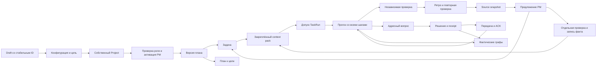

# Fabric · сверка документов, фич и интерактивных макетов

ssheleg skills — task-pipeline · super-ux · sheleg-design · copywriting · agent-sync · evidence-docs · maintaining-fabric-workspace

[Начать с матрицы](../../reports/completeness.html#status) · [Пройти продукт](../../reports/product.html#journeys) · [Карта этой итерации](../../reports/map.html#mockup-completeness).

Baseline этого прохода: `82bc95099a0d09326aa34c612f182b5742cac964`.
Проверяется целевой интерактивный дизайн. Исторический аудит runtime в product-model
по-прежнему закреплён на `91337391aa8d24966bf0c57db381e6fe63b48bce`.
Ни одна продуктовая M/S-задача не закрывается за наличие работающего макета.

## Что охвачено и как читать готовность

Модель содержит 61 записей экранов, 70 визуальных адресов,
80 сценариев, 49 потоков и 35 пользовательских путей
(176 шагов). 107 пакетов контекста включают все
57 действующих инженерных карточек. Числа получены из
[product-model.json](../../ux/product-model.json), а не из количества HTML-заголовков.

[Исходный инвентарь](2026-09-07-mockup-completeness/source-inventory.json) содержит
315 tracked baseline paths: 0 ошибок чтения, каждому назначена роль и глубина
просмотра. Актуальные нормативные и продуктовые документы прочитаны семантически;
исторические receipts и производные файлы классифицированы по каноническому
преемнику. Это не утверждение о дословном повторном прочтении каждого старого лога.
15 исторических изображений дополнительно открыты root; у каждого записан
`current_visual_comparison`. [Реестр](2026-09-07-mockup-completeness/source-requirements.json)
хранит 1123 исходные строки требований/деклараций. Они не являются 1123 разными фичами.

[Исходная сверка экранов](2026-09-07-mockup-completeness/screen-audit.json) выявила
80 конкретных экранных расхождений; источники дали ещё 25 требований.
[Матрица разрешения](2026-09-07-mockup-completeness/resolution-matrix.json) — место
финального статуса каждого пункта. Строка закрывается только по всей совокупности
условий; ссылка, заголовок и общий error-banner сами по себе не считаются приёмкой.
Итог:101 implemented-target,0 remaining,4 review-decision. Для73строк приложены
конкретные проверки; остальные прошли source-semantic review, без заявления о
проверке каждой комбинации состояний в браузере. Отдельные строки `review-decision`
сохраняют конкретный выбор для оператора.

## Что изменилось

- В оболочке постоянно виден CEO. Чат сохраняет отдельную историю и draft для
  Estate и Project, показывает контекст задачи и адрес назначения результата.
  Артефакт подтверждается явно. Знак PassionCode.ai и инициалы — варианты для
  review. Старый утверждённый портрет не найден: M131 исправлен на partial,
  выбор персонажа записан в CO-109, а не объявлен поставленным задним числом.
- Первый проект имеет несколько независимых черновиков, starter, исследование
  репозитория с принятием отдельных подсказок, обзор начальной конфигурации,
  отказ/unknown/reconciliation и стабильную identity создания. Этапы software
  сохраняются в actual fixture конфигурации. PM проходит собственный admission
  и binding перед активацией. У нового проекта нет чужих задач и прогонов.
- Доска и её previews читают общий набор вопросов, review/refusal, Proposal,
  брошенных сессий и незавершённых lease. Приоритет показывает компоненты,
  возраст — известное время либо unknown. Read watermark не разрешает обязательство.
  Отдельный resolver сохраняет квитанцию и историю. Повторная проверка снимает
  только свой прежний refusal; остальные блокеры остаются.
- Четыре графа отвечают на разные вопросы: план к цели, история проекта,
  история агента и решения. Выбор узла/ребра открывает источник. План редактируется
  с новыми версиями, проверкой циклов и явной сверкой изменившегося source.
  Run/Task/Agent/Project сохраняют identity; старые прогоны и пакеты не переписываются.
- Память показывает exact fact, происхождение, версии, retrieval records и
  supersession. Принятый Proposal создаёт actual task; перенос материала в память
  требует отдельной проверки. Sync показывает manifest/diff/coverage;
  restore удерживает новые эффекты до свежей authority.
- Agents/Providers/configuration/access/OAuth разделены. Gate привязан к digest
  и ревизии; callback имеет стабильную операцию и сравнение версии. One-shot grant
  имеет точный ресурс, reserve/dispatch/reconcile и остаётся тем же в модуле и Authority.
- Routine editor, расписание и обзор циклов используют один store. Каждый полный
  прогон хранит все шаги и свою версию. Есть catch-up, граница повторов, новые окна,
  independent sources, unknown, coalescing и сохранение inflight при pause.
  Достигнутая граница создаёт адресуемое предложение PM с observation snapshot.
- IDE хранит буферы по файлу; конфликт показывает обе версии. Session/service
  терминалы имеют отдельные identities, scrollback и resize; закрытие окна не
  приписывается остановке процесса. Внутренний браузер и media читают только fixtures.
  Support/release/content проходят producer → independent check → grant → delivery
  → наблюдаемый результат; выбор элемента не смешивает черновики.
- Home, Inbox и профиль различают настроенное и наблюдаемое. Частичный отказ одного
  источника не обнуляет соседние показатели. Settings/repository roster синхронизированы
  через successor revision, без возврата сохранённой формы к старому значению.

## Проверяемые связи между модулями

[Контракт макетов](../../ux/mockup-contract.md) задаёт state ownership и ограничения.
Для реализации агент читает SCN → FLW → SCR, engineering card, строку этой матрицы,
точный визуальный адрес и её проверку. Название кнопки не заменяет API-контракт.

## Находки, которые важно не повторить

Независимая проверка переходов нашла потери, которые не видны на одиночном экране:
новые proposals/tasks/decisions исчезали при записи в отфильтрованный массив;
сохранённая форма заслоняла новую revision репозиториев; отказ допуска блокировал
собственное устранение; новый проект терял startupSpec между registry и adapter;
старый D-08 ошибочно ссылался на другой ещё открытый вопрос. Эти причины исправлены
в контроллере, синхронизации records и фикстурах, с повторной проверкой путей.

Реальный runtime остаётся отдельной работой. Сохраняются исходные PF/PG, S07/P21,
публичная приёмка, внешние provider gates и предложенные ADR-0045–0047.
Текстовая анонимизация не обещает нулевой риск: макет исходящего feedback содержит
закрытый словарь, точные bytes, политику и отдельное включение. Endpoint, retention,
aggregation и персонаж CEO требуют предметного review.

## Приёмка и её пределы

[Проверки и команды](2026-09-07-mockup-completeness/checks.md) фиксируют завершённые
проверки. Основной browser receipt, независимые module/host seams и изображения
сохранены рядом. Полная матрица рендера проверяет наличие UI, semantic cases —
фактические переходы. Проверены обе темы, узкий и широкий viewport, no-JS fallback,
клавиатура, экспорт review и отсутствие неожиданной сети в названных тестах.
Контраст измерен выборочно; полного WCAG-аудита этот проход не объявляет.

Генерация `build-product-report.mjs` и `build-mockup-coverage.mjs --check` проверяет
соответствие canonical inputs и HTML. `check-design-map.mjs` контролирует source
stamp, а не качество решения. Новые snapshots не меняют исторические аудиты.
Публикация выполняется по существующему приватному workspace-протоколу; exact
source, child, digest и Heroku release фиксируются в `docs/workspace-receipt.json`.

## Вопросы для review

Правильно ли мы это запланировали, и правильно ли мы это делаем? Конкретно:
достаточно ли вам постоянного CEO рядом с рабочей областью, четырёх отдельных
графов и компактных previews; устраивает ли отдельная активация PM; выбираем ли
знак бренда/инициалы как временный аватар до разработки персонажа?

---

**Made with [ssheleg skills](https://github.com/ssheleg/sshlg-skills)**

- [`task-pipeline`](https://github.com/ssheleg/task-pipeline) — доставка и независимая проверка изменений
- [`super-ux`](https://github.com/ssheleg/super-ux) — сверка сценариев и переходов
- [`sheleg-design`](https://github.com/ssheleg/sheleg-design-skill) — сохранение Paperclip и визуальная проверка
- [`copywriting`](https://github.com/ssheleg/super-ux) — термины и состояния интерфейса
- [`agent-sync`](https://github.com/ssheleg/agent-sync) — lease и общие реестры
- [`evidence-docs`](https://github.com/ssheleg/task-pipeline) — источники и проверяемая матрица
- `maintaining-fabric-workspace` — обновление и публикация пространства — not a skill this family ships

A star on [the bundle](https://github.com/ssheleg/sshlg-skills) helps.
