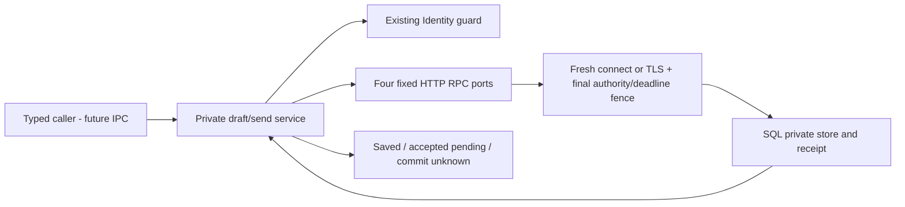

ssheleg skills — task-pipeline · agent-harness · evidence-docs · agent-sync

# Trusted native conversation host · CW-N1a

Status: implemented importable host, independently reviewed and locally tested.
**Not connected to Electron bootstrap, IPC, renderer or a CEO worker.**
[Core service](ceo-conversation-service.md) owns drafts and send recovery;
[private archive](ceo-private-archive.md) is a separate mandatory activation prerequisite.

## Source and ownership

Member [80e907a](https://github.com/passioncode-ai/fabric/commit/80e907a0f7a92bb110c73fe36c16ee7a01231f58)
adds [ceoConversationHost.ts](../../../apps/desktop/src/main/ceoConversationHost.ts)
and [actual HTTP fixtures](../../../apps/desktop/test/ceo-conversation-host.test.mjs).
Integration includes source193d9f57's trusted actor compatibility and a correction to
[ceoConversationService.ts](../../../apps/desktop/src/main/ceoConversationService.ts):
its operation fence rechecks the monotonic deadline after synchronous identity reads.
The source commit containing this report is the reproducible integrated baseline;
the member commit alone predates those prerequisites.

Create one main-process host with trusted root directory, Estate, existing Identity,
connection URL/service key, online observer and a bounded timeout. Renderer input
cannot set these dependencies, select an RPC or reconstruct identity. Host copies
connection values at creation. The existing Identity producer supplies the actor;
SQL remains responsible for transactional membership/revision checks.

## Transport and failure contract

| Boundary | Implemented behavior |
| --- | --- |
| API | Only open, send, read and receipt routes; no arbitrary RPC or URL method. |
| Secrets | Main-only static key sent to the configured backend; never returned in results or written with drafts. Fixed failures exclude private error/body text. |
| Connection | HTTPS uses Node certificate and hostname validation. HTTP requires explicit loopback opt-in and a loopback actual remote address. URL credentials/query/fragment refuse. |
| Write | No pooled socket. Fence runs after connect/secureConnect, before headers/body are flushed; no redirects, retry or automatic replay. |
| Bounds | Request128KiB, response4MiB, strict UTF-8/JSON/depth, bounded headers and operation timeout. Owned request/socket destroyed on settlement. |
| Authority | Existing Identity.guard cannot be aborted. Host retains at most one underlying pending guard until its real settlement; concurrent calls refuse instead of adding waiters. No cached successful authorization for a later operation. |
| Unknown | A lost response to send remains commit_unknown. Reconcile reads the exact operation receipt; it does not resend the message. |
| Local work | Offline draft and frozen input remain within the existing owner/Estate CAS namespace. No model call is implied by accepted_pending. |

The service's end-to-end deadline is authoritative even when the HTTP port has a
later transport deadline. Review reproduced a slow synchronous held-identity read
at socket connection consuming the remaining service budget: the original version
called request.end once despite returning timeout. The integrated post-read fence
passes the regression with **request.end count0**. Timers alone cannot interrupt a
synchronous read; the post-read check prevents its late side effect.

## Checks actually run

`node --experimental-strip-types apps/desktop/test/ceo-conversation-host.test.mjs`:
**11 actual owned localhost HTTP groups PASS**, by author, independent reviewer
and root integration. Includes all four paths/prepared body; real Identity producer;
revocation before write; slow write-edge deadline; one hanging raw guard across
multiple timeout waves; lost response and receipt reconciliation; malformed/oversize/
private errors; unsafe configuration; offline persistence. Owned servers/sockets and
private temporary files are removed. Fixtures use synthetic credentials and no model.

Root also reran22 actual filesystem service groups and19 lifecycle groups. Main/web
TypeScript and repository gates are recorded in [checks](checks.md#native-host-and-view-lifecycle--2026-09-27).
A separate independently reviewed [actual TLS packet](../../../apps/desktop/test/reports/ceo-conversation-host-tls.md)
is now integrated: five localhost TLS groups pass, including wrong chain/hostname,
revocation during handshake and no HTTP write after timeout. Database-through-HTTP,
Electron bootstrap, IPC, worker and product UI remain **NOT_RUN**. Existing service/SQL acceptance is separate;
it is not evidence that this HTTP host has reached a real database.

## Next bounded integration

1. Preserve the measured TLS/hostname checks; compose the host with an isolated real database HTTP boundary before production binding.
2. Add typed IPC command validators using the existing identity-wrapped registration.
   Keep one host per trusted owner, clear/fence it on authority change, never accept
   caller-supplied Estate/Person/key/URL. Register no dispatch until archive and worker
   prerequisites pass. A UI must distinguish saved history from running work.
3. Expose history and retained local intents so capacity errors have a recoverable
   operator path. Bind pending operations to their original conversation/context;
   changing screens cannot redirect an in-flight message.
4. Integrate CEO tool outcomes and voice through the existing canonical command,
   privacy and provenance boundaries. No fabricated assistant reply or success toast.

---
**Made with [ssheleg skills](https://github.com/ssheleg/sshlg-skills)**
