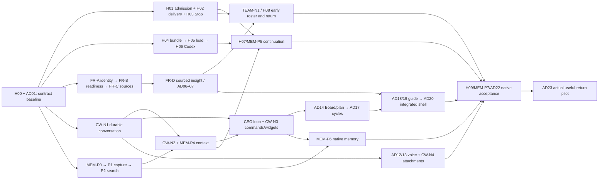

# Разработка: от зависимостей к принятому R0

Общий контекст — [modules](modules.md); вход/цель — [README](README.md). Существующие детальные владельцы остаются в [H00…H09](../../audit/2026-09-26-harness/plan.md), [AD](../adoption/README.md), [FR](../first-release-strategy.md), [CW](../chat-workspace.md), [MEM](../memory/plan.md). Ниже очередь интеграции, не второй реестр статусов.

## Dependency flow

Код против DTO fixtures можно разрабатывать раньше, но приёмка capability ждёт реальный producer. `index.ts`, schema/journal, UX model и отчёты — точки последовательной интеграции. Один исполнитель не меняет общий контракт без уведомления его consumers.

## Ближайшие bounded packets

### HAR-R0-01 · Bundle rollback (H01/H04, E16)

Вход: source baseline и существующий compiler. Exact writes: `apps/desktop/src/main/sessionBundle.ts`, `apps/desktop/test/session-bundle.test.mjs`. После successful mint любая fatal ошибка до возврата bundle должна попытаться revoke и удалить только session dir. Shared content-addressed packets сохраняются. Optional context degradation остаётся отдельным явно известным поведением; основной exception не маскируется cleanup error, secret-bearing error text не логируется. Проверки: mkdir до/после частичного создания, partial config write, corrupt verification, unsupported adapter, revoke/unlink failure, успешный discard. Receipt в checks; не закрывает весь H01.

### HAR-R0-02 · Durable delivery + PTY queue (H02, E07/E15)

Вход: task/current run/session/decision id, bound principal/Estate, deterministic delivery id/digest. Exact candidates: `continuationDelivery.ts`, новый scoped dispatch command/migration, `pty.ts`, выделенный queue module, focused tests; `index.ts` wiring только у integration owner.

1. Durable claim атомарно ограждает competing senders и фиксирует target/digest. Начало возможной записи — отдельный fenced boundary. Expired queued claim может быть восстановлен только если старая generation уже не может начать write.
2. Legacy queued не означает ни delivered, ни безопасный retry: старый runtime мог уже отправить bytes. Вернуть uncertainty, не создавать второй эффект.
3. Queue сохраняет несколько сообщений FIFO, имеет предел/timeout и Promise actual write. Stop/exit отменяет pending, async before-write callback перепроверяет session после возврата. No forced delivery в неготовый CLI.
4. Written receipt только после successful sync PTY write; exception может быть partial write → outcome_unknown, без blind resend. Actual agent accept с digest остаётся независимым.
5. DB read failure → отказ, не `[]`. Claim/finish failure проверяются, не теряются. Completion RPC и journal/projection согласованы транзакционно.

Проверки: два callers одновременно; crash до claim/после claim/перед write/после write до receipt; stale fencing; wrong Estate/session/digest; revoked membership; queue order/overflow; silent/spinning agent; Stop во время async gate; partial write exception; lost RPC response; ACK приходит раньше завершения writer. Pure fake, isolated SQL и native PTY receipts различаются. Migration additive, старый runtime не объявляется безопасным concurrent writer автоматически. Rollback: disable affected admissions, сохранить receipts, не replay uncertain.

### HAR-R0-03 · Единый lifecycle запуска (H01, E14)

После HAR-R0-02. Вынести importable coordinator из `index.ts`, существующие startTask/admitExisting направить в него. До spawn: admission → одноразовый begin → подготовка bundle → финальная проверка generation/lease/blockers/authority; после spawn: atomically bind current Run/lease/session и проверить verdict; потом delivery. Любая промежуточная ошибка либо компенсируется доказанно, либо сохраняет unresolved ownership и блокирует конкурирующий запуск. Нельзя считать lease update успешным, игнорируя error. Не убивать чужой или более новый session при запоздалой компенсации. Exact writes определяются после чтения current head: coordinator, runLifecycle, index wiring, DB command только если необходимо. Acceptance: каждый await падает по очереди; lost bind receipt/retry, exit-before-bind, collision, bundle failure, lease mismatch, grant revoke, no ghost writer. Tests обязаны импортировать настоящий coordinator.

### HAR-R0-04 · Наблюдаемая остановка (H03)

Детальный контракт и следующий native packet: [stop.md](stop.md). SQL/coordinator имеют локальные проверки; полный native путь ещё не принят. После запуска с generation identity. Durable intent до signal; halt queue; provider/platform boundary; await observed exit, descendants, final transcript; revoke token; receipt. Reason natural/operator_stop/app_shutdown различим. Deadline → unknown, не stopped. Новый writer запрещён в том же write scope, пока нет доказанной границы. UI status и exact task/run link читают receipt. Acceptance: SIGTERM ignored, child survives, double Stop, natural-exit race, stop error, crash/restart, stale command, timeout, external effect in flight. Signal-only fake не native proof. Продолжение H07 не принимается без этого пакета.

### HAR-R0-05 · Manifest, host evidence, provider adapters (H00/H04–06)

Конкретные подпакеты P05.1…P05.6 и native acceptance: [Provider lifecycle](providers.md). Проверить compatibility трёх репозиториев: Fabric / fabric-agent-contract / fabric-agent-adapter по semantic diff, не равенству SHA. Минимальный required skill set по роли; pinned manifest/dependency digest; owned installation/upgrade/rollback; scoped runtime materialization. Host registration/probe/ACK отдельно. Claude и Codex используют собственные поддерживаемые flags/protocol, проверенные на точной сборке. Unmediated tools не считаются sandboxed. Native canary в выделенном scope; unknown capability не зелёная. Sibling changes имеют отдельный owner/branch/receipt; parent pins меняются после review, не вследствие наличия чужой ветки.

## Остальные обязательные срезы — владельцы и готовый выход

| Срез | Перед стартом | Доставка / обязательные проверки |
|---|---|---|
| FR-A/B/C/D + AD02–07/24 | R01 и minimal provider readiness | CEO defaults → native folder picker → multi-source one Project → sourced insight; cancel/partial/duplicate/symlink/revoked source, restart draft, no typed-path/name prerequisites |
| CW-N1/2 + MEM-P4 | Canonical refs + sanitization boundary | Durable ticket/project/global conversation, context chips, bounded immutable pack; none/one/many/all, grant revoke, stale refs, autosaved draft/restart, clear scope vs target |
| CEO + CW-N3 + AD14 | Conversation, R01 command path, admitted manager | Свободный text intent/typed widgets сводятся к versioned commands; ambiguity/stale target/duplicate submit/budget/cancel/denial; задачи и решения действительно записаны |
| AD12/13 + CW-N4 | Durable message + source permission | Native record/edit/send/cancel + files/links; capture scope pinned, permission/device/offline/late response, transcript redaction before storage; выбрать STT по receipt, не animation |
| MEM-P1/2/6 | Capture contract / canonical refs | Bounded full-source search, inspector exact Run, source-to-chat; tail/chunk-boundary matches, RU/EN, index lag/error/empty, cross-scope denial, corrupt cursor, revoked source |
| H07 / MEM-P5 / FR-E | Observed Stop + exact packet + compatible target | Fresh same provider / fresh other provider отдельно от verified native resume; dirty branch, missing tail, secret omission, unavailable provider, crash-between-admission-and-ACK; semantic fidelity проверяется по исходным constraints |
| TEAM-N1 / H08 / AD08/20 | Observed Run/read models | Home/Project agents + precise status/clickthrough; unknown freshness, return snapshot boundary, no conflation live pause/Stop; Continue waits H07 only |
| AD17 / FR-F | Proven admission/result + Board | Basic bounded preset: saved paused→enable→due→result→review; offline/missed window/duplicate tick/pause vs active stop/budget exhaustion |
| AD18/19/20 | Real first value/return receipts | One contextual offer, skip/resume, migration per person/Estate; no modal tour prerequisite, click/visit never capability completion |

## Что получает каждый исполнитель

Task brief содержит objective, exact read/write paths, source SHA, dependent receipt refs и минимальный proof tier, inputs/outputs/errors, authority and idempotency rule, migration/rollback, negative corpus, exact commands, allowed effects и acceptance predicate. Нельзя оставлять исполнителю самому решать, что означает successful Stop или loaded skill. Перед edit проверяется актуальность head/contracts; при несовпадении — rebase/review, не силовое overwrite.

Рабочий цикл: fail regression → implementation → positive/negative checks → independent review → reconcile shared contracts → UX chain при изменении поведения → map/source gates → source commit/push → workspace publish/verify. На каждый claim сохраняется receipt; NOT_RUN остаётся NOT_RUN. Несколько последовательных уровней тестирования полезнее сотни тестов, повторяющих код.

## Release gate

H09 объединяет capability receipts **всех 23 модулей**, а не только H-пакетов. Обязательные пути: first launch, existing Project, CEO task/Board decision, actual voice, multiple simultaneous agents, Stop, fresh same/other-provider continuation, memory source retrieval, return after restart, basic cycle. Failure cases и no-permission пути входят в ту же матрицу. Exact app/CLI/adapter/schema digests фиксируются; skipped tests не PASS. Нужны review UI focus/accessibility и реальный operator pilot AD23. Документация/макет и чистый `fast` сами по себе этот gate не закрывают.

### HAR-R0-06 · Единая очистка вводимого контекста (R02/R12/R21)

[Точный ingress-контракт, поля и приёмка](ingress.md). Предпосылка идемпотентности и journal/answer/import adapters подключены к desktop; оригиналы обрабатываются до обрезки и chain outbox. Изолированная SQL-приёмка и очистка старых источников при компиляции проверены в [ingress](ingress.md#legacy-context-compilation-and-isolated-sql-acceptance). HTTP/MCP preparation проверена в owned transport fixture; историческая очистка хранилища и будущие CEO/voice команды остаются отдельными проверками.

Обязательный срез до native переноса памяти и CEO. Read-only review 2026-09-27 выявил обходы: `identity.guarded` проверяет membership, но передаёт payload неизменным; `answer_question` и `import_declared_snapshot` вообще идут напрямую в RPC. Существующий transcript sink писал многострочный PEM до получения footer, а ops cap отрезал footer до redaction. Receipts и точные границы — [checks](checks.md#privacy-ingress).

1. Sink repair: typed credential keys/headers, redact до cap, потоковый PEM state. Владельцы: `shared/redact.ts`, `shared/opsLog.ts`, `main/transcripts.ts`. Открытый sensitive block не попадает на диск даже до footer/при EOF/overflow. UUID, digest, enum и обычный текст сохраняются.
2. Command ingress: одна schema-aware policy до journal/RPC/index/dispatch digest; свободный текст очищается, секретные credential-bearing targets отклоняются, идентификаторы и receipt hashes не переписываются. Покрыть task, answer, note, routine, agent config и workspace import; будущие CEO/voice/attachments используют тот же вход.
3. Реальные outgoing RPC payloads и файлы проверяются синтетическими секретами. Exact canonical text совпадает между snapshot, digest и delivery. Отдельно false positives, partial chunks, cap, nested structured values. Нет обещания распознать произвольный неизвестный пароль без контекста.
4. Исторические данные не переписывать этой миграцией: отдельный контролируемый механизм обнаружения/очистки и инвалидирования индексов/экспортов. Наличие исправленного sink не доказывает чистоту старых данных.

## Capture recovery and native topology · 2026-09-27

[Recovery packet](recovery.md) closes the local spool → strict historical attribution → durable capture → nullable reader boundary in code, with SQL/reader receipts in [checks](checks.md#capture-recovery-and-provider-topology). It does not close native crash/return acceptance. Current runtime generations remain excluded from background recovery, including exited ones awaiting finalization.

[Native topology proposal](provider-topology-proposal.md) chooses a candidate to test, not an accepted provider profile: authenticated owned loopback backend with explicit TUI attachment. Initialize-only probe passes; TUI resume to exact thread, event attribution/fanout, admission against all writers, reconnect and Stop remain distinct required packets. Claude control coordinator is pure/composed evidence; no supervisor is silently promoted by these tests.

## Startup/build admission · 2026-09-27

[Release admission](release-admission.md) makes schema compatibility an executable prerequisite before domain bootstrap; the explicit range replaces the unproved rolling window (initially63–63, now65–65 after the restore-boundary integration). Toolchain checks prove a host/version profile, not signed-package reproducibility. Next acceptance is the packaged cold-start matrix and independent installation/package builds; native provider ownership and CEO/voice remain separate capability gates.

## Durable CEO conversation · next bounded implementation

[ADR-0075](../../adr/0075-private-ceo-content-and-opaque-journal-receipts.md) accepts
private per-Person/subject content with opaque shared journal receipts. The
[contract](ceo-conversations.md) separates storage/authorization, native drafts/IPC,
and UI/owner-portable recovery. Migration 64 is allocated to storage; pipeline
reservations moved on (now 68/69 after migration 67), without applying or renumbering historical migrations.
The runtime contract is now 67–67. Migration 66 (owner-private archive, first-slice plan
A1-2…A1-5) passed its full chain, every owned-cluster DB suite and the reader/scope inventories;
migration 67 (backend exit receipts, first-slice plan B3-1) adds two event types, redefines
managed Stop's observation and `fail_task_launch`, and qualifies schema 67 as a private-archive
source, passing the full chain with the managed Stop and archive suites. Schema 66 and older are
refused. No storage packet activates model dispatch. Owner backup/restore,
none/one/many/all context, typed outcomes and voice remain required R0 gates.

## Native view and send-service integration order

The [empty native-view receipt](provider-topology-proposal.md#native-empty-view-receipt--2026-09-27)
removes one compatibility uncertainty without promoting runtime readiness. Next:
separate exact execution owner from PTY view lifecycle, then join admission,
structured observations and actual Stop evidence. Reconnect must not grant a new
writer or erase unknown termination. Existing provider validators stay authoritative;
an empty view must not invent a native turn to pass them.

The Electron-free conversation service is integrated and checked against actual
schema65 SQL; the trusted HTTP host is separately checked against owned HTTP/TLS.
Next compose both through HTTP to SQL, then bounded IPC, UI entry, history/cleanup discovery and
[portable private recovery](ceo-conversations.md#portable-recovery--next-contract-review).
A draft-capacity screen must make old saved drafts/terminal cache discoverable;
unknown sends cannot be discarded to regain capacity. No activation based only
on successful fake-RPC tests or a green build. The service stages none/one context;
full R0 still requires many/all and the existing context compiler acceptance.

## Concrete host and archive boundary · 2026-09-27

[Conversation HTTP host](ceo-conversation-host.md) now binds the trusted Identity to
four fixed RPCs, with local HTTP acceptance. [Native view lifecycle](../../../apps/desktop/test/reports/native-view-lifecycle.md)
separates view state from execution and provides an owner-wide veto for uncertain
input. Neither is connected to production bootstrap. Actual TLS and a concrete macOS PTY view host are checked separately.
The host → HTTP → SQL composition is checked by `pnpm --dir apps/desktop test:ceo-host-sql`: the real
conversation host, an owned HTTP bridge and the real migration chain on an owned PostgreSQL. The bridge
is a test fixture, not PostgREST, authentication or production wiring. The owned backend registry
exists and is measured inside Electron main (E0). Still missing: typed IPC and the main-side binding
(first-slice plan C1–C4).

[ADR-0077](../../adr/0077-restored-history-does-not-grant-membership.md) adds A0:
restore must not grant membership, including a later replay. Additive migration65
is integrated with explicit65–65 admission. New legacy restore suppresses archived
owner assignment on initial restore and replay; old unmarked restores are not repaired
retroactively. The [destination-authority flow](restore-authority.md#native-compatibility-follow-up--2026-09-27)
has its owner-authorized wrapper in SQL since migration 66 (`restore_estate_verified`); active Estate
selection followed in A1-6. Unexecuted pipeline reservations sit at 70/71 and ADR-0087 under the
existing collision rule, after migrations 67–69 took their slots. [Private archive](ceo-private-archive.md)
commands follow A0; do not activate chat while owner-private recovery is unavailable.
No existing R0 scenario or postponed idea is removed by this ordering.

## After consolidation · 2026-09-27

All parallel member work is now on one line ([record](../../evidence/plans/2026-09-27-branch-consolidation.md)).
Nothing below is natively accepted; "in source" means local or isolated-SQL receipts
in [checks](checks.md), never provider or packaged-app proof.

### First slice: bundle → admission → delivery → ACK → observed Stop

| Step | In source, with receipts | Still required for acceptance |
|---|---|---|
| Bundle (HAR-R0-01, R06) | rollback after mint; context sanitation (HAR-R0-06) | skill/hook manifest, native load (H04/H05) |
| Admission and launch (HAR-R0-03, R08) | one coordinator, migration 61, isolated SQL | native launch matrix |
| Delivery and ACK (HAR-R0-02, R09) | durable dispatch (60), PTY FIFO with write receipts | native ACK by digest |
| Observed Stop (HAR-R0-04, R10) | migration 62, `managedStop`, native binding and UI locally | backend-exit receipt, provider quiescence |
| Provider (HAR-R0-05, R03) | exact lifecycle contract, Codex/Claude transports, view host and lifecycle, backend process registry | accepted provider profile and topology |

### Ordered next packets

The packet-level plan — files, failing tests first, negatives, checks and what stays NOT_RUN — is
[the first-slice plan](../../evidence/plans/2026-09-27-first-slice-plan.md#sequence). Its order,
decided with the operator on 2026-09-27: A1-1…A1-5 (owner-private archive, lands with schema
66–66) → E0 (registry and view host inside Electron 44's own Node 24.18.1) → C0–C4 (CEO chat
behind a closed gate, UX chain first) → A1-6 (native private export/import) → C5 (chat
activation) → B0–B4 (backend ownership, Codex on the loopback backend of
[ADR-0081](../../adr/0081-codex-execution-uses-an-owned-authenticated-loopback-backend.md),
Claude on owned stdio, backend exit receipt, native view) → N1 (first slice on real Codex and
Claude). One executor, packets in sequence. After N1: the second slice (own folder → sourced
overview → task through CEO → launch → Stop → fresh session with verified context → return
after app restart; FR-A…D, CW-N1/2, MEM-P1/2, H07), then the H09 release gate over all 23 modules.

A member packet commits on its own branch before it hands off. The wave that ended at
07:49 left three packets as untracked files, reachable from no branch until this
consolidation tagged them.
