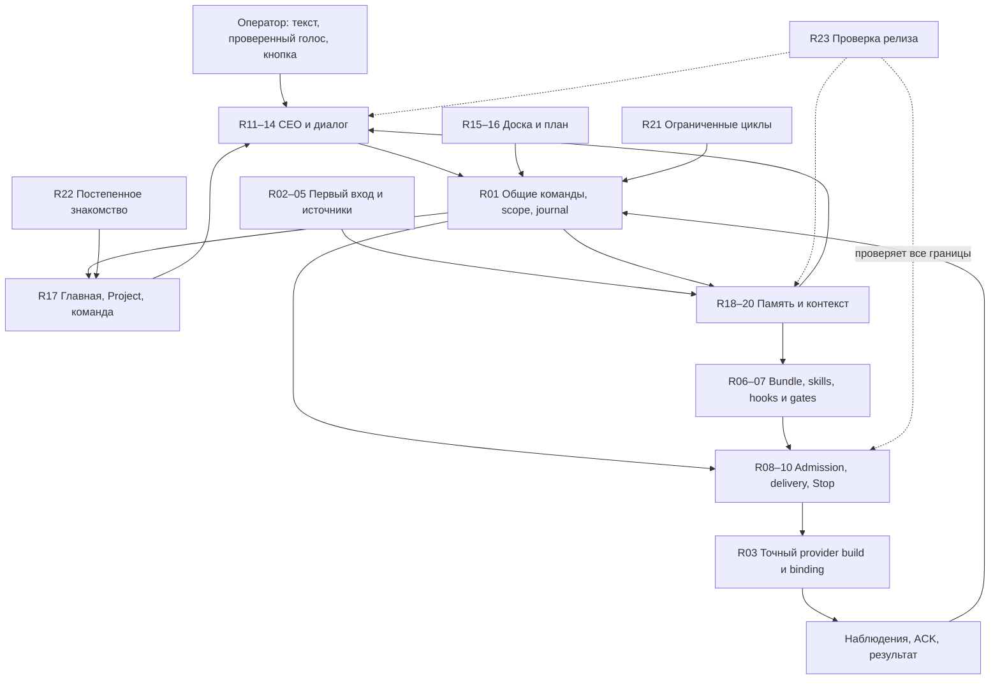

# Все модули первой версии

Это архитектурная декомпозиция R0, а не новый параллельный backlog. Номера R01…R23 обозначают границы модулей; владельцы работ — существующие FR/AD/CW/MEM/H и реестр M. Основание: [стратегия](../first-release-strategy.md), [agent-first contract](../agent-first-contract.md), [adoption contracts](../adoption/contracts.md), [chat workspace](../chat-workspace.md), [memory plan](../memory/plan.md), [harness evidence](../../audit/2026-09-26-harness/evidence.md). Статус `частично` означает наличие конкретного producer, не принятую функцию. Source receipts в последнем разделе.

## Слои и связи

## Каталог

| Модуль / результат для человека | Что владеет состоянием, что делает модуль | Исходный producer и граница | Работы / UX |
|---|---|---|---|
| R01 Identity, authority, journal | Principal/Estate/Project, revision и command identity; единая проверка полномочий и запись эффекта | `scope.ts`, `scopedStore.ts`, journal, grants — частично; новые commands используют тот же boundary | H00/H01/H05, AD01, M152; SCN-027/047 |
| R02 Fabric identity / entry | Настройки имени/образа и draft знакомства; defaults позволяют идти без обязательной персонализации | `onboardingDraft.ts`, `onboardingDrafts.ts`, `ProfileSection.tsx`; typed-name prerequisite ещё требуется убрать | FR-A, AD02/03; SCN-095, FLW-55 |
| R03 Provider readiness | Registry описывает build/capabilities; Account — авторизацию; Binding связывает роль с executor | `agents.ts`, matrix, `AgentSpec`; бинарник на PATH не доказывает loaded/admitted; Codex executor не готов | FR-B, AD15, H00/H04–06; SCN-061/095 |
| R04 Project sources | Один Project, несколько Source refs; первый primary, его можно сменить, связанные read-only по умолчанию | Native `repos.choose` уже поддерживает выбор директорий; missing source-set transaction/partial receipt | FR-C, AD04/05/24; SCN-033/095 |
| R05 Discovery / first value | Ограниченное чтение → sourced overview/checkpoint; неполнота явно описана | FileRoots/readers/repoState есть; цельный agent scan и первый insight требуют интеграции | FR-C/D, AD05/06; SCN-059/095 |
| R06 Bundle / skills | Manifest версии, digest, dependencies, required/optional; один immutable набор на Run | `sessionBundle.ts` сейчас MCP/preamble/context; полный skill/hook manifest и ownership-safe installation не готовы | H04, M177; SCN-047 |
| R07 Host load / gates | Materialized, registered, orientation, accepted — разные receipts; enforceable guards в trusted handlers | `fabric_whoami` — запрос ориентации, не доказательство исполнения всех правил; native bypass назван | H05, M177/M198; SCN-027/047 |
| R08 Admission / terminal supervisor | TaskRun generation, Session и lease; запуск только после admission, компенсация при сбое | `managedLaunch.ts`, migration61, `runLifecycle.ts`, `pty.ts`; общий путь проверен локально и на isolated SQL, native acceptance остаётся | H01, AD16, FR-E; SCN-025/029/045/052/067 |
| R09 Delivery / ACK | Durable operation ownership, очередь, фактический write, отдельный ACK по digest | `continuationDelivery.ts`, migrations60/61, PTY FIFO; исправления E07/E15 имеют [локальные receipts](checks.md), native ACK отдельно | H02, AD16; SCN-050/067 |
| R10 Stop / continuation | Stop intent/observed boundary; новый Run получает новый scoped bundle и lineage | migration62 + `managedStop.ts` + process observer имеют [bounded receipts](checks.md); [native binding/Stop UI](stop.md) реализованы и проверены локально; provider proof/restart ownership ещё открыты, перенос не принят | H03/H06/H07, MEM-P5, FR-E; SCN-096, FLW-56 |
| R11 CEO loop | Manager binding, bounded reasoning/tool cycle, budget/cancel; judgement превращается в команды R01 | `managerEval.ts` — evaluator, не runtime manager; профиль/activation и loop предстоит сделать | M175/176/194, FR-F, AD09/15, CW-N3; SCN-042/061 |
| R12 Conversation | Durable messages/drafts, ticket owner, none/one/many/all knowledge snapshot; destination отдельно | Provider registry не CEO-history; [ADR-0075 private-content contract](ceo-conversations.md) принят, storage64 проверено изолированно; IPC/UI/backup ещё не приняты; макет не runtime | CW-N1/N2, AD09–11; SCN-042 |
| R13 Widgets / common command | Версионированное proposal, кнопка/текст/голос сходятся в одну операцию; receipt возвращается в чат | Task/question/proposal handlers существуют; production NLU и widget binding не принимаются по fixture parser | CW-N3, FR-F, AD09/14; SCN-041/042 |
| R14 Voice / attachments | Record→stop→edit→send/cancel; закреплённый capture scope; source refs вместо неограниченной передачи | Native STT port ещё выбрать/принять; файл/микрофон требуют real permission/error checks | AD12/13, CW-N4, FR-F/G; SCN-042 |
| R15 Board / review | Ticket-owned разбор, решение, defer/resurface, проверка результата; чтение не закрывает obligation | board/attention/question/proposal producers частично; durable CEO discussion отсутствует | AD14, FR-F, M149/151/157/158/168; SCN-041/050/055 |
| R16 Plans / goals | Goal/Task/link projections; простой граф и эквивалентный список; proposed ≠ occurred | `plan.ts`, `planProgress.ts`, `PlanSection.tsx`; CEO planning интегрировать в R13 | FR-F, CW-N3, M144/188–190; SCN-046/052/053/069 |
| R17 Team / live / return | Scoped Agent/Task/current Run, observed freshness, shown-snapshot cursor per person/Estate | EstateHome/Agents/Feed/digest частично; precise run links и unified roster требуют binding | TEAM-N1/VIS-N1, AD07/08/20, H08; SCN-043/044/049/090–094 |
| R18 Capture / search | Санитизированные source chunks, coverage, bounded lexical search и адресное чтение | transcripts/spool, agentSurface/searchRead; полный безопасный capture/index ещё MEM-P1/2 | MEM-P0/P1/P2, M177/182/191; SCN-039/057 |
| R19 Context compiler | Immutable past packet; next pack = разрешённые facts/decisions/tail + omissions + repo state | `contextPack.ts`, `executionPacket.ts`, `sessionBundle.ts`; structured chat зависит R12 | MEM-P4, CW-N2; SCN-057/096 |
| R20 Memory workspace | Search→точный source/run→выбранная ссылка в существующий CEO-chat | `MemoryOverviewSection` счётчики; r0-memory пока prototype, native reader/inspector не приняты | MEM-P6, CW-N1/N3; SCN-057, FLW-31 |
| R21 Basic cycle | Versioned bounded preset/window; saved-paused отдельно от enabled; missed-window policy | routineTick/routine/cyclePort частично; activation/result/Board integration требуется | AD17, FR-F, M178–181/186; SCN-056/075 |
| R22 Guide / useful return | Per-person progress только по receipts; skip/resume; одна уместная подсказка | Draft persistence есть; guide target prototype | AD18/19/20, FR-F/G; SCN-059/060/095 |
| R23 Release / operation | Exact app/CLI/schema/manifest identity, failed/unknown/NOT_RUN не зелёные | [Schema/build admission](release-admission.md) проверяет явный контракт до доменных сервисов; измеренный toolchain profile и fast gates есть. Packaged/native conformance, voice и pilot остаются открыты | H09, MEM-P7, AD22/23, FR-G; все обязательные пути |

## Единые контракты между модулями

Это требования к реализации, не утверждение, что перечисленные поля уже существуют в каждом DTO.

- **Authority envelope:** установленный сервером principal, Estate, Project, exact entity/run/generation, expected revision, command id. Контекст из чата не расширяет полномочия. Связанный источник не становится write destination.
- **Execution envelope:** Task revision, accepted goal/decision refs, provider/build, account reference без секрета, manifest digest, branch/commit/worktree/dirty state, bounded context refs/omissions, policy revision. Credentials создаются после проверок и живут только в controlled ephemeral scope.
- **Event envelope:** canonical event id/seq, cause/correlation/command id, actor, subject, scope, occurred/observed timestamps, evidence boundary. Дубли доставки не создают дубли решения. Restart/retry сохраняют identity.
- **Memory envelope:** source/range/digest, owner/scope, capture coverage, sanitized content, retention, grant checks при retrieval и перед bundle. Summary — производная с source refs, не доказанный факт и не новая Decision.
- **Operation result:** pending/refused/committed/failed-before-effect/outcome-unknown; у доставки written-unconfirmed отдельно от accepted. Read unavailable не заменяется пустым результатом.
- **Read model:** revision/boundary, observedAt, coverage/missing sources, exact routes, eligible actions+reason. UI не догадывается о capability по цвету или названию provider.

Запись разговора проходит sanitization **до** journal/index/ops/export. Секреты, credential-bearing config, authorization headers не являются «контекстом для истории». Raw audio retention — отдельная явная политика; остановка записи не равна отправке текста. Ссылка на удалённый или закрытый источник перепроверяется, включая derivatives.

## Не потерять границы R0

Релиз сохраняет простой план/связи и полный доступ к деталям. Произвольный DAG editor, federation, marketplace, broad human administration, автоматическое улучшение skills и AI-generated avatar не становятся новыми блокерами этого среза: их существующие идеи остаются в исходных планах. Лексический поиск не ждёт необязательных model summaries MEM-P3. Работающий список агентов не ждёт завершения portable continuation; только само действие Continue зависит от R10/R19.

FLW-24 исторически перегружен: исходный harness setup — R06/R07, позднее уточнение CEO communication — R11–14. Для текущего R0 чата основной экран **SCR-44**; SCR-41 — доска, открывающая тот же чат с ticket context. Исторические IDs/anchors сохраняются; packet обязан указывать сценарий и конкретный surface, не один неоднозначный flow ID. Память — **r0-memory / SCN-057 / FLW-31**, включена в список R0 views.

## Проверяемые исходные наблюдения

На базе `eda2e5d` (immutable [tree](https://github.com/passioncode-ai/fabric/tree/eda2e5d071cfb891719e81cf6ba448327f6a7643)):

- Native picker: [index.ts baseline](https://github.com/passioncode-ai/fabric/blob/eda2e5d071cfb891719e81cf6ba448327f6a7643/apps/desktop/src/main/index.ts#L3509) — multi-directory OS dialog; `Onboarding.tsx:58,203` — обязательное typed name. Это существующая реализация, которую надо соединить правильно, а не писать второй picker.
- `apps/desktop/src/renderer/src/AttentionPanel.tsx:8,294` — no conversation/noModel; [managerEval.ts baseline](https://github.com/passioncode-ai/fabric/blob/eda2e5d071cfb891719e81cf6ba448327f6a7643/apps/desktop/src/shared/managerEval.ts#L1) — evaluator без runtime profile/activation. Наличие eval не доказывает CEO.
- [continuationDelivery.ts baseline](https://github.com/passioncode-ai/fabric/blob/eda2e5d071cfb891719e81cf6ba448327f6a7643/apps/desktop/src/main/continuationDelivery.ts#L144) — любой delivery receipt считался alreadyDelivered; [pty.ts baseline](https://github.com/passioncode-ai/fabric/blob/eda2e5d071cfb891719e81cf6ba448327f6a7643/apps/desktop/src/main/pty.ts#L241) — один pending slot и void. Повторяемые E07/E15 находятся в исходном аудите; текущие исправления измеряются отдельно в checks.
- `docs/launch/adoption/contracts.md:124` и AD24 содержали single-candidate ограничение, несовместимое с ADR-0065. Исправление уточняет selected Source set **одного Project**, не batch Project creation.
- [product-model.json baseline](https://github.com/passioncode-ai/fabric/blob/eda2e5d071cfb891719e81cf6ba448327f6a7643/docs/ux/product-model.json#L39039) имел first_release views без уже существующего r0-memory. Исправляется список, а не статус native acceptance.

Пути и строки относятся к зафиксированной базе; после изменения проверять соответствующий symbol/diff. Число модулей — 23 строки каталога R01…R23, не число уже готовых функций.
