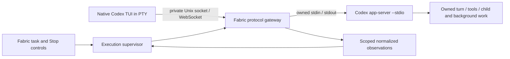

ssheleg skills — evidence-docs · task-pipeline

# Proposed provider topology: native Codex terminal with owned execution

Status: **proposal; its loopback WebSocket candidate was accepted on 2026-09-27 as [ADR-0081](../../adr/0081-codex-execution-uses-an-owned-authenticated-loopback-backend.md)** — still not a native readiness receipt. The text below is the research as written. Research date: 2026-09-27. Scope: preserve the operator's native agent terminal while giving Fabric an exact execution owner, structured observations and a real Stop boundary. This packet changes no production code, launch profile, shared registry, account or machine configuration.

## Candidates for review

First compare **one Fabric-owned, authenticated loopback WebSocket backend per managed scope** with **an owned stdio backend behind a Fabric protocol gateway**. The built-in WebSocket path is the smaller conformance candidate: the vendor already supplies its framing, authentication and native TUI client. A Fabric gateway adds substantial protocol authority and should be selected only if direct multi-client scope, admission and Stop requirements cannot be met—not merely to avoid the vendor's Unix socket directory.

Neither topology is accepted. The later initialize-only loopback probe below observes a limited connection boundary, not working managed execution. Do not launch either from the current UI until its acceptance packet passes. Keep the current native terminal available with its honest capability status; do not silently replace it with a Fabric-rendered transcript or call it fully managed. The diagram shows the larger gateway alternative, not a committed architecture.

The runtime profile describes the **backend**. The gateway alternative really retains owned stdio; a direct WebSocket backend requires its own measured profile and contract amendment. In both cases the PTY is a separately owned view client. Do not relabel a shared daemon or socket backend as `owned-stdio` to bypass current validators.

## What was measured here

The executable `/opt/homebrew/bin/codex` returned `codex-cli 0.157.1`. Its SHA-256, obtained with `shasum -a 256 /opt/homebrew/bin/codex`, was `27ceb5f9b957b43a519efe4eaa3816a0bffb0a531a2c89af18840c0a3c016a7d`.

All four help/version subprocesses exited 0, using a new temporary `CODEX_HOME`, temporary working directory, a restricted child environment, and the macOS sandbox pattern from the existing [isolated initialize probe at 3d680056](https://github.com/passioncode-ai/fabric/blob/3d68005681da77d5d8aee6372f6aeb8be0a8a07e/apps/desktop/test/codex-initialize-native.test.mjs). The policy denied network access, writes outside the probe directory, reads of the operator's `.codex`, `.claude`, `.agents`, `.config` and keychain directories, and securityd lookup. Provider stderr was counted, not persisted. The temporary profile was removed.

| Command under that boundary | Relevant observation |
|---|---|
| `codex --version` | Version string above. |
| `codex --help` | Interactive `--remote` accepts explicit Unix and WebSocket endpoints; `--no-daemon` is available. |
| `codex app-server --help` | `--listen` accepts stdio, Unix socket, WebSocket and off; `--stdio` selects stdio. |
| `codex resume --help` | Explicit session ID and `--remote` are accepted together; latest/picker modes are separate choices. |

No session was listed, resumed, forked or created. No TUI attachment, listener, account operation, thread/turn request, inference, provider stop or background-writer census was performed in this packet. The earlier initialize probe is referenced as a separate receipt, not claimed as rerun here.

The installed version and binary digest are measurements. The relationship between that binary and the public release tag below is **an inference from the matching version**, not reproducible-build attestation or a verified embedded source revision.

## Pinned primary-source findings

Fetched official `openai/codex` source for annotated tag `rust-v0.157.1`; tag object `ac0e23e5232692b95268583c8278c50b8c436d2b` resolves to commit **`36650394c5b38c2990ccf2a3457165ca3e9d9726`**. The cited sources are fixed to that commit, retrieved 2026-09-27. Source inspection is distinct from executing those paths in the installed binary.

1. **The explicit Unix listener uses the protected rendezvous machinery too.** `AppServerTransport::UnixSocket` calls `start_control_socket_acceptor` in [app-server `lib.rs:782`](https://github.com/openai/codex/blob/36650394c5b38c2990ccf2a3457165ca3e9d9726/codex-rs/app-server/src/lib.rs#L782). This is not limited to the automatic daemon command. [The acceptor](https://github.com/openai/codex/blob/36650394c5b38c2990ccf2a3457165ca3e9d9726/codex-rs/app-server-transport/src/transport/unix_socket.rs#L44) calls `prepare_shared_daemon_socket_directory` and `protected_socket_path`, creates a physical socket and startup lock there, then publishes a symlink at the requested path. The socket is mode 0600; the protected directory is 0700.
2. **`CODEX_HOME` and `TMPDIR` cannot relocate that physical socket.** [`shared_daemon_socket_directory`](https://github.com/openai/codex/blob/36650394c5b38c2990ccf2a3457165ca3e9d9726/codex-rs/uds/src/daemon_directory.rs#L13) canonicalizes `/tmp` and appends `codex-daemon-<uid>`. On macOS that is `/private/tmp`. The module explicitly makes this location independent of home/profile/temp environment overrides. A unique `--listen unix://<temporary-path>` is therefore not a wholly temporary listener. No attempt was made to mutate, inspect sessions through, or relax the sandbox around the operator's reserved socket directory.
3. **The transport is WebSocket over Unix, not newline JSON over Unix.** The [acceptor upgrades the connection](https://github.com/openai/codex/blob/36650394c5b38c2990ccf2a3457165ca3e9d9726/codex-rs/app-server-transport/src/transport/unix_socket.rs#L170). The [TUI client endpoint function](https://github.com/openai/codex/blob/36650394c5b38c2990ccf2a3457165ca3e9d9726/codex-rs/app-server-client/src/remote.rs#L786) opens the exact supplied Unix path and performs a WebSocket handshake for `/rpc`.
4. **An explicit TUI socket need not be a vendor-created rendezvous alias.** That client function directly connects the supplied path. [`resolve_remote_addr`](https://github.com/openai/codex/blob/36650394c5b38c2990ccf2a3457165ca3e9d9726/codex-rs/tui/src/lib.rs#L442) only selects the default Codex socket when `unix://` has no path; an explicit path is resolved separately. This supports the proposed private Fabric endpoint without changing the vendor executable. It does not prove full gateway compatibility.
5. **Exact resume and remote targeting have source support.** [CLI argument tests](https://github.com/openai/codex/blob/36650394c5b38c2990ccf2a3457165ca3e9d9726/codex-rs/cli/src/main.rs#L4344) cover `resume --remote`. [TUI exact-session handling](https://github.com/openai/codex/blob/36650394c5b38c2990ccf2a3457165ca3e9d9726/codex-rs/tui/src/lib.rs#L1543) resolves the supplied ID and exits if missing; latest selection is a different branch. Proposed launch syntax is `codex resume <exact-thread-uuid> --remote unix://<fabric-view-socket>` with no implicit prompt, latest selector or fork. It remains to be measured against a deliberately created test thread.
6. **Closing a view is not a process-stop receipt.** The [remote-client shutdown branch](https://github.com/openai/codex/blob/36650394c5b38c2990ccf2a3457165ca3e9d9726/codex-rs/app-server-client/src/remote.rs#L347) closes its WebSocket and exits the local worker. It is not a backend process termination acknowledgement. This establishes why view exit cannot be used as backend exit evidence; behavior of an active turn after TUI disconnect was not measured here.
7. **Implicit daemon reuse is a different topology.** [`app_server_target_for_launch`](https://github.com/openai/codex/blob/36650394c5b38c2990ccf2a3457165ca3e9d9726/codex-rs/tui/src/lib.rs#L1011) distinguishes explicit remote, implicit local daemon and embedded execution. A bare `codex` PTY is insufficient evidence that Fabric owns the execution server.
8. **Built-in loopback authentication has source support.** [`authorize_upgrade`](https://github.com/openai/codex/blob/36650394c5b38c2990ccf2a3457165ca3e9d9726/codex-rs/app-server-transport/src/transport/auth.rs#L273) checks the configured capability-token digest on upgrades, with no loopback exception. Loopback permits an absent policy by default, so Fabric must explicitly configure one. [`start_websocket_acceptor`](https://github.com/openai/codex/blob/36650394c5b38c2990ccf2a3457165ca3e9d9726/codex-rs/app-server-transport/src/transport/websocket.rs#L130) binds the requested address and reports the resulting local address. [`connect_websocket_endpoint`](https://github.com/openai/codex/blob/36650394c5b38c2990ccf2a3457165ca3e9d9726/codex-rs/app-server-client/src/remote.rs#L723) permits a bearer token for loopback `ws://` and supplies the Authorization header. `--remote-auth-token-env` was also observed in installed help. Authentication rejection, an ephemeral-port launch and TUI attachment were not executed here.

Candidate commands for a separately isolated probe are `codex app-server --listen ws://127.0.0.1:0 --ws-auth capability-token --ws-token-file <private-file>` and `codex resume <exact-thread-uuid> --remote ws://127.0.0.1:<observed-port> --remote-auth-token-env FABRIC_VIEW_TOKEN`. Port zero is a source-supported OS-assigned-port candidate, not a measured installed-CLI result. Resolve the actual port from an owned-process startup receipt; do not find a free port, close it, then race to rebind. The current source prints the address in a startup banner, so a version-pinned, bounded parser must discard all other stderr and fail closed on ambiguity. Token material must never enter journal, process arguments, transcripts or shared profile configuration. Whether server-side tools can inherit/read the view token and whether it grants more than the declared scope are explicit acceptance checks.

The backend auth flags are defined and validated in [transport `auth.rs`](https://github.com/openai/codex/blob/36650394c5b38c2990ccf2a3457165ca3e9d9726/codex-rs/app-server-transport/src/transport/auth.rs#L29); capability-token mode requires exactly one token-file or token-digest source. The TUI reads the environment variable **named by the flag** in [`read_remote_auth_token_from_env_var`](https://github.com/openai/codex/blob/36650394c5b38c2990ccf2a3457165ca3e9d9726/codex-rs/cli/src/main.rs#L2357), and [`resolve_remote_endpoint`](https://github.com/openai/codex/blob/36650394c5b38c2990ccf2a3457165ca3e9d9726/codex-rs/cli/src/main.rs#L2506) attaches it to the WebSocket endpoint. `FABRIC_VIEW_TOKEN` above is a proposed private child-variable name, not a vendor-defined fixed variable. Do not load it into the agent backend's tool environment.

## Present Fabric gap

At Fabric source [1330f816](https://github.com/passioncode-ai/fabric/tree/1330f8166261177495857ee81fab9a3952468ba7), [`PtyManager.open`](https://github.com/passioncode-ai/fabric/blob/1330f8166261177495857ee81fab9a3952468ba7/apps/desktop/src/main/pty.ts#L285) directly starts the descriptor program in a PTY. The [Codex descriptor](https://github.com/passioncode-ai/fabric/blob/1330f8166261177495857ee81fab9a3952468ba7/apps/desktop/src/shared/agents.ts#L142) explicitly reports no verified Fabric surface/result channel. Neither statement is changed by adding pure protocol modules.

The delivered [`codexProviderControl` at eb2e6503](https://github.com/passioncode-ai/fabric/blob/eb2e6503db8b7531866b0842eeb0e2197f289fb5/apps/desktop/src/main/codexProviderControl.ts#L53) accepts only the exact owned-stdio profile. Its ownership registry, cursor fences and request ACK semantics remain useful for an owned backend. [`nativeStopRuntime` at 1330f816](https://github.com/passioncode-ai/fabric/blob/1330f8166261177495857ee81fab9a3952468ba7/apps/desktop/src/main/nativeStopRuntime.ts#L137) requires separate provider evidence. Native-terminal attachment is not wired by those modules.

The current [provider contract](../../../apps/desktop/src/shared/providerExecution.ts) binds estate/task/run/Fabric session, native connection/thread/turn, build, manifest and policy. It has no separate native-view lifecycle. The [Claude packet at 1330f816](https://github.com/passioncode-ai/fabric/blob/1330f8166261177495857ee81fab9a3952468ba7/docs/launch/harness-r0/claude-provider.md) also warns that attachment/daemon modes are separate profiles; Codex findings do not establish an equivalent Claude attachment channel.

## Alternatives and scope

| Topology | Native TUI | Ownership and release implication |
|---|---|---|
| Existing bare Codex PTY | Preserved today | Keep existing honest status. PTY exit alone cannot prove daemon/background termination. |
| Owned stdio backend + Fabric-rendered chat | No native Codex UI | Simpler control path but does not satisfy the requested native-terminal experience. It must not become an unannounced substitute. |
| Direct owned Codex Unix listener + native TUI and Fabric clients | Supported in source | Uses the fixed protected physical socket directory even with explicit path; adds multi-client admission, observer completeness and server ownership obligations. Not tested here. |
| **Owned authenticated loopback WebSocket backend + native TUI and Fabric clients** | **Candidate preserves native UI** | Smaller first conformance candidate using built-in framing/auth. Needs measured listener discovery, token rejection, multi-client isolation and closure policy. Loopback alone is not authorization. Initialize-only receipt below. |
| Owned stdio backend + private Fabric gateway + native TUI | Candidate preserves native UI | Centralizes scope/Stop admission, but adds a protocol authority, approval routing, multiplexing and compatibility burden. Conditional alternative if direct clients cannot satisfy the required boundaries. |

## Required supervisor contracts and conditional gateway work

For the direct authenticated WebSocket candidate, first establish whether one isolated backend scope can account for every thread, turn, child and background writer created by its native UI. A successful bearer handshake is not a thread-scoped authorization grant. `/new`, fork, resume and policy changes must not create untracked work or bypass Fabric's admission policy. If vendor capabilities cannot enforce or expose the required boundary, stop that candidate and evaluate the gateway. The following gateway-specific clauses describe that alternative's cost; they are not evidence that it is already necessary or implemented.

1. **Execution identity versus view identity.** Persist one owned backend handle with binary/build receipt, PID plus creation identity, host boot identity, backend connection epoch, exact thread/turn and Fabric task/run/session. Persist PTY/view identity separately. A view may detach/reconnect; it cannot silently create another Run. Do not reinterpret a view's `terminal.closed` as backend exit. If current Stop SQL only accepts terminal receipts, add an explicit execution-process receipt contract and migration before wiring this topology; do not forge the old event's meaning.
2. **One backend owner.** Start the backend after existing durable admission/begin/final-authority checks. Its stdio belongs only to the supervisor/gateway. No automatic shared-daemon discovery, `--last`, cross-profile fallback, silent restart or reuse of a lost connection's cursor. Auth/config acquisition remains an explicit product prerequisite, not copying the operator's private profile into test fixtures.
3. **Native presentation, enforced protocol.** Create a private Fabric socket and parent directory, validate owner/mode/path identity, use bounded WebSocket frames and rate/connection limits, and bind a view to its exact execution grant. Filesystem mode is not proof against hostile same-user processes; peer/process association or a measured additional boundary is needed before making that claim. Never publish the socket path as a reusable execution credential.
4. **Client multiplexing with identity preservation.** The backend receives one initialization. The gateway owns request-ID namespaces, pending deadlines, response routing, notification order and reconnect epochs for the Fabric controller and TUI. Bound all maps; never silently truncate outstanding requests. Advertise only capabilities the gateway implements. The existing JSONL transport's automatic denial of provider requests is not enough to support a native approval UI unchanged.
5. **Effect allowlist.** Inventory the native TUI's actual startup/read/control methods in fixtures before opening the gateway. Thread start/fork/resume/turn start/steer, queued input, configuration mutations, shell/process actions and approvals require exact current authority. Unknown methods fail closed. A TUI `/new`, `/fork` or policy change must become a Fabric-managed action or receive a clear refusal; otherwise the native UI would bypass Run admission. Do not hide uncontrolled sibling threads behind a supposedly single-run backend.
6. **Approval routing.** Send a provider permission request to one authorized UI owner. The response must match backend request identity, execution generation and current policy. Fabric's denial wins after Stop/revocation; a late TUI approval cannot authorize an old request. Declining an unsupported request is safer than fabricating compatibility, but the native flow must display the refusal usefully.
7. **Stop sequencing.** Close view input and every mutating gateway path first; persist canonical Stop; issue exact `turn/interrupt` and known-owned cleanup while backend control remains alive; observe real terminal/writer evidence; then finalize/revoke and, where necessary, terminate the owned backend process tree. Keep requested Stop, protocol ACK, root exit, descendant exit, provider quiescence and durable transcript completion separate. A detached TUI is neither stopped nor failed. Preserve scoped Force as a subsequent operator action, not an automatic kill escalation.
8. **Resume and context.** Observe exact thread restoration, current manifest/policy receipt and branch/worktree binding before granting input. A UI view reconnect is not a new provider epoch grant or a fresh task. A backend crash produces uncertainty; do not replay a submitted turn or restart it because the view reconnects. Same-provider exact resume and cross-provider context transfer remain separate workflows.

## Ordered implementation packets and acceptance

These are proposed work units, not completion claims. Root integration owns the architecture decision, UX propagation, registers and final gates.

| Packet | Deliverable and boundary | Required acceptance before the next packet |
|---|---|---|
| T1 · role/identity model | Separate execution root, structured connection and PTY view; specify durable open/close/Stop receipts and migration compatibility. No provider call. | View exit cannot end Run; stale view cannot signal a newer backend; Stop awaits backend/provider evidence; existing PTY path unchanged. |
| T2 · bounded transport comparison | First probe an authenticated loopback listener under a policy allowing only the owned local socket traffic; verify no-token/wrong-token rejection and own-process port discovery. Inspect direct-client admission and notification coverage. If insufficient, specify a synthetic private gateway and its extra authority. | No global daemon/profile access; no thread/turn/model operation; explicit chosen topology and unresolved authority gaps reviewed by root. Never relabel WebSocket as stdio. |
| T3 · no-model native client compatibility | Chosen private fixture endpoint; installed native TUI may initialize/read only against a synthetic server or an explicitly isolated empty backend. Deny every thread/turn mutation. If gateway selected, prove namespaces, approvals and effect fences with synthetic clients first. | Record requested method names, framing, initialization and detach behavior without prompt bodies. No native thread/model request may be forwarded. This measures UI protocol compatibility only. |
| T4 · exact managed thread canary | Separately authorized isolated account/project fixture with a bounded thread/turn; real native terminal and chosen backend topology. This packet's no-model authorization does not cover it. | Correct native UI, exact thread selection, one launch, policy/bundle receipt, trusted delivery ACK, child/background behavior and actual operator Stop. Check terminal UX as well as protocol traces. |
| T5 · recovery and containment | Backend/TUI and, if selected, gateway crash matrix; process-tree fixtures, lost replies, stale membership, resume/cross-provider handoff. | No second writer after unknown outcome; reconnect does not erase children; observed process exit does not imply provider-wide quiescence. |
| T6 · production integration | Descriptor/profile capabilities, launcher, transcript attribution and user-facing state. | Existing launch and Stop checks plus end-to-end native flow pass at exact source SHA; publish only the capabilities actually measured. |

First production-contract task: **T1**, with the existing Stop SQL/native identity contract open beside both candidates. The initialize-only T2 research probe may proceed independently after root review; it is a bounded comparison, not authorization to construct the full gateway. Do not begin by changing the Codex descriptor to `connectsToSurface:true`, switching its executable flags, or permitting a new runtime profile.

T2's immediate no-model probe must show denied upgrade with an absent token, denied upgrade with a wrong token, and accepted upgrade plus exact owned-profile `initialize` with the correct token. Verify two independently initialized clients without conflating their request IDs, and observe owned-server cleanup. Network beyond the deliberately allowed owned loopback connection and operator configuration/keychain access remain denied. Report missing checks as missing: this probe cannot exercise real thread-event fanout, resume, turn cancellation or writer quiescence without creating execution state.

Later native-thread acceptance must explicitly demonstrate: (a) the Fabric observer receives the complete scoped event stream for work initiated from the native TUI; (b) exact thread resume reattaches the intended conversation without a fork or fallback; (c) TUI detach does not fabricate Stop, and Stop disables subsequent mutating input from every attached client; (d) interrupt/cleanup ACKs precede independent terminal/background evidence; (e) foreign-thread requests, late approvals, reconnect and lost control replies cannot create an untracked writer. If the direct authenticated listener cannot meet these gates, the gateway alternative needs a separate reviewed protocol-authority packet rather than an opportunistic patch.

## Handoff and unmeasured work

Completed: installed help/version measurements under the existing isolated-probe boundary; binary digest; pinned official source review; comparison with current Fabric launch/control/Stop contracts; concrete candidate and alternatives. No production edits or private machine configuration were made. No running probe processes or temporary profile remain; downloaded public source text under `/tmp` is research scratch, not delivery evidence required by this document.

Open: exact installed-binary/source correspondence, complete authenticated loopback conformance beyond initialize and native TUI handshake against the selected endpoint, profile/auth and policy-load behavior, complete writer inventory, approval routing, execution/view receipt migration, and end-to-end Stop/Continue. The shared harness readiness remains unchanged.

Skills applied: `evidence-docs` separated observations from proposals and attached stable sources; `task-pipeline` supplied the bounded scope/dependencies/checks/next-task handoff. This subordinate research packet does not claim the parent's integration, full CI or workspace-publication gates.

---

**Made with [ssheleg skills](https://github.com/ssheleg/sshlg-skills)**

A star on [the bundle](https://github.com/ssheleg/sshlg-skills) helps.

## Initialize-only receipt after research

`apps/desktop/test/codex-loopback-native.test.mjs`, reviewed member `c8e927ebbfb609773e38c741dc40a498e0fe924d`, passed on the installed exact0.157.1 candidate and was independently repeated. Absent/wrong token401, two authorized initialize responses correctly isolated, own temporary codexHome and separate backend lifetime after client disconnect. No thread, turn, model or real account was used. This closes only T2 connection evidence; TUI, event ownership, reconnect, skills/load, full Stop and continuation remain open. [Full receipt/limits](checks.md#capture-recovery-and-provider-topology).

## Native empty-view receipt · 2026-09-27

The later T3 packet narrows and extends the original read-only experiment with one
explicit empty-thread creation and exact view unsubscribe. Its test-only gateway
is containment for that experiment, **not an accepted production gateway**.
Reviewed members `fb063cae002c3327411f4b4602a929277e217eb1`,
`24a062ada6fdfd3c7e1461b6aeac57b2cc25c6c8` and
`f6ea59767e8e3277ab3140dc54cd01b4afa360e8` are integrated;
[complete native receipt, pinned sources and reproduction](../../../apps/desktop/test/reports/codex-tui-native-01571.md).

Actual Codex 0.157.1 rendered its prompt, created exactly one empty owned thread,
unsubscribed and exited 0. A fresh authenticated observer read the same empty
thread while the separately owned backend remained alive. Inference attempts: 0.
Both native processes ran under checked no-fork and local-network boundaries;
owned cleanup was observed. Independent review repeated 26 real WebSocket fixture
groups and three PTY fixtures, not the native run. Root integration repeated those
fixtures and the 14-group pure request policy separately.

This proves a useful separation: closing this native view did not terminate its
backend or erase this empty session. It does not prove active-turn Stop, complete
writer inventory, backend restart, exact resume, bundle loading, real-account
compatibility or cross-provider continuation. The production next packet is T1:
keep execution ownership and view lifecycle distinct before wiring a native view
into Fabric admission/Stop. No descriptor capability is promoted by the test.

## T1 · as built · 2026-09-28 (first-slice plan B0)

The role and identity model of ADR-0081, in code:

- **Profile.** `owned-loopback` in [`providerExecution.ts`](../../../apps/desktop/src/shared/providerExecution.ts)
  carries `provider.backend` — `listener: 'loopback-ws'`, the backend `epoch` and a `process:` reference, never
  a token or an address. The block is required on this profile and refused on every other one
  (`profile_mismatch`), so a loopback execution cannot be labelled `owned-stdio` to pass the measured Codex
  and Claude validators; `createCodexProviderControl` refuses it as `unsupported_control_profile`.
- **Three identities.** The execution root is the backend process and its epoch; Fabric's controller is a
  `controller:*` connection, the only one a binding may name; the operator's TUI is a `view:*` connection and
  `validateProviderBinding` refuses it as `view_cannot_bind_execution` under every profile.
- **Receipts.** [`providerLoopback.ts`](../../../apps/desktop/src/shared/providerLoopback.ts) folds four
  kinds: `view_attached` / `view_detached` change the set of views and nothing else; `stop_requested` makes the
  root `stopping` and turns input off; `backend_lost` turns input off and claims no stop; only `backend_exit`
  for the root's own epoch settles it as `exited`. A receipt for another epoch is `stale_epoch`, so a stale view
  cannot signal a newer backend. The existing PTY path is unchanged (its suites pass untouched).

Not yet: the receipts' journal events and the Stop SQL that accepts a backend exit (B3), the launch seam (B1),
and any real backend (N1).

The launch seam (B1) is built in [`backendLaunch.ts`](../../../apps/desktop/src/main/backendLaunch.ts): a
launch over the owned registry is classified by the registry's result, never its snapshot.
