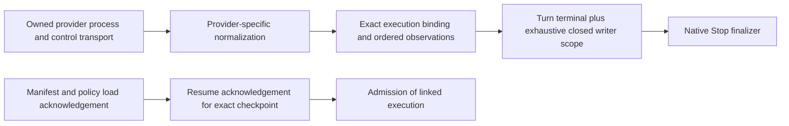

# HAR-R0-05 · Provider lifecycle and harness loading

Status: **implementation packet; native acceptance not run.** [R0 entry](README.md), [Stop boundary](stop.md). Read-only inventory on 2026-09-27 measured `claude --version` = `2.1.283` and `codex --version` = `0.157.1`. `node scripts/check-provider-capability.mjs` and `provider-capability-upgrade.test.mjs` passed their inventory/policy checks. Each current build still has eight unverified capabilities in `providerCapabilityMatrix.ts`; historical supported rows do not accept these builds.

## Implemented foundation, separate from native acceptance

P05.1/P05.2 internal contract is implemented in [providerExecution.ts](../../../apps/desktop/src/shared/providerExecution.ts), reviewed member source [`c77f5d7`](https://github.com/passioncode-ai/fabric/commit/c77f5d7545d62c8b79b7052571ab71c270419e29). Its [executable fixtures](../../../apps/desktop/test/provider-execution.test.mjs) cover malformed input, foreign scope, lost/duplicate/stale events and restored context. The module is not a provider producer and does not change the public sibling contract.

The **intended wiring** above is not connected end to end. `nativeStopRuntime.ts` still refuses provider quiescence without an actual adapter receipt. Bindings retain Estate/Task/Run/Session, provider build/profile, native connection/session/thread/turn and manifest/policy digests. Claude without a native turn ID uses an explicit host request epoch, never the Session alone. Codex requires exact thread/turn. Reconnect invalidates cursor, terminal, load and inventory proofs, retaining known writers as unknown; retired connection IDs cannot return. Limits are 256 normalized observations, 128 writer handles and 64 connection epochs per state. Exceeding limits refuses further proof; no silent eviction grants authority. These limits must be exercised by long-running native acceptance before release.

[providerJsonlTransport.ts](../../../apps/desktop/src/main/providerJsonlTransport.ts) supplies one bounded JSONL connection over pipes owned by the caller. It separates not-sent, unknown, provider error code and reply. Timeouts never resend; late replies never restore success; serialization reentrancy cannot write after close or bypass pending capacity. UTF-8 framing, depth/byte/fragment limits and backpressure bound intake. Unsupported server requests, including approvals, are refused. It retains no provider error text in diagnostics. Returned reply/notification bodies remain private transient input for a scoped normalizer: **do not log them**. The transport is not a permissions router, process supervisor, transcript sink or proof of execution.

Transport checks: [provider-jsonl-transport.test.mjs](../../../apps/desktop/test/provider-jsonl-transport.test.mjs), including a real owned Node child with stdio pipes, malformed bytes and late stream errors. This is transport evidence, not a real Claude/Codex call. The installed Codex `0.157.1` protocol was generated locally with `codex app-server generate-json-schema --out <owned-directory> --experimental`. Schema observations: `turn/interrupt` addresses thread+turn; `turn/completed` carries terminal status; background-terminal listing is paginated; `process/exited` is connection-scoped and separate. Generated schemas were inspection input, not copied dependencies or native acceptance receipts.

### Exact next integration boundary

Provider normalizers must minimize native payloads before receipt persistence, correlate the actual native identity, distinguish background/child/remote writers and validate every pagination cursor. Absence from a current active list is not evidence that a previously known writer ended. A paginated list alone supplies neither an atomic snapshot nor closed admission. Host closure/coverage must be separately bound and tested; no boolean inferred from terminal completion substitutes for it.

Next, an owned supervisor establishes control transport and all writer scopes before managed launch. Managed Stop now has an optional `requestProviderStop` port: durable canonical command → revoke Fabric authority → typed cancellation → physical signal → independent observation. Native Stop delegates it for managed Runs only. Failures still permit physical cleanup within the same deadline; a lost durable command reply, changed owner or expired deadline permits no provider cancellation. Request ACK never substitutes for quiescence. This is an implemented ordering seam, **not an installed adapter**; the app currently supplies no producer. Free terminals need their own bound cancellation command before this path can cover them. Approval routing, manifest load evidence, credential/config isolation and unexpected transport death remain prerequisites. A raw JSONL reply or a fixture claiming `restored:true` does not certify restored model context.

### Codex event normalization

[codexProviderEvents.ts](../../../apps/desktop/src/main/codexProviderEvents.ts) and [fixtures](../../../apps/desktop/test/codex-provider-events.test.mjs), reviewed source [`da7eabc`](https://github.com/passioncode-ai/fabric/commit/da7eabc2e17d70a5900f9644e25f1266d31bcad5), implement a **pure subset** of the installed `0.157.1` schemas. Exact thread/turn and transport epoch are required. `processHandle` belongs to host-created processes on a connection; a PTY `processId` is a different namespace. Child statuses are last-known information and stay unknown for termination proof. A completed turn can contain an unfinished command; its writer is retained until separate completion evidence arrives.

Full linked pagination is checked for background lists. Absence never clears a previously known writer. Closed admission and exhaustive coverage of background/child/remote work require a separate host attestation bound to the exact observation sequence. Minimal source facts are fingerprinted before state-dependent projection, so replaying an older receipt after later link/exit observations is idempotent. A malformed duplicate cannot impersonate the old receipt. Commands, output, paths and prompts are omitted from normalized evidence, including its digests.

This wrapper currently represents **one connection epoch**. Its caller must retain denied/unknown state on disconnect; recreating an empty wrapper is not recovery. A reconnect bridge preserving shared-contract history, unsupported tool/item lifecycles, actual host coverage producer, control transport binding and native canaries remain required. Unsupported notifications fail closed rather than pretending a complete execution history was observed. The next controller packet orchestrates typed stop requests and background cleanup; it must not turn a successful RPC into a `stopped` result.

### Codex control and concrete write fence

[codexProviderControl.ts](../../../apps/desktop/src/main/codexProviderControl.ts) now orchestrates `turn/interrupt` → complete linked background listing → terminate **only** known exact item/process pairs from the host's ownership snapshot. The controller accepts only the current `0.157.1` owned-stdio binding. Foreign handles remain unresolved, a false terminate result stays unacknowledged, and `request_ack` means only command responses were accepted. A completed paginated listing is not an atomic inventory or proof of closed writer admission.

Every effect checks exact current scope, monotonic source/cursor, literal boolean authority and whole-operation deadline. Canonical command/payload repeats share a connection-local result; lost replies never trigger automatic resend. This cache is not durable idempotency: supervisor reconstruction must retain the original command and uncertainty instead of creating permission to retry. `providerJsonlTransport.ts` consumes the same fence at the actual `Writable.write` boundary and checks its own monotonic deadline after the callback. Asynchronous or unreadable authority is refused.

Evidence: [controller fixtures](../../../apps/desktop/test/codex-provider-control.test.mjs), [transport fixtures](../../../apps/desktop/test/provider-jsonl-transport.test.mjs), and [composed owned-pipe fixture](../../../apps/desktop/test/provider-control-stdio.test.mjs). The latter uses both real modules with a spawned deterministic Node peer, tests interleaved revocation between request/reply, missing reply and foreign writer, and verifies secret-bearing command/path examples are absent from receipts. It does **not** run Codex or certify the profile. Supervisor/native binding, durable recovery, host coverage producer and broader item lifecycles remain open.

### Terminal integration probe before choosing a launch topology

Read-only installed help on 2026-09-27 (`codex --help`, `codex app-server --help`) exposes TUI `--remote` with Unix/WebSocket endpoints, `--no-daemon`, and app-server `--listen` with a Unix endpoint. `--stdio` is documented as equivalent to the stdio listener, **not evidence of simultaneous stdio and Unix listeners**. This suggests a candidate owned server + attached TUI topology that could preserve the requested terminal experience while adding structured control. It is an inference from help, not an accepted implementation or a reason to attach the operator's shared daemon.

Before selecting it, isolate a private endpoint and process tree; prove permissions/ownership, exact thread created by Fabric and attached by TUI, multi-client event delivery, control lifetime independent of TUI exit, reconnect and complete cleanup. Do not label a Unix/server profile `owned-stdio`; extend the internal profile contract only with a reviewed topology and its acceptance. If a structured headless presentation is chosen instead, explicitly review terminal controls and operator flows; a stream of raw JSON is not the user's terminal UI. Claude's installed help similarly exposes print/stream JSON and separate background attach/stop commands; no lifecycle equivalence is inferred between those modes.

## What exists and what is missing

Source inspection at [`bac64a3`](https://github.com/passioncode-ai/fabric/tree/bac64a3): `apps/desktop/src/shared/agents.ts` defines launch/surface descriptors, not provider Stop/resume protocols. `sessionBundle.ts` materializes MCP/preamble; `pty.ts` launches those arguments without establishing an observed native thread/session identity. Codex's descriptor has no Fabric result channel. `switchCoordinator.ts` has policy ports without native producers. Authoring adapter manifests are not runtime injection or load receipts.

Installed `claude --help` reports system-prompt snapshot enabled by default, including reuse on resume. Therefore a new append-prompt/bundle cannot prove that resumed execution loaded new policy. Verify exact manifest and capability receipts before granting writer authority.

## Provider contracts to verify

Claude's documented headless lifecycle distinguishes process termination from turn interruption: SIGTERM can leave a turn unfinished; SDK interrupt/SIGINT and explicit interrupted-turn resume have different semantics. Session resume must use an exact ID; fork is not filesystem isolation. A Stop control response is only a request; background task notifications must establish terminal state. Sources read 2026-09-27: [headless lifecycle](https://code.claude.com/docs/en/headless), [sessions](https://code.claude.com/docs/en/agent-sdk/sessions), official SDK [client](https://github.com/anthropics/claude-agent-sdk-python/blob/main/src/claude_agent_sdk/client.py) and [types](https://github.com/anthropics/claude-agent-sdk-python/blob/main/src/claude_agent_sdk/types.py). These are protocol expectations, not local native acceptance.

Codex app-server separates `turn/interrupt` acceptance from `turn/completed`; background terminals and explicitly started processes have separate lifecycle operations. `thread/resume` and `thread/fork` differ. Bind exact thread/turn/process identities rather than extracting identity or success from TUI text. Installed help also exposes daemon and remote profiles, so a local root exit cannot prove their closure. Source read 2026-09-27: [official app-server protocol](https://learn.chatgpt.com/docs/app-server).

## Ordered packets and acceptance

| Packet | Input → output | Mandatory negative checks |
|---|---|---|
| P05.1 Binding | Fabric Estate/Task/Run/Session + exact build/profile → observed provider session/thread/turn/background handles and cursor | foreign IDs, missing IDs, reconnect, stale generation, no secret in records |
| P05.2 Contract | binding + versioned command → requestStop / observeQuiescence / resumeExact / observeResumeAck ports | request ACK never terminal proof; timeout/lost reply preserves command; late action fenced |
| P05.3 Claude | owned structured stream/SDK adapter → typed turn/task events and manifest ACK | SIGTERM versus interrupt, live background task, killed notification, prompt snapshot mismatch |
| P05.4 Codex | owned app-server adapter → exact thread/turn/process receipts | daemon ownership, remote scope, background inventory pagination, approval pending, kill ACK before exit |
| P05.5 Continuation | verified predecessor + immutable context + selected mode → one new linked Run | native resume versus fresh same provider versus other provider; stale HEAD/manifest/context, no replay of unknown external effects |
| P05.6 Acceptance | exact app/schema/provider/manifest builds + evidence → capability-specific readiness | omitted/failed/unobserved never supported; upgrades invalidate receipts |

`requestStop(binding, command, reason, stillAllowed)` must precede destruction of the provider control transport. The optional managed cancellation port now makes that ordering explicit; the actual provider producer remains open. `observeQuiescence(binding, throughCursor)` must cover the bound writer inventory and all known child/background work. Manifest/policy load ACK is separate from context delivery ACK. No known unknown writer disappears merely because the provider turn ended.

Run deterministic protocol fixtures first: reordered/duplicate events, partial inventory, dropped response, changed identity, stale cursor, unknown checkpoint and manifest mismatch. Then an isolated CLI harness with owned directories/config, local stub provider and dummy credentials; do not borrow user Keychain, sessions or shared daemon. A later native canary uses an explicitly bounded test Project and exact builds. No billed provider call or native canary was performed during this inventory.

Before P05.3/P05.4, review public contract compatibility in `fabric-agent-contract` and `fabric-agent-adapter`; maintain separate owner branches and receipts. Current sibling inspection was read-only at contract `1eeb5a3` and adapter `5d2ccd7`; no parent pin changed. Complete release remains gated by memory/privacy, CEO/voice/UI and actual operator flows as listed in [modules](modules.md).

P05.3 has a separate [Claude protocol packet](claude-provider.md): pinned official SDK sources, raw-event attribution, task-patch ownership, prompt snapshot and the limits of SDK idle/background heuristics. It records research and implementation order, not a native acceptance receipt.

P05.3 control transport is now implemented and independently checked against synthetic SDK envelopes in [claude-provider.md](claude-provider.md#implemented-control-transport). ACK remains a control response, not proof that a turn or all writers ended. Pure event normalization is implemented and independently checked in the same packet; owned native event production, supervisor and actual provider acceptance are still open.

## Isolated Codex initialization receipt

The explicit manual command `pnpm --filter @fabric/desktop test:codex-initialize` runs [codex-initialize-native.test.mjs](../../../apps/desktop/test/codex-initialize-native.test.mjs), reviewed source [3d68005](https://github.com/passioncode-ai/fabric/commit/3d68005681da77d5d8aee6372f6aeb8be0a8a07e). On macOS with exact Codex 0.157.1, both the version check and `app-server` child run inside the same deny-network sandbox with an owned temporary CODEX_HOME and standard user configuration/keychain paths denied. No credentials are copied. The actual JSONL transport sends only `initialize`, verifies returned isolated codexHome/platform, closes stdin and observes child exit. Owned process cleanup is bounded; temporary data is removed only after exit. No thread or model request is sent.

Measured receipt: initialize PASS, `platformOs=macos`, isolated profile matched, model requests 0, child exit 0. This proves this installed binary's initialization framing in that isolated profile. It does not certify skills/policy load, native terminal attachment, model behavior, Stop, full writer coverage or continuation. Other OS/builds exit 2 (`NOT_RUN`); it is not registered in automatic fast tests. Current TUI topology and ownership still need explicit conformance before the app can supply native provider evidence.
