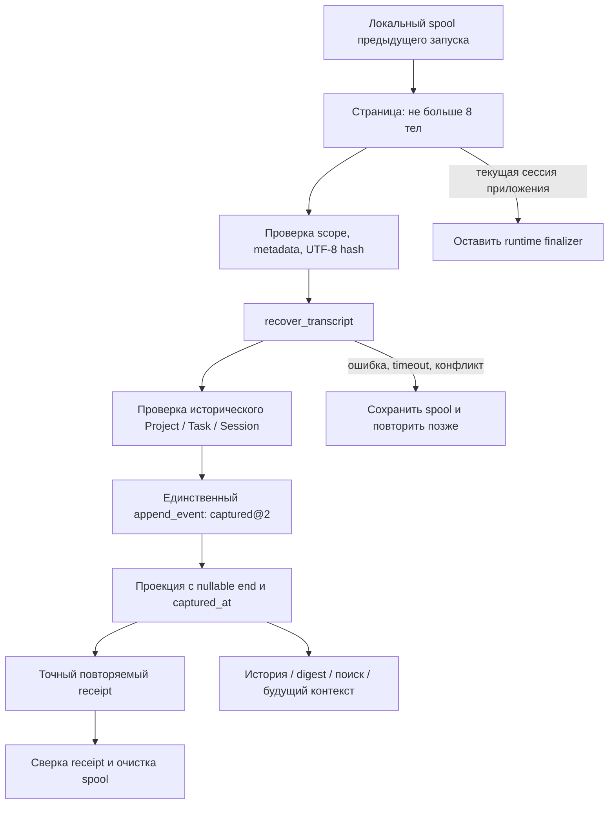

# Recovery: сохранить историю, не выдумать завершение

Статус: pre-release реализация и локальная приёмка. Решение — [ADR-0073](../../adr/0073-recovered-transcripts-do-not-prove-process-ending.md). Живая БД не мигрировалась; native crash/return walkthrough ещё нужен. Проверенные команды и ограничения — [checks](checks.md#capture-recovery-and-provider-topology).

## Модули и поток

- `apps/desktop/src/main/transcripts.ts#recoverFinalizations`: перечисляет идентичности, исключает открытые/владеемые текущим runtime, выбирает страницу **до** чтения тел; повреждение одной страницы не блокирует следующую.
- `apps/desktop/src/main/pty.ts#recoverTranscriptFinalizations`: исключает все принадлежащие менеджеру поколения, включая exited/pending finalization. Именно здесь предотвращается гонка recovery против Stop.
- `apps/desktop/src/main/transcriptRecovery.ts#createTranscriptRecovery`: строгая валидация входа/receipt, стабильный command ID, один запрос за раз, общий монотонный срок страницы. Поздний ответ не разрешает cleanup. Payload digest выдаёт SQL; JS не подменяет его несовместимым JSON-хэшем.
- `apps/desktop/src/main/index.ts#startTranscriptRecovery`: фоновая страница после bootstrap; следующая через 50 мс, новый проход через 60 секунд. Не блокирует вход. Новый bootstrap/quit инвалидирует старый scheduler. Диагностика содержит фиксированные причины, не тело стенограммы.
- `supabase/migrations/20260927000063_transcript_recovery.sql#recover_transcript`: проверяет историческую атрибуцию, content hash/байты/строки, структуру, даты, provenance. Запись и проекция в одной транзакции; private authorization разрешает единственный journal writer и не является сохранённой runtime-властью.
- `apps/desktop/src/shared/digest.ts#digestOf`, `apps/desktop/src/main/searchRead.ts#searchFor`, `apps/desktop/src/main/contextPack.ts#compileContextPack`: отдельная семантика capture, nullable время, будущая компиляция revision 3. Уже finalized пакеты не пересобираются.

## Контракт входа и выхода

RPC получает Estate/Project/Session/command UUID и ровно 14 полей capture: task, option, SHA-256, UTF-8 bytes, lines, truncated, annotation, excerpt, body, capture_state, started_at, ended_at, exit_code, ending_provenance. `body` ограничен 8 000 000 байт; annotation — 8192, excerpt — 32768. Фактические границы проверяет `transcript_capture_error` в миграции; повторение текста здесь не заменяет исполняемую проверку.

`captured_at` ставит БД. При unknown end обязательны null end/exit, captured и truncated. При observed end может быть неизвестен exit code; это не «still open». Пустой вывод разрешён только как доказанная empty capture. То же намерение возвращает исходный receipt даже после потери ответа; изменённое намерение/атрибуция отказывается. В ответе нет body, есть его hash/размер и точные metadata. Произвольный `append_event` с @2 запрещён; restore/replay проверяет schema и identity без operational authorization.

Очистка — только после проверки точного ответа в пределах срока. Если SQL успел commit, а ответ потерялся, следующий вызов получает тот же receipt. Ошибка cleanup не отменяет durable запись. Recognizable credentials in a legacy spool refuse before RPC without rewriting the sealed identity; explicit repair remains in CO-168. This uses the current recognizer, not a claim to detect every secret. Existing legacy/stronger capture не заменяется более слабым восстановлением; такой spool сохраняется для отдельного разбора, автоматического destructive cleanup нет.

## Интерфейс и смысл

SCN-036 → FLW-31 → SCR-31/SCR-34. На строке — краткая пометка неподтверждённого завершения; детали объясняют неполноту и содержат источник. Digest называет capture, а не окончание сессии. Отсутствующее время отображается как неизвестное. Сортировка последних captures использует journal sequence, то есть порядок записи, не выдуманную хронологию исполнения.

В [макете памяти](../../reports/product.html#view-r0-memory) есть явно обозначенный пример «после сбоя»: открыть → прочитать источник → добавить в Fabric. Он не меняет Run и не позволяет обойти Stop. Реальный desktop и target workspace остаются разными уровнями доказательства.

## Разработка и обязательная дальнейшая приёмка

1. Сначала schema/receipt и fault tests, затем coordinator/owner exclusion, nullable readers, UI и сценарии. Этот срез объединён в одной source iteration.
2. SQL: вся цепочка миграций, конкуренция, потерянный ответ, rollback, запрещённые прямые записи, replay, restore и actual disk → coordinator → SQL receipt.
3. Релизная операция отдельно: maintenance window, backup, upgraded readers+schema, проверка nullable истории; порядок и rollback barrier в ADR-0073. Не применять её как побочный эффект unit tests.
4. Native acceptance: принудительное прекращение только собственного тестового приложения, сохранённый spool, новый вход, чужой Project/повреждённая запись, отсутствие дубля, поиск и просмотр; затем отдельная наблюдаемая остановка старого исполнителя. До неё continuation capability не принимается.
5. После native supervisor: долговечное владение поколениями и provider inventory, реальные load/resume ACK, Claude↔Codex перенос, CEO/voice и operator pilot. Общий CO-168 остаётся открытым.

Privacy guard проверяет исходное body и annotation до RPC. Excerpt с обрезанной меткой redaction допустим только как точная производная уже проверенного body через тот же `transcriptExcerpt`; произвольный excerpt проверяется отдельно. Sealed bytes/hash не переписываются. Регрессия с настоящим TranscriptStore и поддельными metadata включена в `transcript-recovery.test.mjs`.
