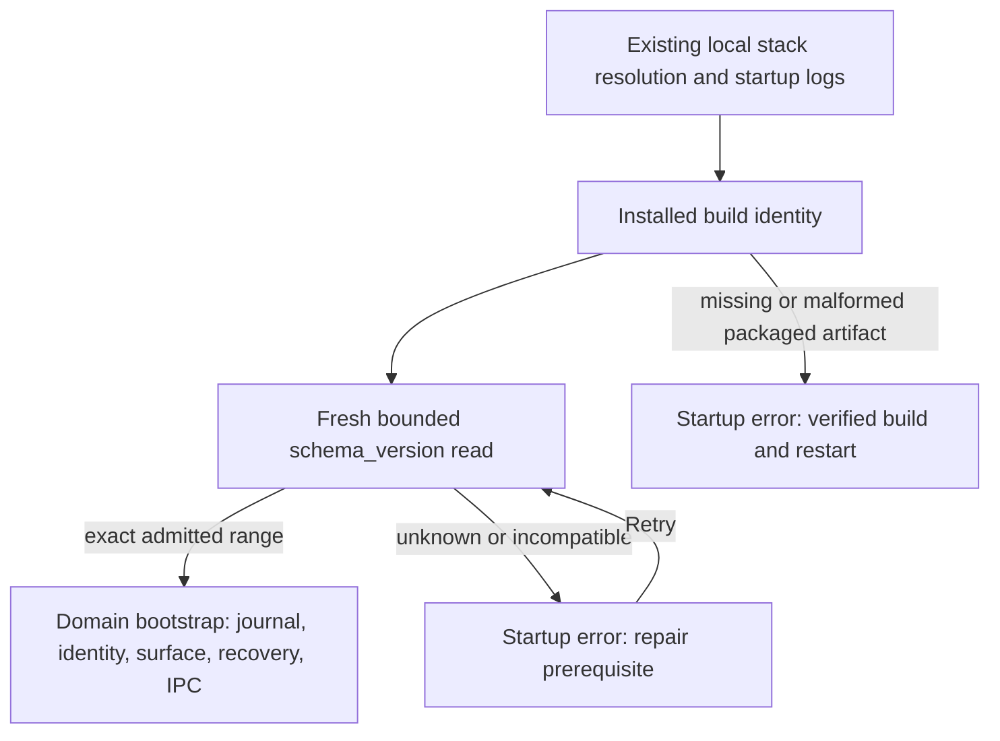

ssheleg skills — task-pipeline · super-ux · copywriting · evidence-docs · agent-sync · maintaining-fabric-workspace

# Release admission: build identity and database before workspace services

Status: implemented bounded startup/producer slice, integration checks recorded in [checks](checks.md#schema-admission-and-toolchain). **Not full R0 acceptance.** Source baseline: [a6ae3d3](https://github.com/passioncode-ai/fabric/tree/a6ae3d3ce374e154e86a8d7aee07ca7facabae5e). The preceding recovery iteration is published as workspace `d44a494ec1ed8f4f5e8265aa762a6b9b15d87b70`, release90; strict publication check passed and a fresh remote checkout resolved 116 relative packet links. That receipt does not cover the later startup changes described here.

## One schema contract

`apps/desktop/src/shared/schemaContract.json` declares **67–67** since 2026-09-28, after migration 67 (backend exit receipts, schema 67 qualified as a private-archive source) passed the full chain with the managed Stop and archive suites ([checks](checks.md#backend-exit-receipts-in-managed-stop--2026-09-28)); migration 66 (owner-private archive) passed [its checks](checks.md#owner-private-archive-sql--2026-09-28) before it. Schema 66 is now refused, as 65 was before it. Schema 65 was qualified by the [restore-boundary integration](checks.md#restore-boundary-and-native-pty--2026-09-27) and is now refused, as schema 64 was before it. The preceding source iteration qualified63–63; it remains a historical receipt, not permission for the new writer to use schema63. It is consumed by `scripts/build-manifest.mjs` and `apps/desktop/src/main/schemaReadiness.ts`. A migration inventory is not evidence that older readers or writers work. The producer refuses a malformed contract or a maximum different from the shipped migration count. Any future range change requires explicitly qualifying its readers and writers; adding a migration does not silently widen compatibility.

The insertion is `apps/desktop/src/main/index.ts#bootstrap` → `withSchemaReadiness` → `bootstrapReady`. Existing stack provisioning, splash and local logging precede this gate; the zero-effect promise applies to **domain startup**, not every possible OS side effect. The new gate itself does not run migrations. It does not protect an already running process from an operator changing schema in place; [ADR-0073's maintenance barrier](../../adr/0073-recovered-transcripts-do-not-prove-process-ending.md) still requires stopping writers before migration.

A packaged process reads only its packaged manifest. An unpackaged development run may use the compiled schema contract only when all manifest candidates are absent. A present unreadable file, JSON `null`, wrong schema bounds or invalid metadata cannot borrow a later candidate or become the development fallback. The process's manifest identity remains cached; an artifact remedy requires restart, while database Retry performs a fresh read. A timeout or late response never invokes domain bootstrap. Diagnostics use fixed descriptions rather than raw backend text.

## What the build can honestly say

[Toolchain packet](toolchain-pinning.md) pins one measured macOS arm64 host/version profile. Its verifier checks the host, Node, explicit pnpm executable, declared package manager, source and installed lock digests, selected installed package versions and entrypoints. `toolchainDigest` is emitted only for a matching measured profile; a checksum of arbitrary JSON is insufficient. The shared manifest reader validates the optional scoped receipt and matching digest. A legacy bare digest does not become verified evidence.

`buildLine` says **versions verified; reproducibility not established**. `scripts/package-pinned.mjs` requires this preflight; generic development/CI can remain explicitly unverified. The command does not silently install or switch pnpm versions. This machine's default executable and the project's automatically selected version differ; use an explicitly installed matching executable for a strict check.

Two actual output-directory builds in the member checkout matched, 191 files each; exact digest, working-tree scope and limitations are in [toolchain-comparison.json](toolchain-comparison.json). This proves neither two independent clean installations nor reproducible native packages, signing, notarization or another host. Root repeated the comparison on the integrated working tree: also 191 files MATCHED, with a different source-specific artifact digest in [integrated-bundle-comparison.json](integrated-bundle-comparison.json). Both receipts have the same limited scope; the integrated source still needs clean release artifacts and packaged acceptance.

## Operator flow and prototype

SCN-095 → FLW-55 → SCR-36 adds the pre-entry condition. The existing native startup dialog names the problem and allows a safe fresh schema retry; invalid artifacts require restarting with a verified build. No unsupported newer database is advertised as safe to read. Existing project context remains preserved rather than being reconstructed by a failed startup.

In the [first-release prototype](../../reports/product.html#view-r0-setup), open review tools → “Проверка перед запуском · примеры”. Explicit examples cover compatible/older/newer/unavailable database and unknown build. Retry in an incompatible example stays refused; selecting the compatible fixture restores the ordinary entry. These are page-local examples, not a live database check or exact native OS-dialog rendering. Tests assert blocked domain actions and hidden chat. Appearance uses the existing components and tokens.

## Reproduction and exact next work

- `node --experimental-strip-types apps/desktop/test/schema-readiness.test.mjs`: composed callback, filesystem manifest lookup, exact bootstrap placement, deadline/retry and malformed source cases.
- `node --test scripts/test/toolchain.test.mjs scripts/test/build-identity.test.mjs`: producer, strict preflight refusal before packaging, schema mismatch and content identity.
- `node --test scripts/test/first-release.test.mjs`: prototype refusal/retry and unchanged main journey.
- `node scripts/check-toolchain.mjs`: actual measured host, exit1 if unverified. Set `FABRIC_PNPM_EXECUTABLE` only to an already installed version matching the pin.

Next: packaged application cold-start against the explicit qualified schema, including unavailable/old/new schema; independent clean-install bundle and unsigned-package comparison; signing separately. Continue the [native provider topology](provider-topology-proposal.md) with actual owned view/backend evidence, then load/resume/Stop acceptance. No production migration, installed product release, native operator pilot or CEO/voice readiness is asserted by this packet. CO-168 remains open.

---

**Made with [ssheleg skills](https://github.com/ssheleg/sshlg-skills)**
