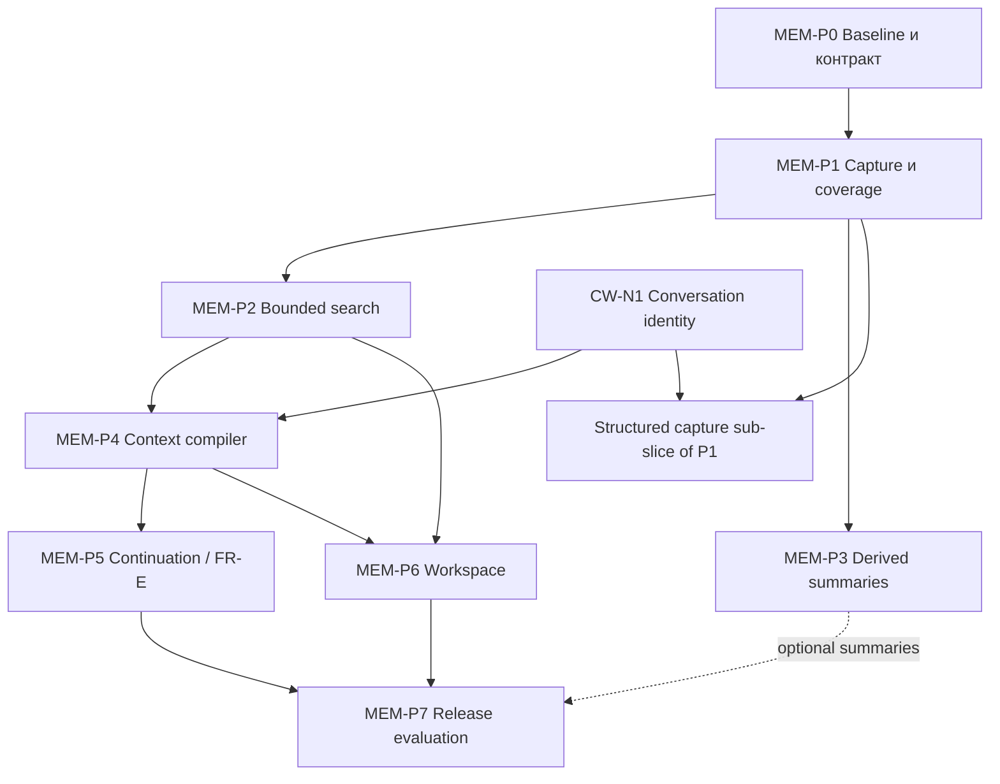

# MEM · детальный план реализации

Статус: **план**, не выполненные native tasks. Контракт: [архитектура](../../architecture/project-memory.md); исходные дефекты и адреса — [evidence](evidence.md). Идентичность и общая команда: [CW-N1/N3](../chat-workspace.md), [TEAM-N1](../operator-workspace.md); portable continuation — [FR-E](../first-release-strategy.md). Эти пакеты детализируют существующие M177/M182/M191/S12/S14 и CO-168, не создают второго реестра delivery status.

## Общие условия для каждого пакета

Сначала прочитать ADR-0032/0063/0067/0069, CONTEXT.md и system-contract.md. Найти существующий producer из evidence, написать failing fixture на наблюдаемый дефект, затем минимальное расширение. Не заменять journal собственной БД. Новые публичные имена согласовать со схемой внешнего контракта; не выдавать local DTO за выпущенный event. Сохранить boundary checks вне LLM. В отчёте: commit, diff, команды/exit codes, реально выполненные vs skipped checks, receipts, отрицательные случаи, оставшиеся риски. Проверить UI через browser, native storage через живой test stack. Tests, которые пропущены, не зелёная интеграция.

## Граф зависимостей

Payload edges: P0→P1 capture schema and baseline corpus; P1→P2 sanitized versioned chunks/coverage; P1→P3 exact source ranges; P2→P4 authorized bounded candidates/receipts; CW-N1→P4 typed source/context attribution; P4→P5 immutable checkpoint/pack; P2/P4→P6 actual read DTOs and pack states; P5/P6→P7 built receivers and fixtures. P3 не блокирует lexical R0: без него L0 metadata и L1 excerpt доступны. Общие файлы agentSurface/index/schema изменяются последовательно или в изолированных ветках с общим convergence review.

## MEM-P0 · подтвердить baseline и зафиксировать расширения

**Owner:** memory contract/QA. **Prerequisites:** доступный локальный test stack; текущие capability descriptors. **Read:** evidence.md, `memory-eval.test.mjs`, transcript migration, `contextPack.ts`, `scope.ts`, external contract pin. **Write:** синтетический корпус, contract fixtures, versioned local schemas и задача совместимости при новом wire surface.

**Работа:** сохранить случаи: русская/английская сессии, совпадение после 400000 символов, оборванный хвост, conflicting decision, одинаковое имя проектов, другой Estate, секрет на границе chunks, старый pack, неизвестный stop, Codex unsupported. Зафиксировать, какие fail именно на исходном коде; не исправлять тест до «зелёного» удалением случая. Сопоставить каждый public API с текущей версией/permissions.

**Приёмка:** reproducible memory-on/off answer с source ref; baseline misses отдельно от no-access; skip без Supabase отмечен NOT-RUN. Из тестового набора не уходят реальные пользовательские стенограммы. **Output:** pinned baseline, schema delta и список изменений P1/P2/P4/P5. **Не делать:** embeddings и новые модели до базового измерения.

## MEM-P1 · устойчивый захват и правдивое покрытие

**Owner:** host capture. **Depends:** P0 для PTY/coverage; CW-N1 дополнительно для structured chat/voice sub-slice. **Read/write:** `transcripts.ts`, `index.ts`, `pty.ts`, `shared/redact.ts`, spool metadata, capture journal projection/migrations/tests. **Input:** adapter event + trusted binding. **Output:** sanitized chunks + durable coverage manifest + stable capture receipt.

**Работа:** сохранить truncation/redaction/gap counters в spool; корректно восстановить их после crash; различить observed и durable cursor; incremental journal checkpoints; sequence dedup; versioned sanitizer; bounded streaming private/PEM/token filtering; structured chat/voice adapter через CW-N1 с separate provenance. Legacy PTY остаётся observation. Fail closed при ненадёжном фильтре, с видимой потерей покрытия.

**Приёмка:** kill между fsync/append/ack, повтор recovery и concurrent retry дают один chunk; cap/disk full не дают complete; CRLF/UTF-8 и секрет через границу chunks скрыты до spool; error logs без payload; final hook отсутствует — durable prefix читается. Startup не меняет partial в complete. **Rollback:** dual-read legacy с coverage=unknown; old spool никогда не выдаёт выдуманную полноту. **Нельзя:** хранить сырой stdin «временно на диске» или выкидывать исходник после summary.

## MEM-P2 · поиск и адресное чтение сессий

**Owner:** knowledge read boundary. **Depends:** P1. **Read/write:** agentSurface transcript tool, searchRead, scopedStore/scope, FTS projection migration, chunk cursor validators. **Input:** authenticated principal/query/effective grants. **Output:** ranked L0 results, nearby timeline, capped L2 source ranges and retrieval receipt.

**Работа:** индекс всех разрешённых chunks; RU/EN и identifiers; rank/date/id ordering; пагинация со snapshot cursor; bounded query/limit; query-near snippet; revalidate read grants; before/after timeline в том же scope. Existing APIs сохраняются versioned; legacy unbounded body получает bounded successor, deprecation без тихого breaking change. Search metadata/total не раскрывают denied source.

**Приёмка:** конец большой сессии находится; совпадение через chunk boundary не дублируется; выдача стабильна между страницами; другой Project/Estate не читает snippet/count/ref; отзыв grant между search и detail запрещает detail; stale/tampered cursor отвергается; zero match/error/index lag различимы. SQL параметризован, user query не подставляется как SQL. **Output to P4/P6:** DTO, scopes, empty/partial/error branches, corpus receipts.

## MEM-P3 · отложенные резюме, необязательные для R0

**Owner:** background Routine. **Depends:** P1; source-authorized egress policy. **Write:** bounded derivation job, summary projection, lineage, costs and retry receipts. **Input:** immutable source segment refs. **Output:** L0/L1 derivatives with model/prompt/source versions.

**Работа:** checkpoint/idle запускает deterministic eligible queue; dedup job key = source digest + derivation revision; cost cap/retry cap; partial segment остаётся partial. Preserve disagreements, unverified outcomes, exact constraints as refs. Без approved provider summary unavailable, оригинал читается.

**Приёмка:** каждое factual assertion имеет source-range refs; неподдержанные/непроверенные утверждения помечаются и не продвигаются в Decision, качество независимо оценивается на корпусе (не предполагается безошибочный hallucination detector); timeout не блокирует capture; retry не удваивает billing receipt; source revoked/deleted делает derivative недоступным; reconstruction from source, не recursive self-summary. **Deferred:** automatic promotion/learned ranking — отдельные reviewed policies.

## MEM-P4 · контекст следующего запуска

**Owner:** compiler/admission. **Depends:** P2, CW-N1; P3 optional. **Write:** `contextPack.ts`, `sessionBundle.ts`, `pastContext.ts`, manifests and tests. **Input:** Task revision, user constraints, predecessor checkpoint, selected source refs, provider capabilities. **Output:** preview/immutable pack and explicit omissions.

**Работа:** deterministic priority tiers; mandatory set; current user-input floor; target tokenizer budget или честный bytes cap; authorized refs before retrieval and dispatch; source freshness; conflict pairs; task/run binding; no retrieval instruction execution. Исторический pack читается только из archive, а не генерируется заново.

**Приёмка:** одна и та же snapshot/config с фиксированным snapshotAt и canonical serialization даёт один digest; createdAt квитанции исключён из hashed content; unrelated old memory не вытесняет текущую задачу; обязательный текст не влезает — отказ admission; pinned unauthorized source отказ; declined/expired facts не current; recompile после изменения revision создаёт новый pack; missing past blob не подменяется preview. **Compatibility:** новые optional fields не ломают legacy read; legacy coverage unknown видна. **Output to P5:** portable checkpoint и pack refs, никаких credentials.

## MEM-P5 · продолжение через того же или другого исполнителя

**Owner:** execution / FR-E. **Depends:** P4 + verified provider adapter + existing stop/fencing. **Write:** continuation/admission state machine, capability descriptors, receiver adapter, Work UI bindings/tests. **Input:** predecessor Task/Run, observed stop, fresh repo observation, target choice. **Output:** one successor Run/session, predecessor edge, delivered/acknowledged receipts.

**Работа:** три режима native/same-provider-new/cross-provider-new; stable command ID; checkpoint seal; repository compare and operator-visible stale recovery; unsettled effects reconcile; readiness as actual probe, not fixture selection; receiver verifies pack digest and reports missing sources.

**Приёмка:** закрытый done/cancelled Task не переоткрывается — новый linked Task; stalled old process → successor не пишет; stop timeout → unknown; crash после delivery до ack → reconcile без второго Run; stale branch/dirty tree → refresh/review; unsupported Codex stays blocked; successful native test не считается cross-provider test. Реально выполнить Claude Code→Codex и обратный путь на disposable repo либо записать конкретный NOT-RUN и держать capability unverified. **Нельзя:** reuse vendor hidden reasoning/tool credentials или копировать provider name как Agent identity.

## MEM-P6 · workspace памяти и CEO

**Owner:** product UI. **Depends:** P2/P4 + CW-N1/N3. **Write:** MemoryOverviewSection, scoped search/source components, R0 navigation/CEO context attachment through actual APIs. **Input:** producer DTOs. **Output:** Home→Memory; Project→scoped Memory; Work→exact Session/pack; source→conversation.

**Работа:** сохранить dashboard Board/Projects/Agents; не добавлять всю память на главную. Visible scope chips, search, compact tabs, session/source inspector. Record author/provider/Task/coverage separately. «В разговор» прикрепляет pinned ref; text/voice и кнопка дают одинаковый command envelope. Context inspector показывает разрешённые проекты и причины пропуска. Settings owns imports/retention/summary budgets.

**Приёмка:** keyboard-only список→источник→чат→возврат; mobile не скрывает search/primary action; title и source доступны screen-reader; draft survives inspect; scope change убирает выбранный чужой source; empty/error/denied/stale/partial различимы; exact Run link не открывает другой Task; no background task launch on read. Цвет дополняет текст. **Проверки:** component + native integration + browser, отдельная WCAG оценка по конкретным критериям, не screenshot certification.

## MEM-P7 · приёмка, эксплуатация и жизненный цикл

**Owner:** independent QA / storage. **Depends:** P1/P2/P4/P5/P6. **Write:** release fixtures, coverage dashboards, restore/export manifests; retention/erasure ADR proposal when ready. **Input:** native receivers and corpus. **Output:** per-capability acceptance matrix, not one blanket readiness flag.

**Release gates:** memory-on beats memory-off на заданных source-only задачах; unanswerable question остаётся без выдуманной ссылки; unauthorized bytes=0 в synthetic cases; bounded L2/packs obey configured cap; replay and crash не теряют acknowledged chunks; cold resume can identify correct Task/branch/constraints/unfinished effect. Зафиксировать latency/cost на указанном corpus/host, не обещать SLA до измерения. Проверить export/restore: источники/refs/coverage связаны и local-only artifacts явно отмечены.

**Retention work:** перечислить replicas и key ownership; запретить автоматическое забывание как релизную иллюзию; спроектировать suppression-before-replay и безопасный audit, backup expiry и внешний provider boundary. Полное удаление требует отдельного accepted lifecycle decision/migration. Пока оно не готово, UI не обещает «удалено везде». **Rollout:** read-only search сначала; capture расширяется под feature flag; compiler/continuation подключаются после native receipts; rollback не удаляет журнал и не смешивает версии индекса.

## Проверка плана перед стартом

- Каждый пакет имеет named inputs/outputs, read/write homes, prerequisites, negative acceptance и запреты.
- P3 не фиктивная обязательная зависимость; P6 может начинаться с DTO-fixtures, но native acceptance ждёт producers.
- Одни Task/Run/Decision и authority path для UI и CEO; нет второго менеджера состояний.
- Release невозможно закрыть только screenshot, exit0 со skip или mockup ACK.
- Точный следующий шаг: MEM-P0. Не откладывать известные capture/redaction/recovery дефекты до semantic search.
