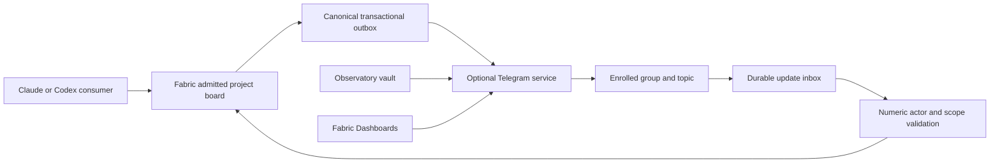

---
report:
  id: fabric/2026-10-04-telegram-board-transport
  title: "Telegram transport for the Fabric project board: implementation packet"
  kind: research
  project: fabric
  domains: [ai-agent, automation, mcp, security, architecture]
  as_of: 2026-10-04
  status: active
  valid_until: 2026-11-04
  summary: >-
    Telegram now permits conditional bot-to-bot communication, contradicting the older FAQ.
    An optional transport can mirror Fabric's board and import authenticated replies.
    This packet specifies ownership, versions, durability, unknown sends, replacement,
    failure tests and a live capability matrix. Implementation and live tests remain NOT_RUN.
  sources:
    - {name: "Telegram features", url: "https://core.telegram.org/bots/features#bot-to-bot-communication", read_at: 2026-10-04}
    - {name: "Telegram Bot API", url: "https://core.telegram.org/bots/api", read_at: 2026-10-04}
    - {name: "Bot API changelog", url: "https://core.telegram.org/bots/api-changelog", read_at: 2026-10-04}
    - {name: "Contradictory older FAQ", url: "https://core.telegram.org/bots/faq#why-doesn-39t-my-bot-see-messages-from-other-bots", read_at: 2026-10-04}
    - {name: "Update identity maintainer", url: "https://github.com/tdlib/telegram-bot-api/issues/837#issuecomment-4141729842", read_at: 2026-10-04}
    - {name: "Webhook retry maintainer", url: "https://github.com/tdlib/telegram-bot-api/issues/211#issuecomment-992486596", read_at: 2026-10-04}
    - {name: "Single-poller library maintainers", url: "https://github.com/python-telegram-bot/python-telegram-bot/issues/1143", read_at: 2026-10-04}
    - {name: "Fabric baseline", url: "https://github.com/passioncode-ai/fabric/tree/41f994a709990ad72621fa834768a8833e7d93e1", read_at: 2026-10-04}
    - {name: "Adapter baseline", url: "https://github.com/passioncode-ai/fabric-agent-adapter/tree/46acc8bb774dbdb1e27022e566bcd0076221bea9", read_at: 2026-10-04}
    - {name: "Adapter-pinned contract", url: "https://github.com/passioncode-ai/fabric-agent-contract/tree/2ce392291c6668598d12cd38327e24696b5ca15c", read_at: 2026-10-04}
  produced_by: {agent: Codex, task: "Bounded COM-08 and COM-09 research"}
  supersedes: []
  consumers: [fabric, fabric-agent-adapter, fabric-agent-contract, fabric-dashboards, project-observatory]
---

ssheleg skills — task-pipeline · telegram-bots · evidence-docs · project-reports

# Telegram board transport implementation packet

Fabric remains the primary project board. Telegram is an optional mirror and an admitted
reply/discussion ingress. Each optional bot represents an enrolled project or agent role;
it does not own task state or bind work to a Claude process. A replacement Codex consumer
uses the same project address through Fabric's generation fence. No code, bot/chat creation,
credential values, live messaging, paid operations or deployment was touched in this study.
No I3 findings were read and no independent I3 review is claimed.

## Scope, source ledger and requirements

This elaborates COM-08/COM-09 from [RPT fabric/2026-10-04-project-communications §Telegram
findings and design consequences] and its companion
`docs/evidence/plans/2026-10-04-project-communications.md`, read in the coordinator's recovery
branch. They are not present in this packet's `origin/main` baseline. The coordinator must
converge their source commits before implementation. This packet is not a second task register.

| Requirement | Receipt or acceptance proposed | Research result |
|---|---|---|
| T-01 Current mode/API capability | Official features/API/changelog and contrary FAQ | Source study complete; concrete bots NOT_RUN |
| T-02 Durable intake/outbox and unknown sends | Crash-point fixture assertions below | Specified; implementation NOT_RUN |
| T-03 Numeric authority, mapping, privacy and loops | Forged actor, cross-estate, duplicate and budget tests | Specified; runtime NOT_RUN |
| T-04 Claude→Codex at project address | Current generation accepts pending request; old one refused | Specified; provider clients NOT_RUN |
| T-05 Owners, extension/version boundary and first task | Commit-addressed source inspection and write sets | Baselines verified; proposed files labelled |

Public retrieval metadata, response hashes and maintainer comment identities are in
[raw/source-receipts.json](raw/source-receipts.json); source commits/version observations in
[raw/baselines.json](raw/baselines.json). No full API copy or credential is retained. Re-fetch
mutable documentation at implementation and before live enrollment. The installed
`telegram-bots` 0.2.1 skill supplied delivery doctrine, but its opening `allowed_updates`
shorthand and outbox guarantee are corrected by the primary API below.

## Current Telegram findings

The [specific features section](https://core.telegram.org/bots/features#bot-to-bot-communication)
permits directed group commands `/command@OtherBot` and replies when either bot enables
Bot-to-Bot Communication Mode. Ambient group bot messages require receiver mode enabled
plus administrator rights or disabled Group Privacy Mode. Private bot messages require both
modes enabled and recipient username in `sendMessage`. The page also requires loop safeguards.
These are documented capabilities; actual receiver updates are still needed for acceptance.

The [older FAQ](https://core.telegram.org/bots/faq#why-doesn-39t-my-bot-see-messages-from-other-bots)
still prohibits bot visibility regardless of mode. Treat the specific feature contract and
capability matrix as the integration basis; never change privacy, mode or admin rights
implicitly to obtain a green probe.

The fetched [changelog](https://core.telegram.org/bots/api-changelog) identifies **Bot API
10.3, 2026-08-24** as its latest entry. This snapshot's `User`/`getMe` includes
`can_read_all_group_messages` but no bot-to-bot mode getter or toggle. Configuration remains
operator-attested until an exchange proves it. Start with an enrolled shared group/topic;
private bot messaging is a separate optional lane, not a second canonical routing system.

The [Bot API](https://core.telegram.org/bots/api#getupdates) specifies mutually exclusive
polling/webhook delivery, at most 24-hour update retention, polling offset confirmation and
stable update identity. Omitted `allowed_updates` retains prior configuration; `[]` resets
it with documented exclusions. Request `message`, `edited_message`, `my_chat_member`
explicitly, and `callback_query` only when implemented. `chat_member` needs separate
subscription/rights. Outage beyond retention creates an external-history gap, not complete replay.

Maintainer [issue 837](https://github.com/tdlib/telegram-bot-api/issues/837#issuecomment-4141729842)
distinguishes update dedup from business idempotency. Maintainer
[issue 211](https://github.com/tdlib/telegram-bot-api/issues/211#issuecomment-992486596)
explains failed webhook retries; its 2021 timeout observation is historical, not today's SLA.
Library-maintainer [issue 1143](https://github.com/python-telegram-bot/python-telegram-bot/issues/1143)
documents duplicate polling conflicts. One local process lock is insufficient across machines:
lease intake per numeric bot id with an authoritative generation and explicit transport mode.

## Architecture, owners and existing extension seam

Everything from this section onward is our proposed architecture and acceptance design,
not Telegram documentation or a shipped capability. API facts above are deliberately brief;
names and controls below are proposals unless marked as existing source files.

| Owner repository | Owns | Boundary |
|---|---|---|
| `passioncode-ai/fabric` | Admission, project board/journal, atomic outbox eligibility, enrollment, bot lease, current responder, receipts, discussion budgets and board views | Canonical communication and task state |
| `passioncode-ai/fabric-agent-adapter` | Proposed optional worker reference kit and provider-neutral consumer helpers, recipes using existing helpers | Existing 0.7.0 plugin is skills only; install alone starts nothing |
| `passioncode-ai/fabric-agent-contract` | COM-01 versioned communication schema/state/capability contract and fixtures | No Telegram-only extension invented here |
| `passioncode-ai/fabric-dashboards` | Service health, attention tiles and safe links under COM-11 | Monitor; no second board or provider runner |
| `passioncode-ai/project-observatory-dashboard` | Vault and privacy-scoped telemetry | No task/message scheduler |

No new repository is required by this proposal. Packaging a daemon from Adapter changes
its background-footprint/dependency facts: that owner must update `AGENTS.md`, package file
list, lifecycle docs, org-index row, version pins and install/release receipts in implementation.
A separate product repository, if preferred, needs an explicit ownership decision first.

Verified baselines: Fabric `41f994a709990ad72621fa834768a8833e7d93e1`; Adapter
`46acc8bb774dbdb1e27022e566bcd0076221bea9`, package/plugin **0.7.0**. Its
[lock](https://github.com/passioncode-ai/fabric-agent-adapter/blob/46acc8bb774dbdb1e27022e566bcd0076221bea9/fabric-contract.lock.json)
pins contract **0.1.0**, `2ce392291c6668598d12cd38327e24696b5ca15c`. Contract main observed
at `71cdd6ed461a177e17aa2db7f5ed2059a537543e` does not silently replace this lock.
No next contract/package version is assigned by this research.

The pinned [src/extensions.ts](https://github.com/passioncode-ai/fabric-agent-contract/blob/2ce392291c6668598d12cd38327e24696b5ca15c/src/extensions.ts)
defines service/0.1 and interop/0.1 under the canonical extension namespace. Reuse
`fabric-service/0.1` lifecycle/discovery and `fabric-interop/0.1` capability/job mapping.
COM-01's contract owner names any communication extension and compatibility revision.
Descriptor discovery grants no estate/project authority.

Existing Adapter files at the above baseline:
`plugins/fabric-agent-adapter/skills/building-fabric-services/scripts/fabric_service.py`
(private paths, instance lock, installer-owned descriptor, Host/Origin guard, events and launchd),
`.../scripts/fabric_interop.py` (object-root schemas, jobs/cancel/result and trace helpers),
`.../references/protocol.md`, `.../references/interop.md`, `.../references/lifecycle.md`.
They do not provide the board, Telegram inbox or bot lease. Relative ellipsis here is shorthand
for the same explicit skill directory, not an executable path.

Proposed worker tools: read-only `telegram.transport.status`, `telegram.transport.capabilities`,
and scoped human `telegram.transport.reconcile` as a job. These do not exist yet. Fabric API
owns enrollment, outbound claim/receipt, admitted import and turn budgets. Negotiate required
COM capabilities/version at startup; unknown/missing capability means `degraded` and no send/import.
Public health exposes aggregate lag/unknown counts and sanitized errors, never private ids,
message content or tokens. End-to-end success needs an exchange receipt, not just health.

## Durable records and crash boundaries

All names below are proposed. Fabric owns canonical rows; a worker inbox may use private
SQLite with disk-full/crash fixtures. It is an intake spool, not another board. Payloads have
bounded retention/redaction and no tokens. Import uses a stable Fabric command id and digest.

| Record/key | Required semantics |
|---|---|
| Enrollment `(estate_id, enrollment_id, revision)` | Numeric bot/chat/topic, allowed actors/projects/kinds and disclosure, vault slot name, active/revoked; usernames grant nothing |
| Intake lease `(bot_id)` | Owner, authoritative generation/expiry, polling/webhook mode; stale generation cannot import or ack |
| Inbox `(bot_id, update_id)` | Payload/digest, receipt, `received/processing/imported/rejected/quarantined`, worker lease, attempts and canonical receipt |
| Poll checkpoint `(bot_id, intake_generation)` | Last durable batch boundary/next offset; no advance on partial write/disk-full; idle/random-id behavior tested |
| External event `(chat_id, message_id, event_kind, edit_revision)` | Numeric actor/topic/digest; dedup same group event across receiver bots, edits append revisions |
| Outbox `(board_event_id, enrollment_id, destination_revision, part_index)` | Atomically enqueued with board event/eligibility, unique logical key; recheck revocation before effect |
| Attempt `(outbox_id, attempt_id)` | Fenced owner, digest, timestamps; `prepared/sending/confirmed/retry_wait/failed_before_send/outcome_unknown/cancelled` |
| Mapping `(enrollment_id, chat_id, message_id)` | Canonical thread/event, bot/topic/part/attempt/origin; exact parent linkage |
| Discussion turn `(thread_id, turn_id)` | Causation, actor pair, depth, deadline, budgets/generation; atomic Fabric admission |

Polling: lease bot intake; inspect webhook configuration without replacing it; fetch with a
positive timeout and explicit update subscription; commit all batch inbox rows and checkpoint
before issuing the next acknowledging offset. Crash after commit produces deduplicated
redelivery. Partial write cannot ack a higher id while earlier rows are absent. After a long
idle the API permits randomized update ids: never discard new lower ids using an eternal
high-water filter; test actual polling behavior before claiming complete recovery. Worker
crash after Fabric commit/before marking imported retries the same command id/digest.

Webhook is a later separately owned reachable HTTPS deployment, not Fabric's loopback port.
Constant-time header-secret check and bounded validation precede durable insert; only then
2xx, with work off request path. Concurrent duplicates hit a unique constraint. Never send
via a webhook response: the API says that result cannot be obtained. Mode migration requires
fencing/authorization; no `drop_pending_updates=true` cleanup. Foreign webhook/409 conflict
becomes actionable degraded status, not permission to take over another consumer.

Outbox: lease row; persist sending attempt; recheck scope/destination; send HTTPS; verify
successful returned Message destination/id; commit receipt plus mapping atomically. Telegram
accepted is distinct from recipient read/task accepted/completed. Definite 429 records
`retry_after` and schedules no earlier than that time; per-chat FIFO and bot-wide pacing
prevent one chat from blocking others. Permission/chat errors suspend enrollment; invalid
bot token suspends its destinations. Errors are sanitized before persistence/logging.

### Unknown sends

Inspection inference: the documented `sendMessage` schema exposes no client idempotency
parameter and no general history method was found in the API method list. Timeout,
post-submit reset, ambiguous server failure, or crash after send/before receipt may have
posted. A unique outbox key prevents duplicate enqueue; it **does not prove exactly-once
visible Telegram posting**. The installed skill's stronger outbox wording is not that guarantee.

Persist outcome_unknown and block automatic resend. Stable non-secret event/part markers can
help a trusted enrolled peer bot reconcile a positively observed message id where capability
allows observation; marker text alone proves neither identity nor success. Otherwise a scoped
human attaches an observed receipt, abandons the mirror, or explicitly resends with duplicate
risk recorded. Absence of observation does not prove failed send. Canonical board work stays
available. A reply with unknown parent mapping is deferred/quarantined, never guessed; later
positive reconciliation can attach it and drain deferred rows. Crash while sending stays unknown.

## Numeric authority, reply mapping, privacy and replacement

Require current enrollment and allowlisted authenticated numeric `from.id`/`is_bot`, chat,
topic, estate and Fabric capability. Store ids safely beyond 32 bits. Username is display/
private routing, never authority. Forwarded actor, quoted command, `forward_origin`, copied
marker and anonymous `sender_chat` cannot impersonate a project. Anonymous/channel-authored
commands are refused unless a later packet explicitly enrolls that actor class.

Resolve `reply_to_message.message_id` through exact chat/topic mapping, then recheck estate
and disclosure. Unknown parents are visible pending/quarantine; cross-topic parents are
refused by default. Parse bounded command entities, not arbitrary text into tools/shell.
Send replies with `reply_parameters` and `allow_sending_without_reply=false`; deleted parent
produces a diagnostic, not silently unthreaded work. Edits append revisions. General group
message deletion updates are not promised by Bot API: tombstones require observed or explicitly
reported deletion; no automatic complete deletion synchronization is claimed.

Suppress mirror reimport only after trusted sender plus stored mapping/validated origin match.
A user copying a marker cannot disappear. Dedup a group message across bots before canonical
request creation and budget charge. Replies remain untrusted content even from enrolled bots.
Shared-chat participants gain no access to private artifacts; disclosure policy applies to
all group readers and remains separate from execution authority.

Claude generation 5 stops; a Telegram reply imports once as pending project work; Codex
registers generation 6 and claims it; delayed Claude 5 ack/reply is refused. Transport bot
mapping never points to a provider PID/session. Recheck grant before effect; bot-intake generation
and project-consumer generation are separate fences. Existing hub binding alone supplies
neither enrollment nor project communication authority.

Read bot tokens only by named Observatory vault slot using the vault-only runner. No values
in fixtures, argv, launchd environment, manifests, chat, Git, logs or traces. Service local
auth tokenFile is a separate service-contract credential, never the bot token. Telegram's
required token-bearing HTTPS path is built inside the privileged HTTP client; test redaction
of library exceptions, URL serialization and token-shaped hostile payloads. Missing key is
degraded, not permission to read alternative files. Restores exclude credentials.

## Bounded autonomous discussion

Fabric atomically admits turns independent of how many bots receive one message. First
proposed defaults inherited from the spine: 8 autonomous turns/thread, 10-minute deadline,
60-second minimum unsolicited interval/actor. These are configurable product limits, not
Telegram limits. Also bound global threads/bytes, actor-pair turns and nesting. Reject cyclic
causation, duplicates, mirrored events, expired/cancelled threads. Pause/stop/revoke fences
queued turns; submitted sends may stay unknown. Human-authorized extension needs a new
budget receipt; bot chatter never renews the deadline. Discussion produces proposals/findings;
side effects still require Fabric's specific admitted capability.

## Live capability matrix — every row NOT_RUN

Use two disposable enrolled bots A/B and neutral group/topic only after separate live authority
and vault enrollment. Receipts name private numeric actors/chat/topic, settings attestation,
privacy/admin rights, method params excluding token, doc/source versions, marker, timestamps,
send message id, receiver update id and canonical import. Public copies redact real identities.
Observe both directions: sender success is not receiver delivery. A bounded gap is not_observed,
not a universal negative. Mode/privacy/admin changes require authorization.

| Case | Documentation expectation | Required evidence | Status |
|---|---|---|---|
| Group command both modes off | Conditional bot delivery unavailable | Send + receiver observation window | NOT_RUN |
| Group command A-only/B-only/both on | Directed delivery allowed, both directions | Command entities + receiving update | NOT_RUN |
| Group direct reply both off/either on/both on | Same mode condition | Exact parent and receiver update | NOT_RUN |
| Ambient bot text receiver mode off | No broad bot visibility promised | Send + receiver window | NOT_RUN |
| Ambient receiver on/privacy on/nonadmin | No broad reception promised | Settings/rights + receiver window | NOT_RUN |
| Ambient receiver on/privacy off | Broad bot messages allowed | Sender numeric actor + receiver update | NOT_RUN |
| Ambient receiver on/admin | Broad bot messages allowed | Admin receipt + receiving update | NOT_RUN |
| Private bots both off/one on | Preconditions absent | Sanitized call + intake observation | NOT_RUN |
| Private bots both on | Username send allowed | Bound numeric identity + receiver update | NOT_RUN |
| Human command/reply privacy on/off | Ordinary intake, numeric authority still required | Allowed/refused actor + Fabric receipt | NOT_RUN |
| Forum topic/reply and foreign topic | Exact route; foreign topic refused by Fabric | Topic/mapping/canonical thread | NOT_RUN |
| Rights/mode/privacy revoked after probe | Cached probe grants no authority | Revision change/refusal/suspension | NOT_RUN |
| Two receivers see one human message | One canonical import/budget charge | Two update ids + one external receipt | NOT_RUN |
| Claude stops then Codex enrolls | Pending project request survives; old fence refused | Real clients + COM-03/04 receipts | NOT_RUN |

Evidence expires on enrollment/settings revision or replacement. Authorized read-only probes
may use getMe/getChatMember/getWebhookInfo, but cannot infer all mode conditions. No guest
bots, managed-bot creation, business automation, paid broadcasts, media or MTProto is in TG-A.

## Cold-readable implementation queue

Rows declare proposed new write sets; names do not claim current API/files. Task state stays
in canonical COM-08/09. Inspect/reserve migration numbers and compatibility revisions when
work starts, under owner policy. No release/version bump is assigned here.

| Packet | Owner and proposed write set | Edge carries | First discriminating test |
|---|---|---|---|
| TG-A fixture kernel | Adapter: new `plugins/fabric-agent-adapter/skills/building-fabric-services/scripts/telegram_transport.py`, new `references/telegram-transport.md` in that skill, new `test/test_telegram_transport.py`, new `test/fixtures/telegram-transport/`; reuse helpers | COM-01 schemas and COM-02 command fixtures | Lost send response stays unknown with zero automatic resends; change to retry and watch fail |
| TG-B canonical bridge | Fabric: new `apps/desktop/src/main/communications/telegramBridge.ts`, new migration numbered at start, existing `agentSurface.ts` after COM API settled, new `scripts/test/telegram-bridge.test.mjs` | COM-01/02 durable commands + COM-03 actor/generation/disclosure | Rollback event creates no outbox; same group message across bots imports once; cross-estate parent denied |
| TG-C enrolled group mirror | Adapter recipe/worker; proposed `bin/fabric-telegram-transport.py` only if executable packaging chosen; existing version/plugin/marketplace/package/AGENTS files reviewed together; Fabric enrollment | TG-A/B green plus actual COM-01/02/03 acceptance, named vault slots and authorized rights | Send+receiver receipt, 429 schedule, secret redaction, duplicate consumer diagnostic |
| TG-D replies/discussion | Fabric admission/budgets + Adapter normalization/mapping; COM-06 scenarios | TG-C matrix and COM-03/04 replacement receipts | A↔B loop terminates; fake username/marker rejected; Telegram reply reaches Codex after Claude ends |
| TG-E diagnostics/rollout | Dashboards COM-11 existing descriptor/events; adapter installed bytes and coordinator manifest | Existing service/interop pin and TG-C/D receipts | Standalone monitor, launchd-only verbs, negotiated Claude/Codex API, installed release identity |

TG-A can use deterministic command fixtures while core contracts are under construction.
TG-C live writes wait for actual core acceptance and explicit enrollment. A plugin install
alone starts nothing. After authorized worker install, launchd supervises resident intake;
positive timeout/backoff, cancellation, drain/checkpoint and lease release are bounded.
Mid-send shutdown preserves unknown state. State/logs live outside source, rotate and remain
private; uninstall preserves pending/unknown work unless purge is separately authorized.

| Failure fixture | Required result |
|---|---|
| Disk full; crash before/after checkpoint | No early offset/2xx; update persists once |
| Worker crash after Fabric commit/lost import response | Same command id recovers receipt, no duplicate request |
| Concurrent webhook/second poller/stale generation | Unique inbox and one fenced intake; old worker cannot ack/import |
| Two bot inboxes for one group message | One external-event import and budget charge |
| Success lost/crash before receipt/ambiguous post-submit 5xx | outcome_unknown, zero automatic second send |
| Definite pre-network error/429 | Safe retry only; no earlier-than-server retry, other chats progress |
| Revoked token/chat/topic/scope mid-claim | Suspension/refusal, no destination fallback |
| Malicious text/forward/anonymous actor/copied marker | No execution or impersonation; visible refusal/quarantine |
| Missing/deleted/cross-estate parent; later positive reconciliation | No guessed reply; safe deferred-link recovery |
| Rapid loop/duplicates/out-of-order edits | Atomic budgets, one cause chain, no deadline renewal |
| Old Claude replies after Codex replacement | Stale ack/reply denied, project backlog retained |
| Restore/outage beyond retention | No credentials in restore; gap labelled, canonical work recovers |
| Start twice/cancel long poll/quit mid-send | Owned instance lease, bounded exit, unknown attempt retained |

Inject HTTP response phases, clock, crash points and durable storage, recording outgoing calls.
Do not use an in-memory dict to claim database transaction durability. Plant mutants for
persist-before-ack, fence, cross-bot dedup, unknown-send and budget checks and watch failure.

Implementation gates: Adapter `npm test`, both documented strict plugin validation commands,
and real-client probe when surface changes; Contract owner gate/new fixtures before pin/version
update; Fabric focused disposable-PG probes then `bash scripts/ci.sh fast` and COM-14's
converged full disposable-PG run. Hosted CI stays nightly; no suite dispatched here. Installed
bytes, provider clients, actual chat delivery and release approval are distinct receipts.

## Checks, boundaries and exact resume

Actual research check receipts: [raw/checks.json](raw/checks.json). Header/link checks prove
only source packet structure. Map/backlog/guarded registry convergence belongs to the root
coordinator because active project leases exist. The isolated branch cannot claim map freshness
or a green full fast gate until the coordinator adds the iteration entry and runs refresh/check/
fast on the converged candidate. Workspace/report-index publication and live checks remain
coordinator follow-up, not source-packet acceptance.

Exact next task: converge COM spine and read actual COM-01/02/03 receipts, then implement TG-A.
First prove lost send response becomes outcome_unknown with zero automatic resends, and that
a retry mutant fails. Add durable inbox and per-bot generation fixtures before enrollment.
Concrete choice open to review: optional Adapter reference worker, Fabric-owned state and
capability-probed group discussion. No production implementation is claimed by this report.

---

**Made with [ssheleg skills](https://github.com/ssheleg/sshlg-skills)**

- [`task-pipeline`](https://github.com/ssheleg/task-pipeline) — bounded research branch and handoff
- [`telegram-bots`](https://github.com/ssheleg/telegram-dev) — current Bot API and durable delivery
- [`evidence-docs`](https://github.com/ssheleg/task-pipeline) — source receipts and NOT_RUN scope
- `project-reports` — dated research packet — not a skill this family ships

A star on [the bundle](https://github.com/ssheleg/sshlg-skills) helps.
