# User Flows

<!-- Managed with super-ux (ux-contract v4). The HOW layer: task analysis
and user flows. Flows reference screens by SCR-ID (full specs live in
screens.md). Scenarios in scenarios.md trace to FLW-IDs and must cover every
node and edge. -->

### FLW-01: Create and activate a project
- **Traces:** ST-001, ST-003 (JTBD-01, JRN-01/#1..6)
- **Goal:** an operator who chooses the advanced organisation/starter branch activates an explicit PM/scope/connection/configuration revision; this is not the mandatory entry path for every project.
- **Entry points:** optional starter/organisation setup from SCR-27 or project configuration; progressive first value follows FLW-32 and the retained onboarding path FLW-18.
- **Success exit:** SCR-03 Project overview for the producer-returned revision
- **Task analysis:**
  1. State the project's purpose and name.
  2. Choose a starter template or empty configuration and inspect its seeded agents/routines.
  3. Define the target scope separately from permissions.
  4. Reuse or connect external accounts and select resources.
  5. Review PM, agents, routines, connection bindings and effects.
  6. Activate the reviewed producer-owned revision and enter the project; a failed activation preserves saved setup.
- **Adoption boundary:** The full review is required only when this branch grants/binds those capabilities. A name/purpose project and recorded task may precede repository, PM, external accounts and routines; no authority or readiness is silently inferred from that minimal creation. The original rejection concerned hidden authoritative defaults, not a ban on progressive adoption.
- **Flow:**

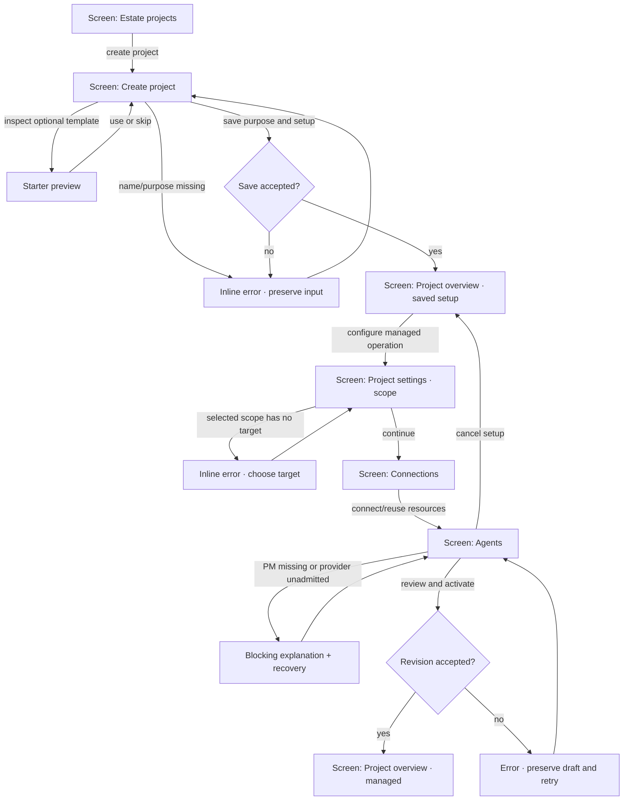
```mermaid
flowchart TD
  A[Screen: Estate projects] -->|create project| B[Screen: Create project]
  B -->|name/purpose missing| B_err[Inline error · preserve input]
  B_err --> B
  B -->|inspect optional template| T[Starter preview]
  T -->|use or skip| B
  C -->|selected scope has no target| C_err[Inline error · choose target]
  C_err --> C
  C -->|continue| D[Screen: Connections]
  D -->|connect/reuse resources| E[Screen: Agents]
  E -->|PM missing or provider unadmitted| E_err[Blocking explanation + recovery]
  E_err --> E
  B -->|save purpose and setup| S{Save accepted?}
  S -->|yes| P[Screen: Project overview · saved setup]
  S -->|no| B_err
  P -->|configure managed operation| C[Screen: Project settings · scope]
  E -->|cancel setup| P
  E -->|review and activate| F{Revision accepted?}
  F -->|yes| G[Screen: Project overview · managed]
  F -->|no| F_err[Error · preserve draft and retry]
  F_err --> E
```

- **Screens traversed:**
  | Screen | States used here |
  |---|---|
  | SCR-01 Estate projects | empty, success |
  | SCR-02 Create project | error, success |
  | SCR-12 Project settings | error, success |
  | SCR-06 Connections | empty, loading, error, success |
  | SCR-04 Agents | empty, error, success |
  | SCR-03 Project overview | loading, success |

### FLW-02: Add or replace a compatible agent
- **Traces:** ST-002, ST-006 (JTBD-01, JRN-01/#5)
- **Goal:** a project has a new agent binding while its routines and history remain intact
- **Entry points:** project Overview add-agent action; Agents screen; replace action on an agent
- **Success exit:** SCR-04 Agents with the new binding and affected routine assignments visible
- **Task analysis:**
  1. Choose the capability or role the project needs.
  2. Select an admitted compatible provider.
  3. Review terminal/runtime, project account pool and grants.
  4. Map routines from the replaced binding when applicable.
  5. Create a new configuration revision.
- **Rejected shape:** install provider directly from the catalog — lost because provider admission is not project access and would hide binding/grant decisions.
- **Flow:**

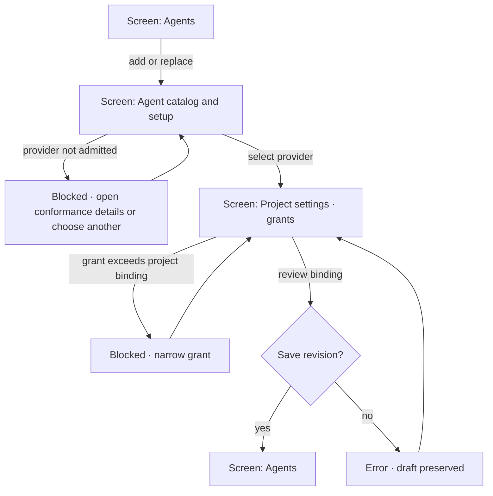
```mermaid
flowchart TD
  A[Screen: Agents] -->|add or replace| B[Screen: Agent catalog and setup]
  B -->|provider not admitted| B_err[Blocked · open conformance details or choose another]
  B_err --> B
  B -->|select provider| C[Screen: Project settings · grants]
  C -->|grant exceeds project binding| C_err[Blocked · narrow grant]
  C_err --> C
  C -->|review binding| D{Save revision?}
  D -->|yes| E[Screen: Agents]
  D -->|no| D_err[Error · draft preserved]
  D_err --> C
```

- **Screens traversed:**
  | Screen | States used here |
  |---|---|
  | SCR-04 Agents | empty, success |
  | SCR-05 Agent catalog and setup | loading, error, success |
  | SCR-12 Project settings | error, success |

### FLW-03: Connect an account and bind resources
- **Traces:** ST-003 (JTBD-01, JRN-01/#3..4)
- **Goal:** a project reuses one estate connection through an explicit resource and agent allowlist
- **Entry points:** project Connections; creation wizard Connections step
- **Success exit:** SCR-06 Connections with account subject, selected resources, health and eligible agents visible
- **Task analysis:**
  1. Reuse an existing estate connection or begin provider OAuth.
  2. Verify the returned external account subject.
  3. Select resources and access ceiling.
  4. Select eligible project agents.
  5. Save a new connection-binding revision.
- **Rejected shape:** asking every agent to log in independently — lost because it duplicates credentials, API collection and revocation paths.
- **Flow:**

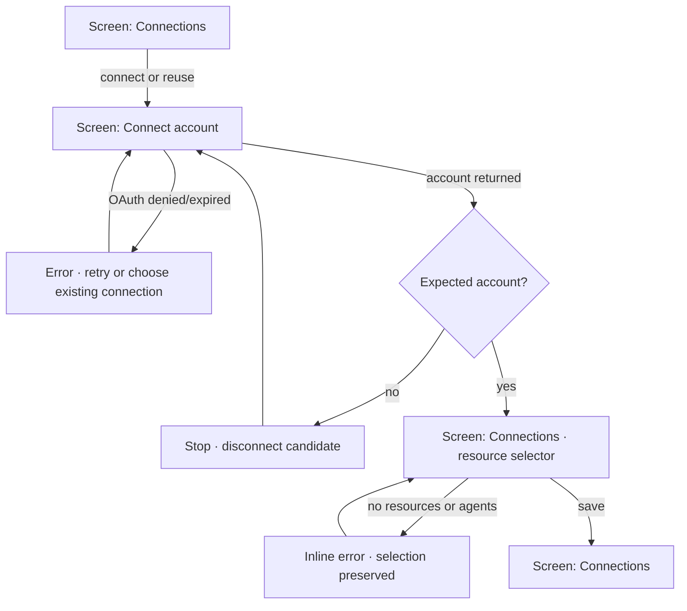
```mermaid
flowchart TD
  A[Screen: Connections] -->|connect or reuse| B[Screen: Connect account]
  B -->|OAuth denied/expired| B_err[Error · retry or choose existing connection]
  B_err --> B
  B -->|account returned| C{Expected account?}
  C -->|no| C_err[Stop · disconnect candidate]
  C_err --> B
  C -->|yes| D[Screen: Connections · resource selector]
  D -->|no resources or agents| D_err[Inline error · selection preserved]
  D_err --> D
  D -->|save| E[Screen: Connections]
```

- **Screens traversed:**
  | Screen | States used here |
  |---|---|
  | SCR-06 Connections | empty, loading, error, success |
  | SCR-07 Connect account | loading, error, success |

### FLW-04: Monitor projects and inspect a run
- **Traces:** ST-004, ST-005, ST-006 (JTBD-02, JRN-02/#1..3)
- **Goal:** the operator identifies one exception and reaches its evidence-backed run detail
- **Entry points:** application start; notification deep link; project card; global active-runs list
- **Success exit:** SCR-09 Run detail with result, proof, artifacts and recovery action understood
- **Task analysis:**
  1. Scan attention, health dimensions, current work and next runs across project cards.
  2. Open the affected project and compare active work, connections and reports.
  3. Open the run or routine responsible for the signal.
  4. Read typed result and receipts before transcript detail.
  5. Retry, pause, cancel or return without changing anything.
- **Rejected shape:** a single green/red project score — lost because stale data, repository absence and production failure require different actions and receipts.
- **Flow:**

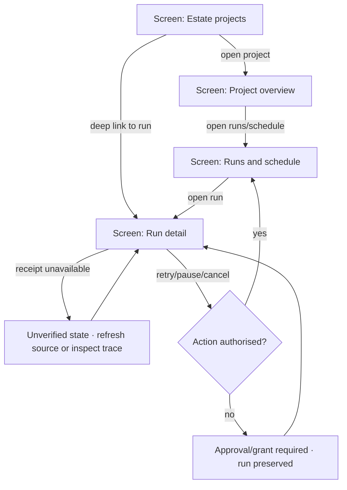
```mermaid
flowchart TD
  A[Screen: Estate projects] -->|open project| B[Screen: Project overview]
  A -->|deep link to run| D[Screen: Run detail]
  B -->|open runs/schedule| C[Screen: Runs and schedule]
  C -->|open run| D
  D -->|receipt unavailable| D_err[Unverified state · refresh source or inspect trace]
  D_err --> D
  D -->|retry/pause/cancel| E{Action authorised?}
  E -->|yes| C
  E -->|no| E_err[Approval/grant required · run preserved]
  E_err --> D
```

- **Screens traversed:**
  | Screen | States used here |
  |---|---|
  | SCR-01 Estate projects | loading, error, success |
  | SCR-03 Project overview | loading, error, success |
  | SCR-08 Runs and schedule | empty, loading, error, success |
  | SCR-09 Run detail | loading, error, success |

### FLW-05: Route and decide a cross-project finding
- **Traces:** ST-007 (JTBD-03, JRN-02/#3..5)
- **Goal:** the target project records one decision on an observer proposal without silent cross-project mutation
- **Entry points:** target project's attention queue; observer report; proposal notification
- **Success exit:** SCR-11 Proposal review with accepted/refused/superseded resolution linked to evidence
- **Task analysis:**
  1. Open the proposal in the target project's context.
  2. Verify source project, target, observations and requested outcome.
  3. Accept, refuse or supersede once.
  4. On acceptance, let the target PM create its own goal/graph.
  5. Return to both projects with the same resolution visible.
- **Rejected shape:** observer writes a target-project backlog node directly — lost because visibility would become decomposition authority.
- **Flow:**

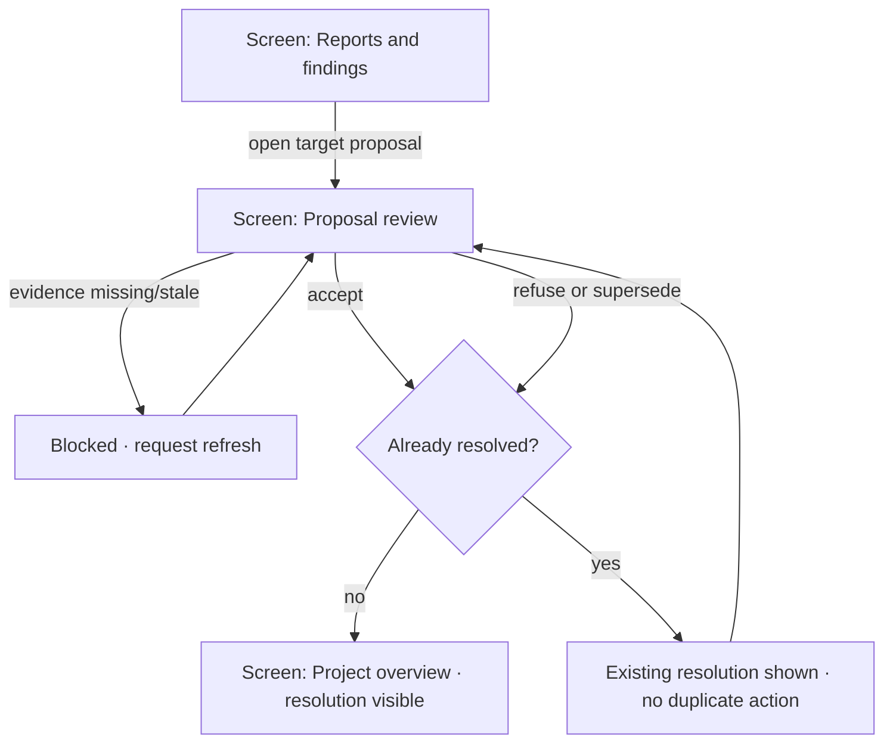
```mermaid
flowchart TD
  A[Screen: Reports and findings] -->|open target proposal| B[Screen: Proposal review]
  B -->|evidence missing/stale| B_err[Blocked · request refresh]
  B_err --> B
  B -->|accept| C{Already resolved?}
  B -->|refuse or supersede| C
  C -->|no| D[Screen: Project overview · resolution visible]
  C -->|yes| C_err[Existing resolution shown · no duplicate action]
  C_err --> B
```

- **Screens traversed:**
  | Screen | States used here |
  |---|---|
  | SCR-10 Reports and findings | empty, loading, error, success |
  | SCR-11 Proposal review | loading, error, success |
  | SCR-03 Project overview | success |

### FLW-06: Join an estate and resolve role work
- **Traces:** ST-008, ST-009 (JTBD-04, JRN-03/#1..5)
- **Goal:** a member understands their scope and resolves one addressed interaction with an attributable receipt
- **Entry points:** invitation deep link; notification deep link; role-workspace navigation
- **Success exit:** a current membership acceptance receipt and authorised work destination; when the later role-workspace capability is available, SCR-13 retains the resolved interaction receipt.
- **Task analysis:**
  1. Open SCR-14; if sign-in is required, preserve a safe return intent and restore the same invitation after authentication. Revalidate intended identity, expiry, revocation and current membership before exposing protected content.
  2. Review the actual estate scope and accept membership once. S09 v1 owner/member visibility is estate-wide; open an authorised project or, when available, the later role workspace.
  3. Select an addressed item by urgency/SLA.
  4. Inspect typed context, evidence, requester and allowed resolution paths.
  5. Submit or delegate one resolution after reviewing any external effect.
  6. Verify the append-only receipt and return to the queue.
- **Rejected shape:** exposing the owner dashboard with controls hidden — lost because hidden controls do not remove overbroad context or authorization ambiguity.
- **Flow:**

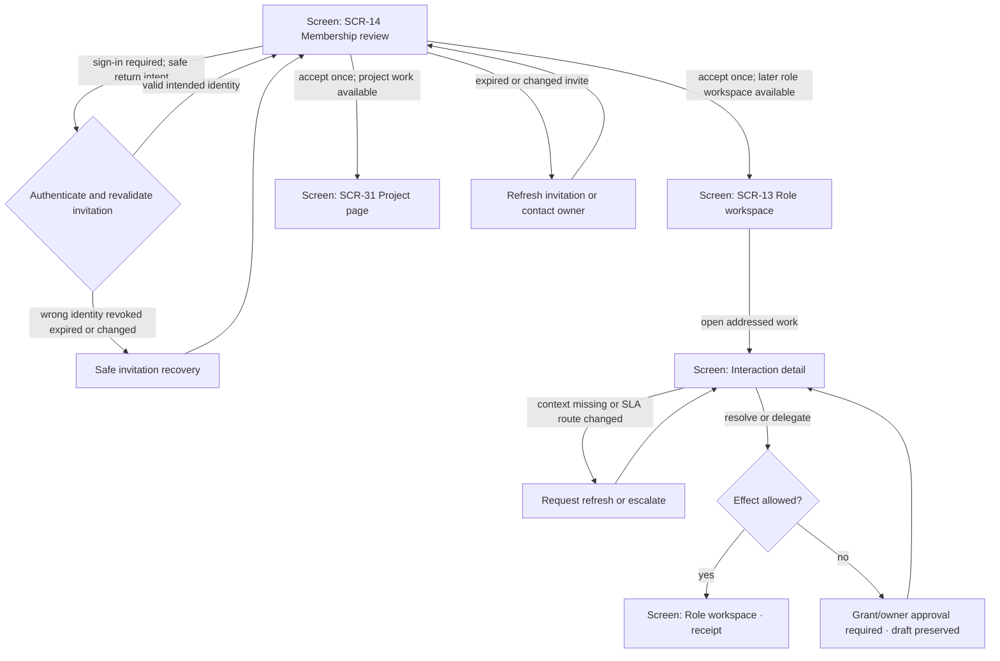
```mermaid
flowchart TD
  A[Screen: SCR-14 Membership review] -->|sign-in required; safe return intent| H{Authenticate and revalidate invitation}
  H -->|valid intended identity| A
  H -->|wrong identity revoked expired or changed| H_err[Safe invitation recovery]
  H_err --> A
  A -->|accept once; later role workspace available| B[Screen: SCR-13 Role workspace]
  A -->|accept once; project work available| P[Screen: SCR-31 Project page]
  A -->|expired or changed invite| A_err[Refresh invitation or contact owner]
  A_err --> A
  B -->|open addressed work| C[Screen: Interaction detail]
  C -->|context missing or SLA route changed| C_err[Request refresh or escalate]
  C_err --> C
  C -->|resolve or delegate| D{Effect allowed?}
  D -->|yes| E[Screen: Role workspace · receipt]
  D -->|no| D_err[Grant/owner approval required · draft preserved]
  D_err --> C
```

- **Screens traversed:**
  | Screen | States used here |
  |---|---|
  | SCR-13 Role workspace | empty, loading, error, success |
  | SCR-14 Membership and interaction detail | auth-return, loading, expired, revoked, wrong-identity, error, success |
  | SCR-31 Project page | authorised project work |
- **Target membership extension:** SCN-066; S09/S02/S03 govern auth-return and current authority. A project filter is not project-private membership.

### FLW-07: Bring an existing or new agent
- **Traces:** ST-010, ST-011 (JTBD-05, JRN-04/#1..5)
- **Goal:** one exact provider revision reaches admission and an optional canary project binding without copied prompt text receiving authority
- **Entry points:** Agent catalog empty state; Add provider; project Add agent when no admitted match exists
- **Success exit:** SCR-16 Conformance and admission with admitted revision or precise recoverable failed gate
- **Task analysis:**
  1. Choose Adapt existing or Create new and name the capability/consumer.
  2. Select source/profile and generate a pinned recipe.
  3. Copy the recipe into the coding agent and review its dry-run change plan.
  4. Run adaptation/creation and local fixtures; return the signed report/bundle.
  5. Run independent conformance and inspect each gate.
  6. Admit the exact revision, then separately review project scope/effects and canary.
- **Rejected shape:** one Paste prompt and install action — lost because generation, compatibility, estate trust and project authority are four different decisions.
- **Flow:**

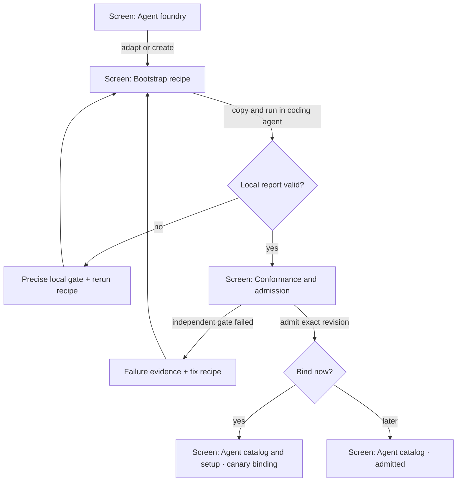
```mermaid
flowchart TD
  A[Screen: Agent foundry] -->|adapt or create| B[Screen: Bootstrap recipe]
  B -->|copy and run in coding agent| C{Local report valid?}
  C -->|no| C_err[Precise local gate + rerun recipe]
  C_err --> B
  C -->|yes| D[Screen: Conformance and admission]
  D -->|independent gate failed| D_err[Failure evidence + fix recipe]
  D_err --> B
  D -->|admit exact revision| E{Bind now?}
  E -->|yes| F[Screen: Agent catalog and setup · canary binding]
  E -->|later| G[Screen: Agent catalog · admitted]
```

- **Screens traversed:**
  | Screen | States used here |
  |---|---|
  | SCR-15 Agent foundry and bootstrap | loading, error, success |
  | SCR-16 Conformance and admission | loading, error, success |
  | SCR-05 Agent catalog and setup | empty, loading, error, success |

### FLW-08: Compose a role workspace
- **Traces:** ST-012 (JTBD-06, JRN-03/#2..4)
- **Goal:** an owner publishes a role layout whose views have explicit scope, fallback and responsive behaviour
- **Entry points:** role workspace Edit layout; project provider-view catalog
- **Success exit:** SCR-17 Workspace editor with a new published layout revision
- **Task analysis:**
  1. Choose an estate/project role and inspect its current layout.
  2. Add an admitted provider view or built-in projection.
  3. Review requested data, tools, eligibility and structured fallback.
  4. Place/size it on the constrained grid, reorder it in the canonical keyboard/focus
     sequence and preview narrow linearization plus unavailable-extension fallback.
  5. Save a new layout revision and inspect it as the target role.
- **Rejected shape:** free-form canvas, provider-controlled placement or arbitrary iframe URLs — lost because overlapping/pixel-positioned views cannot preserve deterministic narrow reflow, semantic focus order, context scope or fallback.
- **Flow:**

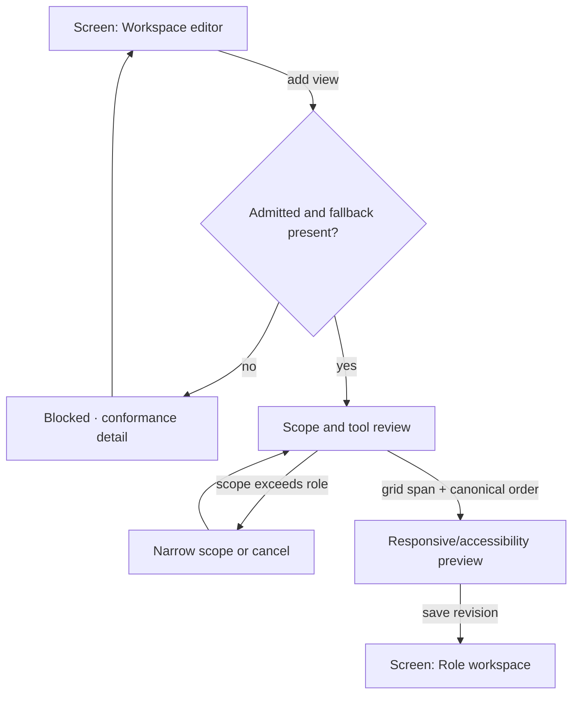
```mermaid
flowchart TD
  A[Screen: Workspace editor] -->|add view| B{Admitted and fallback present?}
  B -->|no| B_err[Blocked · conformance detail]
  B_err --> A
  B -->|yes| C[Scope and tool review]
  C -->|scope exceeds role| C_err[Narrow scope or cancel]
  C_err --> C
  C -->|grid span + canonical order| D[Responsive/accessibility preview]
  D -->|save revision| E[Screen: Role workspace]
```

- **Screens traversed:**
  | Screen | States used here |
  |---|---|
  | SCR-17 Workspace editor | empty, loading, error, success |
  | SCR-13 Role workspace | loading, error, success |

### FLW-09: Resolve a customer request with human fallback
- **Traces:** ST-013 (JTBD-07, JRN-03/#2..5)
- **Goal:** one inbound request receives an attributable safe response or one role-addressed escalation and final receipt
- **Entry points:** mailbox/chat webhook; support inbox; member notification
- **Success exit:** SCR-18 Support inbox with request resolved and response/effect receipt linked
- **Task analysis:**
  1. Normalize and deduplicate the inbound request against customer/account context.
  2. Let the support provider answer only inside its knowledge and effect ceiling.
  3. Route sensitive, uncertain or effect-bearing work to a typed interaction point.
  4. Let the support member review context and submit/approve the response.
  5. Send through the estate Connection and verify the delivery/effect receipt.
- **Rejected shape:** agent writes directly from the mailbox and escalates by forwarding email — lost because identity, duplication, policy and resolution become untraceable.
- **Flow:**

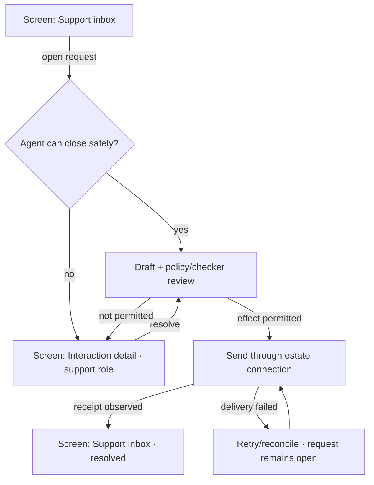
```mermaid
flowchart TD
  A[Screen: Support inbox] -->|open request| B{Agent can close safely?}
  B -->|yes| C[Draft + policy/checker review]
  B -->|no| D[Screen: Interaction detail · support role]
  D -->|resolve| C
  C -->|effect permitted| E[Send through estate connection]
  C -->|not permitted| D
  E -->|receipt observed| F[Screen: Support inbox · resolved]
  E -->|delivery failed| E_err[Retry/reconcile · request remains open]
  E_err --> E
```

- **Screens traversed:**
  | Screen | States used here |
  |---|---|
  | SCR-18 Support inbox | empty, loading, error, success |
  | SCR-14 Membership and interaction detail | loading, error, success |
  | SCR-09 Run detail | loading, error, success |

### FLW-10: Diagnose, release and verify a production fix
- **Traces:** ST-014 (JTBD-02, JTBD-07, JRN-02/#1..5)
- **Goal:** a sourced failure becomes a checked release and closes only after a post-release observation
- **Entry points:** production alert; crash/log finding; customer-linked incident
- **Success exit:** SCR-19 Work graph and release with recovery observation linked
- **Task analysis:**
  1. Open the sourced finding and deterministic target-project route.
  2. Accept into the product PM's graph and preserve the original receipt.
  3. Execute reproduce, diagnose, implement, test and review nodes with independent gates.
  4. Review the production effect and applicable grant.
  5. Release, monitor and close only on observed recovery or reopen on regression.
- **Rejected shape:** developer takes a bug from a shared backlog and marks it done after merge — lost because routing authority, release authority and operational recovery are different facts.
- **Flow:**

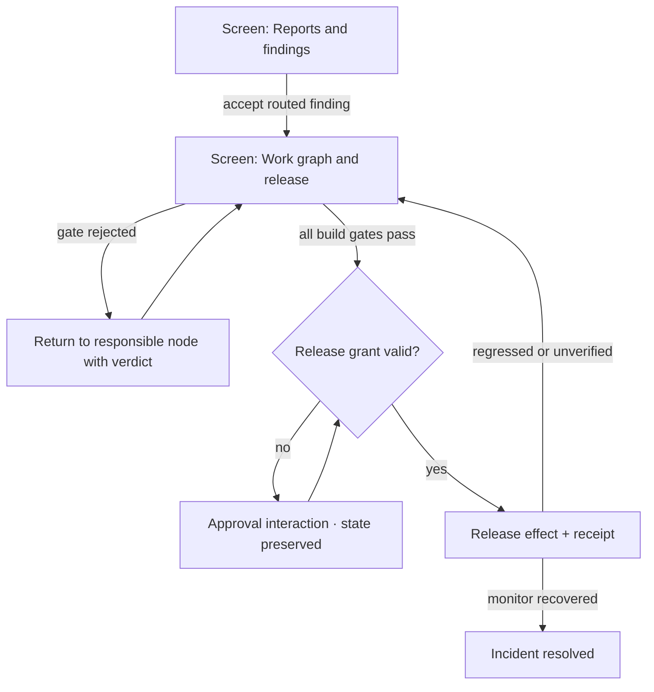
```mermaid
flowchart TD
  A[Screen: Reports and findings] -->|accept routed finding| B[Screen: Work graph and release]
  B -->|gate rejected| B_err[Return to responsible node with verdict]
  B_err --> B
  B -->|all build gates pass| C{Release grant valid?}
  C -->|no| C_err[Approval interaction · state preserved]
  C_err --> C
  C -->|yes| D[Release effect + receipt]
  D -->|monitor recovered| E[Incident resolved]
  D -->|regressed or unverified| B
```

- **Screens traversed:**
  | Screen | States used here |
  |---|---|
  | SCR-10 Reports and findings | loading, error, success |
  | SCR-19 Work graph and release | loading, error, success |
  | SCR-09 Run detail | loading, error, success |
  | SCR-14 Membership and interaction detail | loading, error, success |

### FLW-11: Research, validate, publish and measure content
- **Traces:** ST-015 (JTBD-07, JRN-02/#3..5)
- **Goal:** one sourced opportunity becomes channel-ready content, governed publication and measured feedback
- **Entry points:** scheduled research routine; manual campaign brief; SEO finding
- **Success exit:** SCR-20 Content cycle with publication receipt and next measurement scheduled
- **Task analysis:**
  1. Review research topics with sources, freshness and project relevance.
  2. Accept one topic and generate channel-specific drafts from approved project facts.
  3. Run editorial/SEO/channel checks independently of the writer.
  4. Review publication identity, account, schedule and effect grant.
  5. Publish through the estate Connection and attach receipts.
  6. Ingest analytics/Search Console observations into the next routine/backlog.
- **Rejected shape:** researcher posts directly or SEO writes development tasks — lost because discovery, editorial authority, public identity and target-project decomposition are separate roles.
- **Flow:**

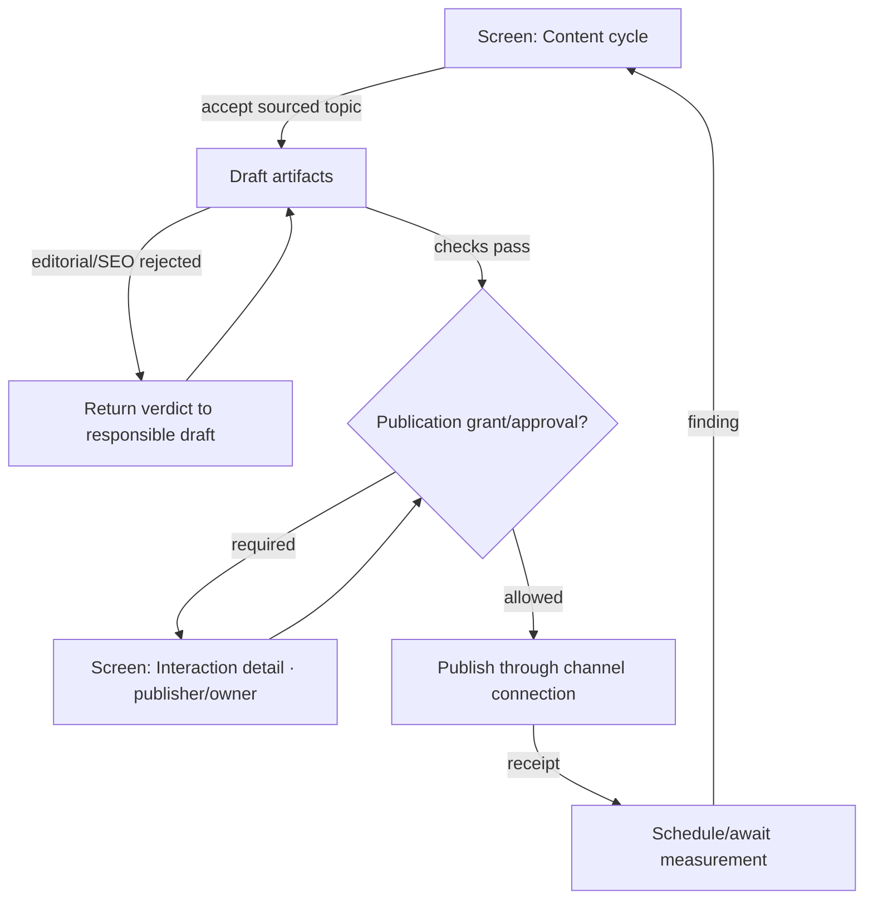
```mermaid
flowchart TD
  A[Screen: Content cycle] -->|accept sourced topic| B[Draft artifacts]
  B -->|editorial/SEO rejected| B_err[Return verdict to responsible draft]
  B_err --> B
  B -->|checks pass| C{Publication grant/approval?}
  C -->|required| D[Screen: Interaction detail · publisher/owner]
  D --> C
  C -->|allowed| E[Publish through channel connection]
  E -->|receipt| F[Schedule/await measurement]
  F -->|finding| A
```

- **Screens traversed:**
  | Screen | States used here |
  |---|---|
  | SCR-20 Content cycle | empty, loading, error, success |
  | SCR-14 Membership and interaction detail | loading, error, success |
  | SCR-10 Reports and findings | loading, error, success |

### FLW-12: Connect and govern an external MCP agent
- **Traces:** ST-016 (JTBD-08, JRN-05/#1..5)
- **Goal:** one external MCP client can use only the reviewed Projects and operations, with every call attributable and access revocable
- **Entry points:** Estate settings -> MCP access; Project settings -> External access; empty-state action
- **Success exit:** SCR-22 MCP access detail shows a successful discovery/call receipt or a confirmed revocation with its effect on in-flight work
- **Task analysis:**
  1. Create MCP access and select an explicit finite Project set.
  2. Select resource/command scopes, effect ceiling and expiry; review what is excluded.
  3. Create the binding and copy the credential plus client configuration from the one-time reveal.
  4. Connect the external agent and test authorized discovery.
  5. Observe its reads, submissions and Run admissions through receipts.
  6. Rotate the credential or revoke access; separately cancel a Run when required.
- **Rejected shape:** one Estate administrator token with Project ids supplied only in tool arguments — lost because adding a Project would silently increase blast radius and a caller could change the argument without changing authority.
- **Flow:**

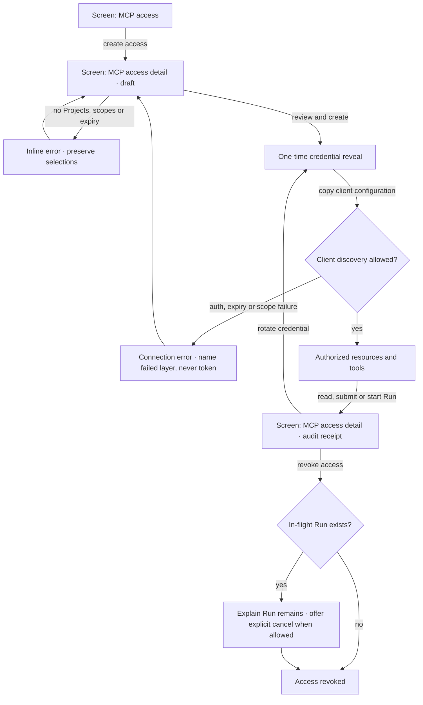
```mermaid
flowchart TD
  A[Screen: MCP access] -->|create access| B[Screen: MCP access detail · draft]
  B -->|no Projects, scopes or expiry| B_err[Inline error · preserve selections]
  B_err --> B
  B -->|review and create| C[One-time credential reveal]
  C -->|copy client configuration| D{Client discovery allowed?}
  D -->|auth, expiry or scope failure| D_err[Connection error · name failed layer, never token]
  D_err --> B
  D -->|yes| E[Authorized resources and tools]
  E -->|read, submit or start Run| F[Screen: MCP access detail · audit receipt]
  F -->|rotate credential| C
  F -->|revoke access| G{In-flight Run exists?}
  G -->|no| H[Access revoked]
  G -->|yes| I[Explain Run remains · offer explicit cancel when allowed]
  I --> H
```

- **Screens traversed:**
  | Screen | States used here |
  |---|---|
  | SCR-21 MCP access | loading, empty, error, success |
  | SCR-22 MCP access detail | loading, one-time-reveal, error, success, revoked |
  | SCR-09 Run detail | loading, error, success |

### FLW-13: Open a project terminal and work inside the product
- **Retired with SCR-23, 2026-08-31 — recorded here 2026-09-11 (UXA-C06).** `screens.md` has
  said "FLW-13 retired with it" since the terminal became a detached window, and this record
  went on describing a Terminal tab as a live route. Sessions open in SCR-25, reached by
  FLW-16. Kept, not deleted: the task analysis below is the reasoning SCR-25 came out of, and
  a flow removed from the file is a flow nobody can check the successor against.
- **Traces:** ST-017 (JTBD-02, JRN-02/#1)
- **Goal:** the operator works in a real Claude Code session without leaving the product
- **Entry points:** project card; project overview terminal tab; keyboard shortcut
- **Success exit:** a live PTY session in the project's cwd, typed into, surviving a window reload
- **Task analysis:**
  1. Open the project and its Terminal tab.
  2. The session starts in the bound repository's directory; `terminal.opened` is journalled.
  3. Work interactively; output streams into the tab.
  4. Close or reload the window; reopen reattaches to the running session.
  5. End the session; `terminal.closed` is journalled and the transcript is captured (slice 2).
- **Rejected shape:** a read-only transcript viewer as the primary surface — lost because ADR-0008 requires the session the agent actually runs in, typeable, inside the product.
- **Flow:**

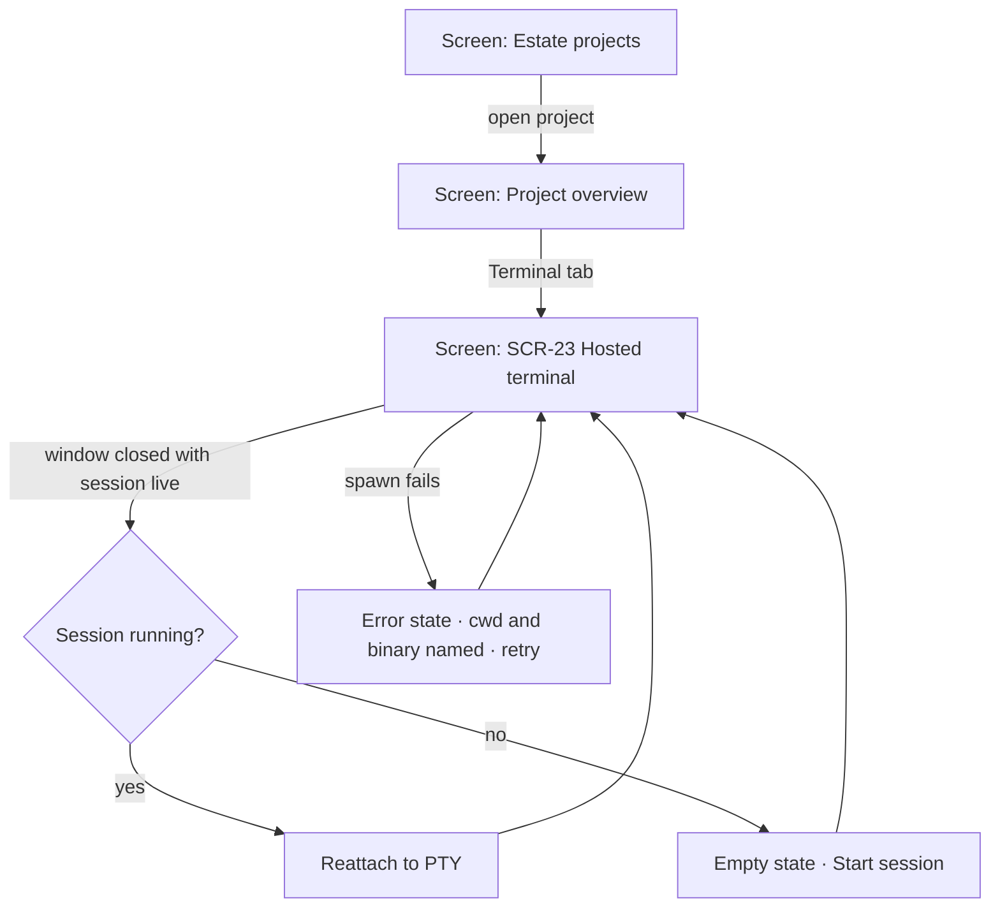
```mermaid
flowchart TD
  A[Screen: Estate projects] -->|open project| B[Screen: Project overview]
  B -->|Terminal tab| C[Screen: SCR-23 Hosted terminal]
  C -->|window closed with session live| D{Session running?}
  D -->|yes| C2[Reattach to PTY]
  C2 --> C
  D -->|no| C3[Empty state · Start session]
  C3 --> C
  C -->|spawn fails| C_err[Error state · cwd and binary named · retry]
  C_err --> C
```

- **Screens traversed:**
  | Screen | States used here |
  |---|---|
  | SCR-01 Estate projects | success |
  | SCR-03 Project overview | success |
  | SCR-23 Hosted terminal | empty, loading, error, success, reattached |

### FLW-14: Answer the approval queue
- **Traces:** ST-018 (JTBD-02, JRN-02/#2)
- **Goal:** one queue holds every question the fabric may not answer itself, and each resolution resumes its node with a receipt
- **Entry points:** queue badge; notification deep link; run detail's blocked state
- **Success exit:** the question resolved, the node resumed or the refusal recorded, receipt visible
- **Task analysis:**
  1. Open the queue; items are ordered by wait time and SLA.
  2. Open one item: node, goal, autonomy level, requested action class, evidence.
  3. Resolve — approve (a one-shot grant where floored), refuse, or answer the choice.
  4. The node resumes from its checkpoint; the resolution and receipt are journalled.
  5. A floored action with no grant shows as an automatic refusal, not a pending item.
- **Rejected shape:** per-channel ad-hoc prompts (native dialogs, chat messages) — lost because approvals must return through the same channel that asked and leave one auditable trail (ADR-0007; vision step 4).
- **Flow:**

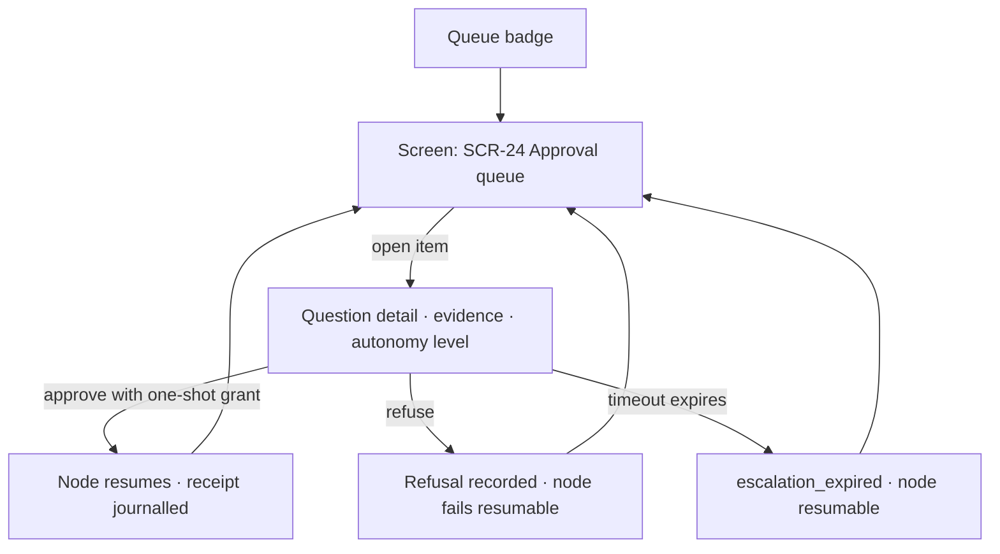
```mermaid
flowchart TD
  A[Queue badge] --> B[Screen: SCR-24 Approval queue]
  B -->|open item| C[Question detail · evidence · autonomy level]
  C -->|approve with one-shot grant| D[Node resumes · receipt journalled]
  C -->|refuse| E[Refusal recorded · node fails resumable]
  C -->|timeout expires| F[escalation_expired · node resumable]
  D --> B
  E --> B
  F --> B
```

- **Screens traversed:**
  | Screen | States used here |
  |---|---|
  | SCR-24 Approval queue | empty, loading, error, success |
  | SCR-09 Run detail | success |

### FLW-15: Open and configure a project tab
- **Traces:** ST-001, ST-019 (JTBD-01, JTBD-02)
- **Goal:** the operator opens a project as a tab and changes its configuration as a recorded revision
- **Entry points:** estate home empty state; project card; tab bar
- **Success exit:** the project tab shows the new configuration and the revision incremented
- **Task analysis:**
  1. Read the estate home: projects, or the empty state that explains what one is.
  2. Create or open a project; it becomes a tab.
  3. Open Settings on the header; edit name, purpose or repository path.
  4. Save; the change is journalled and the revision moves.
  5. Close the tab without affecting the project or its sessions.
- **Rejected shape:** a modal settings dialog per project — lost because the header is where the operator already reads those three facts, and a modal hides the revision they are changing.
- **Flow:**

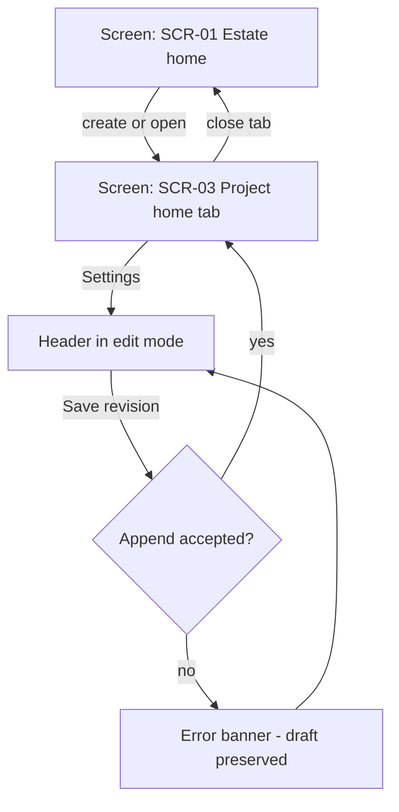
```mermaid
flowchart TD
  A[Screen: SCR-01 Estate home] -->|create or open| B[Screen: SCR-03 Project home tab]
  B -->|Settings| C[Header in edit mode]
  C -->|Save revision| D{Append accepted?}
  D -->|yes| B
  D -->|no| C_err[Error banner - draft preserved]
  C_err --> C
  B -->|close tab| A
```

- **Screens traversed:**
  | Screen | States used here |
  |---|---|
  | SCR-01 Estate projects | empty, success |
  | SCR-03 Project overview | loading, error, success |

### FLW-16: Launch an agent and work in its window
- **Traces:** ST-017, ST-020 (JTBD-02, JTBD-05)
- **Goal:** the operator starts a session and reaches a full terminal without losing the project view
- **Entry points:** project home Agents section; agent tile
- **Success exit:** a live session window plus a tile on the project page showing its state
- **Task analysis:**
  1. Pick the launch option; unavailable ones are visibly disabled.
  2. Launch; the session starts in the project's directory and opens in its own window.
  3. Work in the window; the project tab keeps showing the tile with state and last output.
  4. Close the window; the session keeps running and can be reopened from its tile.
  5. End the session from the tile when the work is done.
- **Rejected shape:** terminals as top-level tabs — lost because the top level is projects, and a terminal belongs to the project that owns its directory and its journal events.
- **Flow:**

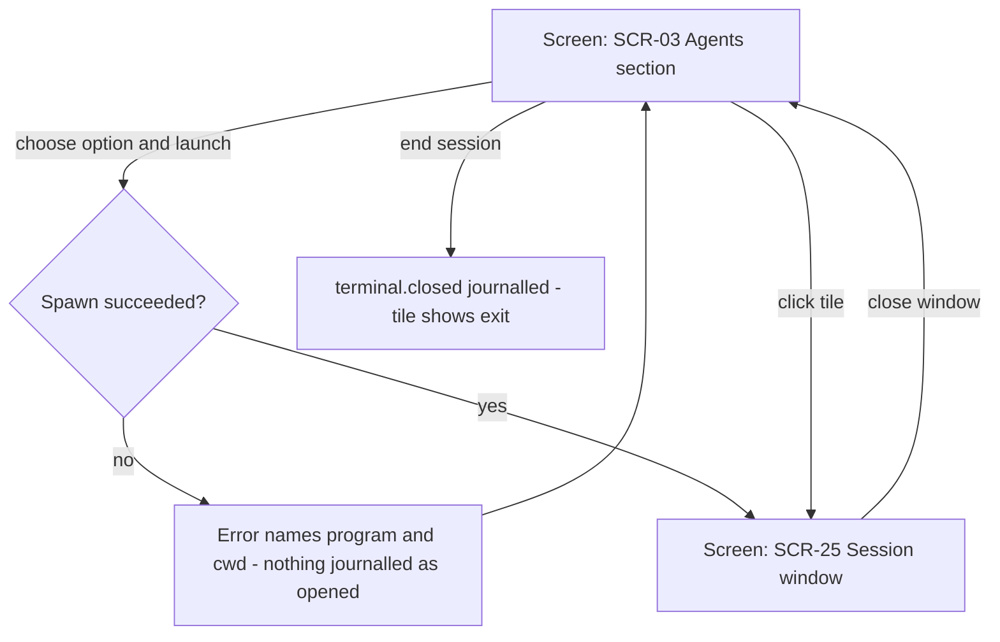
```mermaid
flowchart TD
  A[Screen: SCR-03 Agents section] -->|choose option and launch| B{Spawn succeeded?}
  B -->|no| A_err[Error names program and cwd - nothing journalled as opened]
  A_err --> A
  B -->|yes| C[Screen: SCR-25 Session window]
  C -->|close window| A
  A -->|click tile| C
  A -->|end session| D[terminal.closed journalled - tile shows exit]
```

- **Screens traversed:**
  | Screen | States used here |
  |---|---|
  | SCR-03 Project overview | empty, success, error |
  | SCR-25 Session window | loading, success, ended |

### FLW-17: Read the workspace canvas
- **Traces:** ST-021 (JTBD-02, JTBD-06)
- **Goal:** the operator reads project state on one canvas whose slots providers can later render into
- **Entry points:** project home Workspace panel
- **Success exit:** the canvas renders its widgets, each fact traceable
- **Task analysis:**
  1. Open the canvas from the project home.
  2. Read agents, activity and the results slot.
  3. Return to the project home; the layout revision is unchanged by reading.
- **Rejected shape:** a free-form spatial canvas in v1 — lost to ADR-0024: a constrained grid keeps keyboard order, linearization and admitted spans decidable.
- **Flow:**

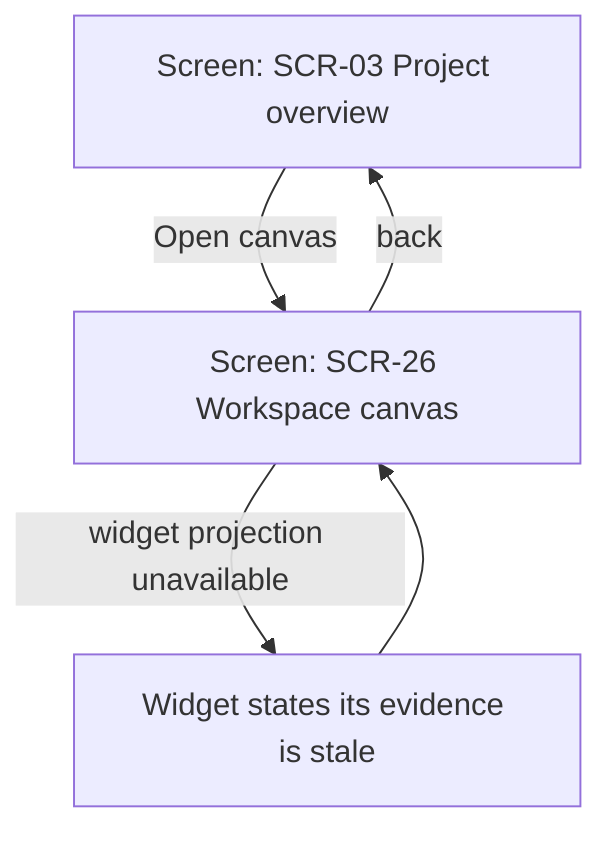
```mermaid
flowchart TD
  A[Screen: SCR-03 Project overview] -->|Open canvas| B[Screen: SCR-26 Workspace canvas]
  B -->|widget projection unavailable| B_err[Widget states its evidence is stale]
  B_err --> B
  B -->|back| A
```

- **Screens traversed:**
  | Screen | States used here |
  |---|---|
  | SCR-03 Project overview | success |
  | SCR-26 Workspace canvas | empty, success, error |

### FLW-18: Onboard a project and take the first step
- **Traces:** ST-001, ST-022, ST-023 (JTBD-01, JTBD-02)
- **Goal:** an operator reaches a durable project and the first inspectable work intent through progressive setup.
- **Entry points:** first launch; global add; empty Estate; persona save/skip; Help resume; legacy onboarding URL; restored local onboarding draft. Target aliases preserve Estate/draft identity.
- **Success exit:** the draft becomes a project tab; the first Task and any attempted execution receipts are inspectable through FLW-32.
- **Task analysis:**
  1. Open or resume the project draft and state its name/purpose. Restored drafts and input begun during hydration are merged by independent identity; missing file permits first save, unreadable file blocks persistence and shows recovery status.
  2. Attach repositories now if applicable, or explicitly defer them; no executable context is inferred from a missing repository.
  3. Inspect memory and runner availability without needing to complete a full organisation or connect external accounts.
  4. Save with stable project/command identity; preserve fields on refusal, conflict or unknown outcome.
  5. Record the first task on SCR-32, then follow FLW-32/SCN-067 if execution is requested.
- **Adoption boundary:** FLW-01 is the optional complete starter/organisation branch. Repo-less intent can be saved; starting a runner requires its actual certified execution context, scope and readiness.
- **Target AD03:** aliases share one page-local draft/review/create authority. Idea excludes old repo before duplicate lookup; optional advanced setup reuses the same review. Help resumes exact scope/draft/step. This prototype authority is not a new native store.
- **Implementation qualification:** Existing Onboarding/Tasks UI is partial coverage, not proof of the target durable admission semantics. In the target, spawn failure after admission belongs to its TaskRun; it is never represented as if no accepted work existed.
- **Flow:**

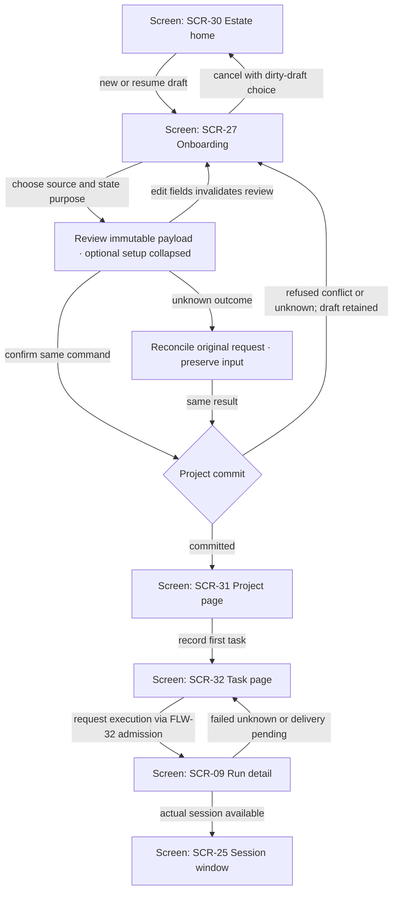
```mermaid
flowchart TD
  A[Screen: SCR-30 Estate home] -->|new or resume draft| B[Screen: SCR-27 Onboarding]
  B -->|cancel with dirty-draft choice| A
  B -->|choose source and state purpose| V[Review immutable payload · optional setup collapsed]
  V -->|edit fields invalidates review| B
  V -->|confirm same command| C{Project commit}
  V -->|unknown outcome| U[Reconcile original request · preserve input]
  U -->|same result| C
  C -->|refused conflict or unknown; draft retained| B
  C -->|committed| P[Screen: SCR-31 Project page]
  P -->|record first task| T[Screen: SCR-32 Task page]
  T -->|request execution via FLW-32 admission| R[Screen: SCR-09 Run detail]
  R -->|actual session available| S[Screen: SCR-25 Session window]
  R -->|failed unknown or delivery pending| T
```

- **Screens traversed:**
  | Screen | States used here |
  |---|---|
  | SCR-30 Estate home | empty, success |
  | SCR-27 Onboarding | draft, resumed, error, success |
  | SCR-31 Project page | first step, success |
  | SCR-32 Task page | draft, task-recorded, readiness |
  | SCR-09 Run detail | admitted, failed, unknown, delivery pending |
  | SCR-25 Session window | loading, success, ended |

### FLW-19: Open a file and resolve a conflicting save
- **Traces:** ST-025 (JTBD-02)
- **Goal:** the operator corrects a file beside working agents without either side losing work
- **Entry points:** the Files tree on the project home
- **Success exit:** the file saved, with any conflict resolved by an explicit choice
- **Task analysis:**
  1. Click a file in the tree; it opens in its own window and the content hash is remembered.
  2. Edit; the header marks the buffer unsaved.
  3. Save. If the file on disk still matches what was read, it is written.
  4. If it does not, nothing is written: a banner explains and a diff shows both versions.
  5. Choose the version on disk, or keep your own and save over it.
- **Rejected shape:** locking the file while any session is live — lost because agents work in these repositories constantly, so the editor would be read-only nearly always.
- **Flow:**

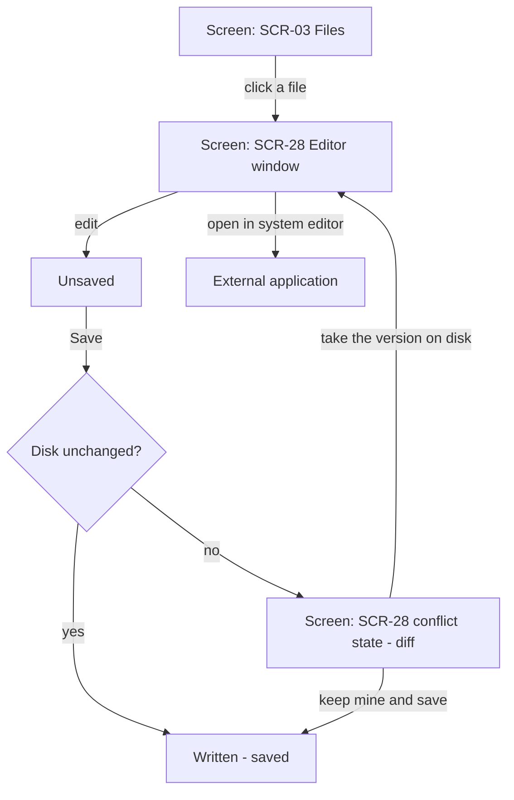
```mermaid
flowchart TD
  A[Screen: SCR-03 Files] -->|click a file| B[Screen: SCR-28 Editor window]
  B -->|edit| C[Unsaved]
  C -->|Save| D{Disk unchanged?}
  D -->|yes| E[Written - saved]
  D -->|no| F[Screen: SCR-28 conflict state - diff]
  F -->|take the version on disk| B
  F -->|keep mine and save| E
  B -->|open in system editor| G[External application]
```

- **Screens traversed:**
  | Screen | States used here |
  |---|---|
  | SCR-03 Project overview | success |
| SCR-28 Editor window | loading, success, unsaved, conflict, error |

### FLW-20: Evaluate PassionCode.ai from the public page
- **Traces:** ST-027 (JTBD-09, JRN-06/#1..5)
- **Goal:** the reader understands the category shift, current status and next reading path
- **Entry points:** domain, social preview, organization profile, repository README
- **Success exit:** GitHub organization opened or repository map understood
- **Task analysis:**
  1. Read the category transition and primary positioning.
  2. Compare agent-by-agent coordination with Project-level operation.
  3. Inspect what persists inside a Project and how the operating loop closes.
  4. Check the agent-agnostic and human-authority boundaries.
  5. Confirm current status and choose the organization or a repository role.
- **Rejected shape:** a product screenshot carousel — lost because no hosted surface is publicly available and screenshots would make the interface, not the operating-unit shift, the promise.
- **Flow:**

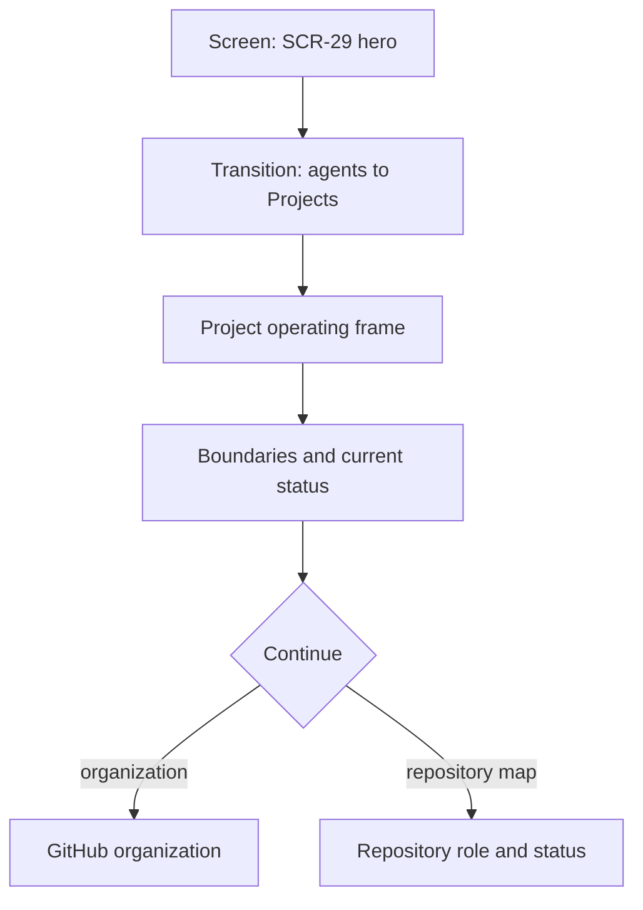
```mermaid
flowchart TD
  A[Screen: SCR-29 hero] --> B[Transition: agents to Projects]
  B --> C[Project operating frame]
  C --> D[Boundaries and current status]
  D --> E{Continue}
  E -->|organization| F[GitHub organization]
  E -->|repository map| G[Repository role and status]
```

- **Screens traversed:**
  | Screen | States used here |
  |---|---|
  | SCR-29 Public landing page | success, image unavailable, narrow viewport, reduced motion |

### FLW-21: Open the estate and reach what needs you
- **Traces:** ST-032, ST-033, ST-028 (JTBD-02)
- **Goal:** the operator sees who is waiting, opens the right project, and can read the estate's own record and a project's memory without hunting
- **Entry points:** application launch; the manager control on any screen
- **Success exit:** the operator is inside the project that needed them, or has answered what was waiting
- **Task analysis:**
  1. Launch; favourites lead and a project with an agent waiting sorts up.
  2. Read the live feed; a question addressed to the operator is visibly different from progress.
  3. Click the feed row; the agent that raised it opens.
  4. Or open the manager profile to see what the estate has actually done.
  5. Or open a project's memory to see what it knows and what it failed to answer.
- **Rejected shape:** a notification centre separate from the feed — lost because two lists of the same events drift, and the operator learns to read only one.
- **Flow:**

```mermaid
flowchart TD
  A[Screen: SCR-30 Estate home] -->|attention count| Q[Screen: SCR-24 Approval queue]
  Q -->|approve or answer| A
  A -->|agents| G[Screen: SCR-39 Estate agents]
  G -->|open its task| T2[Screen: SCR-32 Task page]
  A -->|search| S[Screen: SCR-37 Search results]
  S -->|open a result| D
  A -->|attention count| B{Anything waiting?}
  B -->|yes| C[Screen: SCR-25 Session window]
  B -->|no| D[Screen: SCR-31 Project page]
  A -->|manager profile| E[Screen: SCR-36 Manager profile]
  D -->|memory| F[Screen: SCR-34 Project memory]
  A -->|open chat| A
```

### FLW-22: Work a task through its own page
- **Traces:** ST-030, ST-034 (JTBD-02, JTBD-07)
- **Goal:** a task carries its own context, agents fill it as they work, and the operator can correct it without overwriting them
- **Entry points:** a card on the board; a task's address; the manager chat scoped to a task
- **Success exit:** the task is understandable cold, and anything durable it produced has moved to project memory
- **Task analysis:**
  1. Open a card from the board; the task page states what, why and the expected result.
  2. Correct the reasoning; the operator's version stands and the agent's stays readable.
  3. Add a note, or read the ones agents left; notes are append-only.
  4. Promote a note that will outlive the task; it moves to memory and the page keeps a link.
  5. Read what the task did outside — its receipts — and follow one to the journal row.
- **Rejected shape:** a single editable document per task — lost because two writers on one blob lose work silently; sections with owners do not.
- **Flow:**

```mermaid
flowchart TD
  A[Screen: SCR-31 Project page] -->|click a card| B[Screen: SCR-32 Task page]
  B -->|edit the brief| B
  B -->|promote a note| C[Screen: SCR-34 Project memory]
  B -->|open the session| D[Screen: SCR-25 Session window]
  B -->|back| A
```

### FLW-23: Judge direction from the plan
- **Traces:** ST-035 (JTBD-02, JTBD-07)
- **Goal:** the operator reads where the work is going, not only where it is
- **Entry points:** the plan widget on the project page
- **Success exit:** the operator can name the next task before a goal closes, and can see work that belongs to no goal
- **Task analysis:**
  1. Open target-plan revision.
  2. Inspect declared dependencies and retained completed membership.
  3. Assign orphan tasks through the existing command.
  4. Open exact task and restore selection on return.
  5. Navigate to separately addressed Project history when asking what happened.
- **Rejected shape:** a Gantt over dates — lost because nothing here has reliable dates, and a chart of invented dates reads as a plan.
- **Flow:**

```mermaid
flowchart TD
 A[Screen: SCR-31 Project page] -->|target-plan preview| P[Screen: SCR-40 Target plan destination]
 P -->|open task| T[Screen: SCR-32 Task page]
 P -->|declare dependency| C{Dependency cycle check}
 C -->|refused with relation| P
 C -->|accepted and journalled| P
 T -->|back restores revision| P
 P -->|separate Project history route| H[Screen: SCR-40 Project history destination]
```
- **Target migration:** SCR-40 and SCN-053 describe separate routes. The current PlanSection is legacy preview coverage until M190.

### FLW-24: Set up a project's harness and hold agents to it
- **Traces:** ST-036, ST-031 (JTBD-05, JTBD-07)
- **Goal:** what agents may do in a project is visible, and the contract they follow is the tool list rather than a document
- **Entry points:** the harness panel on the project page; the manager chat
- **Success exit:** an agent is bound with its mandatory skill and either runs or names the grant it is waiting for
- **Task analysis:**
  1. Open the harness; agents, skills and servers are listed with grant state.
  2. Add an agent through the manager; the specification is shown before anything is created.
  3. Confirm; the binding and its mandatory task skill are installed together.
  4. A server needing a grant leaves the agent visibly not running, with the grant named.
  5. Issue the grant; the agent starts and its first claim appears on the board.
- **Rejected shape:** an instruction document agents are asked to read — lost because a document on disk and the product that enforces it diverge at the first release; a tool call cannot.
- **Flow:**

```mermaid
flowchart TD
  A[Screen: SCR-31 Project page] -->|harness| B[Screen: SCR-35 Project harness]
  B -->|add an agent| C{Specification confirmed?}
  C -->|no| B
  C -->|yes| D[binding.hired journalled with the mandatory skill]
  D --> E{Grant present?}
  E -->|no| F[Agent not running - the grant is named]
  F -->|issue grant| E
  E -->|yes| A
  B -->|open a tool| T[Screen: SCR-38 Harness tool]
  T -->|back| B
```

## Engineering contract additions — 2026-09-07

Target design only; [shared contract](../architecture/system-contract.md) and proposed ADR-0045–0047 govern the new semantics. These records do not assert shipped screens.

### FLW-25: Answer and continue accountable work
- **Traces:** ST-030, ST-034 (JTBD-02, JTBD-07)
- **Goal:** Resolve an authored question while distinguishing commit from delivery.
- **Entry points:** Home/project Board preview or blocked task.
- **Success exit:** Decision receipt and addressed continuation are inspectable; remaining blockers remain.
- **Task analysis:**
  1. Open exact question.
  2. Inspect options and affected work.
  3. Commit answer.
  4. Inspect delivery receipt and recover if needed.
- **Flow:**

```mermaid
flowchart TD
 A[Screen: SCR-30 Estate home] -->|open question| B[Screen: SCR-41 Board]
 P[Screen: SCR-31 Project page] -->|open question| B
 T[Screen: SCR-32 Task page] -->|blocking question| B
 B -->|submit expected revision| C{Answer command}
 C -->|conflict or rejection; draft retained| B
 C -->|committed| D[Screen: SCR-41 Answer receipt]
 D -->|decision evidence| E[Screen: SCR-33 Decision history]
 D -->|queued, write unconfirmed, unknown or needs restart| D
 D -->|open addressed work| T
 T -->|back to question| D
```

Delivery follows claim → readiness → fenced begin → actual PTY write → receipt → receiver ACK. A confirmed no-write outcome permits retry; possible write requires reconciliation. A read/claim failure after answer commit preserves the answer receipt. See [implementation packets](../launch/harness-r0/development.md).

### FLW-26: Inspect settlement and approve or override a decision change
- **Traces:** ST-029, ST-030 (JTBD-02, JTBD-07)
- **Goal:** Keep authority, basis and reversal visible.
- **Entry points:** Board settlement/change item or decision.
- **Success exit:** Current decision has valid provenance; original remains in lineage.
- **Task analysis:**
  1. Read basis and applicability.
  2. Read hard-floor/criticality reason.
  3. Use human approval/override where required.
  4. Inspect affected continuation.
- **Flow:**

```mermaid
flowchart TD
 A[Screen: SCR-41 Board] -->|settlement or change| B[Screen: SCR-33 Decision history]
 B -->|source or original| B
 B -->|requires grant| C[Screen: SCR-24 Approval queue]
 B -->|human override command| D{Check scope and current revision}
 D -->|stale or denied| B
 D -->|new decision committed| B
 B -->|affected task| E[Screen: SCR-32 Task page]
 E -->|back| B
```

### FLW-27: Inspect execution history and the target plan
- **Traces:** ST-030, ST-034, ST-035, ST-037 (JTBD-02, JTBD-07)
- **Goal:** Understand recorded work and declared direction in separately addressed views.
- **Entry points:** Project/agent/task previews.
- **Success exit:** Exact subject/evidence reached and return context preserved.
- **Task analysis:**
  1. Choose matching semantic destination.
  2. Inspect run/plan revision and source-labelled relation.
  3. Open exact subject.
  4. Return or read equivalent outline.
- **Flow:**

```mermaid
flowchart TD
 A[Screen: SCR-31 Project page] -->|project DID or target SHOULD link| G[Screen: SCR-40 Graph explorer family]
 B[Screen: SCR-39 Estate agents] -->|agent DID link with project scope| G
 T[Screen: SCR-32 Task page] -->|run history| G
 G -->|selected task or run| T
 G -->|question| Q[Screen: SCR-41 Board]
 G -->|decision| D[Screen: SCR-33 Decision history]
 G -->|pack or fact| M[Screen: SCR-34 Project memory]
 T -->|back restores graph state| G
 Q -->|back| G
 D -->|back| G
 M -->|back| G
 G -->|partial or source failure; keep snapshot| G
```

### FLW-28: Trace decision lineage and source evidence
- **Traces:** ST-029, ST-034 (JTBD-02, JTBD-07)
- **Goal:** Inspect why the recorded decision changed without fabricated reasoning.
- **Entry points:** Project preview, answered question, memory/task source.
- **Success exit:** Exact source version or honest incomplete result, with return to selected decision.
- **Task analysis:**
  1. Open decision.
  2. Inspect actor and replacements.
  3. Follow rationale/citations/supplied pack separately.
  4. Return to lineage.
- **Flow:**

```mermaid
flowchart TD
 P[Screen: SCR-31 Project page] -->|Decisions preview| D[Screen: SCR-33 Decision history]
 Q[Screen: SCR-41 Board] -->|answer decision| D
 D -->|pack fact or transcript| M[Screen: SCR-34 Project memory]
 D -->|affected work| T[Screen: SCR-32 Task page]
 M -->|back| D
 T -->|back| D
 D -->|missing source diagnostic| D
```

### FLW-29: Read one inbox without dismissing obligations
- **Traces:** ST-028, ST-033 (JTBD-02)
- **Goal:** Separate action owed from events read.
- **Entry points:** Estate home Inbox preview.
- **Success exit:** Resolved work leaves Needs you; read state affects only Happened.
- **Task analysis:**
  1. Choose lane.
  2. Open exact subject or sanitized event.
  3. Mark only read information.
  4. Return with filters/cursor.
- **Flow:**

```mermaid
flowchart TD
 A[Screen: SCR-30 Estate home] -->|Inbox preview| I[Screen: SCR-42 Inbox]
 I -->|Needs you item| B[Screen: SCR-41 Board]
 I -->|Happened source| T[Screen: SCR-32 Task page]
 I -->|cycle failure| C[Screen: SCR-43 Cycles]
 I -->|mark happened read| I
 B -->|back| I
 T -->|back| I
 C -->|back| I
```

### FLW-30: Inspect cycles and recover through their guarded boundary
- **Traces:** ST-030, ST-033, ST-037 (JTBD-02, JTBD-07)
- **Goal:** Explain cadence, observation and outcomes across the estate.
- **Entry points:** Home cycle summary, project automations or Inbox.
- **Success exit:** Source tick/task reached; optional wake has admitted/refused receipt.
- **Task analysis:**
  1. Read config/health/outcome separately.
  2. Open tick evidence.
  3. Follow work or cause.
  4. Wake through admission if appropriate.
- **Flow:**

```mermaid
flowchart TD
 A[Screen: SCR-30 Estate home] -->|cycles| C[Screen: SCR-43 Cycles]
 P[Screen: SCR-31 Project page] -->|automations all| C
 I[Screen: SCR-42 Inbox] -->|cycle subject| C
 C -->|tick task| T[Screen: SCR-32 Task page]
 C -->|guarded wake| G{Admission}
 G -->|admitted or coalesced receipt| C
 G -->|denied with cause| C
 T -->|back| C
```

### FLW-31: Inspect next context and historical evidence
- **Traces:** ST-028, ST-029, ST-034 (JTBD-02, JTBD-07)
- **Goal:** Explain future selection and actual past context separately.
- **Entry points:** Project Memory or pack/source reference.
- **Success exit:** Exact source inspected without a dry preview writing state.
- **Task analysis:**
  1. Choose Next context or exact Past pack route.
  2. Inspect budget/versions/omissions/coverage.
  3. Follow lineage/source. Recovered session output may have unknown ending; capture time and process end remain separate. Read/attach never bypasses Stop before continuation.
  4. Read declared mirror freshness separately.
- **Flow:**

```mermaid
flowchart TD
 P[Screen: SCR-31 Project page] -->|memory| M[Screen: SCR-34 Project memory]
 D[Screen: SCR-33 Decision history] -->|exact pack| M
 G[Screen: SCR-40 Graph explorer family] -->|run context| M
 M -->|dry next preview; no writes| M
 M -->|fact lineage or exact artifact| M
 M -->|source task| T[Screen: SCR-32 Task page]
 T -->|back| M
 M -->|legacy incomplete or read failure| M
```

## First-release routing precedence · 2026-09-25

The new-user entry is FLW-55, with executor readiness before agent discovery. Historical FLW-18/manual source-purpose-review first-launch variants are superseded for R0 only; optional starter and idea capabilities remain. FLW-32 retains transaction integrity and task admission, without requiring manual name/purpose/review. Stable aliases launch-start/onboarding resolve to r0-setup when CEO setup is absent, r0-provider when readiness is missing, and r0-source when ready; saved work remains readable.

### FLW-32: Reach progressive first value and admit the first task
- **Traces:** ST-001, ST-022, ST-023, ST-024, ST-034 (JTBD-01, JTBD-02, JTBD-07)
- **Goal:** Keep project/task intent durable before requiring executable readiness.
- **Entry points:** Empty estate, New project or restored local draft.
- **Success exit:** Project and first Task are inspectable; attempted execution has explicit admission and delivery receipts.
- **Task analysis:**
  1. Resume the source draft through FLW-55; identity defaults and a source picker replace manual metadata prerequisites.
  2. Observe permitted sources with a ready executor, or preserve the source and read saved work while readiness is unavailable.
  3. Save one project with derived display name and sourced facts, then record a task with its expected result.
  4. Check execution context/runner/authority only when execution is requested.
  5. Inspect pre-admission refusal or admitted TaskRun and later delivery acknowledgement.
- **Target qualification:** Proposed design; product coverage is measured on the traversed screens, not inferred from the prototype or this flow.
- **Implementation tasks:** S09, S01, S04, M103, M188, S13, S14.
- **Flow:**

```mermaid
flowchart TD
 A[Screen: SCR-30 Estate home] -->|new or resume draft| B[Screen: SCR-27 Onboarding]
 B -->|switch away or restart; draft preserved| B
 B -->|save stable command| C{Project commit}
 C -->|refused conflict or unknown; preserve and reconcile| B
 C -->|committed| P[Screen: SCR-31 Project page]
 P -->|record task intent| T[Screen: SCR-32 Task page]
 T -->|request execution| G{Admission boundary}
 G -->|missing context or denied; no TaskRun| T
 G -->|admitted TaskRun and spawn intent| R[Screen: SCR-09 Run detail]
 R -->|spawn failed or unknown; evidence retained| R
 R -->|delivery pending or ack| T
 R -->|open actual session| S[Screen: SCR-25 Session window]
 S -->|back to task| T
```

- **Screens traversed:**
  | Screen | States used here |
  |---|---|
  | SCR-30 Estate home | empty, success |
  | SCR-27 Onboarding | draft, resumed, error, committed |
  | SCR-31 Project page | first step, success |
  | SCR-32 Task page | create, recorded, pre-admission-refused, ack-pending |
  | SCR-09 Run detail | admitted, spawn-failed, unknown, acked |
  | SCR-25 Session window | loading, success, ended |

### FLW-33: Resume addressed work across projects
- **Traces:** ST-019, ST-028, ST-032, ST-034 (JTBD-01, JTBD-02)
- **Goal:** Restore work context and follow precise links without assuming their authority.
- **Entry points:** Restart, estate home, Inbox, search or typed deep link.
- **Success exit:** Exact authorised work reached and return scope/selection/draft retained.
- **Task analysis:**
  1. Restore accessible working set and local drafts.
  2. Read addressed attention or project changes with coverage.
  3. Resolve the typed target under trusted scope.
  4. Switch projects while preserving per-project/task drafts.
  5. Return from question/decision/source to the previous exact context.
- **Target qualification:** Proposed design; product coverage is measured on the traversed screens, not inferred from the prototype or this flow.
- **Implementation tasks:** S01, S02, S09, S13, S14, M185, M187.
- **Flow:**

```mermaid
flowchart TD
 A[Screen: SCR-30 Estate home] -->|restore project| P[Screen: SCR-31 Project page]
 A -->|addressed work| I[Screen: SCR-42 Inbox]
 A -->|search| S[Screen: SCR-37 Search results]
 I -->|typed ref| G{Resolve current scope}
 S -->|typed ref| G
 G -->|allowed exact task| T[Screen: SCR-32 Task page]
 G -->|denied or missing; no fallback| I
 P -->|select task| T
 T -->|question| Q[Screen: SCR-41 Board]
 Q -->|decision| D[Screen: SCR-33 Decision history]
 D -->|Back restores selection and draft| Q
 Q -->|Back| T
 T -->|switch project or Back| P
```

- **Screens traversed:**
  | Screen | States used here |
  |---|---|
  | SCR-30 Estate home | restoring, success |
  | SCR-31 Project page | digest, draft-restored, partial |
  | SCR-42 Inbox | needs-you, happened, stale |
  | SCR-37 Search results | partial, target-loading |
  | SCR-32 Task page | selected, draft, denied, missing |
  | SCR-41 Ranked Board and question detail | selected, resolved history |
  | SCR-33 Decision history | selected, stale |

### FLW-34: Choose replace or suspend a manager safely
- **Traces:** ST-002, ST-006, ST-031, ST-036, ST-037 (JTBD-01, JTBD-02, JTBD-05, JTBD-07)
- **Goal:** Change the judgement provider while preserving the role slot, records and fixed authority boundary.
- **Entry points:** Manager lifecycle action from project/estate agents or cycle readiness.
- **Success exit:** One configured assignment has an explicit authority/readiness outcome; no old-epoch writer can mutate.
- **Task analysis:**
  1. Read configured binding and observed readiness separately.
  2. Compare certified candidate profile, scope, source and budget.
  3. Request guarded replacement/suspension with current revision.
  4. Inspect checkpoint/drain, epoch invalidation, admission and continuation.
  5. Follow invocation/pack receipts or resolve unknown/held state.
- **Target qualification:** Proposed design; product coverage is measured on the traversed screens, not inferred from the prototype or this flow.
- **Implementation tasks:** M194, M166, M167, M175, M176, S15, S02, S03.
- **Flow:**

```mermaid
flowchart TD
 A[Screen: SCR-04 Agents] -->|manager role| M[Screen: SCR-44 Manager lifecycle]
 C[Screen: SCR-43 Cycles] -->|readiness issue| M
 M -->|select candidate| V{Current profile scope and budget}
 V -->|uncertified unavailable or denied| M
 V -->|request replace| H{Stop admissions and bounded checkpoint}
 H -->|unknown or failed; safe hold| M
 H -->|invalidate old epoch then admit new binding| M
 M -->|ack and invocation evidence| C
 M -->|exact supplied pack| P[Screen: SCR-34 Project memory]
 P -->|Back| M
 M -->|suspend or revoke| M
```

- **Screens traversed:**
  | Screen | States used here |
  |---|---|
  | SCR-04 Agents | binding selected |
  | SCR-44 Manager lifecycle | configured, checking, handoff, revoked, unknown, success |
  | SCR-43 Cycles | readiness, tick outcome |
  | SCR-34 Project memory | exact pack, missing artifact |

### FLW-35: Verify retrospective learning and inspect service feedback
- **Traces:** ST-028, ST-029, ST-030, ST-033, ST-034, ST-036 (JTBD-02, JTBD-07)
- **Goal:** Connect observed incidents to corrective verification while keeping outbound feedback a separate gated operation.
- **Entry points:** Retrospective cycle, memory insight or a service candidate.
- **Success exit:** Episode outcome is evidenced; any outbound policy/candidate/delivery state remains independently inspectable.
- **Task analysis:**
  1. Read category, distinct occurrences and source coverage.
  2. Inspect checked correction and accountable decision/task.
  3. Verify against a declared observation window; preserve regressions.
  4. Optionally inspect eligible service feedback exact preview and activation gates.
  5. Opt out/suppress or inspect actual delivery/retention limits without erasing the episode.
- **Target qualification:** Proposed design; product coverage is measured on the traversed screens, not inferred from the prototype or this flow.
- **Implementation tasks:** M154, M182, M184, M168, M183.local, M183.upstream, S15, S12, S14.
- **Flow:**

```mermaid
flowchart TD
 C[Screen: SCR-43 Cycles] -->|retro episode| R[Screen: SCR-45 Retrospectives]
 M[Screen: SCR-34 Project memory] -->|insight| R
 R -->|process decision| Q[Screen: SCR-41 Board]
 Q -->|accepted corrective task| T[Screen: SCR-32 Task page]
 T -->|verification sources| R
 R -->|verified or regressed| R
 R -->|eligible service candidate only| F[Screen: SCR-46 Service feedback settings]
 F -->|activation gate absent; local only| F
 F -->|exact payload policy and suppression check| G{Outbound eligible}
 G -->|refused or policy changed| F
 G -->|pending attempt receipt| F
 F -->|opt out; pending suppressed and inflight unknown| F
 F -->|Back keeps episode state| R
```

- **Screens traversed:**
  | Screen | States used here |
  |---|---|
  | SCR-43 Cycles | retro tick outcome |
  | SCR-34 Project memory | insight selected |
  | SCR-45 Retrospectives | observing, proposed, verifying, verified, regressed |
  | SCR-41 Ranked Board and question detail | process decision, committed |
  | SCR-32 Task page | corrective task, result |
  | SCR-46 Service feedback settings | local-only, preview, pending, opted-out, unknown, quarantined |

### FLW-36: Inspect storage import declared data and restore an archive
- **Traces:** ST-001, ST-022, ST-028, ST-033 (JTBD-01, JTBD-02)
- **Goal:** Keep declared mirror import distinct from restoring an archive into a fresh Estate ([ADR-0079](../adr/0079-private-conversation-archives-preserve-history-not-authority.md)).
- **Entry points:** Memory sync, estate storage settings, import or restore action.
- **Success exit:** Import receipt, or a restored Estate that is opened after an explicit choice and restart.
- **Task analysis:**
  1. Read storage classes, coverage and distinct source/export cursors.
  2. Choose declared import or archive restore.
  3. Validate the manifest or archive before any write.
  4. Import atomically with revision conflict handling, or restore into a fresh Estate in one step.
  5. Read the three restore facts; open the restored Estate by choice, with a restart.
- **Target qualification:** Proposed design; product coverage is measured on the traversed screens, not inferred from the prototype or this flow.
- **Implementation tasks:** S12, S14, M198, M191, S02, S03; A1-3 and A1-6 of the first-slice plan.
- **Flow:**

```mermaid
flowchart TD
 M[Screen: SCR-34 Project memory] -->|storage sync| S[Screen: SCR-47 Storage and sync]
 S -->|validate declared import| I{Schema refs digest and empty target}
 I -->|invalid or conflict; no writes| S
 I -->|atomic commit receipt| S
 S -->|restore an archive| R[Screen: SCR-48 Restore]
 R -->|refused: named reason, nothing written| R
 R -->|confirm| C{One step: new Estate, same owner, history}
 C -->|any failure rolls back| R
 C -->|result unknown: same operation| C
 C -->|history restored, access verified| V[Screen: SCR-48 Restored, not opened]
 V -->|stay here| S
 V -->|open this Estate| O[Restart into the restored Estate: opened]
```

- **Screens traversed:**
  | Screen | States used here |
  |---|---|
  | SCR-34 Project memory | sync partial, stale |
  | SCR-47 Storage and sync | validation, preview, importing, conflict, committed |
  | SCR-48 Restore | verifying, refused, restoring, result-unknown, history-restored, access-verified, opening, opened |

### FLW-37: Маршрут работы
- **Traces:** SCN-068
- **Goal:** Редактировать этапы, отделы, навыки и gates без изменения уже начатого прогона.
- **Entry points:** Общая навигация → SCR-49.
- **Success exit:** Текущая квитанция изменения или явное отсутствие допустимого действия.
- **Task analysis:** Изменение → проверка этапов → причина → новая версия → будущий допуск. Начатый прогон закреплён на прежней версии.
- **Flow:**

```mermaid
flowchart TD
 N0["Screen: SCR-49 · Прочитать действующую версию"] --> N1
 N1["Screen: SCR-49 · Изменить этапы и критерии gates"] --> N2
 N2["Screen: SCR-49 · Проверить навыки и основание"] --> N3
 N3["Screen: SCR-49 · Сохранить новую версию"] --> N4
 N4["Screen: SCR-49 · Сравнить закреплённый и будущий прогон"]
 N2 -->|отказ / неполные данные| R["Непредоставленный skill удерживает gate; версия начатого прогона сохраняется."]
 R --> N0
```

- **Screens traversed:** SCR-49. Domain branches: stage-edit, validation-error, version-preview, committed, old-version-pinned.

### FLW-38: Цели и приёмка
- **Traces:** SCN-069
- **Goal:** Задать цель, критерии, границы автономности и состав задач; принять результат отдельно от выполнения задач.
- **Entry points:** Общая навигация → SCR-50.
- **Success exit:** Текущая квитанция изменения или явное отсутствие допустимого действия.
- **Task analysis:** Цель → критерии → задача в плане → результат → явная приёмка. Непривязанные задачи и неготовые критерии остаются видимыми.
- **Flow:**

```mermaid
flowchart TD
 N0["Screen: SCR-50 · Выбрать или создать цель"] --> N1
 N1["Screen: SCR-50 · Задать критерии и потолок автономности"] --> N2
 N2["Screen: SCR-50 · Связать задачи и проверить неполную декомпозицию"] --> N3
 N3["Screen: SCR-50 · Записать проверку результата"] --> N4
 N4["Screen: SCR-50 · Принять либо вернуть с причиной"]
 N2 -->|отказ / неполные данные| R["Завершение задач не принимает цель; родительский потолок не повышается."]
 R --> N0
```

- **Screens traversed:** SCR-50. Domain branches: draft, task-linked, ready-for-review, rejected, accepted, superseded.

### FLW-39: Квоты и использование
- **Traces:** SCN-070
- **Goal:** Различать доступную квоту провайдера, ёмкость автоматизаций, записанные расходы и подписку Estate.
- **Entry points:** Общая навигация → SCR-51.
- **Success exit:** Текущая квитанция изменения или явное отсутствие допустимого действия.
- **Task analysis:** Показатель → источник и срок сброса → ограниченная возможность → допустимое действие восстановления. Неизмеренные расходы не становятся нулём; цена без решения не подставляется.
- **Flow:**

```mermaid
flowchart TD
 N0["Screen: SCR-51 · Выбрать измерение квоты"] --> N1
 N1["Screen: SCR-51 · Открыть источник, возраст и reset"] --> N2
 N2["Screen: SCR-51 · Сравнить бюджет Estate, проекта, цели и узла"] --> N3
 N3["Screen: SCR-51 · Проверить доступный slot и приоритет"] --> N4
 N4["Screen: SCR-51 · Показать допуск либо точную причину удержания"]
 N2 -->|отказ / неполные данные| R["Unknown сохраняет последнее датированное измерение; backoff запрещает ранний retry."]
 R --> N0
```

- **Screens traversed:** SCR-51. Domain branches: measured, unavailable, quota-limited, reset-pending, capacity-paused, terms-open.

### FLW-40: Настройки рабочего пространства
- **Traces:** SCN-071, SCN-134
- **Goal:** Настроить тему, локаль, поведение пробуждения, хранение и допустимые проектные ограничения.
- **Entry points:** Общая навигация → SCR-52.
- **Success exit:** Текущая квитанция изменения или явное отсутствие допустимого действия.
- **Task analysis:** Глобальная настройка → проектный override → проверка сужения прав → новая ревизия. Повышение прав не следует из настройки интерфейса.
- **Flow:**

```mermaid
flowchart TD
 N0["Screen: SCR-52 · Выбрать локальные предпочтения установки"] --> N1
 N1["Screen: SCR-52 · Сохранить тему, язык и awake policy"] --> N2
 N2["Screen: SCR-52 · Открыть отдельно политику Estate"] --> N3
 N3["Screen: SCR-52 · Проверить trust и сужающий override проекта"] --> N4
 N4["Screen: SCR-52 · Сохранить новую ревизию политики"]
 N2 -->|отказ / неполные данные| R["UI preference не выдаёт полномочий; lid limitation и отсутствие фонового процесса названы."]
 R --> N0
```

- **Screens traversed:** SCR-52. Domain branches: inherited, overridden, validation-error, saved, read-only.

### FLW-41: Уведомления и маршруты
- **Traces:** SCN-072
- **Goal:** Настроить адрес и типы уведомлений с явным scope; не потерять обязательство после прочтения события.
- **Entry points:** Общая навигация → SCR-53.
- **Success exit:** Текущая квитанция изменения или явное отсутствие допустимого действия.
- **Task analysis:** Личная привязка → подтверждение субъекта → выбор проектного маршрута → review раскрытия → правило → квитанция доставки. Отказ запроса полномочия остаётся отдельным обязательством.
- **Flow:**

```mermaid
flowchart TD
 N0["Screen: SCR-53 · Выпустить личную привязку"] --> N1
 N1["Screen: SCR-53 · Подтвердить адресата в DM"] --> N2
 N2["Screen: SCR-53 · Выбрать проект, агента и тип события"] --> N3
 N3["Screen: SCR-53 · Проверить раскрытие и сохранить маршрут"] --> N4
 N4["Screen: SCR-53 · Составить notifier с шаблоном"] --> N5
 N5["Screen: SCR-53 · Проверить замороженную outbox запись и retry-after"]
 N2 -->|отказ / неполные данные| R["Group route не получает grant; mute не закрывает обязательство; template не меняет историю."]
 R --> N0
```

- **Screens traversed:** SCR-53. Domain branches: unbound, challenge, bound, route-review, muted, consent-required, delivery-unknown.

### FLW-42: Диагностика
- **Traces:** SCN-073
- **Goal:** Прочитать состояние источников и безопасный журнал; экспортировать проверяемый набор без секретов.
- **Entry points:** Общая навигация → SCR-54.
- **Success exit:** Текущая квитанция изменения или явное отсутствие допустимого действия.
- **Task analysis:** Проблема → диагностика источника → отбор безопасных строк → предпросмотр → локальный экспорт. Недоступность источника и пустой журнал различаются.
- **Flow:**

```mermaid
flowchart TD
 N0["Screen: SCR-54 · Выбрать источник диагностики"] --> N1
 N1["Screen: SCR-54 · Прочитать health, возраст и correlation"] --> N2
 N2["Screen: SCR-54 · Отфильтровать безопасные строки"] --> N3
 N3["Screen: SCR-54 · Просмотреть редактирование секретов"] --> N4
 N4["Screen: SCR-54 · Сохранить локальный диагностический набор"]
 N2 -->|отказ / неполные данные| R["Недоступный источник не превращается в пустой журнал; экспорт не отправляется внешне."]
 R --> N0
```

- **Screens traversed:** SCR-54. Domain branches: healthy, partial, source-error, filtered, redacted-export.

### FLW-43: Архив и удаление
- **Traces:** SCN-074
- **Goal:** Отделить обратимое архивирование проекта от необратимого удаления данных.
- **Entry points:** Общая навигация → SCR-55.
- **Success exit:** Текущая квитанция изменения или явное отсутствие допустимого действия.
- **Task analysis:** Review активной работы → архив → восстановление, либо отдельное удаление с повторной проверкой условий и подтверждением точного объекта.
- **Flow:**

```mermaid
flowchart TD
 N0["Screen: SCR-55 · Выбрать точный проект"] --> N1
 N1["Screen: SCR-55 · Проверить активную работу и потребителей"] --> N2
 N2["Screen: SCR-55 · Запросить drain и дождаться наблюдения"] --> N3
 N3["Screen: SCR-55 · Проверить адресное полномочие и архивировать"] --> N4
 N4["Screen: SCR-55 · Восстановить в dormant или отдельно проверить purge"]
 N2 -->|отказ / неполные данные| R["Purge требует отдельного DELETE и tombstone; архив обратим; unknown сверяет тот же запрос."]
 R --> N0
```

- **Screens traversed:** SCR-55. Domain branches: active, blocked-running, archived, restore, purge-review, purged.

### FLW-44: Редактор цикла
- **Traces:** SCN-075
- **Goal:** Определить триггер, типизированный граф данных и ограничение полных прогонов.
- **Entry points:** Общая навигация → SCR-56.
- **Success exit:** Текущая квитанция изменения или явное отсутствие допустимого действия.
- **Task analysis:** Триггер → входы и типы → политики отсутствия/пустоты/возраста → проверка DAG → основание → новая версия → отдельные прогоны → граница → Proposal PM.
- **Flow:**

```mermaid
flowchart TD
 N0["Screen: SCR-56 · Задать триггер и временную зону"] --> N1
 N1["Screen: SCR-56 · Проверить граф типов и edge policies"] --> N2
 N2["Screen: SCR-56 · Проверить DAG и границу полных прогонов"] --> N3
 N3["Screen: SCR-56 · Сохранить следующую версию"] --> N4
 N4["Screen: SCR-56 · Проверить свежий, пустой или устаревший вход"] --> N5
 N5["Screen: SCR-56 · Сверить прежнее окно и отдельные прогоны"]
 N2 -->|отказ / неполные данные| R["Ребро назад отклоняется; bounded chain передаёт Proposal PM, а не запускает себя бесконечно."]
 R --> N0
```

- **Screens traversed:** SCR-56. Domain branches: draft, invalid-cycle, revision-preview, saved, paused, missing-input, empty-input, stale-input, bounded, reconciled.

### FLW-45: Сервисные терминалы
- **Traces:** SCN-076
- **Goal:** Наблюдать службы Claude Swap и agentgateway независимо от допуска агента.
- **Entry points:** Общая навигация → SCR-57.
- **Success exit:** Текущая квитанция изменения или явное отсутствие допустимого действия.
- **Task analysis:** Выбор службы → её терминал и generation → запрос probe → измеренный healthy/unhealthy или unknown → закрытие вкладки отдельно от остановки → новая generation.
- **Flow:**

```mermaid
flowchart TD
 N0["Screen: SCR-57 · Выбрать Claude Swap или agentgateway"] --> N1
 N1["Screen: SCR-57 · Открыть терминал точной generation"] --> N2
 N2["Screen: SCR-57 · Запросить проверку здоровья"] --> N3
 N3["Screen: SCR-57 · Прочитать healthy, unhealthy либо unknown"] --> N4
 N4["Screen: SCR-57 · Закрыть вкладку отдельно от остановки процесса"]
 N2 -->|отказ / неполные данные| R["Новая generation обнуляет прежнее измерение health; допуск provider остаётся отдельным."]
 R --> N0
```

- **Screens traversed:** SCR-57. Domain branches: unmeasured, probe-pending, healthy, unhealthy, unknown, closed-tab, exited, new-generation.

### FLW-46: Встроенный браузер
- **Traces:** SCN-077
- **Goal:** Открывать адресованную цитату с видимым адресом, историей навигации и изоляцией.
- **Entry points:** Общая навигация → SCR-58.
- **Success exit:** Текущая квитанция изменения или явное отсутствие допустимого действия.
- **Task analysis:** Цитата → проверка http/https → предпросмотр адреса → отдельный sandbox → источник либо недоступность → назад/вперёд. Cmd-click означает явный внешний переход, popup запрещён.
- **Flow:**

```mermaid
flowchart TD
 N0["Screen: SCR-58 · Открыть адресованную цитату"] --> N1
 N1["Screen: SCR-58 · Проверить и подтвердить URL"] --> N2
 N2["Screen: SCR-58 · Прочитать fixture внутри изоляции"] --> N3
 N3["Screen: SCR-58 · Проверить popup и недоступность"] --> N4
 N4["Screen: SCR-58 · Вернуться назад либо явно открыть снаружи"]
 N2 -->|отказ / неполные данные| R["Протоколы кроме HTTP(S) не допускаются; исторический адрес не считается прочитанным содержимым."]
 R --> N0
```

- **Screens traversed:** SCR-58. Domain branches: pending, loaded, invalid-url, source-missing, popup-blocked, external-request.

### FLW-47: Предпросмотр медиа
- **Traces:** SCN-078
- **Goal:** Показать выбранное изображение или страницу PDF с происхождением и состоянием загрузчика.
- **Entry points:** Общая навигация → SCR-59.
- **Success exit:** Текущая квитанция изменения или явное отсутствие допустимого действия.
- **Task analysis:** Ссылка файла → точный asset → изображение или страница PDF → смена страницы → возврат к источнику. Недоступный asset и отсутствующий loader отличаются.
- **Flow:**

```mermaid
flowchart TD
 N0["Screen: SCR-59 · Выбрать точный asset"] --> N1
 N1["Screen: SCR-59 · Показать изображение или PDF"] --> N2
 N2["Screen: SCR-59 · Открыть следующую страницу"] --> N3
 N3["Screen: SCR-59 · Проверить missing asset и no loader"] --> N4
 N4["Screen: SCR-59 · Вернуться к источнику или запросить reveal"]
 N2 -->|отказ / неполные данные| R["Имя, тип и страница принадлежат выбранному файлу; отсутствующий asset не подменяется другим."]
 R --> N0
```

- **Screens traversed:** SCR-59. Domain branches: image, pdf-page-1, pdf-page-2, source-missing, no-loader, reveal-request.

### FLW-48: Diff выбранного файла
- **Traces:** SCN-079
- **Goal:** Сравнить точную сохранённую ревизию файла с текущим буфером.
- **Entry points:** Общая навигация → SCR-60.
- **Success exit:** Текущая квитанция изменения или явное отсутствие допустимого действия.
- **Task analysis:** Файл → выбранные disk revision и buffer generation → вычисленная разница → unified/split → редактор. Пропавшая ревизия не подменяется пустым файлом.
- **Flow:**

```mermaid
flowchart TD
 N0["Screen: SCR-60 · Выбрать файл и буфер"] --> N1
 N1["Screen: SCR-60 · Сравнить disk revision с buffer generation"] --> N2
 N2["Screen: SCR-60 · Переключить unified и split"] --> N3
 N3["Screen: SCR-60 · Проверить отсутствие ревизии"] --> N4
 N4["Screen: SCR-60 · Вернуться в редактор"]
 N2 -->|отказ / неполные данные| R["Diff вычисляется из реальных строк fixture, а не из постоянного образца."]
 R --> N0
```

- **Screens traversed:** SCR-60. Domain branches: unchanged, changed, split, unified, source-missing, conflict.

### FLW-49: Документ и происхождение задач
- **Traces:** SCN-080
- **Goal:** Связать идею, отдельное исследование и задачи с точным документом и его ревизией.
- **Entry points:** Общая навигация → SCR-61.
- **Success exit:** Текущая квитанция изменения или явное отсутствие допустимого действия.
- **Task analysis:** Идея с origin → запрет запуска идеи → отдельная research task → документ-основание → список sibling tasks → адресованная задача.
- **Flow:**

```mermaid
flowchart TD
 N0["Screen: SCR-61 · Записать идею с document origin"] --> N1
 N1["Screen: SCR-61 · Создать отдельную задачу исследования"] --> N2
 N2["Screen: SCR-61 · Открыть исходный документ"] --> N3
 N3["Screen: SCR-61 · Просмотреть все sibling tasks"] --> N4
 N4["Screen: SCR-61 · Вернуться к адресованной задаче"]
 N2 -->|отказ / неполные данные| R["Идея остаётся идеей; assigned_by и assigned_to, документ и его ревизия сохраняются."]
 R --> N0
```

- **Screens traversed:** SCR-61. Domain branches: document, missing-document, idea, research-created, sibling-linked, origin-unavailable.

## Общие переходы целевых макетов · 2026-09-07

[Контракт](mockup-contract.md#владение-состоянием-и-сквозная-запись) задаёт общие
правила вышеописанных flows. Назад к draft возвращает тот же draftId;
назад из источника графа — тот же project/agent/task/run, выбор и camera.
Proposal accept материализует task в целевом project; memory promotion остаётся
следующим самостоятельным review. Read watermark не является resolution.
[Адресная матрица](../reports/completeness.html#matrix) содержит источники каждого
уточнения; предложенные продуктовые политики не считаются принятыми.

### FLW-50: Необязательные аккаунты и выбор для новых разговоров
- **Traces:** ST-002, ST-006; M199, CO-112
- **Goal:** Сохранить обычный вход или добавить проверенный профиль; default меняет только будущие запуски.
- **Entry points:** Настройки аккаунтов или закреплённый аккаунт разговора.
- **Success exit:** Проверенный результат в SCR-62, SCR-63.
- **Task analysis:**
  1. Открыть выбранное устройство и provider.
  2. Выбрать системный вход или начать официальный login.
  3. Проверить identity и сохранить профиль.
  4. Выбрать default для новых разговоров; текущий разговор остаётся закреплён.

```mermaid
flowchart TD
  A[SCR-62 Аккаунты] --> B{Добавлять профиль?}
  B -->|нет| C[Системный вход]
  B -->|да| D[Вход на выбранном устройстве]
  D -->|identity подтверждена| E[Профиль сохранён]
  D -->|отмена / ошибка| A
  E --> F[Default для новых разговоров]
  C --> F
  F -->|текущий разговор не меняется| G[SCR-63 Закреплённый аккаунт]
```

| Screen | Role |
|---|---|
| SCR-62 | Подготовка, результат и восстановление в своём scope. |
| SCR-63 | Подготовка, результат и восстановление в своём scope. |

### FLW-51: Сменить аккаунт с проверенным продолжением
- **Traces:** ST-002, ST-006; M199, CO-112
- **Goal:** Сохранить conversation и Task, явно заменив execution session/run.
- **Entry points:** Настройки аккаунтов или закреплённый аккаунт разговора.
- **Success exit:** Проверенный результат в SCR-63.
- **Task analysis:**
  1. Проверить identity, scope, возможности resume и ревизии.
  2. Дождаться подтверждённой безопасной границы или отменить.
  3. Зафиксировать checkpoint и остановить старого writer.
  4. Возобновить под новым аккаунтом; проверить conversation и identity.
  5. При ошибке сверить ту же операцию и восстановить либо оставить остановленной.

```mermaid
flowchart TD
  A[SCR-63 Выбор аккаунта] --> B{Resume и доступ подтверждены?}
  B -->|нет| U[Ограничение / отдельный перенос контекста]
  B -->|да| C{Граница сохранена?}
  C -->|нет| W[Ожидание]
  W -->|отмена| A
  W -->|подтверждение адаптера| C
  C -->|да| D[Остановка и fencing]
  D -->|unknown| R[Сверка операции]
  D -->|подтверждена| E[Resume нового процесса]
  E -->|identity и conversation ack| F[Продолжено]
  E -->|ошибка| R
  R -->|старый вход восстановлен| A
  R -->|нет доказательства| S[Остановлено / unknown]
```

| Screen | Role |
|---|---|
| SCR-63 | Подготовка, результат и восстановление в своём scope. |

### FLW-52: Обслужить аккаунт и распознать ограничения
- **Traces:** ST-002, ST-006; M199, CO-112
- **Goal:** Прочитать атрибутированную квоту, восстановить вход или удалить локальный профиль без потери истории.
- **Entry points:** Настройки аккаунтов или закреплённый аккаунт разговора.
- **Success exit:** Проверенный результат в SCR-62, SCR-63.
- **Task analysis:**
  1. Проверить account/runtime, источник и возраст usage.
  2. При неизвестной identity повторить официальный вход.
  3. При удалении прочитать зависимые разговоры и default.
  4. Заблокировать удаление используемого профиля; различить недоступный runtime, revoked и unsupported resume.

```mermaid
flowchart TD
  A[SCR-62 Аккаунт] --> B{Identity и usage известны?}
  B -->|нет| C[Неизвестно / повторный вход]
  B -->|да| D[Атрибутированная квота]
  A --> E[Удалить локальный профиль]
  E -->|есть зависимости| F[SCR-63 Завершить или переназначить]
  E -->|нет зависимостей, default разрешён| G[Профиль удалён, история сохранена]
  F -->|нет доступа / unsupported| H[Ограничение и безопасный выход]
```

| Screen | Role |
|---|---|
| SCR-62 | Подготовка, результат и восстановление в своём scope. |
| SCR-63 | Подготовка, результат и восстановление в своём scope. |

### FLW-53: Автоматически продолжить разговор с разрешённым аккаунтом
- **Traces:** ST-006, SCN-088, SCN-089; M199.auto
- **Goal:** Включённый режим сам меняет аккаунт при подходящем наблюдении и сохраняет проверенную историю без второго confirmation.
- **Entry points:** SCR-63 → Автопереключение; новая conversation может наследовать явно заданную policy при admission.
- **Success exit:** SCR-63 с новым account, той же native conversation и auto receipt.
- **Task analysis:**
  1. Показать pool, scope, стратегию, порог и затронутый разговор до включения.
  2. Прочитать свежие account/model quota windows и текущую policy revision.
  3. Отбросить исключённые/unknown/unsupported candidates; проверить cooldown и общий cap/budget.
  4. При необходимости дождаться certified boundary; pause отменяет intent до stop.
  5. Через общий coordinator остановить, восстановить и проверить identity + native conversation; без повторного человеческого confirmation.
  6. Записать результат/cooldown либо hold/recovery; следующая проверка имеет ограниченный срок и стоимость.

```mermaid
flowchart TD
  A[SCR-63 Режим выключен] -->|pool и включение| B[Наблюдение квоты]
  B -->|fresh threshold / typed exhausted| C{Есть разрешённый кандидат?}
  B -->|unknown / cooldown| H[Hold с причиной]
  C -->|нет| H
  C -->|да| D[Ожидание certified boundary]
  D -->|pause / exclusion / revoke| A
  D -->|boundary и текущая policy| E[Общий switch coordinator]
  E -->|identity + native ack| F[Продолжено автоматически]
  E -->|ошибка / unknown| G[Сверка той же операции]
  F --> B
  H -->|свежая проверка| B
```

| Screen | Role |
|---|---|
| SCR-63 | Policy, enrollment, current account, auto receipt, pause и recovery. |

### FLW-54: Возврат в контекст — дашборд → проект → агент
- **Traces:** ST-029, ST-032, ST-037, ST-038 (JTBD-02)
- **Goal:** от холодного запуска до первого решения — один спуск по раскладушке; каждый уровень отвечает пятью полосами в одном порядке: Вопросы → Сейчас → Было → Дальше → Решения
- **Entry points:** запуск приложения; возвращение к окну после перерыва
- **Success exit:** вопрос отвечен или команда выдана; показанное признано прочитанным
- **Task analysis:**
  1. Открыть дашборд; под компактным профилем/пульсом прочитать доску и соседнее «Где остановились»: решение, сейчас, дальше.
  2. Открыть вопрос — консоль агента открывается с контекстными панелями.
  3. Прочитать панели: вопрос, бриф, прогресс, мои прошлые решения этому агенту.
  4. Ответить или дать команду; граница прочитанного сдвигается честно.
  5. Подняться; повторить со следующим вопросом или спуститься в проект.
- **Rejected shape:** отдельный экран «сводка для возвращения» поверх дашборда — проиграл, потому что вторая сводка дрейфует от живых полос; тот же довод, которым FLW-21 отверг отдельный notification centre. Возврат обслуживают те же поверхности, на которых идёт работа.
- **Flow:**

```mermaid
flowchart TD
  A[Screen: SCR-30 Estate home] -->|старейший вопрос| G[Screen: SCR-39 Estate agents]
  G -->|ответ в панели у консоли| A
  A -->|карточка проекта| P[Screen: SCR-31 Project page]
  P -->|дайджест и решения прочитаны| P2{Нужна команда?}
  P2 -->|да: поле запроса| S[Screen: SCR-25 Session window]
  P2 -->|нет| A
  G -->|отцепить сессию| S
  S -->|те же панели у консоли| S
  G -->|открыть задачу| T[Screen: SCR-32 Task page]
  T -->|back| G
  G -->|панель не прочиталась| G_err[Полоса именует отказ, остальные живут]
  G_err --> G
```

- **Screens traversed:**
  | Screen | States used here |
  |--------|------------------|
  | SCR-30 Estate home | success, empty |
  | SCR-39 Estate agents | success, partial, stale |
  | SCR-31 Project page | success, loading |
  | SCR-32 Task page | success |
  | SCR-25 Session window | success, partial |

## Уточнение FLW-54 / FLW-27 · 2026-09-15

Приоритетный путь: SCR-30 Fabric (профиль и прогресс → актуальная доска → проекты → активность) → SCR-41 разбор → SCR-39 контекст агента → SCR-31 проект → SCR-40 планирование. Разбор сохраняет итог либо причину переноса. План раскрывает внутренние составляющие с breadcrumb и списком; история фактов открывается отдельно. Отказ чтения оставляет явно устаревший снимок, запись блокируется до перечитывания. [Интерактивная карта](../reports/product.html#view-launch-map).

## Уточнение пульса приоритетного запуска · 2026-09-15

FLW-54/FLW-21: SCR-30 → SCR-36 (знакомство/облик) → SCR-30; сохранение или пропуск возвращают Home, отмена сохраняет прежний облик. SCR-30 → SCR-42 (пульс/день) → SCR-39 (контекст источника) либо SCR-41 (решение). SCR-31 → SCR-42 (релиз проекта) → SCR-40 (основание/план). SCR-42 → SCR-43 (цикл). Пауза ленты, потеря источника и восстановление остаются на SCR-42 с сохранённым выбранным днём/черновиком. Все варианты адресованы в [макете пульса](../reports/product.html#view-launch-pulse), [онбординге](../reports/product.html#view-launch-persona), [релизах](../reports/product.html#view-launch-releases). Это детализация существующих сценариев, новая production coverage не заявлена.

## Компактный вход FLW-54 / FLW-21 · 2026-09-15

SCR-30: верхняя полоса → доска SCR-41 либо возврат в SCR-31; ниже — список проектов и Live SCR-42. Детали события раскрываются в Live, источник открывается отдельным адресным переходом. Мини-график ведёт в полную аналитику Пульса. Пауза показа не изменяет агента. На узком экране возврат следует сразу за доской, до проектов. [Проверяемая композиция](../launch/home-layout.md).

## Связные пути R0 · 2026-09-16

FLW-54/21: SCR-30 верх = профиль/ритм + компактный возврат; контент = Board/Projects слева и Live справа без зависимости высот. Ритм → выбранный день SCR-42 → источник. SCN-042: постоянный CEO → голосовой пример или текст → проверка → адресат → квитанция → SCR-41 → исходная реплика. SCN-047/075: CEO typed draft → SCR-05 / SCR-56 → проверить → сохранить → отдельный допуск/включение. Неизвестный исход возвращает к той же команде; denied скрывает данные, partial сохраняет чтение. [Адреса и границы проверки](../launch/r0-ui.md).

## CEO и guided first project · 2026-09-16

FLW-24 / SCN-042: launcher → fixed right chat → visible scope → read answer **или** explicit reversible write → command receipt → exact destination. Ambiguous scope → selection; configuration → draft → preview/admission; unknown → reconcile same request. Close/Escape → исходный экран без смещения.

FLW-18/32 / SCN-031/059: источник → discovery/ручной путь → выбранный кандидат → цель → кандидат агента/позже → review → stable Project → contextual Fabric → first Task → tutorial Board item → return overview. Cancel/partial/denied/duplicate/no provider/skip/resume — независимые ветви, перечисленные в [контракте](../launch/ceo-onboarding.md). Детальная помощь доступна по ходу, не обязательна до первого результата.

## Спокойный UI и адресный контекст · 2026-09-16

FLW-24: экран → открыть Fabric → текущая область над вводом → при необходимости выбрать другую область без навигации основного экрана → добавить/снять ссылки контекста → написать/продиктовать → проверить доступ → отправить → чтение либо общий command handler → точный результат. При смене области возвращается её разговор; исходные сообщения сохраняют принадлежность. При потере доступа attachment остаётся видимым пользователю как проблема и снимается явно.

FLW-18/32: результат этапа записывает прогресс знакомства; выход и пропуск его не увеличивают. Archived duplicate → восстановление выбранного проекта; отказ и неизвестный исход не перенаправляют в чужую работу. Task/Run flows сохраняют ручные переходы и recovery, убирая повторные одинаковые кнопки; fault injection остаётся отдельной веткой просмотра макета.

### FLW-55: Configure CEO and discover the first project
*(Amended 2026-10-03 by [ADR-0100](../adr/0100-first-run-and-start-paths.md): the first run is FLW-69 — name and look first, then coding agents, then the start paths; a parent folder is FLW-71's checklist, each ticked repository its own Project. The "one Project with related sources" and "no personalisation form" lines below are superseded where they differ.)*
- **Traces:** ST-001, ST-022, ST-031; SCN-095, SCN-059 (JTBD-01, JTBD-02)
- **Goal:** First useful sourced insight from the user's selected project, with minimal operator input.
- **Before entry:** Verify exact build/schema compatibility before workspace services or recovery. Unknown/out-of-range → native startup error → fresh schema Retry, or reinstall/restart for an artifact failure. No automatic migration, no false read-only ahead mode.
- **Entry points:** First launch; New project; restored source draft; launch-start/onboarding aliases; CEO add-project intent.
- **Success exit:** SCR-30 r0-home and SCR-31 r0-project with source receipts and one next action. A folder-scan checklist creates one Project per ticked repository, in selection order; existing primary identities open their own Project and are never merged.
- **Task analysis:** Accept or customise CEO defaults; choose a ready executor; choose source with picker/URL; let CEO discover; inspect sourced insight and next action.
- **Flow:**

```mermaid
flowchart TD
 V[Build and schema check] -->|compatible| A
 V -->|unknown or incompatible| E[Native startup error; no workspace services]
 E -->|fresh schema observation| V
 A[SCR-36 r0-setup: meet Fabric] -->|connect executor| B[SCR-05 r0-provider]
 B -->|missing or auth or unsupported| R[Install / sign in / change provider]
 R -->|recheck actual readiness| B
 B -->|ready| C[SCR-27 r0-source: choose folder or URL]
 B -->|read saved work| H[SCR-30 r0-home: saved snapshot]
 C -->|picker cancel| C
 C -->|read-only observation| D[SCR-27 r0-discovery]
 D -->|parent folder candidates| M[Tick repositories to add as separate Projects]
 M -->|one Project per tick; unticked stays out| H
 M -->|already imported| P
 D -->|denied / error / cancelled| C
 D -->|partial with sources| P[SCR-31 r0-project: facts and gaps]
 D -->|observed| H
 D -->|duplicate| P
 H -->|inspect insight| P
 P -->|record next task| T[SCR-32 r0-work]
 P -->|question for operator| Q[SCR-41 r0-board]
 P -->|direction| G[SCR-40 r0-plan]
```

- **Screens traversed:** SCR-36 defaults/draft; SCR-05 checking/ready/missing/auth/denied; SCR-27 selected/scanning/partial/empty/cancelled/unknown; SCR-30 saved/ready/stale; SCR-31 sourced/partial; SCR-32 recorded/admission; SCR-41 open; SCR-40 planned.
- **Recovery:** Local selection survives cancel/back/restart; new source revisions fence late results. No ready executor means no claimed scan. Existing work remains reachable. Read-only scan grants no code execution or write authority. Unknown create/scan outcomes reconcile before retry.

### FLW-56: Stop and continue with an explicit session choice
- **Traces:** ST-006, ST-017, ST-034; SCN-096 (JTBD-01, JTBD-02, JTBD-07)
- **Goal:** Continue the task through a confirmed stopped executor boundary while preserving work and provenance.
- **Entry points:** Task terminal, agent session or scoped CEO command.
- **Success exit:** SCR-32 r0-work shows one linked successor run and access to the previous run/pack.
- **Task analysis:** Request stop; observe termination; inspect context; choose resume/fresh/provider; reconcile workspace; admit one successor.
- **Flow:**

```mermaid
flowchart TD
 A[SCR-32 r0-work: running] -->|stop| B[Stop requested]
 B -->|termination observed| C[Stopped: inspect context]
 B -->|timeout| D[Check same Stop / confirm scoped Force / wait]
 D -->|cancel Force| U
 D -->|observed stopped| C
 D -->|unknown| U[Reconcile: no second writer]
 U -->|termination observed| C
 C -->|copy context / leave| C
 C -->|continue| E[Choose native resume / fresh same provider / other provider]
 E -->|missing capability or auth| F[SCR-05 r0-provider: recovery]
 F --> E
 E -->|HEAD / worktree changed| G[Refresh context and reconcile]
 G --> E
 E -->|ready and admitted| H[New linked run: spawn then delivery]
 H -->|failed / unknown| E
 H -->|acknowledged| A
 A -->|close the window| W[Window closed: agent still working]
 W -->|reattach| A
 A -->|backend lost| L[Every window: connection lost, input off]
 L -->|end observed| C
 L -->|end not confirmed| U
```

- **Screens traversed:** SCR-32 running/stopping/stopped/unknown/context/continuation; SCR-25 process console, view-detached, backend-lost; SCR-05 readiness/recovery; SCR-64 same scoped command path.
- **Recovery:** Stop button acknowledgement is never stopped evidence. Force-stop is scoped to the owned process tree; unresolved remote effects remain explicitly unknown. No automatic reset/commit/delete. Same provider fresh session preserves old history without reviving it; native resume requires advertised and verified adapter capability.

### FLW-57: Talk to Fabric in the first slice
- **Traces:** ST-031; SCN-042 (JTBD-01, JTBD-05)
- **Goal:** Say what is needed and have it kept truthfully, with every send state visible, before the CEO can answer.
- **Entry points:** the floating Fabric avatar on every surface; "Discuss with Fabric" on a task, plan or insight.
- **Success exit:** the message is shown as saved with no reply claimed, or the draft stays safe with a named reason.
- **Task analysis:** Open the conversation; choose context (None or One Project); type; send; read the result; clean up kept drafts when capacity is full.
- **Flow:**

```mermaid
flowchart TD
 A[Screen: SCR-30 or SCR-31] -->|avatar| C[Screen: SCR-64 conversation]
 C -->|chat not activated| N[Not yet activated: draft stays on this Mac]
 C -->|type| D[Saved on this Mac]
 D -->|several Projects or All| X[Refused: this slice supports None or One]
 X --> D
 D -->|send| S{Send result}
 S -->|accepted| P[Saved, no reply yet]
 S -->|refused| R[Refused: named reason, draft kept]
 S -->|unknown| U[Result unknown: check again with the same operation]
 U -->|found| P
 U -->|still unknown| U
 D -->|newer text elsewhere| K[Draft conflict: newer text kept]
 D -->|capacity full| F[Kept drafts and sends: forget, discard, check again]
 F --> D
 C -->|history unreadable| H[Local history unreadable, not empty]
 C -->|no access| Z[Unavailable: no content]
```

- **Screens traversed:**
  | Screen | States used here |
  |---|---|
  | SCR-30 Estate home | success |
  | SCR-31 Project page | success |
  | SCR-64 CEO conversation | not-activated, saved-locally, accepted-pending, refused, commit-unknown, draft-conflict, capacity-full, local-recovery-required, denied, unsupported-context |

### FLW-58: Carry private conversation history to another installation
- **Traces:** ST-001, ST-028, ST-033; SCN-097 (JTBD-01, JTBD-02)
- **Goal:** Export one person's private history and import it into an Estate restored from the matching archive, without moving authority or reviving work.
- **Entry points:** SCR-52 Settings → Private history.
- **Success exit:** exported file with its name; or imported history marked "nothing will be sent".
- **Task analysis:** Export; later restore the Estate (FLW-36); import the file; confirm; read the result.
- **Flow:**

```mermaid
flowchart TD
 S[Screen: SCR-52 Settings] -->|private history| P[Screen: SCR-65 Private history]
 P -->|export| E{Write a new private file}
 E -->|history changed meanwhile| P
 E -->|written| X[Exported: file name shown]
 P -->|import| V{Check file before writing}
 V -->|not this person, not this Estate, altered, too large| P
 V -->|valid| I{Import in one step}
 I -->|result unknown: same operation| I
 I -->|imported| H[History restored; nothing will be sent]
 I -->|failed: rolled back| P
```

- **Screens traversed:**
  | Screen | States used here |
  |---|---|
  | SCR-52 Workspace settings | success |
  | SCR-65 Private history | exporting, exported, export-refused, verifying, refused, importing, result-unknown, imported |

### R0 Board refinement · 2026-09-26

FLW-25 / SCN-041: Board ticket → its CEO conversation → clarify intent → versioned proposed outcome → validate scope/context revision → idempotent accepted decision/task → admitted execution → result returns to the same ticket → review. Closing or reading changes no task status. Unknown effects reconcile before retry. FLW-55 candidate selection creates one Project with primary and related sources; future primary changes preserve Run snapshots. See [contract](../launch/agent-first-contract.md).

## R0 conversation workspace · 2026-09-26

FLW-24 / SCN-042: open from Project → preselect its materials; open globally → none. Toggle none/one/many/all → retain conversation and draft → attach/remove references → send captures snapshot → inline overview/plan or destination choice → typed operation → outcome/receipt. Ticket owner remains mandatory; added Projects are reference-only. Material selection supersedes the September 16 scope-switch description for R0: only explicit history/new switches conversations. Close/reopen retains identity. A draft-only conversation remains in history. All selects current eligible Projects; large lists are searchable. Invalid/credential-bearing URL → inline error without attachment; stale command or replaced Run → no effect and re-query; unknown/native command outcomes use the existing gate contract.

Inline widget inventory and geometry: [chat workspace](../launch/chat-workspace.md); target decision [ADR-0067](../adr/0067-conversation-context-and-typed-chat-widgets.md). Real uploads, provider streaming, voice, persistence and authorization remain native packets, not prototype coverage.

## R0 single entry and contextual discussion · 2026-09-26

FLW-24 / SCN-042: avatar → chat immediately (or focus the open composer); header minimize / Escape → same avatar → retained draft and transcript. Settings owns identity, appearance and response style. FLW-55 welcome leads directly to executor connection; no personalisation form. Task title / Project insight / Plan CTA → resolve typed source and owner → open its existing discussion or create it → attach Project and source snapshot → clarify → proposed next step → explicit apply. Applied outcomes remain in history; further conversation creates a new proposal, not an edit to prior accepted work. Source unavailable → inline explanation and no substitute target. [Acceptance and native contract](../launch/single-entry.md).

### Target refinement · 2026-09-26 · team and dialogue

SCN-094/090/091/092: SCR-30 compact profile/rhythm + resume → Board and Projects / current team + Live. Home roster spans the selected Estate; SCR-31 roster filters by Project. Row → exact SCR-32 Run/session, with brief/context and previous sessions; observed stop → chosen continuation; result → owner-bound SCR-41 review → receipt → roster attention clears. Historical Run inspection does not replace the observed active Run. Unknown stop holds continuation. Missing target refuses without fallback. Same provider in two Projects remains two independently addressed rows.

SCN-042 / FLW-24: SCR-64 typed reply, reviewed dictation or card choice → resolve proposal ID/version/owner → common command validation → one result receipt. Question preserves proposal; refinement supersedes old version; decline leaves the Board question open. Multi-project choice accepts an exact project name or its chip; ambiguous agreement asks for a destination. Accepted proposals cannot be undone by silently deleting their effect. Context snapshots remain immutable. See [packets and acceptance](../launch/operator-workspace.md).

## Memory workspace refinement · 2026-09-26

FLW-31: SCR-30 Home and SCR-31 Project open SCR-34 with explicit permitted scope; SCR-32 Work opens the exact session source. Search → L0 list → selected source/timeline → bounded L2 → existing CEO conversation with attached SourceRef, or exact Work/Run. Back preserves query/scope. Related Project chips select context and never grant access. Native continuation goes through FLW-56 after stop observation, fresh workspace and immutable pack; inspection itself has no execution effect. All source failures remain named read states.

## Agent registry, in-machine protocol, pipelines, traces · 2026-09-29

Source: the approved [design](../evidence/specs/2026-09-29-agent-registry-design.md); stories
ST-041…ST-051. Modules AR-2…AR-10 build these flows.

### FLW-59: See every agent on this Mac
- **Traces:** ST-041; SCN-098, SCN-099, SCN-100, SCN-101, SCN-102 (JTBD-05)
- **Goal:** Know which agents exist, what they can do and whether they are healthy.
- **Entry points:** SCR-30 Estate home → Agents; SCR-04 Agents → Add agent; the CEO naming an agent.
- **Success exit:** the agent card, with its dashboard opened in Fabric Dashboards when wanted.
- **Task analysis:** Open the registry; read the three groups; open a card; open its dashboard or use it in a project.
- **Flow:**

```mermaid
flowchart TD
 H[Screen: SCR-30 Estate home] -->|agents| R[Screen: SCR-05 Agent registry]
 R -->|scan running| R
 R -->|open card| C{Card state}
 C -->|declared or admitted| U[Use in a project: FLW-61]
 C -->|manifest invalid, foreign, unreadable| X[Card names the problem; no use action]
 C -->|has a dashboard| D{Fabric Dashboards installed?}
 D -->|yes| DB[Opens in Fabric Dashboards]
 D -->|no| I[Card says so, links to Fabric Dashboards]
```

- **Screens traversed:**
  | Screen | States used here |
  |---|---|
  | SCR-30 Estate home | success |
  | SCR-05 Agent registry | loading, empty, success, partial, error |

### FLW-60: See MCP servers
- **Traces:** ST-042; SCN-103, SCN-104 (JTBD-02)
- **Goal:** See every MCP server on this Mac apart from agents.
- **Entry points:** SCR-05 Agent registry → MCP servers.
- **Success exit:** the inventory with declaration places and health.
- **Task analysis:** Open the tab; read servers; open one to see which agents declare it.
- **Flow:**

```mermaid
flowchart TD
 R[Screen: SCR-05 Agent registry] -->|MCP servers| M[Screen: SCR-66 MCP servers]
 M --> O{Project Observatory answers?}
 O -->|yes| L[Inventory: servers, declared in, transport, health]
 O -->|not installed| F[Fabric's own servers + recommend Observatory]
 O -->|installed, not answering| E[Last inventory with its age + the reason]
```

- **Screens traversed:**
  | Screen | States used here |
  |---|---|
  | SCR-05 Agent registry | success |
  | SCR-66 MCP servers | loading, success, observatory-missing, stale, error |

### FLW-61: Give Fabric a task; it chooses and starts the work
- **Traces:** ST-043, ST-044; SCN-105, SCN-106, SCN-107, SCN-108 (JTBD-07)
- **Goal:** Get any task done by talking to Fabric.
- **Entry points:** SCR-64 CEO conversation (floating avatar on any screen).
- **Success exit:** a job ends with a result envelope in its project; or a question waits for me as an interaction point.
- **Task analysis:** Say the task; read Fabric's plan (project, agent or pipeline, why); confirm; answer a question if one comes; read the result.
- **Flow:**

```mermaid
flowchart TD
 C[Screen: SCR-64 CEO conversation] -->|task| P{Fabric plans}
 P -->|no fitting agent| N[Says so; offers to make one: FLW-67]
 P -->|agent not in project| A{Admission probes + binding}
 A -->|a gate fails| G[Names the gate; keeps the plan]
 A -->|bound| J
 P -->|ready| J{Job running}
 J -->|input_required| Q[Screen: SCR-24 Approval queue: interaction point]
 Q -->|answered by me or by Fabric when delegable| J
 J -->|failed, agent down| F[Names the failure; offers retry or another agent]
 J -->|result unknown| K[Looks it up by job id; never repeats blindly]
 J -->|completed| D[Screen: SCR-09 Run detail: result envelope]
```

- **Screens traversed:**
  | Screen | States used here |
  |---|---|
  | SCR-64 CEO conversation | composing, planning, proposal, applied, error |
  | SCR-16 Conformance and admission | probing, admitted, failed |
  | SCR-24 Approval queue | pending, answered, delegated |
  | SCR-09 Run detail | running, completed, failed, unknown |

### FLW-62: An agent calls Fabric or another agent over MCP
- **Traces:** ST-045; SCN-109 (JTBD-08)
- **Goal:** Let coding agents and my agents use Fabric's projects and each other within a grant.
- **Entry points:** an external MCP client; SCR-21 MCP access.
- **Success exit:** the call runs under the grant and appears in the trace.
- **Task analysis:** Fabric writes its MCP entry into a runner's config; the agent calls; Fabric checks the grant, routes, traces.
- **Flow:**

```mermaid
flowchart TD
 X[External: agent calls Fabric MCP] --> S{Credential + grant}
 S -->|expired, revoked, outside scope| R[Refused with reason; recorded in SCR-22]
 S -->|allowed| T[Routed with traceparent]
 T -->|callee down| E[Error to caller; recorded]
 T -->|ok| V[Result; span in the run trace]
```

- **Screens traversed:**
  | Screen | States used here |
  |---|---|
  | SCR-21 MCP access | success |
  | SCR-22 MCP access detail | calls, refused |

### FLW-63: Change the open screen by asking the floating CEO
- **Traces:** ST-046; SCN-110, SCN-111 (JTBD-02)
- **Goal:** Change what I see with a sentence; use tiny direct controls for tiny edits.
- **Entry points:** the floating avatar on any screen.
- **Success exit:** the change applied and recorded; or declined without effect.
- **Task analysis:** Open the avatar where I am; say the change; confirm; or drag, rename, toggle, pin directly.
- **Flow:**

```mermaid
flowchart TD
 A[Any screen] -->|avatar| C[Screen: SCR-64 CEO conversation with view context]
 C -->|change request| P{Proposal on the open object}
 P -->|ambiguous target| Q[Asks which one]
 P -->|confirmed| Y[Applied, recorded, screen updates]
 P -->|declined| N[No effect]
 A -->|micro-control| M[Direct edit, recorded]
```

- **Screens traversed:**
  | Screen | States used here |
  |---|---|
  | SCR-64 CEO conversation | context-attached, proposal, applied, declined |
  | SCR-49 Маршрут работы | success |

### FLW-64: Fabric composes a pipeline; I approve and reuse it
- **Traces:** ST-047; SCN-112, SCN-113, SCN-114 (JTBD-07)
- **Goal:** Turn repeated work into a proven, versioned pipeline.
- **Entry points:** SCR-64 CEO conversation; SCR-49 Маршрут работы; SCR-03 Project overview → Pipelines.
- **Success exit:** a saved pipeline version, project or global.
- **Task analysis:** Ask; read the graph; see the checks; approve; later run it or reuse it elsewhere.
- **Flow:**

```mermaid
flowchart TD
 C[Screen: SCR-64 CEO conversation] -->|compose| G[Screen: SCR-49 Маршрут работы: proposed graph]
 G --> K{Checks}
 K -->|incompatible edge, no checker before an effect, cycle| X[Names the failing part; Fabric proposes a fix]
 K -->|all pass| A[Approve → new version saved]
 A -->|global| U[Used by a project with its own bindings]
 A -->|replace an agent| R[Stage keeps its capability; next run resolves the new agent]
```

- **Screens traversed:**
  | Screen | States used here |
  |---|---|
  | SCR-49 Маршрут работы | proposed, checking, blocked, approved, versioned |

### FLW-65: Read a run as one graph
- **Traces:** ST-048; SCN-115, SCN-116 (JTBD-02)
- **Goal:** Understand and debug a run across nested agents.
- **Entry points:** SCR-09 Run detail → Trace; a failed-run attention item.
- **Success exit:** the failing node found with its input, output and error.
- **Task analysis:** Open the trace; follow branches; open a node; read evidence.
- **Flow:**

```mermaid
flowchart TD
 D[Screen: SCR-09 Run detail] -->|trace| T[Screen: SCR-67 Run trace]
 T -->|node| N[Input, output, error, usage]
 T -->|agent reported nothing| I[That part marked incomplete]
 T -->|run still going| L[Live nodes update]
```

- **Screens traversed:**
  | Screen | States used here |
  |---|---|
  | SCR-09 Run detail | completed, failed |
  | SCR-67 Run trace | loading, live, complete, incomplete, error |

### FLW-66: Save tokens with Fabric tools and optimizer proposals
- **Traces:** ST-049; SCN-117, SCN-118, SCN-119, SCN-120 (JTBD-07)
- **Goal:** Replace repeated deterministic agent work with tested scripts.
- **Entry points:** SCR-68 Fabric tools; SCR-69 Optimizer proposals; an attention item "N proposals".
- **Success exit:** an accepted proposal became a tool or a pipeline version; or it was declined with a reason.
- **Task analysis:** Read a proposal and its traces; check the script's test and saving; accept or decline; see the tool in project or global tools.
- **Flow:**

```mermaid
flowchart TD
 O[Screen: SCR-69 Optimizer proposals] -->|open| P{Proposal}
 P -->|evidence too thin| W[Marked 'needs more runs'; cannot be accepted]
 P -->|accept| A[Tool created or pipeline version saved]
 P -->|decline| D[Reason recorded; not proposed again for the same pattern]
 A --> T[Screen: SCR-68 Fabric tools]
 T -->|enable without passing test| X[Stays disabled; failing fixture named]
```

- **Screens traversed:**
  | Screen | States used here |
  |---|---|
  | SCR-69 Optimizer proposals | empty, list, detail, accepted, declined |
  | SCR-68 Fabric tools | empty, list, disabled, enabled, failing |

### FLW-67: Make a new agent, or turn a project into one
- **Traces:** ST-050; SCN-121, SCN-122, SCN-123 (JTBD-05)
- **Goal:** Get a protocol-correct agent wired into Fabric by asking for it.
- **Entry points:** SCR-64 CEO conversation; SCR-05 Agent registry → New agent.
- **Success exit:** the agent in the registry, admitted, with a canary binding.
- **Task analysis:** Describe the agent or pick the project; answer the intake questions; watch production; read the admission result.
- **Flow:**

```mermaid
flowchart TD
 C[Screen: SCR-64 CEO conversation] -->|make or convert| F[Screen: SCR-15 Agent foundry: production project]
 F --> S[Intake → base or project → capabilities → manifest → evals → install]
 S --> A[Screen: SCR-16 Conformance and admission]
 A -->|gate fails| K[Draft kept; gate named; fix proposed]
 A -->|admitted| B[Canary binding; appears in SCR-05 as your agent]
```

- **Screens traversed:**
  | Screen | States used here |
  |---|---|
  | SCR-15 Agent foundry and bootstrap | intake, producing, blocked |
  | SCR-16 Conformance and admission | probing, admitted, failed |

### FLW-68: Fabric answers from memory
- **Traces:** ST-051; SCN-124, SCN-125 (JTBD-02)
- **Goal:** Get answers grounded in what the project already knows.
- **Entry points:** SCR-64 CEO conversation; SCR-34 Project memory.
- **Success exit:** an answer with its cited sources.
- **Task analysis:** Ask; read the answer; open a cited fact or transcript.
- **Flow:**

```mermaid
flowchart TD
 C[Screen: SCR-64 CEO conversation] -->|question| Q{Memory search}
 Q -->|facts found| A[Answer with citations]
 Q -->|nothing recorded| N[Says nothing is recorded]
 Q -->|memory unavailable| U[Says memory is unavailable; answers nothing from it]
 A -->|open citation| M[Screen: SCR-34 Project memory]
```

- **Screens traversed:**
  | Screen | States used here |
  |---|---|
  | SCR-64 CEO conversation | answered, no-memory, memory-unavailable |
  | SCR-34 Project memory | success |

## Start paths · 2026-10-03 (ADR-0100)

### FLW-69: First run
- **Traces:** ST-001, ST-022; SCN-126 (JTBD-01)
- **Goal:** Meet Fabric once and leave on a path.
- **Entry points:** First launch of an empty estate; Help.
- **Success exit:** the chosen start path, or home.
- **Task analysis:** Name and look; check coding agents; choose where to start.
- **Flow:**

```mermaid
flowchart TD
 A[Screen: SCR-70 step 1 Your Fabric] -->|Continue / Skip| B[SCR-70 step 2 Coding agents]
 B -->|Continue / continue without an agent, including while checking| C[SCR-70 step 3 Where to start]
 C -->|path| D[Start path SCR-71..75]
 C -->|Later| H[Home]
```

- **Screens traversed:**
  | Screen | States used here |
  |---|---|
  | SCR-70 First run | first-visit, saving, not-saved, checking, found, found-unconnected, unresponsive, missing, check-failed, authenticated, not-authenticated, auth-unsupported, auth-unknown, choose-path, skipped |

### FLW-70: Add an existing project
- **Traces:** ST-001, ST-031; SCN-127 (JTBD-01)
- **Goal:** Turn one folder into a Project.
- **Entry points:** Start menu; first run.
- **Success exit:** the new project's page.
- **Task analysis:** Choose; confirm what was found; add.
- **Flow:**

```mermaid
flowchart TD
 A[Screen: SCR-71 Add a project] -->|Choose| P{Picker}
 P -->|cancel| A
 P -->|folder| R[Reading]
 R --> F[Facts and name]
 F -->|already in a project| O[Open that project]
 F -->|Add| C[Project created] --> H[Project page]
```

- **Screens traversed:**
  | Screen | States used here |
  |---|---|
  | SCR-71 Add a project | idle, picker-cancel, reading, ready, duplicate, not-git, creating, failed, created |

### FLW-71: Scan a projects folder
- **Traces:** ST-001, ST-031; SCN-128 (JTBD-01)
- **Goal:** Bring many repositories in, each as its own Project.
- **Entry points:** Start menu; first run; the pending-candidates note.
- **Success exit:** projects created for the ticked rows.
- **Task analysis:** Choose a parent; review the checklist; tick; add.
- **Flow:**

```mermaid
flowchart TD
 A[Screen: SCR-72 Scan] -->|Choose| S[Scanning]
 S -->|Stop| A
 S --> L[Checklist grouped by product]
 L -->|tick and Add| I[Importing row by row]
 I --> D[Summary: added / not added]
 D -->|retry ticked| I
 D -->|Open the first| H[Project page]
```

- **Screens traversed:**
  | Screen | States used here |
  |---|---|
  | SCR-72 Scan a projects folder | idle, picker-cancel, scanning, cancelled, results, empty, truncated, unreadable, deep, symlinks, kept-unreadable, not-kept, no-match, duplicate, part-ticked, importing, partial, imported, failed |

### FLW-72: Create a new project
- **Traces:** ST-001; SCN-129 (JTBD-01)
- **Goal:** Start a project from nothing.
- **Entry points:** Start menu; first run.
- **Success exit:** the new project's page.
- **Task analysis:** Name; purpose; where it lives; create.
- **Flow:**

```mermaid
flowchart TD
 A[Screen: SCR-73 New project] -->|folder| L[Choose location]
 A -->|idea| C[Create]
 L --> C
 C -->|folder refused| A
 C --> H[Project page]
```

- **Screens traversed:**
  | Screen | States used here |
  |---|---|
  | SCR-73 New project | idle, invalid-name, no-parent, creating, exists, outside, failed, created, left-on-disk |

### FLW-73: Create an ecosystem agent
- **Traces:** ST-050; SCN-136 (JTBD-05); SCN-130 is reached from a project's Team, not from here
- **Goal:** A new agent with its own repository, being built in a coding agent's console.
- **Entry points:** Start menu → Agent → Create an agent; first run step 3.
- **Success exit:** the coding agent's console window, its session asking the intake questions.
- **Task analysis:** Name and purpose; parent folder; skills ready; coding agent; create.
- **Flow:**

```mermaid
flowchart TD
 A[Screen: SCR-74 Create an agent] -->|name, purpose, parent| C{Skills installed for the chosen agent?}
 C -->|no| S[Install command, Copy, Check again] --> C
 C -->|yes| K[Create and open the console]
 K --> F[Folder + git main] --> P[Project, purpose = the sentence] --> T[Task: build with creating-fabric-agents] --> W[Console window]
 F -->|exists / mkdir failed| E[Said in place; nothing left half-made]
 T -->|start failed| R[Reason; folder kept; retry with the same Project, task and session]
```

- **Screens traversed:**
  | Screen | States used here |
  |---|---|
  | SCR-74 Create an agent | idle, invalid-name, no-parent, exists, skills-missing, checking-skills, no-agent, creating, failed, started |

### FLW-74: Turn an existing agent into an ecosystem agent
- **Traces:** ST-050; SCN-131 (JTBD-05)
- **Goal:** An agent built elsewhere, adapted to the Fabric contract on its own branch, in a coding agent's console.
- **Entry points:** Start menu → Agent → Turn an existing agent into an ecosystem agent; first run step 3.
- **Success exit:** the coding agent's console window, its session inspecting without running and showing its plan.
- **Task analysis:** Choose folder; read facts; see the four steps; skills ready; coding agent; start.
- **Flow:**

```mermaid
flowchart TD
 A[Screen: SCR-75 Turn an agent] -->|choose folder| R[Read without running: facts, already-in]
 R --> C{Skills installed for the chosen agent?}
 C -->|no| S[Install command, Copy, Check again] --> C
 C -->|yes| K[Start the adaptation]
 K --> P[Project: new, or the one holding the folder] --> T[Task: adapt with adapting-projects-to-fabric, own branch] --> W[Console window]
 R -->|unreadable / outside| E[Refused in words; choose another folder]
 T -->|start failed| X[Reason; retry with the same Project, task and session]
```

- **Screens traversed:**
  | Screen | States used here |
  |---|---|
  | SCR-75 Turn an existing agent | idle, picker-cancel, reading, ready, skills-missing, checking-skills, no-agent, starting, failed, started |

### FLW-75: An external agent asks for access
- **Traces:** ST-045; SCN-132 (JTBD-08)
- **Goal:** Answer an agent's request once, knowing who asks and what for.
- **Entry points:** a native prompt over Fabric's window; a notification and the queue when Fabric is in the background.
- **Success exit:** the agent holds a credential limited to what was allowed; or a standing denial.
- **Task analysis:** Read who asks and what; Allow or Deny; later, revoke.
- **Flow:**

```mermaid
flowchart TD
 R[Agent asks through the door token] -->|not registered| X[Refused before any prompt]
 R -->|window in front| P[Native prompt over the window, in the operator's language]
 R -->|background, or behind another app| N[Notification; row in SCR-41]
 N -->|clicked, or window comes forward| P
 N -->|Allow or Deny in the queue| D
 P --> D{Decision}
 D -->|Allow| A[Credential collected once; grants listed in SCR-76 Agent access]
 D -->|Allow, product not connected| C[FLW-76 starts; if the product cannot open, the Allow stands and says so]
 D -->|Deny| Y[Denied until cleared in SCR-76 Agent access]
 A -->|Revoke| V[Next call refused]
```

- **Screens traversed:**
  | Screen | States used here |
  |---|---|
  | SCR-41 Ranked Board and question detail | access request |
  | SCR-76 Agent access | loading, unreadable, hub-off, waiting, read |

### FLW-76: Connect a product
- **Traces:** ST-045; SCN-133 (JTBD-08)
- **Goal:** Connect a product once, by its own consent, with nothing copied.
- **Entry points:** SCR-76 Connect, or Reconnect for a connected product; Allow and connect in FLW-75's prompt.
- **Success exit:** SCR-76 shows the product connected.
- **Task analysis:** Choose Connect; allow in the product's app.
- **Flow:**

```mermaid
flowchart TD
 C[SCR-76 Agent access: Connect or Reconnect] --> L[Product's app asks; waiting disables another attempt; Reconnect retains current key]
 L -->|Allow| K[Key delivered; secret stored in its own vault slot, then recorded, within 8 s]
 L -->|Deny| N[SCR-76 says declined]
 L -->|no answer in 10 min| W[SCR-76 says no answer; Try again]
 K -->|vault missing, refused or too slow| F[Nothing recorded; the product revokes the key; SCR-76 says why]
 K -->|recorded after the deadline| G[Record withdrawn; a Reconnect says the product is not connected now]
 G -->|withdrawal itself fails| X[Record stays; SCR-76 says the late record could not be withdrawn]
 K --> S[SCR-76 shows connected; only successful Reconnect says previous key is no longer used]
 S -->|Disconnect| D[Fabric stops using it; the key stays valid in the product until revoked there]
```

- **Screens traversed:**
  | Screen | States used here |
  |---|---|
  | SCR-76 Agent access | waiting, connected, declined, failed, hub-off |
