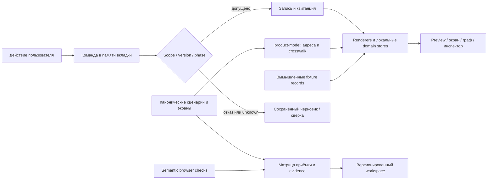

# Контракт интерактивных макетов Fabric

Status: target design, 2026-09-07. Production coverage не изменяется.
Владелец поведения — [scenarios.md](scenarios.md); пути — [flows.md](flows.md);
экраны — [screens.md](screens.md). Этот документ задаёт сквозные правила
симулятора и приёмку визуальной спецификации. Он не заменяет инженерный
[system-contract.md](../architecture/system-contract.md).

## Что считается готовым макетом

Для каждой действующей возможности нужен визуальный адрес, исходное требование,
основной путь, существенные отказы, понятное восстановление и фактическая проверка
действий. Непустой экран, зелёная плашка и ссылка на спецификацию не доказывают
работоспособность пути. Дальние возможности показывают целевой контракт и его
открытые решения; их наличие в макете не меняет статус реализации.

Исторический документ может объяснять происхождение решения, но не становится
текущим контрактом только из-за упоминания фичи. Инвентарь документов фиксирует
ревизию, digest, назначение и семантическую сверку. Реестры требований, проверок
и нерешённых вопросов доступны в интерактивном отчёте рядом с экранами.

## Общая оболочка и CEO

Плавающий control доступен на продуктовых поверхностях; публичный вход и
служебные разделы отчёта не выдают его за работающего агента. На широком экране
чат занимает третью колонку и сдвигает рабочую область. На узком экране это
отдельная панель с явной кнопкой возврата; она не перекрывает форму под собой.
Клавиатурный focus переходит в управление панелью, Escape возвращает его кнопке.

Estate и каждый Project имеют собственную историю разговора и черновик.
Контекст текущего Task/TaskRun виден рядом с адресатом. Предложение фиксирует
контекст в момент создания; смена вкладки не переписывает его адрес назначения.
Действие завершает предложение с артефактом, адресатом и основанием, либо явно
сообщает, что результата нет. Подтверждение предложения создаёт запись в
демонстрационной доске; повторное нажатие не создаёт вторую. Черновики и история
в этом отчёте живут в памяти вкладки и не отправляются в модель.

Образ по умолчанию до генерации — существующий знак PassionCode.ai. **Решение
оператора 2026-09-12: у каждого пользователя — персональный Fabric, генерируемый ИИ
в заданном стиле; в макете генерация демонстрируется заготовленными градиентными
капсулами (орнаментный слой), реальный вызов модели не выполняется.** Уровень рядом с
образом всегда несёт строку формулы и регистры-источники — он пересчитывается, не
хранится. Событийные изображения остаются вопросом бренд-review.
Имя/аватар не определяют исполнителя, роль или полномочия. Основание разногласия
источников: commit `33c0815801c34765d3b9e9f38f61a4a5581dd201` добавил измерения
профиля, сохранив visibly empty portrait; прежняя формулировка M131 преувеличивала
объём поставленного. Текущая реализация: `apps/desktop/src/renderer/src/ProfileSection.tsx`, `portraitEmpty`.

## Собственная идентичность каждой работы

Route хранит безопасные ссылки на Project, Task, TaskRun, Agent, Fact, Decision,
Session, File и другие предметные объекты. Черновики не помещаются в URL.
Хранилище формы включает проект, тип экрана и идентичность объекта. Смена проекта
не переносит admission, revoke, manager epoch, ответ, файл или note draft в другой
scope. Отсутствующая запись даёт собственное missing/denied состояние; другой
объект не подставляется автоматически.

Новый проект начинается без истории. Его цель → первая задача → разрешённый
контекст → проверенный исполнитель → допуск → прогон → проверка → приёмка
образуют проходимый путь. Смена провайдера отменяет старый допуск. Новый полный
прогон имеет новые состояния всех шагов; завершённые и неудавшиеся прошлые
прогоны остаются неизменными. У завершённой задачи последующая работа получает
новую связанную идентичность, а не стирает старую приёмку.

## Графы: четыре различных вопроса

| Проекция | Откуда данные | Что пользователь проверяет |
|---|---|---|
| План к цели | версия цели, membership, dependencies, критерии | что должно быть сделано; полный знаменатель, включая выполненное |
| История проекта | события задач всех агентов, новые задачи, handoff, runs | что фактически произошло, кто создал/кому назначил и куда попала работа |
| История агента | роль/binding, TaskRun, шаги, вопросы и артефакты | последовательность работы, собственные прогоны и передачи |
| Решения | записанное основание, citations, predecessor/supersedes | почему изменилось направление; источники, а не скрытое мышление модели |

Одна запись может быть видна в нескольких проекциях, но тип связи сохраняется.
Назначение не означает получение; сообщение агента не равно проверке; включение
в context pack не означает цитирование. Непрочитанный источник и отсутствие
связи показываются явно. Preview содержит текущую важную работу, полный экран —
выбор узла/ребра, инспектор, фильтры, список/структуру, масштаб и панорамирование.
Возврат из источника сохраняет scope, выбор, фильтр, версию и положение обзора.

## ReadEnvelope и команды в интерфейсе

Загрузка не показывает выдуманный ноль. Partial/error сохраняют разрешённый
снимок с именем источника; conflict сохраняет черновик и предлагает сравнить
текущую версию. На stale/conflict/read-only запрещены зависимые команды.
Навигация, выбор графа и изучение источника остаются доступны. Denied скрывает
защищённое содержимое, включая старый кеш.

Команда, её commit, доставка, выполнение и проверка результата — разные записи.
Unknown ведёт в reconciliation того же request, не в повторный effect. Отказ,
revoked/expired/spent и потеря полномочий не превращаются в разрешение нажатием
«повторить». Квитанция старого решения остаётся доступной после его замены.

## Обязательная приёмка по модулям

| Модуль | Наблюдаемое действие и инвариант | Визуальный вход |
|---|---|---|
| Первый проект | собственные task/run/pack, путь до приёмки без Atlas substitution | `product.html#view-onboarding` |
| Задачи и доска | brief/notes, legal transitions, resolved history, creator/assignee; повтор без дубликата | `product.html#view-board` |
| Вопрос и решение | причина сохраняется; вопрос исчезает из unresolved; delivery отдельно; override append-only | `product.html#view-question` |
| Manager | validation → drain/checkpoint → epoch/binding → handoff ACK; история роли сохраняется | `product.html#view-manager` |
| Агенты и доступ | discovered/conformant/admitted/bound отдельно; OAuth subject, scope и эффект; revoke не отменяет историю | `product.html#view-providers` |
| Память и ретро | exact fact/pack lineage, supersession; категория фильтрует; подтверждение только после проверки | `product.html#view-memory` |
| Sync и restore | manifest, diff, coverage, read-only restore, fresh authority, quarantined outbound | `product.html#view-sync` |
| Циклы | отдельные расписания и тики, manual wake, not-due/unready/unknown, собственные квитанции | `product.html#view-cycles` |
| IDE и workspace | отдельные файлы/сессии, буфер и conflict, поздний ответ, layout add/remove/order | `product.html#view-workspace` |
| Pipeline и цель | новая версия; уже начатая работа закреплена; приёмка цели по критериям | `product.html#view-pipeline` |
| Наблюдение и Proposal | source и target различаются; accept/refuse/supersede один раз | `product.html#view-proposal` |
| Support / release / content | результат каждого этапа; независимый checker; адресный grant; receipt и последующее наблюдение | `product.html#view-support` |
| Настройки / quota / notifications | prefs не дают права; число имеет источник; выключение доставки не решает вопрос | `product.html#view-estate-settings` |
| Архив / диагностика | архив обратим; purge отдельно; логи проходят безопасный предпросмотр | `product.html#view-archive` |

## Контуры данных симулятора

Ни один из этих переходов не вызывает runtime Fabric, внешнего агента, API
платежей или отправку сообщения. Функциональность симулятора проверяется
отдельно от инженерной реализации. Для агента-разработчика контекст — canonical
scenario/flow/screen, owning engineering card, её prerequisites, state branches,
точный визуальный адрес и приёмочная проверка; название кнопки не является API.

## Владение состоянием и сквозная запись

| Данные макета | Единственное место записи | Кто читает |
|---|---|---|
| Локальные project drafts и create identity | `localDrafts`, `activeDraftId`, `demoProjects` | onboarding и startup review; route сменяет выбор, не переписывает identity draft |
| Task, Run, Repo, File, Session и их receipts | operations state; `syncOperationsFixtures` публикует проекцию | task/launch/IDE/Board и фактические графы |
| Новые Proposal, Task и Decision из governance | `onRecordsChange` upsert в canonical fixture records по project/id | новые отфильтрованные представления, Board и графы |
| Конфигурация проекта | governance successor revision; `syncGovernanceRepositories` для обратной записи | настройки, список репозиториев и запуск; старый Run сохраняет свой pin |
| Цели и отношения плана | `fixtures.goals/taskLinks` + версии `graphPlanEdits` | граф SHOULD; изменение source требует явного rebase |
| Routine и каждый прогон | `routineStore(project)` + shared cycle runtime | расписание, обзор циклов и редактор; reconciliation ищет прежний tickId |
| Локальный урок и исходящий кандидат | installation feedback store | выбранный кандидат, frozen payload, очередь, suppressed/unknown/receipt |
| Вопросы и производные обязательства | `readObligations` читает исходные записи | Home, Board, Inbox, project preview; source failure не маскируется полным итогом |

Реализация этих связей — `scripts/product/controller.js`, `workbench.mjs`,
`routines.mjs`, `obligations.mjs` и соответствующие domain modules в той же папке.
Приёмка: `scripts/test/product-integrated.browser.cjs`,
`product-workbench.browser.cjs`, `product-schedule.browser.mjs`.
Это контракты симулятора: реальная persistence, durable queues и DB transactions
описаны отдельно в инженерном пакете.

## Начальная конфигурация и повторные команды

Software starter хранит редактируемые этапы, запланированные роли и paused routines.
Создание проекта не запускает PM. Активация разрешается лишь после собственного
admission/binding роли `product-manager` в этом Project. Разрешение другого проекта
не подходит. Observer подтверждает перечисленные текущие targets и отдельный
future-consent. Отмена сохраняет или удаляет только выбранный draft. Повтор create
с тем же draft identity возвращает ту же запись проекта.

Каждое новое окно цикла имеет identity. Повтор в текущем окне объединяется;
unknown сохраняет pending tickId. Сверка не добавляет второй Run. Новая версия
расписания не меняет pins прошлого Run. Boundary Proposal возникает только после
заданного количества завершённых прогонов текущей серии; blocked/stale input
сохраняет квитанцию причины без ложного заявления о достигнутой границе.

Решение показывает timestamp и context-pack ref из записанного source. Когда для
пакета нет однозначной адресации к Run, показан ID и причина отсутствия перехода;
последний доступный Run не используется как подстановка.
