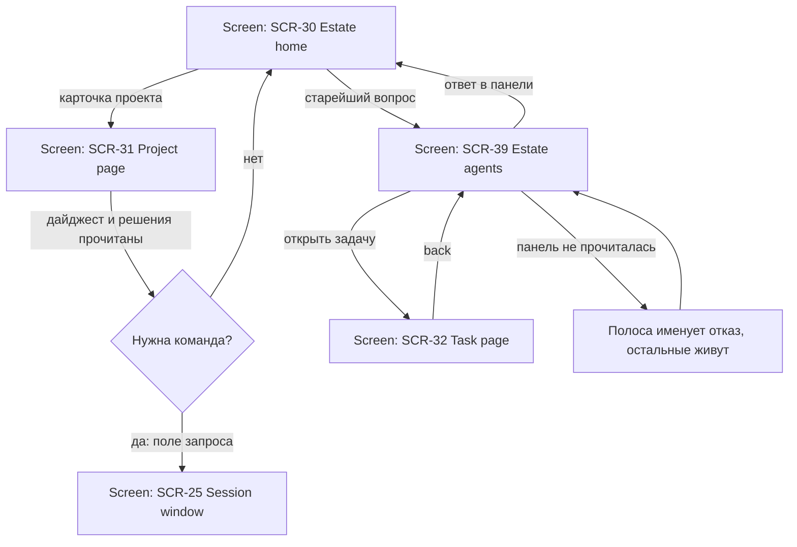

# UX Plan — V1 «Возврат в контекст» — 2026-09-12

> **Amended 2026-09-12, тем же днём, прогоном `2026-09-12-v1-reentry-deep` (run
> r-8bda8d73c).** Оператор попросил детальнее: сопоставить желаемое с ТЕКУЩИМИ фичами,
> скорректировать их реализацию, дать уточнённый вижн первой итерации и дорогу к ней.
> Ответы гриля того же дня: (1) порядок полос — Вопросы первыми; (2) пять полос агента
> живут там, где открыта консоль — extra panels рядом с терминалом, и SCR-25 несёт их
> первоклассно; (3) **циклы/рутины возвращены в границу V1** — §8 ниже читается с этой
> поправкой; (4) имя CEO ратифицировано — ADR-0057. Новые разделы: §14 сопоставление,
> §15 коррекции, §16 уточнённый вижн, §17 дорога к V1. Черновики §10 вставлены в базу
> этим же прогоном (SCN-091/092, ST-038, FLW-54) — §10 остаётся записью их исходной
> формы; действующая редакция — в `scenarios.md`/`foundation.md`/`flows.md`.

- **Sources:** операторский бриф 2026-09-12 (session; paraphrased: the main value is helping the
  operator return to context); `foundation.md` ST-018..ST-037, JRN-02; `scenarios.md` SCN-006..SCN-090 и
  аудит 2026-09-09; `screens.md` SCR-25/30/31/32/39/42; `flows.md` FLW-21/22/23/33;
  инвентаризация рендерера 2026-09-12 (§14).
- **Goal:** оператор, вернувшись после перерыва, восстанавливает контекст и принимает
  первое осмысленное решение за секунды: дашборд отвечает «кто меня ждёт» ≤ 10 с,
  проект — ≤ 60 с, агент — ≤ 30 с. Это проектные цели (design targets), `unobserved`
  до реального измерения; журнальный прокси уже существует — возраст ожидания вопроса.

## 1. Ценность, которой посвящена первая версия

Когда много агентов работает на разных проектах, оператор тратит основную энергию не на
решения, а на восстановление контекста при каждом переключении: чем мы тут занимались,
какие проблемы решали, что нас сюда привело, чего агент от меня хочет. Сегодня это
разматывание цепочки назад — история команд, транскрипты, память — при каждом возврате.

**V1 = продукт возврата в контекст.** Всё остальное (роли, foundry, внешний MCP-контроль,
циклы, бэкапы) — за границей V1 и названо ниже явно.

Один принцип управляет каждым экраном: **сначала то, что ждёт оператора; каждая строка
цитирует свою запись; заявление агента никогда не выглядит как измерение системы;
неизвестное никогда не выглядит как ноль; у каждого чтения есть возраст.** Эти правила
уже доктрина базы (SCN-035, SCN-039, SCN-044, SCN-090) — V1 делает их несущей
конструкцией, а не орнаментом.

## 2. Инвариант «раскладушки»: три уровня × пять полос

Три вложенных уровня — **Дашборд → Проект → Агент** — и на каждом один и тот же
информационный контракт из пяти полос, в одном и том же порядке. Спустившись на уровень,
оператор читает те же полосы, сфокусированные на меньшем субъекте. Это даёт мышечную
память: возврат в контекст везде читается одинаково.

| # | Полоса | Вопрос оператора | Дашборд (estate) | Проект | Агент |
|---|---|---|---|---|---|
| 1 | **Вопросы** | что ждёт МЕНЯ? | инбокс «Needs you» по всем проектам, старейшие сверху (SCN-055) | вопросы этого проекта (SCN-050) | вопросы этого агента, ответ inline (SCN-091, новый) |
| 2 | **Сейчас** | что происходит? | полоса живых агентов + карточки проектов (SCN-006, SCN-049) | активные сессии, колонка running доски (SCN-041) | живая консоль + заявление агента рядом с наблюдением (SCN-035, SCN-049) |
| 3 | **Было** | что я пропустил? | лента estate с границей прочитанного (SCN-026) | «пока вас не было» — дайджест с той же границей (SCN-090) | что агент СДЕЛАЛ: лизы, гранты, эффекты, факты (SCN-049), прошлые сессии (SCN-036) |
| 4 | **Дальше** | что запланировано? | следующие запуски рутин по проектам (SCN-006) | цели и граф плана, бэклог доски (SCN-046) | план задачи: закрыто / в работе / следующий шаг (SCN-046, SCN-091) |
| 5 | **Решения** | почему мы здесь? | решения уровня estate: гранты, урегулирования менеджера (SCN-051) | лента решений с цитатами, новые сверху (SCN-040, SCN-054) | мои команды и ответы ЭТОМУ агенту, хронологией (SCN-091, новый) |

Правила полос, единые для всех уровней:

- **Порядок фиксирован:** Вопросы → Сейчас → Было → Дальше → Решения. Вопросы всегда
  первыми — они и есть причина возврата; пустая полоса вопросов говорит «ничего не ждёт»
  явно, а не исчезает.
- **Каждая строка открывается** в свою запись (журнал, транскрипт, задача, решение) —
  мёртвого текста нет (правило SCN-040/SCN-090).
- **Граница прочитанного** (механика SCN-090) действует на полосах «Было» на всех
  уровнях: посмотрел — признано прочитанным ровно то, что было на экране; вернулся —
  видишь только новое. Возврат дешевеет с каждым разом.
- **Частичное чтение честно:** полосы читаются независимо; отказавшая именует себя и не
  гасит соседние (правило SCN-049/SCN-039).
- **Прогрессивное раскрытие** (правила SCN-058): полосы свёрнуты до счётчиков и первых
  строк, раскрытие не сбрасывает фокус, выбор и ревизию.

## 3. Уровень 1 — Дашборд (SCR-30 + SCR-42 + SCR-39)

Экран отвечает за 10 секунд на один вопрос: **кого из агентов и какие вопросы нельзя
оставлять без меня.**

- Заголовок внимания: «N агентов ждут ответа» + возраст старейшего ожидания
  (правило сортировки уже в `attention.ts` — дольше всех ждёт, тот выше).
- Избранные проекты первыми (SCN-043), на карточке: ждёт / работает / тихо, последний и
  следующий запуск, счётчик внимания (SCN-006).
- Инбокс двумя дорожками — «Needs you» и «Happened» (SCN-055): первая не снимается
  прочтением, только разрешением; вторая двигает границу прочитанного.
- Полоса живых агентов — вход на SCR-39 (SCN-049).
- Fabric (CEO) доступен с любой поверхности (SCN-042) — см. раздел 6.

## 4. Уровень 2 — Проект (SCR-31)

Экран отвечает за 60 секунд: **что здесь происходило, почему проект в этом состоянии,
что дальше.**

- Верх страницы — «пока вас не было» (SCN-090) и лента решений с цитатами (SCN-040):
  сперва ЧТО РЕШЕНО и ЧТО ПРОИЗОШЛО, не что напечатано.
- История команд: задачи, которые я запускал, с исходом и повтором без перепечатки
  (SCN-032, ST-024).
- Доска, которую ведут агенты (SCN-041); карточка называет, кто её поставил и откуда.
- Цели и граф плана (SCN-046): закрыто / в работе / осталось, сироты видны отдельно.
- Поле «попросить работу» (SCN-032) — команда следующему агенту в одну строку.
- Память проекта и поиск (SCN-039, SCN-048) — справочный слой, не первый экран.

## 5. Уровень 3 — Агент (SCR-39, тот же контекст в SCR-25)

Ядро нового в V1 — **контекстная панель агента**: то, чего сегодня нет как единой
поверхности. Оператор открывает агента и за 30 секунд видит:

- **Центр — живая консоль** (уже построено, SCN-049: `TerminalView` размещён дважды —
  в SCR-39 и в окне SCR-25).
- **Правая колонка — пять полос агента:**
  1. Вопрос, ждущий ответа, с возрастом; **ответ прямо в панели** (механика SCN-050) —
     ответил, вопрос ушёл из полосы, агент продолжил, без смены окна.
  2. «Что мы делаем»: бриф задачи — что / зачем / ожидаемый результат, с автором
     («агент написал» — сказано явно) и ссылкой на страницу задачи SCR-32 (SCN-045).
  3. Прогресс: заявление агента (с давностью, помечено как заявление) рядом с
     наблюдаемым состоянием (SCN-035) + план задачи: закрыто / сейчас / дальше.
  4. Что агент сделал: журнальная история — лизы, гранты, эффекты, факты (SCN-049,
     шаг 3), а не что он напечатал.
  5. Мои решения здесь: хронология команд и ответов, данных ЭТОМУ агенту — инструкция
     запуска, ответы на вопросы, решения; каждая строка цитирует журнальную запись.
- Место работы остаётся видимым: проект, репозиторий, ветка, объём изменений (SCN-049).

Это расширение правой колонки SCR-39 (сегодня там meta + история) и **те же панели
первоклассно в SCR-25** (поправлено амендментом 2026-09-12: оператор, paraphrased — the extra panels belong
wherever the agent's console is open, так что окно сессии несёт панели как
первоклассные элементы, не как опциональный ящик) — **не новый экран**: место, где
оператор находится, уже существует; меняется то, что оно ему отвечает (правило
контракта «a state is not a screen» — и его дух: не плодить места).

## 6. Fabric — CEO и главный герой

Решение оператора, 2026-09-12: **CEO-агент носит имя Fabric.** Это сводит имена
воедино: PassionCode.ai — продукт и платформа; Fabric — техническое ядро (ADR-0018) и
одноимённый главный герой поверх него — агент-CEO, который следит за всем, автоматизирует
и даёт инсайты. Продукт называется по герою.

В V1 Fabric делает ровно то, что уже описано базой — и это честный минимум:

- компилирует дайджесты и ленту решений (SCN-040, шаг 4: «CEO пересобирает из журнала»);
- маршрутизирует неоднозначные карточки и вопросы (SCN-041, alt path);
- отвечает с любой поверхности, зная scope, и каждый разговор кончается артефактом или
  честным «ничего не создано» (SCN-042);
- ведёт профиль estate — измеримый послужной список (SCN-044).

**Вне V1 (анти-скоуп Fabric):** проактивные инсайты, мотивационные механики, «советы
дня». Двигатель для них — тот же журнал; когда дойдёт очередь, они станут строками
дайджеста, а не отдельной поверхностью.

Именование — изменение уровня vision/бренда: нужен ADR (id резервируется через
`agent_sync.py reserve ADR`), поправка `docs/vision.md` (охраняемый файл, лиза) и
`docs/brand/facts.md`. В таблице изменений — отдельной строкой.

## 7. Золотой путь (сквозной процесс V1)

1. Оператор открывает Fabric после перерыва → дашборд ведёт вниманием: «3 агента ждут»,
   избранные проекты первыми, старейший вопрос наверху инбокса.
2. Клик по вопросу → открывается агент (SCR-39): вопрос наверху контекстной панели,
   под ним бриф задачи, заявление+наблюдение, мои прошлые команды. Консоль в центре.
3. 30 секунд чтения → ответ inline → журналируется, агент продолжает, счётчик внимания
   уменьшился.
4. Спуск в проект с карточки → «пока вас не было» + решения → взгляд на доску и план →
   при необходимости следующая команда через поле запроса или через Fabric.
5. Подъём по крошке (Estate / Проект / Агент — один жест наверх) → следующий вопрос или
   конец. Всё показанное признано прочитанным честно (граница SCN-090) — следующий
   возврат покажет только новое.

## 8. Минимальный набор фич V1

Существующая база покрывает почти всё — V1 это в первую очередь **граница и сборка**,
а не новая стройка. Статусы — из аудита 2026-09-09.

**Входит (ядро возврата в контекст):**

| Слой | Сценарии | Статус аудита |
|---|---|---|
| Дашборд: карточки + внимание + избранные | SCN-006, SCN-007, SCN-043 | PARTIAL |
| Инбокс двумя дорожками | SCN-055 | FAIL — строить |
| Экран агентов с живой консолью | SCN-049 | PARTIAL |
| **Контекстная панель агента (5 полос)** | **SCN-091 — новый** | — |
| Ответ на вопрос по месту | SCN-050 | PARTIAL |
| Дайджест «пока вас не было» | SCN-090 | draft, построено |
| Лента решений проекта | SCN-040, SCN-054 | PARTIAL |
| Доска, которую ведут агенты | SCN-041 | PARTIAL |
| Цели и граф плана | SCN-046 | PARTIAL |
| Страница задачи | SCN-045 | PARTIAL |
| Поле запроса + история команд | SCN-032 | PARTIAL |
| Заявления и записи сессий | SCN-035, SCN-036 | BLOCKED/PARTIAL |
| Fabric: чат → артефакт; профиль estate | SCN-042, SCN-044 | FAIL/PARTIAL |
| Вкладки и непрерывность | SCN-028, SCN-060 | PARTIAL |
| Поиск | SCN-048 | PARTIAL |
| **Золотой путь возврата** | **SCN-092 — новый** | — |
| Терминал/сессии | SCN-025, SCN-029 | PARTIAL/BLOCKED |

**Не входит в V1 (названо, чтобы граница была решением, а не умолчанием):**
членство и роли (SCN-013/014/066), agent foundry (SCN-015..017), внешний MCP-контроль
(SCN-022..024), операционные петли support/growth (SCN-019..021), storage/backup
(SCN-064/065), ретроспективы (SCN-062/063), замена менеджера (SCN-061), сервисные
поверхности SCN-068..080 (кроме уже построенного), автосмена аккаунтов (SCN-088/089).
Публичный сайт (SCN-038) — отдельная поверхность со своим владельцем.

## 9. Правила UI/UX первой версии

- **Стиль:** пак `paperclip` (принят 2026-08-31, `foundation.md` → Design tooling);
  плотность 7, motion ≤ 150 мс, ничего не анимируется, пока стримит терминал.
- **Одна грамматика строки** во всех полосах: chip вида + текст + возраст + цитата.
  Оператор учится читать её один раз.
- **Возраст на всём:** у заявления, у чтения, у дайджеста, у вопроса. Свежесть — часть
  данных, не оформление.
- **Голоса различимы:** «агент сказал» / «система измерила» / «оператор решил» — три
  разных источника, три разных маркировки, никогда не сливаются (SCN-035).
- **Клавиатура:** спуск — Enter по строке-субъекту, подъём — Esc по крошке; полосы
  раскрываются и обходятся с клавиатуры (режим EAA — `foundation.md`, Product mechanics).
- **Пустота ≠ ошибка ≠ не-прочитано:** три разных состояния с тремя формулировками
  (доктрина SCN-039).

## 10. Черновики новых артефактов (готовы к вставке в базу)

Правки самой базы (`foundation.md`, `flows.md`, `scenarios.md`, `screens.md`) — отдельная
итерация доставки: контракт итерации требует синхронизировать `docs/ux/product-model.json`
и мокапы в том же изменении (`AGENTS.md#iteration-contract`). Тексты ниже — полные
черновики для этой итерации.

### ST-038: Вернуться к одному агенту холодным (в foundation.md)

- **Story:** As P-01, I want an agent's own surface to carry what we are doing, its
  progress and plan, its open questions and the decisions I already gave it, so that I
  can re-enter one agent's context in seconds without unwinding its transcript.
- **Traces:** JTBD-02, JRN-02/#2..4
- **Acceptance criteria:**
  - Given an agent working a task, when I select it, then one panel shows the task
    brief, the agent's claim beside the observed state, its open questions with wait
    ages, and my prior commands and answers to this agent — each line citing its
    journal record.
  - Given an open question, when I answer it in the panel, then the answer is
    journalled, the question leaves the lane, and the agent's work resumes without me
    switching windows.
- **Priority:** must
- **Status:** proposed
- **Product:** unobserved

### FLW-54: Возврат в контекст — дашборд → проект → агент (в flows.md)

- **Traces:** ST-029, ST-032, ST-037, ST-038 (JTBD-02)
- **Goal:** от холодного запуска до первого решения — один спуск по раскладушке; каждый
  уровень отвечает пятью полосами в одном порядке.
- **Entry points:** запуск приложения; возвращение к окну после перерыва.
- **Success exit:** вопрос отвечен или команда выдана; показанное признано прочитанным.
- **Task analysis:**
  1. Открыть дашборд; прочитать внимание и старейший вопрос.
  2. Открыть вопрос — агент открывается с контекстной панелью.
  3. Прочитать панель: вопрос, бриф, прогресс, мои прошлые решения.
  4. Ответить или дать команду; граница прочитанного сдвигается честно.
  5. Подняться; повторить со следующим вопросом или спуститься в проект.
- **Rejected shape:** отдельный экран «сводка для возвращения» поверх дашборда —
  проиграл, потому что вторая сводка дрейфует от живых полос; тот же довод, которым
  FLW-21 отверг отдельный notification centre. Возврат обслуживают те же поверхности,
  на которых идёт работа.
- **Flow:**



- **Screens traversed:**
  | Screen | States used here |
  |--------|------------------|
  | SCR-30 Estate home | success, attention, nothing-waiting |
  | SCR-39 Estate agents | success, partial, stale |
  | SCR-31 Project page | success, first-visit, lines |
  | SCR-32 Task page | success |
  | SCR-25 Session window | success |

### SCN-091: Вернуться к агенту, прочитав его собственный контекст (в scenarios.md)

- **Persona:** P-01
- **Feature:** Agents
- **Traces:** ST-038, ST-026, ST-034, FLW-54, FLW-21 (JTBD-02)
- **Entry point:** строка агента на SCR-39; вопрос из инбокса; сессия задачи со страницы SCR-32
- **Preconditions:** хотя бы одна сессия открыта; у агента может быть задача, вопрос — или ни того, ни другого
- **Steps:**
  1. Оператор выбирает агента → центр занимает живая консоль; правая колонка открывается
     контекстной панелью, наверху — вопрос, ждущий ответа, с возрастом ожидания.
  2. Оператор читает «что мы делаем» → бриф задачи: что, зачем, ожидаемый результат — с
     автором («агент написал» сказано явно) и ссылкой на страницу задачи.
  3. Оператор читает прогресс → заявление агента с давностью, помеченное как заявление,
     рядом с наблюдаемым состоянием; план задачи: закрыто / сейчас / дальше.
  4. Оператор читает «мои решения здесь» → хронология команд и ответов, данных этому
     агенту: инструкция запуска, ответы, решения; каждая строка цитирует журнальную
     запись и открывается.
  5. Оператор отвечает на вопрос прямо в панели → ответ журналируется, вопрос уходит из
     полосы, агент продолжает; окно не менялось.
  6. Оператор отцепляет сессию в отдельное окно → SCR-25 несёт ту же контекстную панель:
     один компонент, размещённый дважды.
- **Expected result:** контекст одного агента восстановлен и решение принято без
  разматывания транскрипта и без смены экрана; заявление агента ни разу не выглядело
  как измерение системы.
- **Alt paths:** агент без задачи показывает сессию и место работы, а про остальные полосы
  говорит, что их не из чего собрать; plain-терминал показывает наблюдение и историю
  команд, без заявлений (нечему говорить протоколом — правило SCN-035); вопрос,
  разрешённый другим путём, пока панель открыта, помечается разрешённым, а не исчезает.
- **UI elements:** полоса вопроса с ответом inline и возрастом; бриф-виджет с авторством;
  прогресс — заявление + наблюдение + план; журнальная история действий; хронология
  решений и команд оператора; ссылки-цитаты на каждой строке; переход на SCR-32.
- **States covered:** empty (ни задачи, ни вопросов), loading, success, partial (одна из
  полос не прочиталась), stale, error
- **Errors & recovery:** полосы читаются независимо — отказавшая именует себя и не гасит
  соседние; ответ, не прошедший журнал, остаётся в поле с причиной и не теряется; ответ,
  пришедший для агента, которого оператор уже покинул, отбрасывается (правило SCN-049);
  устаревшее чтение несёт возраст последнего удачного.
- **Telemetry:** planned only — журнальное событие остаётся записью.
- **Status:** draft
- **Coverage:** none yet
- **Product:** unobserved

### SCN-092: Вернуться в estate холодным и дойти до первого решения (в scenarios.md)

- **Persona:** P-01
- **Feature:** Navigation/continuity
- **Traces:** ST-018, ST-029, ST-032, ST-037, ST-038, FLW-54 (JTBD-02)
- **Entry point:** запуск приложения после перерыва; возвращение к окну
- **Preconditions:** estate работал без оператора: есть журнал, могут быть открытые вопросы
- **Steps:**
  1. Оператор открывает Fabric → дашборд ведёт вниманием: сколько агентов ждут, избранные
     проекты первыми; на карточках — ждёт / работает / тихо и последний/следующий запуск.
  2. Оператор открывает старейший вопрос → агент открывается с вопросом наверху
     контекстной панели (SCN-091); проект и задача названы, спуск не потерял адрес.
  3. Оператор отвечает → счётчик внимания уменьшается; показанное признано прочитанным
     (граница SCN-090), повторный вход показывает только новое.
  4. Оператор спускается в проект с карточки → «пока вас не было» и лента решений, затем
     доска и план; при необходимости — следующая команда через поле запроса или Fabric.
  5. Оператор поднимается по крошке → вкладки и черновики на месте (правила SCN-060);
     следующий вопрос или конец.
- **Expected result:** от холодного открытия до первого осмысленного действия — один спуск
  по раскладушке, без чтения транскриптов; повторный возврат стоит дешевле первого,
  потому что граница прочитанного сдвинулась честно.
- **Alt paths:** пустой estate предлагает создать проект (SCN-059), а не показывает нулевые
  полосы; когда ничего не ждёт — дашборд говорит это явно и ведёт к «Было»; вопрос,
  разрешившийся, пока оператор шёл к нему, показан разрешённым, а не исчезнувшим.
- **UI elements:** заголовок внимания с возрастом старейшего ожидания; карточки с
  избранными первыми; инбокс двумя дорожками; контекстная панель агента; крошка
  Estate / Проект / Агент как один жест подъёма.
- **States covered:** first-visit, loading, nothing-waiting, lines, partial, stale, error
- **Errors & recovery:** уровень, не прочитавшийся целиком, — частичное чтение с
  именованным отказом, никогда не пустой экран; неотвеченный вопрос не теряется от
  навигации — он остаётся в «Needs you», пока не разрешён (правило SCN-055).
- **Telemetry:** planned only — журнальным прокси времени-до-решения служит возраст
  ожидания вопроса.
- **Status:** draft
- **Coverage:** none yet
- **Product:** unobserved

## 11. Changes

| # | Action | Object | Details | Traces | Priority |
|---|--------|--------|---------|--------|----------|
| 1 | CREATE | `foundation.md` → ST-038 | история агентского возврата (текст в §10) | JTBD-02, JRN-02 | P1 |
| 2 | CREATE | `flows.md` → FLW-54 | золотой путь возврата (текст в §10) | ST-029/032/037/038 | P1 |
| 3 | CREATE | `scenarios.md` → SCN-091 | контекстная панель агента (текст в §10) | ST-038, FLW-54 | P1 |
| 4 | CREATE | `scenarios.md` → SCN-092 | сквозной золотой путь (текст в §10) | ST-018/029/032/037/038, FLW-54 | P1 |
| 5 | MODIFY | `screens.md` → SCR-39 | правая колонка = пять полос агента; Elements и States по SCN-091 | SCN-091 | P1 |
| 6 | MODIFY | `screens.md` → SCR-25 | контекстный ящик — тот же компонент панели | SCN-091 | P2 |
| 7 | MODIFY | `docs/ux/product-model.json` + мокапы | синк модели и целевых макетов в той же итерации (`AGENTS.md#iteration-contract`) | SCN-091/092, FLW-54 | P1 |
| 8 | CREATE | ADR: имя CEO — Fabric | резерв id через agent-sync; поправка `docs/vision.md` (лиза) и `docs/brand/facts.md` | §6, ADR-0018 | P2 |
| 9 | MODIFY | `scenarios.md` Index | строки SCN-091/092; трассировки FLW-54 у SCN-049/090 не меняются | — | P1 |
| 10 | MODIFY | реализация SCR-39/SCR-25 | панель пяти полос поверх существующих чтений (`EstateAgents.tsx`, `SessionWindow.tsx`) | SCN-091 | P1 |
| 11 | MODIFY | инбокс SCR-42 | построить две дорожки (аудит 2026-09-09: FAIL) | SCN-055 | P1 |
| 12 | MODIFY | Fabric-чат | довести SCN-042 до построенного (аудит: FAIL, Coverage none yet) | SCN-042 | P2 |

## 12. Execution order

P1 — ядро ценности, порядок: 1→2→3→4→9 (база, одна итерация с п.7) → 5→10 (панель
агента) → 11 (инбокс). P2 — 6, 12, 8. Каждая итерация — через task-pipeline, с синком
мокапов и design map в том же изменении.

## 13. Definition of done

- Каждое изменение приземляется со своим сценарием в том же изменении (same-change rule).
- `python3 docs/ux/lint.py` чист; `node scripts/sync-product-ux.mjs` и
  `node scripts/build-product-report.mjs` прогнаны в итерации, меняющей базу.
- Пост-имплементационный `/ux-audit` по SCN-091, SCN-092, SCN-055 — PASS.
- Статусы новых сценариев: `draft` до одобрения оператором, `validated` после; `Product`
  остаётся `unobserved`, пока не измерено время-до-решения на живом операторе.

## What you have now

- Этот план: инвариант раскладушки, три уровня, золотой путь, граница V1, полные
  черновики ST-038 / FLW-54 / SCN-091 / SCN-092.
- Существующая цепочка `docs/ux/` (foundation, flows, screens, scenarios) и аудит
  2026-09-09 со статусами всего набора V1.

## Recommended: continue autonomously with task-pipeline

```
/task-pipeline docs/ux/plans/2026-09-12-v1-context-reentry.md
```

Пайплайн уже установлен; черновики §10 вставляются в базу на его стадиях, с синком
модели и мокапов в той же итерации.

---

## 14. Сопоставление: 15 полос × текущие фичи (измерено 2026-09-12)

Инвентаризация рендерера `apps/desktop/src/renderer/src/` + аудит 2026-09-09.
Вердикты: **built** — полоса живёт; **partial** — механизм есть, полоса не собрана;
**absent** — в рендерере нет.

### Уровень 1 — Дашборд (SCR-30)

| Полоса | Вердикт | Что есть сегодня (улики) | Чего не хватает |
|---|---|---|---|
| 1 Вопросы | **partial** | `BoardPanel.tsx#AnswerForm` + `BoardPanel` (limit 5, «Needs you») на `EstateHome.tsx`; `AttentionPanel.tsx` — proposal/grant с действиями | единого инбокса нет: типы `shared/inbox.ts` (`NeedsYouItem`/`HappenedItem`/`InboxLane`) **без потребителя в рендерере** (импортируется только `cursorFor`); в `AttentionPanel` возраст ожидания не рендерится на строках с действием. SCN-055 аудит FAIL |
| 2 Сейчас | **built** | карточки live/idle + `{n} waiting` chip (`EstateHome.tsx`); экран агентов `EstateAgents.tsx`, порядок `shared/sessionOrder.ts#inAttentionOrder` | SCN-006/049 PARTIAL — краевые состояния |
| 3 Было | **partial** | «Estate journal»: `Feed` + «Mark read (n)» над `visibleThroughSeq` (`EstateHome.tsx`) | это сырой журнал с водяным знаком, не компилированный дайджест с цитатами; для V1 достаточно (см. §15 C10) |
| 4 Дальше | **absent** | next-due вычисляется (`shared/routine.ts#nextDue`), но рендерится только на странице проекта, внутри `Collapsible defaultOpen={false}` | на дашборде следующих запусков нет вовсе; SCR-43 (циклы, SCN-056) не построен, Coverage none yet. **Оператор вернул циклы в V1** |
| 5 Решения | **absent** | `ProfileSection.tsx` — измерения estate (SCN-044) | ленты решений уровня estate нет; урегулирования менеджера — SCN-051, аудит FAIL |

### Уровень 2 — Проект (SCR-31)

| Полоса | Вердикт | Что есть сегодня (улики) | Чего не хватает |
|---|---|---|---|
| 1 Вопросы | **built** | `BoardPanel` limit 10; ответ inline, `expectedRevision`-guard, черновик переживает отказ (`BoardPanel.tsx#AnswerForm`) | SCN-050 PARTIAL |
| 2 Сейчас | **built** | `ProjectStatusBar` (агенты running/idle/unread, blocked, ветка/диff, квота); `AgentsSection`/`AgentTile` с заявлением против наблюдения (SCN-035) | SCN-035 аудит BLOCKED — живой прогон не наблюдался |
| 3 Было | **built** | `DigestSection.tsx` — граница прочитанного целиком (first-visit / nothing-new / lines / stale; `digest.seen` на unmount) — SCN-090; `TranscriptsSection` (SCN-036) | лучшая полоса продукта; переносить её семантику на другие уровни, не изобретать вторую |
| 4 Дальше | **partial** | `PlanSection.tsx` + `shared/planProgress.ts#goalProgress` (closed/total с честным floor); колонки доски (`ProjectHome.tsx#BoardSection`) | нет разбиения закрыто/сейчас/дальше — backlog+running+review слиты в один open-bucket; Routines свёрнуты по умолчанию |
| 5 Решения | **partial** | `DecisionsSection.tsx` — newest first, цепочки замен, coverage-примечания | **`source_ref` рендерится инертным `<span class="muted mono">`** — цитата не открывается, тогда как открыватели уже есть: `RetroSection.tsx` (`evidenceOpens`/`destinationOf`), `Feed.tsx#actFor`. История команд: reuse только из done-колонки доски; списка прошлых запросов под полем нет — строка `i18n/en.ts:'tasks.noneYet'` — сирота без потребителя. SCN-040/032 PARTIAL |

### Уровень 3 — Агент (SCR-39 / SCR-25, поверхность консоли)

| Полоса | Вердикт | Что есть сегодня (улики) | Чего не хватает |
|---|---|---|---|
| 1 Вопросы | **absent у консоли** | механизм ответа существует и построен — но только в `BoardPanel` | на SCR-39/SCR-25 ответить нельзя; вопрос выбранного агента не виден |
| 2 Сейчас | **built** | `TerminalView` — один компонент, два хоста (SCR-39 центр, SCR-25); ended snapshot + exit code | заявление агента (`AgentTile`) не показано на SCR-39/25 |
| 3 Было | **partial** | «What it did» на SCR-39: тип события + актор + возраст (`window.fabric.terminal.history`) | в SCR-25 отсутствует целиком (окно = header + терминал, `SessionWindow.tsx`) |
| 4 Дальше | **absent** | задача — только кнопка `Task: {title}`, уводящая со страницы | плана задачи (закрыто/сейчас/дальше) у консоли нет |
| 5 Решения | **absent в рендерере целиком** | — | хронологии команд/ответов оператора ОДНОМУ агенту нет нигде; бриф задачи (что/зачем/ожидаемый) имеет один дом — `TaskPage.tsx` (`brief_what` встречается в одном файле рендерера) |

**Итог сопоставления.** Из 15 полос: built — 4, partial — 6, absent — 5. Уровни 1–2
в основном собраны и требуют коррекций; уровень 3 — главный зазор: у консоли, где
оператор проводит время, контекста нет, и это ровно место боли из брифа.

## 15. Коррекции реализации (каждая переиспользует, не изобретает — R-005)

| # | Коррекция | Механизм переиспользуется | Полоса | Трасса |
|---|---|---|---|---|
| C1 | Построить SCR-42 Инбокс двумя дорожками | готовые типы `shared/inbox.ts`; «Needs you» не снимается прочтением | L1-1 | SCN-055 |
| C2 | Возраст ожидания на строках `AttentionPanel` с действием | `duration.ts#since` — уже на no-action ветке | L1-1 | SCN-055/027 |
| C3 | Полоса «Дальше» на дашборде: next-due рутин по проектам + бейдж на карточке | `shared/routine.ts#nextDue` уже вычисляет | L1-4 | SCN-006/056 |
| C4 | SCR-43 Циклы — read-only инспекция состояний | модель SCN-056 записана целиком | L1-4 | SCN-056 |
| C5 | `DecisionsSection`: `source_ref` → открываемая цитата | `destinationOf`/`evidenceOpens` из `RetroSection`, `Feed.tsx#actFor` — не второй резолвер | L2-5 | SCN-040/054 |
| C6 | `PlanSection`: разбиение закрыто/сейчас/дальше | те же чтения `goalProgress` + состояния доски; floor-честность сохраняется | L2-4 | SCN-046 |
| C7 | Список прошлых запросов под полем «попросить работу» | потребить сироту `tasks.noneYet`; reuse уже есть в done-колонке | L2-5 | SCN-032, ST-024 |
| C8 | SCR-39: правая колонка → пять панелей агента | AnswerForm (reuse), бриф — те же поля, что `TaskPage`; заявление — правило `AgentTile`; «что сделал» — существующая панель; **новое чтение: хронология команд/ответов по агенту** (журнал: `tasks.start` payload + ответы + гранты) | L3-1..5 | SCN-091 |
| C9 | SCR-25: те же панели первоклассно | тот же компонент, что C8 — один, размещённый дважды | L3-1..5 | SCN-091, ST-038 |
| C10 | Estate-дайджест с цитатами — named deferral | для V1 достаточно журнала с mark-read; компиляция — после V1 | L1-3 | SCN-026 |

Единственное по-настоящему новое чтение во всей V1 — хронология C8: журнал уже несёт
эти события (ST-023 «what I asked is recorded», ответы SCN-050, гранты SCN-027);
нового стора нет, есть новый фильтр по сессии/агенту.

## 16. Уточнённый вижн первой итерации

**V1 готова, когда золотой путь SCN-092 проходится в приложении на живом estate:**
оператор открывает Fabric холодным; дашборд за десять секунд отвечает, кто ждёт, что
работает, что пропущено и **что запланировано** (циклы и рутины — в границе, решение
оператора 2026-09-12); клик по старейшему вопросу открывает консоль агента с пятью
панелями, и ответ даётся У КОНСОЛИ, без смены окна; спуск в проект показывает «пока
вас не было» и решения с открывающимися цитатами; подъём возвращает вкладки и
черновики. Порядок полос везде один: **Вопросы → Сейчас → Было → Дальше → Решения.**

Fabric — имя CEO (ADR-0057); его V1-объём — ровно записанное базой: дайджесты и
решения (SCN-040), маршрутизация (SCN-041), разговор-в-артефакт (SCN-042), измеримый
профиль (SCN-044). Метрики времени-до-решения остаются design targets, `Product:
unobserved` до замера; журнальный прокси — возраст ожидания вопроса.

Поправка к §8: строка «редактор циклов — вне V1» сужается — РЕДАКТОР остаётся вне,
**инспекция циклов (SCN-056, read-only) и next-due рутин — внутри**.

## 17. Дорога к V1 — вехи

Согласовано с [Build order by layer](../../evidence/backlog.md#build-order-by-layer)
(ADR-0044: foundations first): вехи — потребители батчей F3–F4; веха, упирающаяся в
незакрытый ряд F0–F2, ждёт его, а не обходит. Каждая веха — прогон task-pipeline.

| Веха | Что входит | Критерий выхода |
|---|---|---|
| **V1-M0** — документация (этот прогон) | §14–§17; SCN-091/092, ST-038, FLW-54 в базе; SCR-39/25 target-блоки; модель+мокапы синхронизированы; ADR-0057 | гейты зелёные; этот коммит |
| **V1-M1** — панели у консоли | C8 + C9: SCR-39 правая колонка и SCR-25; новое чтение хронологии; заявление у консоли | SCN-091 аудит по построенному; подсадки пойманы (R-006); ответ у консоли журналируется |
| **V1-M2** — инбокс и внимание | C1 + C2: SCR-42 из `shared/inbox.ts`; возрасты в AttentionPanel | SCN-055 из FAIL; «Needs you» неснимаемо прочтением — probed |
| **V1-M3** — «Дальше»: рутины и циклы | C3 + C4: next-due на дашборде; SCR-43 read-only | SCN-056 из none-yet; app-off ≠ stall — правило сценария соблюдено |
| **V1-M4** — решения открываются, команды помнятся | C5 + C6 + C7 | SCN-040/046/032 без их именованных зазоров; `tasks.noneYet` потреблена |
| **V1-M5** — золотой путь | сквозной прогон SCN-092 живьём; `/ux-audit` по набору V1 | SCN-092 наблюдён на реальном estate; Product остаётся unobserved до замера времени |

Строки вех заведены на доске (`docs/evidence/backlog.md`, секция «V1 „Возврат в
контекст“»), чтобы отложенное уходило с id, а не счётом (R-002).

> **Amended 2026-09-12, вечер (прогон `2026-09-12-v1-design-gamification`):** вехи
> декомпозированы в самодостаточные пакеты T-01…T-19 —
> [execution plan](2026-09-12-v1-execution-plan.md); визуальный слой и честная
> геймификация Fabric-CEO — [design language](2026-09-12-v1-design-language.md)
> (циферблаты пересчитаны `4·3·5`, foundation обновлён; ST-039 и SCN-093 в базе).
