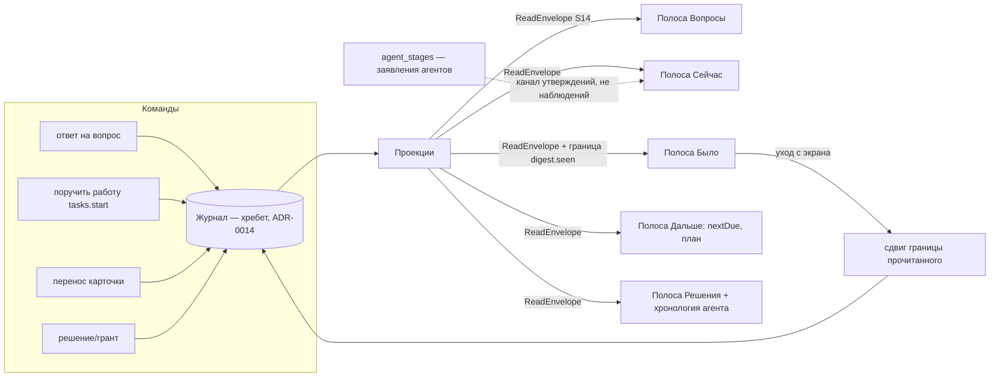

# Design language — V1 «Возврат в контекст» — 2026-09-12

- **Sources:** операторский бриф 2026-09-12 (paraphrased: convenient, simple, spacious and modern,
  with gamification in the form of the Fabric CEO); [план V1](2026-09-12-v1-context-reentry.md)
  §14–§17; `foundation.md` → Design tooling; пак `paperclip` (sheleg-design 1.59.0),
  `MOTION_DOCTRINE`, `AI_PRODUCT_PATTERNS`; `docs/ux/mockup-contract.md` (правила CEO).
- **Goal:** поверхности V1 читаются просторно и однородно, геймификация несёт голос
  Fabric и ничего не выдумывает; каждый визуальный ход ложится в грамматику пака.
- **Falsifier (проверяется браузером в пакетах T-плана):** холодный вход не отвечает
  «кто меня ждёт» за 10 с; празднование двигает layout, живёт на клавиатурном пути или
  идёт рядом со стримящим терминалом; полоса скроллит горизонтально на 1280 px.

## 0. Запись директора

| | |
|---|---|
| Mode | redesign с сохранением идентичности → вход через **tokens** |
| Циферблаты | `DESIGN_VARIANCE 4 · MOTION_INTENSITY 3 · VISUAL_DENSITY 5` — плотность на шаг ниже пола продуктовой строки (6–8) по явному требованию оператора (spacious); простор покупается раскрытием и ритмом, не пустотой; потолок движения пака — 5, частотная таблица режет первой |
| Fork | нет: система записана (paperclip), бриф определяет направление — форк изготовил бы выбор |
| Cast | sheleg-design (директор) · paperclip + `tokens/paperclip.css` · MOTION_DOCTRINE · AI_PRODUCT_PATTERNS · copywriting (голос Fabric, в задачах сборки) · a11y: лейн делегирован — браузерные проверки закреплены в каждом UI-пакете T-плана |
| Open | ~~лицо Fabric: отдельный ПЕРСОНАЖ остаётся вопросом бренд-ревью~~ **закрыт оператором 2026-09-12 (вечер): у каждого пользователя — персональный Fabric, генерируемый ИИ в заданном стиле; до генерации — нейтральный знак. Облик не меняет полномочий (ADR-0057)** |

## 1. Пространство: чем покупается «просторно»

Плотность НЕ покупается пустыми экранами — это продуктовая поверхность. Простор дают
четыре механики:

1. **Полоса = карточка с раскрытием (LaneCard).** Каждая из пяти полос — карточка
   пака (`--r-md`, hairline, `--surface`): шапка — знак-капсула вида, имя, mono-счётчик,
   возраст; свёрнутая показывает до 3 превью-строк. При холодном входе раскрыта ровно
   одна полоса: Вопросы, если они есть; иначе Было. **Один якорь на вьюпорт** —
   правило Act 5 директора.
2. **Ритм.** Между полосами `--space-xl`; внутри карточки `--space-lg --space-md`
   (паддинги карточки пака); прозные строки — мера ≤66ch. Никогда не ужимать ритм
   пака в плотный дефолт (анти-дрифт §8 доктрины).
3. **Две колонки максимум** + контекстный рейл. Три равноправные колонки текста —
   не эта система (SCR-39: список / консоль / панель — консоль не текст).
4. **Тишина — состояние.** Пустая полоса — mono-строка «что отсутствует» + одно
   действие, слева, без иллюстраций (идиома пустоты пака). «Ничего не ждёт» — спокойный
   факт, уступающий место дайджесту.

## 2. Грамматика строки — одна на все полосы

`[капсула-знак вида 10×20] [текст Inter] [возраст mono] [→ цитата]`

- **Статус — всегда слово со знаком** (бан пака: no status without a word).
- **Три голоса, три маркировки:** оператор / агент («агент сказал», с давностью) /
  система (измерено). Никогда не сливаются — правило SCN-035, теперь визуальное.
- **Улика — mono:** id, ref, команда, возраст. Человеческое предложение — никогда mono.
- **Каждая строка открывается** в свою запись; мёртвого текста нет (SCN-040/090).
- Числа — `tabular-nums` (леджер, который дёргается, — сломанный леджер).

## 3. Геймификация — честная, в грамматике пака

Переопределение записано: foundation говорил «Engagement mechanics: none»; оператор
2026-09-12 вслух добавил геймификацию. Правило, которое делает её совместимой с
доктриной (SCN-044 «ничего не награждается»): **каждый игровой элемент — проекция
журнала, пересчитываемая, а не хранимая награда.**

| Элемент | Идиома пака | Правило честности |
|---|---|---|
| **Приветствие Fabric** (холодный вход) | полоса над дайджестом: знак + одно предложение с фактами; entrance разрешён — редкий путь частотной таблицы: rise 16px + fade от 0.55 (трюк пака), `--t-medium`, `--ease-enter` | каждый факт открывается в запись; это ОЗВУЧЕННЫЙ дайджест, не вторая сводка (довод FLW-21/54 против второй сводки) |
| **Веха** (цель/веха закрыта) | строка в «Было» с **градиентным бейджем-капсулой** — орнаментный слой пака: бейдж = ярлык, НИКОГДА не контрол; появляется один раз (seen stays seen) | бейдж несёт слово («MILESTONE · V1-M1») и цитату события; источник superseded → строка помечена (правило SCN-040) |
| **Предложение поднять автономию** | **interrupt-чип** — единственная пружина пака, для элемента, «пришедшего незваным» (`--ease-spring`, 0.4s) | предложение именует улики («10 прогонов без вмешательства»); решение — оператора (механика ST-018/SCN-027); отказ журналируется |
| **Лестница доверия** (уровень автономии проекта) | goal-levels пака: капсулы-ступени, заполненные по мере ИЗМЕРЕННОГО | уровень — поле цели (ADR-0004); повышение только решением; Fabric предлагает, не действует |
| **Честные серии/тренды** | ledger row: трек `--surface-quiet`, заполнение `--ink` (количество — не вердикт) + слово | пересчитываются из журнала; переставшая быть true — исчезает; без loss-aversion (recovery по BP-142: пропуск просто обнуляет пересчёт, никаких «вы потеряли») |
| **Профиль Fabric = лист персонажа** | stat-плитки на hairline-гриде | каждая цифра именует регистр (SCN-044, без изменений поведения) |

**Анти-скоуп геймификации:** очки, хранимые бейджи-награды, daily-login, лидерборды,
конфетти/частицы (утопили бы единственный хроматический объект пака), фейковые
прогресс-бары. **Празднование ≤1 на возврат**, никогда рядом со стримящим терминалом
(клауза foundation остаётся: консоль не анимируется, пока стримит) и никогда на
клавиатурном пути (частотная таблица: 100+/день — никакой анимации, никогда).

**Голос Fabric** — через brand pack (`docs/brand/voice.md`): факты + максимум одно
предложение; без гипербол; провайдер CEO не привязан → полоса компилируется системой
и помечена так, без голоса персонажа. Строки — в реестр строк в задачах сборки
(copywriting-трек, там же brand_lint).

## 4. AI-поверхности V1 (по AI_PRODUCT_PATTERNS)

- **Пять состояний вызова модели** — на панели агента и в чате Fabric: Idle (пустое
  состояние несёт способность — 2–3 реальных примера-аффорданса, не «спросите
  что-нибудь»), Working (стоп с первого кадра; терминал и есть стрим — спиннеров нет
  нигде, идиома trace), Complete (с провенансом), **Refused ≠ Failed** (уже доктрина
  реестров — теперь и визуально: `--warn` слово vs `--danger` слово).
- **Заявление агента** — provenance-тег в духе `[INFERRED]`: подпись «агент сказал ·
  N мин назад» рядом с наблюдением системы. Тег у span, не у сообщения.
- **Consent:** эффект наружу — предпросмотр в той форме, в какой он случится
  (diff, адресат, запрос); дешёвое обратимое — undo вместо подтверждения.
- Латентность двумя числами: первый токен показывается сразу; долгое — словами
  процесса («читаю 4 источника»), не выдуманным процентом.

## 5. UX / data flow

Правила потока: каждый read — конверт с возрастом и частичностью (отказ одной полосы
не гасит соседние); заявления агентов идут отдельным каналом и никогда не сливаются с
наблюдениями; границы прочитанного — per-поверхность (`digest.seen`,
`visibleThroughSeq`) и сдвигаются только показанным; **хронология агента** — новое
чтение: журнал, фильтрованный по актору/сессии (`task.started` payload, ответы,
гранты), нового стора нет. Поздний ответ для покинутого субъекта отбрасывается
(генерация-guard — правило SCN-049/060).

## 6. Каталог пограничных кейсов (сводка; каждый живёт в своём сценарии)

| Класс | Правило | Владелец |
|---|---|---|
| Пустота ≠ ошибка ≠ не-прочитано | три формулировки, mono-строка + действие | SCN-039 |
| Частичное чтение | отказавшая полоса именует себя, остальные живут | SCN-049/091 |
| Возраст на всём | заявление, чтение, дайджест, вопрос — все несут давность | SCN-035/090 |
| Гонка ответа | ответ покинутому агенту отбрасывается; черновик не теряется | SCN-091 |
| Вопрос решён другим путём | помечен разрешённым, не исчезает молча | SCN-091/055 |
| Источник вехи superseded | строка помечена, не переигрывается и не стирается | SCN-093/040 |
| Пустой estate | Fabric представляется и ведёт к созданию (без нулевых полос) | SCN-093/059 |
| CEO без провайдера | полоса «компилировано системой», без голоса персонажа | SCN-093/042 |
| Reduced motion | все моменты статичны, содержание полное; loops стоп (гочи 6 пака) | контракт §9 доктрины |
| Стримящий терминал | никакой анимации рядом; празднования только в полосах дайджеста | foundation, dials |
| Клавиатура | спуск Enter, подъём Esc; фокус-кольцо пака никогда не снимается (гоча 5) | SCN-058 |
| Узкая ширина / 200% | грид схлопывается по правилам пака (768/480); без горизонтального скролла | пакеты T-плана |
| Сон хоста / циклы | app-off ≠ stall; unknown next due — явный | SCN-056 |
| Квота неизвестна | не «простаивает»: unknown ≠ 0 (ADR-0054) | SCN-070 |

## 7. Что меняется в реестрах этим же прогоном

- `foundation.md` → Design tooling: циферблаты `4 · 3 · 5` с причиной; Product
  mechanics: engagement = measured-only (переопределение оператора, jobs названы).
- `foundation.md` → ST-039; `scenarios.md` → SCN-093 (+Index); journeys модели.
- Пошаговый план сборки: [execution plan](2026-09-12-v1-execution-plan.md) — пакеты
  T-01…T-19, каждый самодостаточен для сабагента.

## Definition of done

- Каждый UI-пакет T-плана несёт браузерные проверки таблицы качества директора
  (контраст вычислен, клавиатурный путь, reduced-motion включением, токены grep-ом).
- Празднование проверяется подсадкой: убрать журнальное событие — момент не рисуется.
- `python3 docs/ux/lint.py` 0 ошибок; модель и мокапы синхронизированы в том же
  изменении; anti-drift §8 доктрины — страница читается как paperclip.

---

## 8. Amended 2026-09-12, вечер — профиль-первая главная, уровень, таймлайн, ориентация графов

Операторский бриф вернул три вещи на главную и добавил четыре правила:

1. **Дашборд открывается как страница Fabric** (a company page, per the brief): идентити-блок —
   персональный аватар, «Fabric · CEO», уровень, дни в работе — стоит НАД полосами;
   затем лист персонажа и пять полос. Прототип это уже рендерит (view `estate`).
2. **Персональный аватар**: генерируется ИИ в заданном стиле, у каждого пользователя
   свой Fabric; в макете — заготовленные градиентные капсулы (орнаментный слой пака,
   некликабельные) со сменой стиля и кнопкой «Сгенерировать». Облик и имя не меняют
   полномочий; до генерации — нейтральный знак.
3. **Уровень и прокачка — честные по построению**: уровень никогда не хранится и не
   награждается — он пересчитывается из именованных регистров, и **строка формулы
   ставится рядом с числом** (`уровень = 1 + log₂(1 + задачи + решения + агенты + дни)
   · формула v1`). Days in work (the brief's request, paraphrased) — измерение по времени первого события.
4. **История — один таймлайн**: «Мы сейчас здесь» сверху, вниз — как мы сюда пришли,
   новое сверху; каждый элемент раскрывается до основания и цитаты; **граф — второе
   представление тех же записей**, нодами. **Правило ориентации: каждый граф растёт
   слева направо, либо сверху вниз** — обратных и радиальных раскладок в продукте нет;
   аудит существующих графов на это правило — веха V1-M7.
