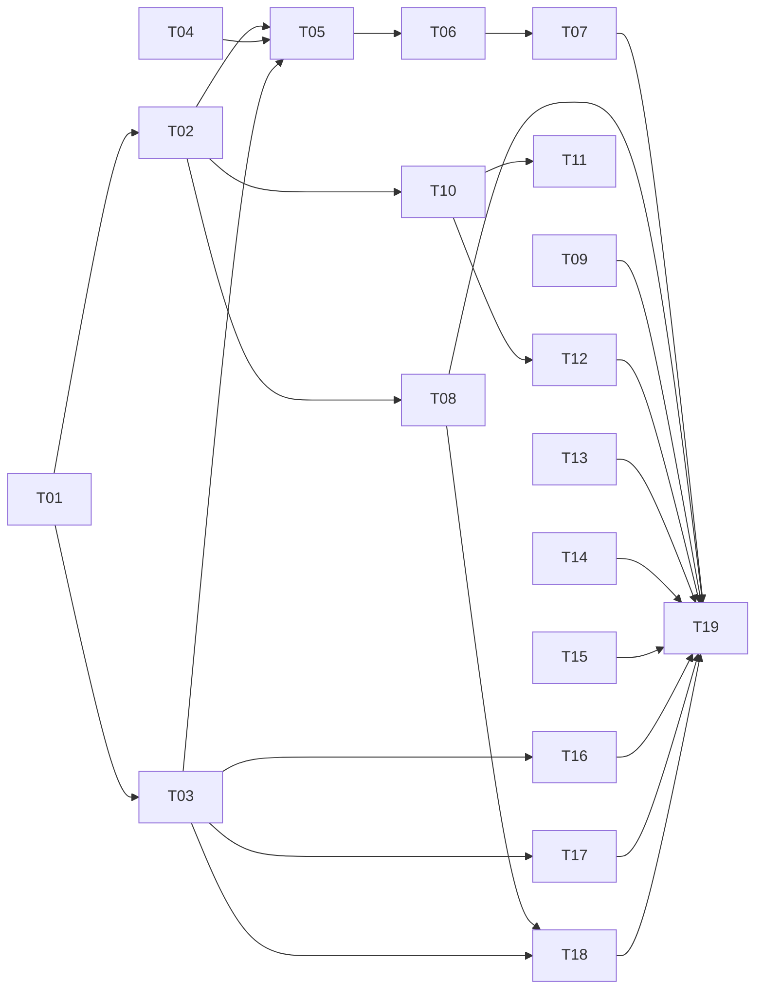

# Execution plan — V1 «Возврат в контекст» — пакеты T-01…T-19 — 2026-09-12

- **Sources:** [план V1](2026-09-12-v1-context-reentry.md) §14–§17 (карта, коррекции
  C1–C10, вехи V1-M0..M5); [дизайн-язык](2026-09-12-v1-design-language.md); доска
  `docs/evidence/backlog.md` → секция «V1 „Возврат в контекст“».
- **Goal:** каждая таска самодостаточна — сабагент берёт ОДИН пакет холодным, не читая
  этого разговора, и доводит его до принятых гейтов.
- **Scheduling:** пакеты — потребители батчей F3–F4 очереди
  [Build order by layer](../../evidence/backlog.md#build-order-by-layer) (ADR-0044);
  пакет, упирающийся в незакрытый ряд F0–F2, ждёт его. Параллельность указана на пакете;
  параллельные прогоны — в git worktree, охраняемые файлы — только под лизой agent-sync.

## Общий контекст (входит в КАЖДЫЙ пакет; пакет ниже ссылается сюда как «ОК»)

1. **Репозиторий:** `~/DATA/fabric`, Electron 44 + React 19 + TS, pnpm workspace;
   рендерер `apps/desktop/src/renderer/src/`, главный процесс `apps/desktop/src/main/`,
   общие контракты `apps/desktop/src/shared/`.
2. **Гейты перед коммитом** (код выхода читается напрямую, не через `tail`):
   `bash scripts/ci.sh fast` (полный тир: типы, тесты, реестры, карта, i18n, дизайн);
   точечно — `node scripts/check-registers.mjs`, `bash scripts/check-docs.sh`,
   `python3 docs/ux/lint.py`, `node scripts/check-design.mjs` (токены: компоненты
   потребляют только `var(--…)`).
3. **Правила прогона (обязательные, из `docs/evidence/retro.md` §Standing):**
   R-002 — отложенное уходит с id на доске в том же коммите; R-005 — прежде чем
   объявить тип/хелпер, grep на второе объявление, переиспользовать; R-006 — каждая
   новая проверка наблюдается КРАСНОЙ на подсадке (убрать механизм — тест падает);
   R-004 — «проба не дотянулась» ≠ «дефект продукта».
4. **Доктрина чтений:** каждый IPC-read возвращает `ReadEnvelope` (см.
   `shared/memoryOverview.ts` как образец) — отказ/частичность/возраст выражаются
   конвертом, `?? 0` на count запрещён; отказ одной панели не гасит соседние; поздний
   ответ покинутому субъекту отбрасывается (образец: `shared/keyedRead.ts`,
   `EstateAgents.reads.test.tsx`).
5. **Журнал — хребет (ADR-0014):** новые типы событий требуют строку `event_types`
   (миграция в форме migration 4: grants + RLS) И фразу `event.<type>` в `i18n/en.ts`
   (narrative-гейт откажет машинным id в ленте). В V1-пакетах новых типов НЕТ —
   если понадобился, остановись и заведи строку на доске.
6. **Строки UI:** только через реестр i18n + `docs/brand/strings.md`;
   `python3 docs/brand/lint.py` держит соответствие; голос — `docs/brand/voice.md`.
7. **Дизайн:** пак `paperclip`; токены `apps/desktop/src/renderer/src/tokens.paperclip.css`
   (не править) + семантика `tokens.app.css`; циферблаты `4·3·5`
   (`docs/ux/foundation.md` → Design tooling); грамматика строки и правила движения —
   [дизайн-язык](2026-09-12-v1-design-language.md) §1–§4; ничего не анимируется рядом
   со стримящим терминалом и на клавиатурных путях; reduced-motion проверяется
   ВКЛЮЧЕНИЕМ.
8. **UX-реестры:** любое изменение поведения обновляет `docs/ux/scenarios.md` (+flows/
   screens по касанию) В ТОМ ЖЕ изменении, затем `node scripts/sync-product-ux.mjs`,
   `node scripts/build-product-report.mjs`, `node scripts/check-product-model.mjs`;
   сценарий обязан быть достижим из journey модели.
9. **Координация:** охраняемые файлы (`docs/evidence/**`, `docs/adr/**`,
   `docs/vision.md`, `CONTEXT.md`, `docs/architecture/*`) — только под лизой
   (`agent_sync.py acquire <T-id>`; release на каждом пути); merge-log — внутрь
   итерационного коммита, посадка fast-forward (`AGENTS.md#iteration-contract` §4);
   карта дизайна получает новую верхнюю полосу + `check-design-map.mjs --refresh`.
10. **Definition of done пакета:** тесты зелёные с наблюдённой подсадкой; гейты §2
    зелёные; сценарий/экраны обновлены; verification-строка в
    `docs/evidence/verification.md`; строка вехи на доске отмечена по факту.

---

## Фаза A — дизайн-система (открывает всё; T-01→T-02 последовательно, T-03 параллельно T-02)

### T-01 · Токены простора (V1-M1 пролог)
- **Goal:** семантический слой отражает циферблаты `4·3·5`: ритм полос, паддинги
  LaneCard, мера прозы; ни один компонент не получает литерал.
- **Context:** ОК §2,7. Файл: `tokens.app.css` (алиасы поверх `tokens.paperclip.css`);
  ритм пака: `--space-xl` между полосами, карточка `--space-lg --space-md`, секционный
  метроном `--space-section`; мера ≤66ch. Потребители токенов: `styles.css`,
  `ProjectHome.tsx`, `EstateHome.tsx`.
- **Steps:** добавить семантические алиасы (`--lane-gap`, `--lane-pad-*`, `--measure`);
  переключить существующие поверхности с локальных значений на алиасы; grep на raw px
  в диффе.
- **Accept:** `node scripts/check-design.mjs` зелёный; скриншоты SCR-30/31 до/после
  показывают ритм; ни одного нового литерала в компонентах.
- **Deps:** нет. **Parallel-safe:** да (один файл + точечные замены).

### T-02 · LaneCard — компонент полосы
- **Goal:** одна карточка полосы для всех уровней: шапка (капсула-знак вида, имя,
  mono-счётчик, возраст), 0–3 превью-строки, раскрытие на месте.
- **Context:** ОК §4,7. Грамматика строки — дизайн-язык §2; раскрытие не сбрасывает
  фокус/выбор (правила SCN-058); «один якорь»: раскрыта одна полоса при монтировании
  (Вопросы, иначе Было). Образцы: `Collapsible` в `ProjectHome.tsx`, статусные чипы в
  `AttentionPanel.tsx`. Ховеры пака: цвет/бордер/заливка, никогда геометрия.
- **Steps:** `components/LaneCard.tsx` + тесты (RTL): пустое состояние (mono-строка +
  действие), частичное чтение (конверт), клавиатура (Enter/Esc, фокус-кольцо),
  reduced-motion.
- **Accept:** 4 подсадки наблюдены красными (снятый конверт, снятая пустая строка,
  снятый фокус, анимация на клавиатурном пути); компонент не знает о доменных типах —
  принимает строки-модели.
- **Deps:** T-01.

### T-03 · Примитивы присутствия Fabric
- **Goal:** знак Fabric (существующий бренд-знак, per mockup-contract §CEO),
  приветственная полоса (озвученный дайджест), веха-бейдж (орнамент, некликабельный),
  interrupt-чип предложения.
- **Context:** ОК §6,7. Дизайн-язык §3 — таблица идиом; строки через реестр
  (`i18n/en.ts` + `docs/brand/strings.md`, голос `voice.md`); бейджи пака несут
  СОБСТВЕННЫЙ ink (не вычислять из одного конца градиента); entrance от opacity .55,
  `--t-medium`, `--ease-enter`; спружина ТОЛЬКО у interrupt-чипа; reduced-motion —
  всё статично.
- **Steps:** `components/FabricPresence.tsx` (band, badge, chip) + строки + тесты.
- **Accept:** подсадка: убрать журнальное событие — момент не рисуется (R-006);
  `brand/lint.py` зелёный; провайдер CEO не привязан → пометка «компилировано системой».
- **Deps:** T-01. **Parallel:** с T-02.

## Фаза B — веха V1-M1 «Панели у консоли» (ядро; после A)

### T-04 · Чтение хронологии агента (главный процесс)
- **Goal:** IPC `agents.chronology(sessionId|agentId)` — журнал, фильтрованный по
  актору/сессии: инструкция запуска (payload `task.started`), ответы на вопросы,
  гранты; `ReadEnvelope`, страницы, возраст.
- **Context:** ОК §4,5. Образцы читалок: `main/digestRead.ts`, `main/harnessRead.ts`
  (+их тесты `test/digest-boundary.test.mjs`, `test/harness-read.test.mjs`); скоупинг
  ТОЛЬКО через scoped store (урок SCN-039: ручной фильтр — дыра); список >20 говорит,
  сколько не показал (правило M124).
- **Steps:** `shared/chronology.ts` (типы+сборка) — прежде grep на второе объявление
  (R-005); `main/chronologyRead.ts`; IPC-регистрация в `main/index.ts`; node-тест
  с подсадками (снятый фильтр актора → чужие строки → красный).
- **Accept:** 3+ подсадки наблюдены; частичное чтение выражено конвертом; нет нового
  типа события (ОК §5).
- **Deps:** нет (данные существуют). **Parallel-safe:** да.

### T-05 · AgentContextPanel на SCR-39
- **Goal:** правая колонка экрана агентов = пять полос агента (SCN-091): вопрос с
  ответом НА МЕСТЕ, бриф задачи, заявление+наблюдение+план, «что сделал», хронология;
  место работы остаётся строкой.
- **Context:** ОК §4,7,8. СЦЕНАРИЙ-ВЛАДЕЛЕЦ: SCN-091 (scenarios.md) — шаги 1–5 и
  Errors&recovery исполняются буквально. Переиспользование (R-005, названо в плане §15):
  ответ — `BoardPanel.tsx#AnswerForm` (выделить в `components/AnswerForm.tsx`, оба
  места потребляют один); бриф — те же поля, что `TaskPage.tsx#sections`
  (`brief_what/why/expected`), read выделить в shared; заявление — правило
  `AgentTile`; план — `shared/planProgress.ts#goalProgress` (floor-честность!);
  «что сделал» — существующая панель центра; хронология — T-04. Каркас: LaneCard
  (T-02); экран: `EstateAgents.tsx` (три колонки, `.project-columns-3`).
- **Steps:** `components/AgentContextPanel.tsx`; независимые keyed-чтения по полосам;
  интеграция в `EstateAgents.tsx`; RTL-тесты: гонка (ответ покинутому агенту
  отброшен), частичность, агент без задачи, plain-терминал без заявлений.
- **Accept:** SCN-091 шаги 1–5 наблюдаемы в тестах; 5 подсадок (по полосе) красные;
  Coverage SCN-091 заполнен, статус остаётся draft до аудита; экранная запись SCR-39
  обновлена в том же изменении (ОК §8).
- **Deps:** T-02, T-03, T-04.

### T-06 · Та же панель в окне сессии SCR-25
- **Goal:** окно сессии несёт панель первокласно (решение оператора, paraphrased: the extra panels belong
  where the console is open), сворачиваемым доком справа, состояние дока — на окно.
- **Context:** ОК §4,7,8. `SessionWindow.tsx` сегодня: header + `TerminalView` и всё;
  панель — ТОТ ЖЕ компонент T-05 (один, размещённый дважды — правило SCN-091 шаг 6);
  никакой анимации рядом со стримом; ширины: узкое окно — панель поверх с явным
  возвратом (правило mockup-contract о чате на узком экране).
- **Accept:** SCN-091 шаг 6; закрытие окна не трогает сессию (инвариант SCR-25);
  запись SCR-25 обновлена.
- **Deps:** T-05.

### T-07 · Приёмка вехи V1-M1
- **Goal:** веха закрывается по своему критерию выхода с доски: SCN-091 аудит по
  построенному, мокапы синхронизированы.
- **Context:** ОК §8,10; `/ux-audit SCN-091` (super-ux); мокапы: `product-model.json`
  view для SCR-39/25 + `scripts/product/`, обе команды синка; доска: строка V1-M1.
- **Accept:** аудит-вердикт записан в Last audit; доска обновлена; verification-строки.
- **Deps:** T-05, T-06.

## Фаза C — веха V1-M2 «Инбокс и внимание» (параллельна B после A)

### T-08 · SCR-42 Инбокс двумя дорожками
- **Goal:** построить инбокс из существующих типов: «Needs you» (не снимается
  прочтением) и «Happened» (двигает границу).
- **Context:** ОК §4,7,8. СЦЕНАРИЙ: SCN-055 (шаги+Errors буквально). Типы уже
  написаны: `shared/inbox.ts` (`NeedsYouItem`, `HappenedItem`, `InboxLane`,
  `cursorFor`) — потребителя нет (карта §14, L1-1); читалка поверх существующих
  источников BoardPanel/attention + журнала; граница — семантика `visibleThroughSeq`
  (`EstateHome.tsx`); водяной знак не двигается получением или отказом чтения
  (Errors SCN-055).
- **Steps:** `main/inboxRead.ts` + `components/InboxPanel.tsx` (LaneCard×2) +
  интеграция на SCR-30 ведущей полосой; тесты: dedupe по source id, два оператора не
  трогают чужой read-state.
- **Accept:** SCN-055 из FAIL: «Needs you» неснимаемость — probed (подсадка: mark-read
  снимает обязательство → красный); запись SCR-42 → построена.
- **Deps:** T-02. **Parallel:** с фазой B.

### T-09 · Возрасты в AttentionPanel
- **Goal:** строки с действием (proposal/grantable) несут возраст ожидания.
- **Context:** ОК §4. `AttentionPanel.tsx`: возраст рендерится только на no-action
  ветке (карта §14); `duration.ts#since`; порядок — `attention.ts` (дольше ждёт — выше).
- **Accept:** RTL-тест на обе ветки; подсадка (возраст снят) красная.
- **Deps:** нет. **Parallel-safe:** да. Размер: S.

## Фаза D — веха V1-M3 «Дальше: рутины и циклы» (параллельна B/C)

### T-10 · Next-due на дашборде
- **Goal:** полоса «Дальше» на SCR-30: ближайшие запуски рутин по проектам + бейдж
  на карточке.
- **Context:** ОК §4,7,8. `shared/routine.ts#nextDue` уже вычисляет; сценарии
  SCN-006 (карточки), SCN-056 (словарь состояний: not-due/unknown/disabled…);
  «unknown next due — явный» (Errors SCN-056); сон хоста ≠ stall.
- **Accept:** unknown ≠ пусто ≠ ноль — три рендера; подсадка снятого unknown красная.
- **Deps:** T-02.

### T-11 · Рутины проекта — из свёрнутого в видимое
- **Goal:** сводка next-due в статус-баре проекта; полный список — раскрытием.
- **Context:** ОК §7. `ProjectHome.tsx#Routines` внутри `Collapsible
  defaultOpen={false}` (карта §14 L1-4/L2-4); `ProjectStatusBar` — образец сводки.
- **Accept:** сводка видима без раскрытия; SCN-056/006 трассы обновлены.
- **Deps:** T-10 (словарь состояний общий). Размер: S.

### T-12 · SCR-43 Циклы — read-only инспекция
- **Goal:** таблица циклов SCN-056: kind/project, конфигурация, наблюдение, последний
  исход — раздельными полями; тик-расписки по клику; БЕЗ редактора и БЕЗ ручного wake.
- **Context:** ОК §4,7,8. СЦЕНАРИЙ: SCN-056 (12 состояний!); «app-off без внешнего
  монитора — unknown, не доказательство простоя» — уже enforced в деривации (AX-02);
  расписание — существующие читалки рутин; редактор циклов — SCN-075, ВНЕ V1.
- **Accept:** каждое из 12 состояний достижимо фикстурой; Coverage SCN-056 из
  none-yet; запись SCR-43 → построена.
- **Deps:** T-02, T-10.

## Фаза E — веха V1-M4 «Решения открываются, команды помнятся» (параллельна B/C/D; три S-пакета)

### T-13 · Цитаты решений открываются
- **Goal:** `source_ref` в DecisionsSection — открываемая цитата.
- **Context:** ОК §4. Сегодня инертный `<span class="muted mono">` (карта §14 L2-5);
  резолвер СУЩЕСТВУЕТ: `shared/entityRef.ts#destinationOf` (4 исхода, 3 из них —
  отказы с причиной; НЕ маршрутизировать на чужой проект — урок UX28-06: владельца
  рефа сообщает ЧТЕНИЕ, не страница); открыватели-образцы: `RetroSection.tsx`,
  `Feed.tsx#actFor`. Второй резолвер запрещён (R-005).
- **Accept:** неразрешимая цель рисуется на месте с сырым рефом и причиной; подсадка
  (резолвер подменён на страницу-проект) красная; SCN-040 зазор закрыт.
- **Deps:** нет. Размер: S.

### T-14 · План: закрыто / сейчас / дальше
- **Goal:** разбиение open-bucket PlanSection на три текущих состояния.
- **Context:** ОК §4. `PlanSection.tsx` + `shared/planProgress.ts#goalProgress`;
  состояния доски (backlog/running/review) уже различимы в `BoardSection`; ЧЕСТНОСТЬ
  floor: «закрытый список, которого никто не считал, — floor» (Errors SCN-046, урок
  UX28-08 — `coverageOfList` возвращает ТРИ ответа, третий не терять).
- **Accept:** усечённое чтение рисует floor, не дробь; подсадка (truncated===true
  сравнение) красная; SCN-046 зазор закрыт.
- **Deps:** нет. Размер: S.

### T-15 · Список прошлых запросов
- **Goal:** под полем «попросить работу» — история запросов с исходом и повтором
  (ST-024), сирота `tasks.noneYet` потреблена.
- **Context:** ОК §4,6. `Tasks.tsx` (поле, presets, reuse-механика уже есть из
  done-колонки `BoardSection#onReuse`); строка `i18n/en.ts:'tasks.noneYet'` — без
  потребителя (карта §14 L2-5); источник — те же чтения задач.
- **Accept:** пустое состояние произносит `tasks.noneYet`; повтор не перепечатывает
  (SCN-032); brand_lint зелёный.
- **Deps:** нет. Размер: S.

## Фаза F — геймификация (после A; T-16/17/18 параллельны)

### T-16 · Честные серии и лист персонажа
- **Goal:** пересчитываемые тренды («7 дней подряд вопросы < 4ч») в полосе Было
  дашборда; профиль SCR-36 — stat-плитки листа персонажа.
- **Context:** ОК §4,7. Дизайн-язык §3 (ledger row: заполнение `--ink`, слово рядом);
  пересчёт из журнала, НИКОГДА не хранится; исчезает, когда перестал быть true; без
  loss-aversion; профиль: `ProfileSection.tsx` (SCN-044 — каждая цифра именует
  регистр, поведение НЕ меняется, только вид). Чарты не нужны — если появятся, сначала
  консультация dataviz-скилла (роль-контракт SURFACE_COMPOSITION).
- **Accept:** подсадка (события удалены — серия исчезает) красная; ни одного
  хранимого значения серии в БД.
- **Deps:** T-03.

### T-17 · Лестница доверия и предложение автономии
- **Goal:** уровень автономии проекта — капсульная лестница; Fabric предлагает
  повышение interrupt-чипом с уликами; решение — оператора.
- **Context:** ОК §4,5,7. СЦЕНАРИЙ: SCN-093 шаг 3; уровень — поле цели (ADR-0004);
  механика решения — ST-018/SCN-027 (очередь одобрений, отказ журналируется);
  предложение — существующий механизм proposals (SCN-010/011), НЕ новый тип события;
  чип — примитив T-03.
- **Accept:** предложение не действует само (подсадка: авто-apply → красный);
  отказ оставляет расписку; SCN-093 Coverage частично заполняется.
- **Deps:** T-03.

### T-18 · Моменты Fabric: приветствие и вехи
- **Goal:** приветственная полоса на холодном входе (озвученный дайджест) и
  строки-вехи с бейджем в «Было».
- **Context:** ОК §4,6,7. СЦЕНАРИЙ: SCN-093 шаги 1–2, Alt (пустой estate → SCN-059;
  superseded → пометка; CEO без провайдера → «компилировано системой»); граница
  прочитанного — SCN-090 (полоса и есть дайджест, вторая сводка запрещена);
  festivities ≤1 на возврат; примитивы T-03.
- **Accept:** повторный вход не переигрывает момент (граница сдвинута); подсадка
  (журнальное событие вехи удалено — строка не рисуется) красная; reduced-motion
  включением — статика, содержание полное.
- **Deps:** T-03, T-08 (полоса Было на дашборде — единая).

## Фаза G — веха V1-M5 «Золотой путь» (последняя)

### T-19 · Сквозной прогон и аудит V1
- **Goal:** SCN-092 наблюдён живьём: холодный вход → ответ у консоли → спуск в проект
  → подъём; `/ux-audit` по набору V1; фальсификаторы дизайн-языка проверены браузером.
- **Context:** ОК §2,8,10. Браузерная проверка — образцы `workspace/test/browser.mjs`
  (геометрия, scroll-spy) и `scripts/test/product-*.browser.cjs`; таблица качества
  директора: контраст вычислен, клавиатурный путь в DOM-порядке, reduced-motion
  включением, grep токенов; Product у сценариев ОСТАЁТСЯ unobserved до замера
  времени-до-решения на операторе (журнальный прокси — возраст ожидания вопроса).
- **Accept:** SCN-092 шаги наблюдены средой; аудит-вердикты в Last audit; доска V1-M5;
  отчёт итога — вехи и остаток по РОДУ.
- **Deps:** все фазы.

## Карта зависимостей и параллельности



Максимальная ширина параллели после фазы A: **B (T-04…) ∥ C (T-08, T-09) ∥ D (T-10…) ∥
E (T-13, T-14, T-15)** — четыре независимых потока; фаза F после T-03. Один поток —
один worktree; охраняемые файлы каждый пакет берёт лизой на СВОЙ id (`acquire T-NN`).

## Как запустить пакет сабагентом

```
/task-pipeline docs/ux/plans/2026-09-12-v1-execution-plan.md#t-NN
```

или прямым сабагентом с worktree-изоляцией: дать пакету этот файл + общий контекст §ОК;
пакет не читает чужих веток и не трогает чужих полос; финал пакета — гейты §2 зелёные +
verification-строка + строка доски. Проверка «сделано» — критерий Accept пакета, не
слова агента (R-006: подсадка наблюдена красной — часть Accept каждого пакета).

## Дополнение 2026-09-12, вечер — пакеты T-20/T-21 (бриф: профиль, таймлайн, графы)

### T-20 · Профиль Fabric в продукте: аватар и вычисляемый уровень
- **Goal:** дашборд приложения открывается идентити-блоком Fabric (аватар, уровень с
  формулой, дни в работе), страница профиля несёт генерацию персонального аватара.
- **Context:** ОК §4,5,7. Целевой дизайн уже в прототипе: `scripts/product/workbench.mjs`
  (`wbFabricRecord`, `wbAvatar`, view `estate`/`profile`) и SCN-094 — исполнять буквально.
  Уровень НИКОГДА не хранится: чистая функция от чтений (задачи done, решения, агенты,
  дни от первого события журнала) в `shared/`, формула версионируется (`формула v1`);
  регистры не прочитались → уровень не показывается (незнание ≠ единица). Генерация
  аватара: провайдер image-gen за фичефлагом; до интеграции — стилевые пресеты
  (детерминированный сид на пользователя); хранится ТОЛЬКО выбор стиля/сид (не награда).
  Поверхности: `EstateHome.tsx` (идентити-блок над полосами), `ProfileSection.tsx`.
- **Accept:** уровень с формулой в UI; подсадка (регистр отключён → уровень скрыт,
  строка называет молчащий регистр) красная; аватар меняется и нигде не меняет
  полномочий (probe: грант-чтения не зависят от аватара); SCN-094 шаги 1,4.
- **Deps:** T-03, T-16. **Веха:** V1-M6.

### T-21 · Таймлайн истории + ориентация графов
- **Goal:** решения/история — один таймлайн («мы сейчас здесь» сверху, скролл в прошлое,
  раскрытие до основания) с графом как вторым представлением; каждый граф продукта
  растёт слева направо либо сверху вниз.
- **Context:** ОК §4,8. Целевой дизайн: `renderDecisionTimeline` в прототипе + SCN-094
  шаги 2–3; продуктовая сторона — `DecisionsSection.tsx` (после T-13: цитаты уже
  открываются) + графовые вьюхи SCR-40 (когда строятся — CO-156). Правило ориентации —
  дизайн-язык §8.4: аудит СУЩЕСТВУЮЩИХ графов прототипа (`scripts/product/graphs.mjs` —
  координаты нод заданы руками) на LR/TB, нарушители перекладываются; гейт: проверка
  монотонности x (или y) вдоль рёбер follows в моделях графов.
- **Accept:** таймлайн и граф — одни записи (подсадка: запись только в одном из двух →
  красный); гейт монотонности наблюдён красным на нарушителе; SCN-094 шаги 2–3.
- **Deps:** T-13. **Веха:** V1-M7.
