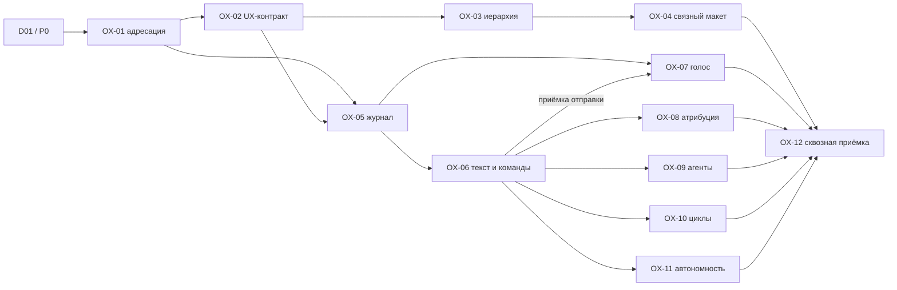

# UX Plan — R0 operator — 2026-09-15

- **Sources:** [аудит C01…C30 / OF01…OF10](../audits/2026-09-15-r0-operator.md), [требования OF-01…OF-12](../../launch/operator-first.md), [контракт](../../architecture/operator-interaction.md), [прежние C1–C6](../../audit/2026-09-15-launch/contracts.md), [P0–P6](../../architecture/personal-fabric-pulse.md).
- **Goal:** оператор понимает текущую работу, принимает только необходимые решения, поручает текстом/голосом и возвращается к тому же контексту без поиска по разрозненным чатам.
- **Status:** план, ещё не исполнен. Scope разрешён текущим запросом; новые UI/runtime-пакеты имеют собственную проверку перед приёмкой. Модель текущей сессии сохраняется; automation/подписки не создаются. Эта итерация: audit → contract/plan → checks/Git/wiki; не реализация всех будущих OX.

## 1. Принцип: минимум на поверхности, полнота по раскрытию

У каждого объекта три уровня. **L0: ориентация и действие. L1: достаточно для решения. L2: изучение и проверка.** Это правила проектирования, не уже измеренные свойства UI.

| Уровень | Обязательное | Что сюда не поднимать |
|---|---|---|
| L0 · обзор | Область, краткая цель/название, текущий наблюдаемый статус и возраст, причина участия, один основной следующий шаг | Полный transcript, все runs, технические event IDs, управление каждым параметром, длинный график |
| L1 · решить | Что изменилось, почему нужен человек, варианты с последствиями, рекомендация с источником, право/стоимость при необходимости, сохранение и receipt | Повтор всей истории и бесконечный console stream |
| L2 · изучить | Исходная задача, chronological timeline, решения и альтернативы, exact context pack, tools/results, данные freshness/coverage, версии и связи | Недоказанные summaries вместо первичных источников |

Один акцент на primary action в контексте; вторичные действия остаются доступными клавиатурой и через явное меню, не только hover. Статус никогда не обозначается только цветом. Зелёный не скрывает stale/unknown. Локальное раскрытие не пересортировывает очередь; новые данные приходят с контролируемым apply, если могут сдвинуть внимание.

**Не убирать:** персональность Fabric, видимый scope, текущий вопрос, freshness, непрочитанное, путь назад и происхождение. **Свернуть:** график прогресса, служебные управления, диагностические пояснения, повторяющиеся сводки, завершённые дела. **Снять с оператора:** сбор фактов, точный routing, дедупликацию, повседневные разрешённые проверки. Решение скрыть объект не должно отменять обязательство.

## 2. Target interface

| Экран / цепочка | L0 и primary action | L1/L2 | Особые состояния и переходы |
|---|---|---|---|
| Home · SCR-30, FLW-21/54 | Компактный цветной Fabric сверху; «Нужны 2 решения / 3 проекта работают / 1 источник не прочитан»; primary «Разобрать следующий вопрос» либо «Продолжить проект» при пустой Board | Прогресс раскрывается; проекты с кратким next step, порядок в режиме «Упорядочить»; история в Pulse | Нет проектов→создать; нет вопросов→продолжить/обзор; stale помечен; нормальный список остаётся читаемым |
| Board · SCR-41, FLW-22/25/29 | Очередь обязательств: причина, проект, владелец, срок/вес только если значимы; primary конкретный ответ/проверка | Панель решения: вопрос, почему сейчас, контекст, варианты, последствия, источник; вся история по раскрытию | «Разобрано» темы отдельно от «ответ доставлен»; snooze сохраняет due; escalation не плодит копии |
| Project · SCR-31, FLW-21/33 | Одна orienting строка: цель → сейчас → следующее; since-last-visit; primary продолжить/ответить | Краткие agents/goal/links; подробные история/команда/настройки доступны из проекта | A→B→A сохраняет место, scope и черновики; не все проекты обязаны иметь агента/граф |
| Agent/task/IDE · SCR-39/32, FLW-27/31/52 | Задача, текущий run, фаза и ожидание; primary ответить здесь либо открыть работу | Вкладки Сейчас / Контекст / Решения / История; exact historical pack; поток свёрнут на обзоре, а при входе в IDE/консоль виден сразу рядом с контекстом, включая detached-session | Historical run не носит badge текущего; stop requested не ended; новый run не новое название старой сессии |
| Pulse · SCR-42/43, FLW-30/54 | Сейчас: требует человека, неизвестно, активная работа, следующий обзор | Лента группируется по смыслу; график активности/релизы дальше; raw observations по раскрытию | Пауза просмотра не пауза агентов; project scope сохраняется; тихий источник не объявляется мёртвым |
| CEO · постоянная панель, SCN-042 | Видимый адресат, текст + микрофон, одна кнопка отправки/stop согласно состоянию | История разговора; proposal с изменениями и адресатом; refs/receipts; привязки и исходники | Нет модели→ручное действие; pending сохраняется при смене проекта; ошибка записи не показывает «сохранено» |
| Team/settings · SCR-04/05/35/44, FLW-02/24/34 | Роль, текущий исполнитель, что может сам; primary настроить роль/назначить исполнителя | Версии config, model, provider, admission, capability и budget; техническое отдельно | Неподдержанное объяснено; config draft не trusted и не running; conflict даёт перечитать/сравнить |
| Cycle setup · SCR-56/43, FLW-44/30 | Preset + когда/над чем/кто/лимит/остановка; primary сохранить проверенную конфигурацию | Preview next window, inputs, шаги, retry/concurrency и версии | Save≠enable≠run; pause affects future; текущий run отдельно; app off означает явное ограничение |
| Task/project timeline · SCR-33/34/61, FLW-28/31 | Последнее значимое изменение и его причина; primary открыть основание | Message span → conversation → proposal → command → outcome; временная и причинная линии раздельны | Неполный импорт помечен; исправление атрибуции версионное; no access не раскрывает чужой transcript |
| Goal/links · SCR-40/50, FLW-23/38 | Цель, следующий milestone, blocker; primary перейти к связанному обязательству | Read-only граф и эквивалентный список; полный editing — R1 | Недоступный узел не раскрывает данные; Back сохраняет выбранный узел и уровень |

Это спецификация изменений для следующих макетов. Их текущий внешний вид не назван исправленным. OX-02 переносит новые/уточнённые сценарии и states в каноническую базу, OX-04 обновляет product-model/renderers/previews в одной итерации.

## 3. Пять сквозных историй приёмки

1. **Первый полезный запуск:** новый пользователь→Fabric→создать проект→ввести/сказать цель→исправить текст→выбрать существующего исполнителя/preset→увидеть задачу и статус допуска→вернуться Home→найти новый проект. Нет необходимости сначала спроектировать организацию.
2. **Утренний обзор:** два проекта→изменения после прошлого визита→вопрос с основанием→ответить→увидеть delivery/receipt→следующая тема→все оставшиеся актуальные вопросы не потеряны. Рутинные ответы по принятому основанию уже обработаны без нового запроса оператору.
3. **Смена контекста в работе:** A→разговор/запись/черновик→B→ответ агента A→сохранить текущую работу B→открыть ответ A→вернуться B в то же место. Смена окна не переадресует команду.
4. **Настройка через CEO:** «Проверяй незавершённые задачи утром, без публикаций»→editable cycle spec→preview области, исполнителя, лимита и следующего окна→confirm→receipt сохранения→Включить→receipt включения→видимая активная конфигурация→run/result→pause. Та же конфигурация доступна ручной форме.
5. **Восстановление и ответственность:** голос→распознавание→исправление отрицания→отправка→network unknown→reconcile→ровно одна задача; restart→найти исходную реплику из задачи→посмотреть дальнейшие решения. Отклонённый grant и недоступный источник не превращаются в успешное выполнение.

## 4. Матрица состояний для каждого пути

| Условие | UX-контракт | Приёмка |
|---|---|---|
| Новый/пустой | Одно полезное действие, без фальшивых графиков и истории | First-run проходит до первого результата |
| Loading/partial/stale | Сохранённый разрешённый снимок, возраст/пробел; чтение и local navigation работают | Запрещены только неподтверждённые записи, а не весь экран |
| Denied/revoked | Область недоступна и понятный выход; чужих названий/фрагментов нет | Отозвать права во время draft/request и попытаться открыть ref |
| Conflict/version changed | Старый draft цел, сравнение/перечитать/повтор после проверки | Две правки не затирают друг друга |
| Saved/accepted/delivered | Каждый переход имеет receipt, scope и next action | Удалить получение receipt — UI не должен сказать «готово» |
| Unknown outcome | Сохранён request ID; проверить исход, без duplicate effect | Ответ потерян после commit, повтор с тем же ID |
| Error/no model/no capability | Конкретная причина и доступный ручной путь | Отсутствие провайдера не вызывает скрытый платный вызов |
| Mic denied/silence/interrupted/STT failed | Видимый статус, пригодный draft, повтор/текст | Не терять текст и не отправлять частичное распознавание |
| Background/new event | Scoped unread, без захвата фокуса/самопереключения | A→B во время ответа/записи |
| Completed/paused/cancelled | Что завершилось, что осталось, что дальше | Скрыть/свернуть не считается pause/stop |
| Long content/small viewport/keyboard | Полные подписи, доступный focus и раскрытие, эквивалент графу | 1280×800 и узкий 390px web prototype; native desktop и увеличенный текст отдельно |

## 5. Изменения и исполнение

| Пакет | Action / объект | Traces | Приоритет |
|---|---|---|---|
| OX-01 | MODIFY адресацию и карту существующих producers/consumers | OF-01/03/09, AUD-OF01/02 | P0, первый |
| OX-02 | MODIFY canonical UX; CREATE voice/input сценарии и state routes | OF-01…12, все находки | P0 |
| OX-03 | MODIFY hierarchy/disclosure; REMOVE повторяющиеся summary и design-only nav из production-spec | OF-02/03, AUD-OF09 | R0 |
| OX-04 | MODIFY общий prototype state и все связанные mockup routes | OF-01/03/04/06/11, AUD-OF01/02/05/07 | P0 |
| OX-05 | CREATE durable CEO messages/outbox в существующем journal/storage | OF-08/09/11, AUD-OF03 | P0 |
| OX-06 | MODIFY CEO text path и typed command receipts | OF-04/05/06, AUD-OF03/05/06 | R0 |
| OX-07 | CREATE voice capture/STT draft/error adapter и UI | OF-07/08/11, AUD-OF04 | R0 обязательный |
| OX-08 | MODIFY attribution/timeline/search readers и backlinks | OF-03/08/09, AUD-OF03/08 | R0 |
| OX-09 | MODIFY agent preset/editor/admission через общий command path | OF-06/10/11, AUD-OF06 | R0 |
| OX-10 | MODIFY цикл/планирование обзора и pause/result path | OF-04/06/10, AUD-OF06 | R0 |
| OX-11 | MODIFY объяснимую автономность и triage исключений | OF-04/05, AUD-OF05/06 | R0 |
| OX-12 | CREATE сквозной acceptance ledger и pilot; MODIFY подтверждённые статусы | OF-01…12, AUD-OF10 | R0 gate |

`AUD-OFxx` в таблице сокращает `AUD-2026-09-15-OFxx`, не создаёт другие ID. REMOVE относится к будущей production-композиции; никакие исторические документы/функции не удаляются. Пакеты не называются parallel-ready, пока OX-01 не выдаст точные read/write sets; общий controller/main/index требует последовательной интеграции.

D01/P0 и OX-01 исполняются как один inventory-проход: стрелка означает входной контракт, не две команды реконструировать всё. [Машинный DAG](../../launch/operator-plan.json) хранит тип и payload каждого ребра; внешние prerequisite readiness проверяются отдельно, а не выводятся из порядка экранов.

### OX-01 — адресация и существующие механизмы

**Owner:** архитектура/desktop integration. **Вход:** D01/P0, C1–C6, аудит. **Файлы:** `scripts/product/assistant.mjs`, `launch.mjs`, `controller.js`, `pulse.mjs`; `apps/desktop/src/shared/types.ts`, `main/contextPack.ts`, `main/livenessRead.ts`, `main/index.ts`; существующие schema/command/route owners устанавливаются через symbols, не угадываются.

**Выход:** producer→event→projection→reader→screen по C01…C30; reuse/extend/missing; ScopeRef/SubjectRef/ReturnAnchor, scope-snapshot и command outcome contract; точные module/read/write sets и prerequisites. **Положительная:** A→B, task/run/question/release refs разрешаются однозначно; история и текущий объект различимы. **Отрицательная:** удалить project/task propagation — проверка отвергает wrong-scope, а не падает на соседней ошибке. **Граница:** не вводить новую БД, event bus или параллельный manager. **Rollback:** документировать отложенный writer, старые данные не мигрировать в этом пакете.

### OX-02 — полный сценарный контракт R0

**Owner:** UX. **Зависит:** OX-01 (объекты/команды). **Файлы:** `docs/ux/foundation.md`, `scenarios.md`, `flows.md`, `screens.md`, `product-model.json`. **Выход:** trace всех OF/C к шагам, объектам и состояниям; новый voice scenario ID зарезервирован по правилам UX-базы; R0/R1 labels; входы из product-nav, back и recovery.

**Положительная:** пять историй §3 имеют действие/исход на каждом шаге. **Отрицательная:** убрать normal entry или error exit — orphan обнаружен. **Граница:** нельзя считать верхний каталог макетов пользовательским доступом; статусы runtime не повышаются от спроектированной ветки. **Rollback:** сохраняем старую версию сценария и причину пересмотра.

### OX-03 — минимальная композиция с раскрытием

**Owner:** design + UX. **Зависит:** OX-02 (actions/states). **Файлы:** будущие изменения `scripts/product/launch.css`, `pulse.css`, `assistant.css`, соответствующих renderers и `docs/ux/screens.md`; фактический CSS owner подтвердить OX-01.

**Выход:** спецификация L0/L1/L2 и отрисованный before/after на одинаковых данных; compact profile, один context strip, явное меню secondary actions, спокойный Pulse. **Положительная:** без раскрытия понятно «где / что сейчас / нужен ли я / что дальше»; по раскрытию доступны источники. **Отрицательная:** источник устарел либо вопрос высокоприоритетный — его нельзя спрятать общей «всё хорошо» сводкой. **Граница:** сохраняем принятый бренд и аватар; не переизобретаем тему. **Rollback:** изолированный layout change, без удаления функциональных routes.

### OX-04 — связать полный макет

**Owner:** prototype integration. **Зависит:** OX-03; OX-01 contract через OX-02. **Файлы:** `scripts/product/{controller.js,launch.mjs,pulse.mjs,assistant.mjs,integrations.mjs,routines.mjs}`, `docs/ux/product-model.json`, generated reports/previews.

**Выход:** один fixture store, entity-addressed links и общий state; CEO→задача/Board, onboarding→Home, project→scoped Pulse, exact release/question, independent partial read controls. **Положительная:** все пять историй проигрываются без reset и скрытого каталога. **Отрицательная:** закрыть иной question ID/подставить другой project/потерять return anchor — тест падает по нужной причине. **Граница:** synthetic data явно маркирована; backend-ready не заявлен. **Rollback:** сохранять исходный screenshot/state receipt, не стирать исторические макеты.

### OX-05 — журнал разговора и outbox

**Owner:** data + main process. **Зависит:** OX-01/02. **Файлы:** `apps/desktop/src/main/transcripts.ts`, `main/index.ts`, `shared/types.ts`, существующий journal/storage reader; новые migration/shared module paths выбираются по inventory и фиксируются до кода.

**Выход:** message/conversation IDs, text revisions, actor/scope/time, durable draft/submit/outbox, event refs и permission-safe read. **Положительная:** restart сохраняет диалог и состояние доставки. **Отрицательная:** crash между append/dispatch, duplicate submit и revoked scope не теряют сообщение и не дублируют действие. **Граница:** no LLM on primary write path, PTY не переименовывается в CEO conversation. **Rollback:** additive migration/capability off, без удаления записанного.

### OX-06 — текстовое управление и результат

**Owner:** CEO/core + UI. **Зависит:** OX-05; **внешний gate:** готовность CO-158/M166…M175 по каждому используемому tool, не автоматическое закрытие всей серии. **Файлы:** `main/agentSurface.ts`, `shared/managerEval.ts`, существующие policy/command handlers; renderer `AttentionPanel.tsx`; producer/capability symbols — из OX-01.

**Выход:** один composer/ModelPort, context preview, typed task/answer/config/workflow proposal, authoritative receipt и unavailable manual route. **Положительная:** явное разрешённое поручение даёт одну задачу/квитанцию, доступную на Board. **Отрицательная:** malformed proposal, budget exhausted, denied grant, failed callback и неизвестный outcome не показывают saved/success. **Граница:** не обходить deterministic tools и accepted autonomy floor ради demo. **Rollback:** модель выключается отдельно, ввод/история/ручные формы сохраняются.

### OX-07 — голос как вход в тот же разговор

**Owner:** desktop media + composer. **Зависит:** OX-05 и UX из OX-02 для разработки capture/STT; закрытие интеграционной приёмки — OX-06 command path. **Файлы:** `apps/desktop/src/renderer/src/AttentionPanel.tsx`, существующий preload/IPC boundary и settings; новый capture/STT module после capability study. **Внешний gate:** target OS, permission/packaging, выбранный STT adapter, budget и raw-audio retention перед активацией.

**Выход:** record/stop/cancel, visible recording scope, transcript editor, text fallback, persisted message и diagnostics без содержимого речи. **Положительная:** RU/EN, имена/числа/отрицания, исправление перед send; ровно один ввод проходит тот же OX-06 command path. **Отрицательная:** denied mic/no device/silence/network loss/закрытие окна/scope switch; partial STT никогда не исполняется. **Граница:** full-duplex и always-listening не нужны R0. **Rollback:** capability off оставляет текст, но voice gate R0 остаётся незакрытым.

### OX-08 — атрибуция, история и поиск

**Owner:** knowledge + navigation. **Зависит:** OX-06 (messages+command refs). **Файлы:** `main/contextPack.ts`, `main/transcripts.ts`, существующие timeline/search readers; renderer `ProjectHome.tsx`, task/details. **Выход:** bidirectional message/span↔task/project/decision links, correction revisions, ACL-safe excerpts, search filters и causal/time views.

**Положительная:** из результата найден исходный запрос и решение; из разговора найдены артефакты. **Отрицательная:** общий разговор A/B не раскрывается целиком пользователю только A; исправление связи не переписывает старое решение; импорт без provenance показывает unknown. **Rollback:** перестраиваемый index, первичные сообщения/links не удалять.

### OX-09 — настройка команды через форму и Fabric

**Owner:** agent lifecycle. **Зависит:** OX-06. **Файлы:** renderer `ProjectHome.tsx`, `HarnessSection.tsx`, main agents create/config/admission; prototype `integrations.mjs`. **Выход:** роль/исполнитель/область/лимит preset, editable versioned spec, change preview, canary/admission/status и тот же CLI-independent command gateway.

**Положительная:** команда из разговора открывает ту же конфигурацию и после save отображает её в проекте. **Отрицательная:** config save rejected не сообщает success; неподдержанный capability не выдаёт trusted; настройка не запускает агента неявно. **Граница:** существующие providers, без generic agent foundry. **Rollback:** вернуть предыдущую config revision отдельной командой, действующие runs не переписывать.

### OX-10 — готовые рабочие циклы

**Owner:** workflow/cycle. **Зависит:** OX-06; **внешний gate:** P4/P5, S15 window/claim/replay receipts. **Файлы:** `main/index.ts` routine handlers, `shared/cycleView.ts`, существующий scheduler; prototype `routines.mjs` и renderer automation section.

**Выход:** утренний обзор, post-result review, checkpoint при уходе; preset/editor parity, next due, run/result, pause/stop distinction. **Положительная:** от настройки до следующего наблюдаемого окна и результата, затем пауза. **Отрицательная:** duplicate tick/crash/app-off не даёт два результата или ложный «успех»; paused feed не останавливает run. **Граница:** без always-on-host и полного workflow generator. **Rollback:** прекратить новые окна, reconciliation текущих effects, сохранить историю.

### OX-11 — самостоятельность и маршрутизация исключений

**Owner:** governance/manager. **Зависит:** OX-06; **внешний gate:** ADR-0036/39 floor и текущий S09 command authority проверены в реальном boundary. **Файлы:** `shared/managerEval.ts`, `main/agentSurface.ts`, existing settlement/gateway handlers и Board readers.

**Выход:** rule-first routing по owner, cited/routine actions, reasoned escalation с вариантами; dedup obligation/subject/revision; «может сам / спросит / недоступно». **Положительная:** известное разрешённое действие выполняется без лишнего подтверждения, записывает основание и результат. **Отрицательная:** reversal пользовательского решения, отсутствующий source, grant или превышенный threshold блокируются; отсутствие ModelPort не отменяет детерминированный обзор. **Граница:** низкая субъективная уверенность модели не новый permission system. **Rollback:** понизить capability, сохранить queue и receipts.

### OX-12 — приёмка первой версии целиком

**Owner:** delivery + оператор pilot. **Зависит:** OX-04,07,08,09,10,11 и runtime receipts из таблицы ниже. **Файлы:** `docs/evidence/verification.md`, `docs/ux/audits/`, `docs/evidence/backlog.md`, сценарная база; release build receipt.

**Выход:** одна идентифицированная сборка, все C01…C30, пять историй §3 и state matrix, measurements и список остатка. **Положительная:** другой оператор без рассказа автора проходит путь и верно объясняет состояние. **Отрицательная:** planted wrong scope / missing receipt / duplicate message / stale status / hidden microphone denial не проходят. **Граница:** prototype PASS, unit PASS и «кнопка есть» не заменяют эту приёмку; нет общего PASS пока required voice не проверен. **Rollback:** оставшийся дефект блокирует только его обязательную capability/release gate, история и ранее проверенные части остаются.

## 6. Runtime-исполнители и обязательные входы приёмки

OX-04 завершает только макет. Для возможностей вне новых conversational пакетов есть существующие исполнители; OX-01 уточняет их реальные пробелы и read/write sets. OX-12 не закрывается по макету, пока соответствующие runtime receipts не получены.

| Возможности | Runtime packet / owner | Обязательный результат перед OX-12 |
|---|---|---|
| C01: persisted Fabric identity | P1 / identity owner | Облик после relaunch, first-entry/skip/conflict |
| C02/C03: onboarding, Home и порядок проектов | L03 + существующий onboarding / desktop projects | Созданный проект появляется в Home; порядок сохраняется; нет второго списка |
| C04/C05/C11/C12/C18/C19: контекст, ссылки и история | L01/L02 + P4; OX-08 добавляет разговор / context+navigation | A→B→A, read boundary, exact task/run/pack и разрешённый source; R0 graph только read context |
| C06…C10/C13: Board и рабочее действие | L04/L06 + OX-06/11 / work loop | Адресованный ответ, независимые admission/delivery/outcome и обновлённые projections |
| C14/C15: Pulse/обзор | P2/P4/P5 + L05; OX-10 / observability+cycles | Snapshot/cursor, unknown/source loss, pause/apply, next due и результат окна |
| C16/C17: activity/release readers | P2/P3 / projection owners | Day/source и exact release/build/environment, dedup/coverage/verification |
| C20…C30: config/CEO/voice/logging | OX-05…OX-11 / владельцы пакетов выше | Положительные/отрицательные receipts соответствующих полных путей |

[Имена и прежние packets L01…L06](../../audit/2026-09-15-launch/packets.md), [P1…P5](../../architecture/personal-fabric-pulse.md) сохранены; это интеграционные prerequisites, не переименование и не автоматическое повышение их статусов. D01/P0/OX-01 объединяется; старый L06 «ранняя R0» теперь промежуточный результат, а не приёмка нового обязательного voice scope.

## 7. Измерить снижение нагрузки, а не число карточек

Pilot — сравнение текущей и новой версии на одинаковых обезличенных заданиях двух проектов с изменениями после перерыва. Предлагаемые участники: оператор и несколько людей без истории проекта; количество/расписание согласовать перед исследованием. Сначала фиксируется ground truth ответов и событий, затем наблюдение; подсказка ведущего записывается как помощь.

| Метрика | Как измерять | Решение |
|---|---|---|
| Время до правильного следующего действия | Возврат→первое обоснованное действие, с проверкой его правильности | Сравнивать распределение с baseline; красивый быстрый неправильный ответ — провал |
| Восстановление контекста | Верно ли названы цель, последнее решение, сейчас, блокер, дальше | Предлагаемый target: 5/5 по источникам за один короткий проход; не текущая гарантия |
| Лишние переключения и поиск | Переходы/возвраты/поиск по старым чатам | Цель: снижение против baseline, не лимит ради лимита |
| Нагрузка решений | Число unnecessary approvals и повторных вопросов на один принятый результат | Уменьшение без роста ошибочной автономии |
| Ошибки области/исхода | Wrong-project commands, lost input, duplicate effects, false success | В контрольном corpus — 0; иначе обязательный gate не пройден |
| Голос | Успех записи, исправления важных слов, время до отправленного корректного текста | Реальные RU/EN записи, permission/network cases; не только synthetic transcript |

Telemetry минимальна: event kind, elapsed bucket, scope pseudonymous ID, outcome/error class, assistance flag. Содержание речи/переписки и секреты не отправляются в analytics. Условия сбора видны пользователю; operational logs отдельно от продуктового исследования. Полная WCAG/assistive-tech и native permission проверка имеют отдельные receipts; screenshot не выдаётся за conformance.

## 8. Сохранённый горизонт и точка старта

CO-166 хранит все десять audit findings и OX-01…12 как открытое исполнение; CO-158/165 остаются предшественниками. Полный граф, agent foundry, full-duplex/озвучка, AI-аватары, федерация, широкие integrations и always-on не вычеркнуты из проекта. Возврат к ним — после соответствующих data/authority/retention prerequisites и подтверждённого R0 loop.

**Первая следующая задача — OX-01/D01.** Не начинать с микрофонной иконки и переписывания CSS: сначала определить, куда сохраняется сообщение, кто адресат и какой объект должен измениться. После принятого contract результаты OX-03 и OX-05 могут готовиться независимо; изменения в shared assembly интегрируются по resource order. Никаких сроков в днях без оценки существующих producer gaps; оценку каждый owner добавляет после OX-01.
